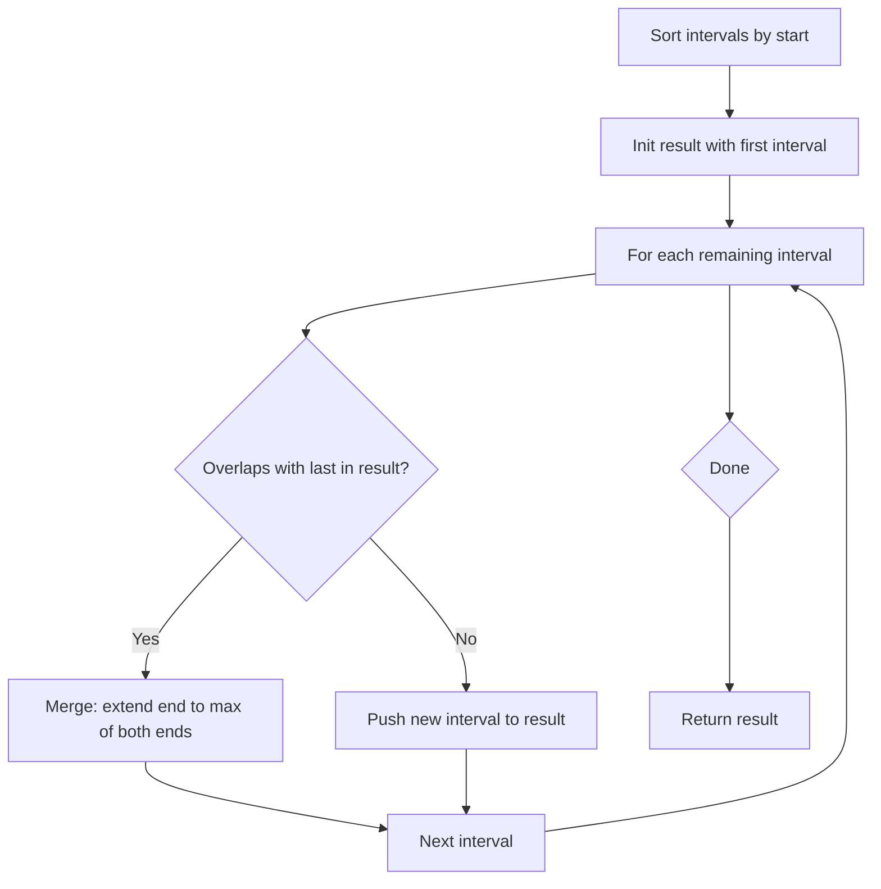

Given an array of `intervals` where `intervals[i] = [start_i, end_i]`, merge all overlapping intervals, and return an array of the non-overlapping intervals that cover all the intervals in the input.

## Examples

**Input:** intervals = [[1,3],[2,6],[8,10],[15,18]]
**Output:** [[1,6],[8,10],[15,18]]
**Explanation:** [1,3] and [2,6] overlap and merge into [1,6], while the other intervals remain separate.

**Input:** intervals = [[1,4],[4,5]]
**Output:** [[1,5]]
**Explanation:** The intervals share the endpoint 4, so they overlap and merge into [1,5].


## Solution

```js
function merge(intervals) {
  intervals.sort((a, b) => a[0] - b[0]);
  const merged = [intervals[0]];

  for (let i = 1; i < intervals.length; i++) {
    const last = merged[merged.length - 1];
    if (intervals[i][0] <= last[1]) {
      last[1] = Math.max(last[1], intervals[i][1]);
    } else {
      merged.push(intervals[i]);
    }
  }

  return merged;
}
```

## Explanation

APPROACH: Sort by Start, Merge Greedily

Sort intervals by start time. For each interval, either merge with the previous (overlapping) or start a new group.

```
intervals = [[1,3],[2,6],[8,10],[15,18]]

After sort by start: [[1,3],[2,6],[8,10],[15,18]]

merged = [[1,3]]
  [2,6]: 2 <= 3 (overlap) → extend to [1,6]
merged = [[1,6]]
  [8,10]: 8 > 6 (no overlap) → new group
merged = [[1,6],[8,10]]
  [15,18]: 15 > 10 → new group
merged = [[1,6],[8,10],[15,18]] ✓

Visual:
  1---3
    2------6
              8--10
                     15--18
  └────────┘  └────┘ └─────┘
    [1,6]     [8,10]  [15,18]
```

KEY: Sorting ensures that when we scan left to right, we only need to compare with the last merged interval. If current.start <= last.end, they overlap.

## Diagram



## TestConfig
```json
{
  "functionName": "merge",
  "testCases": [
    {
      "args": [
        [
          [
            1,
            3
          ],
          [
            2,
            6
          ],
          [
            8,
            10
          ],
          [
            15,
            18
          ]
        ]
      ],
      "expected": [
        [
          1,
          6
        ],
        [
          8,
          10
        ],
        [
          15,
          18
        ]
      ]
    },
    {
      "args": [
        [
          [
            1,
            4
          ],
          [
            4,
            5
          ]
        ]
      ],
      "expected": [
        [
          1,
          5
        ]
      ]
    },
    {
      "args": [
        [
          [
            1,
            4
          ],
          [
            0,
            4
          ]
        ]
      ],
      "expected": [
        [
          0,
          4
        ]
      ]
    },
    {
      "args": [
        [
          [
            1,
            4
          ],
          [
            2,
            3
          ]
        ]
      ],
      "expected": [
        [
          1,
          4
        ]
      ]
    },
    {
      "args": [
        [
          [
            1,
            2
          ]
        ]
      ],
      "expected": [
        [
          1,
          2
        ]
      ]
    },
    {
      "args": [
        [
          [
            1,
            4
          ],
          [
            0,
            0
          ]
        ]
      ],
      "expected": [
        [
          0,
          0
        ],
        [
          1,
          4
        ]
      ]
    },
    {
      "args": [
        [
          [
            1,
            4
          ],
          [
            0,
            2
          ],
          [
            3,
            5
          ]
        ]
      ],
      "expected": [
        [
          0,
          5
        ]
      ]
    },
    {
      "args": [
        [
          [
            2,
            3
          ],
          [
            4,
            5
          ],
          [
            6,
            7
          ],
          [
            8,
            9
          ],
          [
            1,
            10
          ]
        ]
      ],
      "expected": [
        [
          1,
          10
        ]
      ]
    },
    {
      "args": [
        [
          [
            1,
            3
          ],
          [
            5,
            7
          ],
          [
            2,
            4
          ],
          [
            6,
            8
          ]
        ]
      ],
      "expected": [
        [
          1,
          4
        ],
        [
          5,
          8
        ]
      ]
    },
    {
      "args": [
        [
          [
            0,
            0
          ],
          [
            1,
            1
          ],
          [
            2,
            2
          ]
        ]
      ],
      "expected": [
        [
          0,
          0
        ],
        [
          1,
          1
        ],
        [
          2,
          2
        ]
      ]
    }
  ]
}
```
