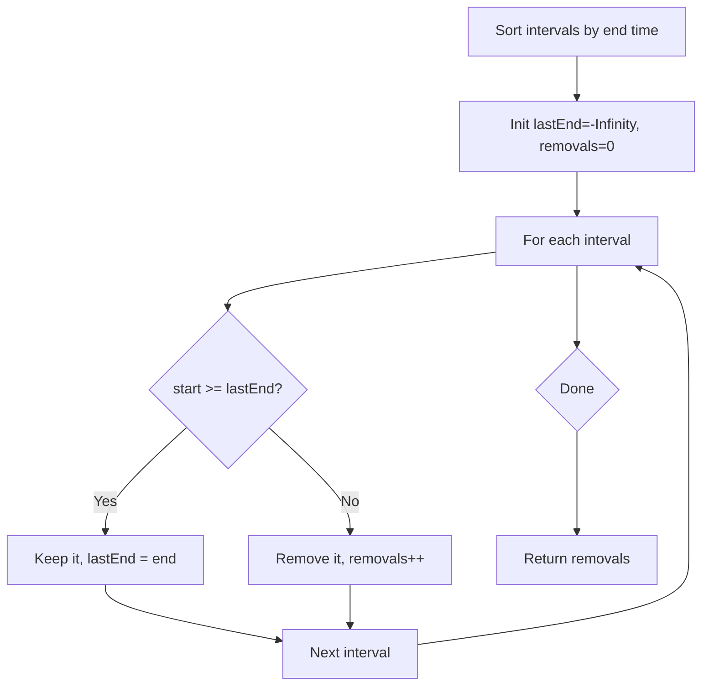

Given an array of intervals `intervals` where `intervals[i] = [start_i, end_i]`, return the minimum number of intervals you need to remove to make the rest of the intervals non-overlapping.

## Examples

**Input:** intervals = [[1,2],[2,3],[3,4],[1,3]]
**Output:** 1
**Explanation:** [1,3] can be removed.

**Input:** intervals = [[1,2],[1,2],[1,2]]
**Output:** 2
**Explanation:** All three intervals [1,2] are identical, so two must be removed to leave just one.


## Solution

```js
function eraseOverlapIntervals(intervals) {
  intervals.sort((a, b) => a[1] - b[1]);
  let count = 0;
  let prevEnd = -Infinity;

  for (const [start, end] of intervals) {
    if (start < prevEnd) {
      count++;
    } else {
      prevEnd = end;
    }
  }

  return count;
}
```

## Explanation

APPROACH: Sort by End Time — Activity Selection

Sort by END time (not start). Greedily keep intervals that end earliest — this maximizes room for future intervals.

```
intervals = [[1,2],[2,3],[3,4],[1,3]]

Sort by end: [[1,2],[2,3],[1,3],[3,4]]

prevEnd = -∞
  [1,2]: 1 >= -∞ → keep, prevEnd=2
  [2,3]: 2 >= 2  → keep, prevEnd=3
  [1,3]: 1 < 3   → OVERLAP → remove (count++)
  [3,4]: 3 >= 3  → keep, prevEnd=4

Removed: 1 interval ✓

Visual:
  [1,2] [2,3] [3,4]   ← kept (no overlaps)
  [---1,3---]          ← removed (overlaps with [2,3])

WHY sort by end time?
  Choosing the earliest-ending interval leaves the
  most room for subsequent intervals. This is the
  classic activity selection greedy proof.
```

## Diagram



## TestConfig
```json
{
  "functionName": "eraseOverlapIntervals",
  "testCases": [
    {
      "args": [
        [
          [
            1,
            2
          ],
          [
            2,
            3
          ],
          [
            3,
            4
          ],
          [
            1,
            3
          ]
        ]
      ],
      "expected": 1
    },
    {
      "args": [
        [
          [
            1,
            2
          ],
          [
            1,
            2
          ],
          [
            1,
            2
          ]
        ]
      ],
      "expected": 2
    },
    {
      "args": [
        [
          [
            1,
            2
          ],
          [
            2,
            3
          ]
        ]
      ],
      "expected": 0
    },
    {
      "args": [
        [
          [
            1,
            100
          ],
          [
            11,
            22
          ],
          [
            1,
            11
          ],
          [
            2,
            12
          ]
        ]
      ],
      "expected": 2
    },
    {
      "args": [
        [
          [
            0,
            2
          ],
          [
            1,
            3
          ],
          [
            2,
            4
          ],
          [
            3,
            5
          ],
          [
            4,
            6
          ]
        ]
      ],
      "expected": 2
    },
    {
      "args": [
        [
          [
            1,
            2
          ]
        ]
      ],
      "expected": 0
    },
    {
      "args": [
        [
          [
            -52,
            31
          ],
          [
            -73,
            -26
          ],
          [
            82,
            97
          ],
          [
            -65,
            -11
          ],
          [
            -62,
            -49
          ],
          [
            95,
            99
          ],
          [
            58,
            95
          ],
          [
            -31,
            49
          ],
          [
            66,
            98
          ],
          [
            -63,
            2
          ],
          [
            30,
            47
          ],
          [
            -40,
            -26
          ]
        ]
      ],
      "expected": 7
    },
    {
      "args": [
        [
          [
            1,
            5
          ],
          [
            2,
            3
          ],
          [
            3,
            4
          ],
          [
            4,
            5
          ]
        ]
      ],
      "expected": 1
    },
    {
      "args": [
        [
          [
            0,
            1
          ],
          [
            0,
            1
          ],
          [
            0,
            1
          ],
          [
            0,
            1
          ]
        ]
      ],
      "expected": 3
    },
    {
      "args": [
        [
          [
            1,
            2
          ],
          [
            3,
            4
          ],
          [
            5,
            6
          ]
        ]
      ],
      "expected": 0
    }
  ]
}
```
