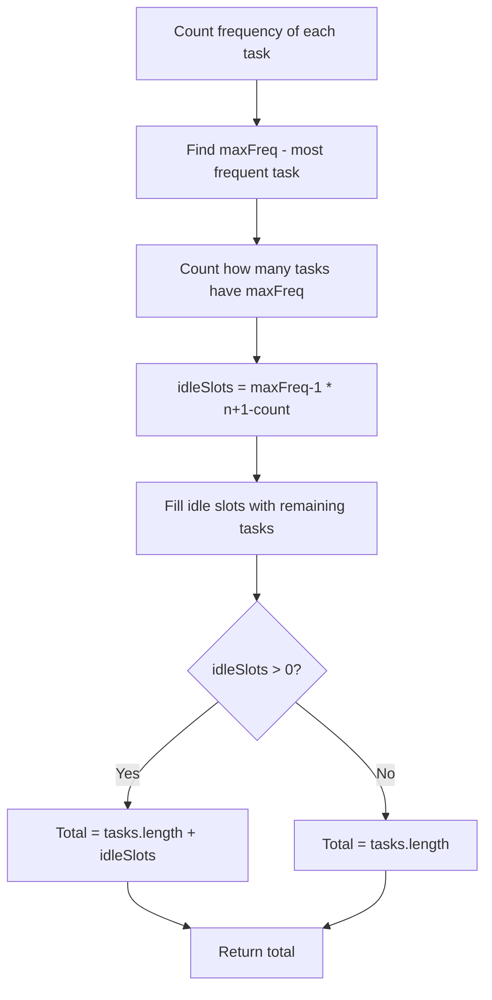

You are given an array of CPU tasks, each represented by a letter A to Z, and a cooling interval `n`. Each cycle, you can complete one task (or idle). Identical tasks must be separated by at least `n` intervals. Return the minimum number of intervals the CPU will take to finish all the tasks.

## Examples

**Input:** tasks = ["A","A","A","B","B","B"], n = 2
**Output:** 8
**Explanation:** A → B → idle → A → B → idle → A → B

**Input:** tasks = ["A","A","A","B","B","B"], n = 0
**Output:** 6
**Explanation:** With no cooldown required, all 6 tasks run back-to-back without idle time.


## Solution

```js
function leastInterval(tasks, n) {
  const freq = new Array(26).fill(0);
  for (const task of tasks) {
    freq[task.charCodeAt(0) - 65]++;
  }

  const maxFreq = Math.max(...freq);
  const maxCount = freq.filter(f => f === maxFreq).length;

  const minLength = (maxFreq - 1) * (n + 1) + maxCount;
  return Math.max(minLength, tasks.length);
}
```

## Explanation

APPROACH: Math Formula from Most Frequent Task

The most frequent task creates a frame. Fill the gaps with other tasks.

```
tasks = [A,A,A,B,B,B], n=2

Most frequent: A and B (freq=3 each)

Frame built from max-freq task:
  A _ _ A _ _ A
  └─n=2─┘

Fill with B:
  A B _ A B _ A B
  └───┘ └───┘

Total: (maxFreq-1) × (n+1) + maxCount
     = (3-1) × (2+1) + 2
     = 6 + 2 = 8  ✓

Another example: [A,A,A,A,A,A,B,C,D,E,F,G], n=2

A _ _ A _ _ A _ _ A _ _ A _ _ A
Fill:
A B C A D E A F G A _ _ A _ _ A
                   └─idle─┘└─idle─┘

= (6-1)×3 + 1 = 16  ✓

Edge case: enough tasks to fill all gaps
  tasks = [A,A,A,B,B,B,C,C,C], n=2
  Frame: A B C A B C A B C = 9
  Formula: (3-1)×3 + 3 = 9
  tasks.length = 9
  Answer: max(9, 9) = 9
```

KEY: If tasks.length > formula result, there are enough diverse tasks to fill all idle slots, so answer = tasks.length.

## Diagram



## TestConfig
```json
{
  "functionName": "leastInterval",
  "testCases": [
    {
      "args": [
        [
          "A",
          "A",
          "A",
          "B",
          "B",
          "B"
        ],
        2
      ],
      "expected": 8
    },
    {
      "args": [
        [
          "A",
          "A",
          "A",
          "B",
          "B",
          "B"
        ],
        0
      ],
      "expected": 6
    },
    {
      "args": [
        [
          "A",
          "A",
          "A",
          "A",
          "A",
          "A",
          "B",
          "C",
          "D",
          "E",
          "F",
          "G"
        ],
        2
      ],
      "expected": 16
    },
    {
      "args": [
        [
          "A"
        ],
        2
      ],
      "expected": 1
    },
    {
      "args": [
        [
          "A",
          "B"
        ],
        2
      ],
      "expected": 2
    },
    {
      "args": [
        [
          "A",
          "A",
          "A",
          "B",
          "B",
          "B",
          "C",
          "C",
          "C"
        ],
        2
      ],
      "expected": 9
    },
    {
      "args": [
        [
          "A",
          "A",
          "B",
          "B"
        ],
        1
      ],
      "expected": 4
    },
    {
      "args": [
        [
          "A",
          "A",
          "A",
          "A"
        ],
        3
      ],
      "expected": 13
    },
    {
      "args": [
        [
          "A",
          "B",
          "C",
          "D",
          "E",
          "F"
        ],
        2
      ],
      "expected": 6
    },
    {
      "args": [
        [
          "A",
          "A",
          "A",
          "B",
          "B",
          "C"
        ],
        2
      ],
      "expected": 7
    }
  ]
}
```
