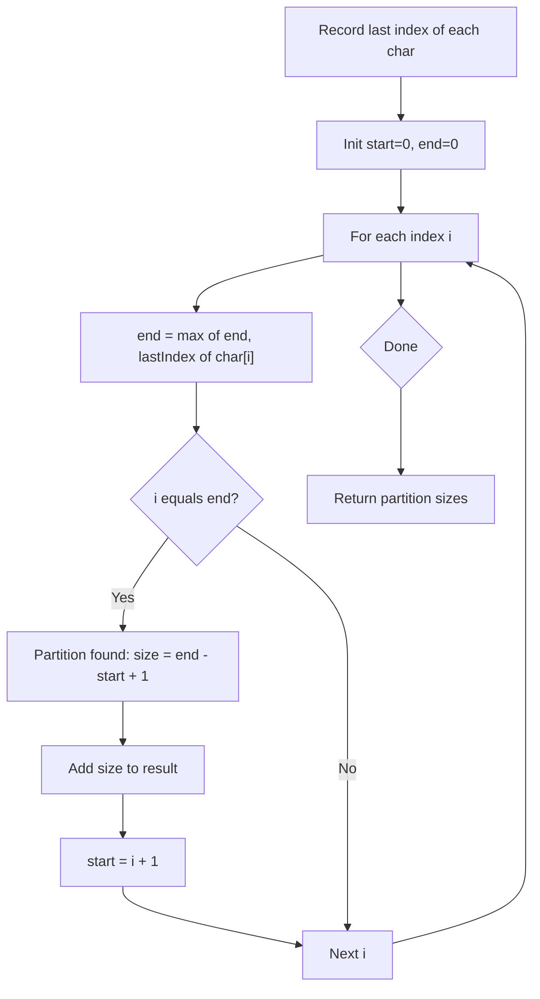

You are given a string `s`. We want to partition the string into as many parts as possible so that each letter appears in at most one part. Return a list of integers representing the size of these parts.

## Examples

**Input:** s = "ababcbacadefegdehijhklij"
**Output:** [9,7,8]
**Explanation:** The first 9 characters contain all occurrences of a, b, and c; splitting earlier would separate repeated letters.

**Input:** s = "eccbbbbdec"
**Output:** [10]
**Explanation:** Every character appears in overlapping ranges across the string, so it cannot be split at all.


## Solution

```js
function partitionLabels(s) {
  const lastIndex = {};
  for (let i = 0; i < s.length; i++) {
    lastIndex[s[i]] = i;
  }

  const result = [];
  let start = 0;
  let end = 0;

  for (let i = 0; i < s.length; i++) {
    end = Math.max(end, lastIndex[s[i]]);
    if (i === end) {
      result.push(end - start + 1);
      start = end + 1;
    }
  }

  return result;
}
```

## Explanation

APPROACH: Last Occurrence + Greedy Expansion

Precompute the last index of each character. Scan and expand the current partition boundary to include all last occurrences.

```
s = "ababcbacadefegdehijhklij"

Last occurrence:
  a:8  b:5  c:7  d:14  e:15  f:11  g:13  h:19  i:22  j:23  k:20  l:21

Scan:
i=0 'a': end=max(0,8)=8
i=1 'b': end=max(8,5)=8
i=2 'a': end=max(8,8)=8
...
i=8 'a': i==end → CUT! partition size = 8-0+1 = 9

i=9  'd': end=max(9,14)=14
i=10 'e': end=max(14,15)=15
i=11 'f': end=max(15,11)=15
...
i=15 'e': i==end → CUT! partition size = 15-9+1 = 7

i=16 'h': end=max(16,19)=19
...
i=23 'j': i==end → CUT! partition size = 23-16+1 = 8

Result: [9, 7, 8] ✓

Visual:
  a b a b c b a c a | d e f e g d e h | i j h k l i j
  └───────────────┘   └─────────────┘   └──────────┘
        9                    7                8
```

KEY: The partition must extend to include the last occurrence of every character seen so far. When the current index equals the partition end, no character in this partition appears later.

## Diagram



## TestConfig
```json
{
  "functionName": "partitionLabels",
  "testCases": [
    {
      "args": [
        "ababcbacadefegdehijhklij"
      ],
      "expected": [
        9,
        7,
        8
      ]
    },
    {
      "args": [
        "eccbbbbdec"
      ],
      "expected": [
        10
      ]
    },
    {
      "args": [
        "a"
      ],
      "expected": [
        1
      ]
    },
    {
      "args": [
        "ab"
      ],
      "expected": [
        1,
        1
      ]
    },
    {
      "args": [
        "abab"
      ],
      "expected": [
        4
      ]
    },
    {
      "args": [
        "abc"
      ],
      "expected": [
        1,
        1,
        1
      ]
    },
    {
      "args": [
        "eaaaabaaec"
      ],
      "expected": [
        10
      ]
    },
    {
      "args": [
        "caedbdedda"
      ],
      "expected": [
        1,
        9
      ]
    },
    {
      "args": [
        "qiejxqfnqceocmy"
      ],
      "expected": [
        13,
        1,
        1
      ]
    },
    {
      "args": [
        "vhaagbiacc"
      ],
      "expected": [
        1,
        8,
        1
      ]
    }
  ]
}
```
