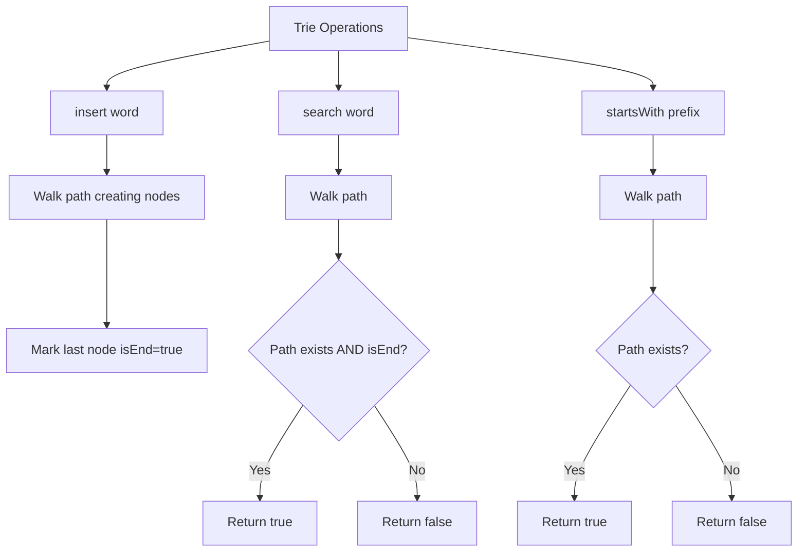

A **trie** (prefix tree) is a tree data structure used to efficiently store and retrieve keys in a dataset of strings. Implement the `Trie` class:

- `Trie()` Initializes the trie object.
- `insert(word)` Inserts the string `word` into the trie.
- `search(word)` Returns `true` if the string `word` is in the trie, and `false` otherwise.
- `startsWith(prefix)` Returns `true` if there is a previously inserted string that has the prefix `prefix`, and `false` otherwise.

## Examples

**Input:** ["Trie", "insert", "search", "search", "startsWith", "insert", "search"]
[[], ["apple"], ["apple"], ["app"], ["app"], ["app"], ["app"]]
**Output:** [null, null, true, false, true, null, true]

**Explanation:**
- insert("apple") → trie has "apple"
- search("apple") → true
- search("app") → false (not a complete word)
- startsWith("app") → true ("apple" starts with "app")
- insert("app") → trie has "apple" and "app"
- search("app") → true


## Brute Force

```js
class TrieBrute {
  constructor() {
    this.words = [];
  }
  insert(word) {
    this.words.push(word);
  }
  search(word) {
    return this.words.includes(word);
  }
  startsWith(prefix) {
    return this.words.some(w => w.startsWith(prefix));
  }
}
// insert: O(1) | search: O(n*m) | startsWith: O(n*m)
```

### Brute Force Explanation

Store words in an array. Search and startsWith scan all words. Trie gives O(m) per operation regardless of how many words are stored.

## Solution

```js
class TrieNode {
  constructor() {
    this.children = {};
    this.isEnd = false;
  }
}

class Trie {
  constructor() {
    this.root = new TrieNode();
  }

  insert(word) {
    let node = this.root;
    for (const char of word) {
      if (!node.children[char]) {
        node.children[char] = new TrieNode();
      }
      node = node.children[char];
    }
    node.isEnd = true;
  }

  search(word) {
    const node = this._walkTo(word);
    return node !== null && node.isEnd;
  }

  startsWith(prefix) {
    return this._walkTo(prefix) !== null;
  }

  _walkTo(str) {
    let node = this.root;
    for (const char of str) {
      if (!node.children[char]) return null;
      node = node.children[char];
    }
    return node;
  }
}
```

## Explanation

APPROACH: Trie with Character-by-Character Nodes

Each node stores children (char → node) and whether it marks a word end.

```
After insert("apple") and insert("app"):

       root
        |
        a
        |
        p
        |
        p  ← isEnd=true ("app")
        |
        l
        |
        e  ← isEnd=true ("apple")

search("app"):
  root → a → p → p (isEnd=true) → return true ✓

search("ap"):
  root → a → p (isEnd=false) → return false ✓

startsWith("app"):
  root → a → p → p (exists) → return true ✓

startsWith("b"):
  root → no 'b' child → return false ✓
```

WHY THIS WORKS:
- Each character maps to one child node — walking spells out the word
- isEnd distinguishes complete words from prefixes
- Shared prefixes share nodes → space efficient
- O(m) per operation where m = word/prefix length

## Diagram



## TestConfig
```json
{
  "functionName": "Trie",
  "isClass": true,
  "testCases": [
    {
      "operations": ["Trie", "insert", "search", "search", "startsWith", "insert", "search"],
      "args": [[], ["apple"], ["apple"], ["app"], ["app"], ["app"], ["app"]],
      "expected": [null, null, true, false, true, null, true]
    },
    {
      "operations": ["Trie", "insert", "insert", "search", "search", "startsWith"],
      "args": [[], ["hello"], ["help"], ["hell"], ["help"], ["hel"]],
      "expected": [null, null, null, false, true, true],
      "isHidden": true
    },
    {
      "operations": ["Trie", "insert", "search", "startsWith", "startsWith"],
      "args": [[], ["a"], ["a"], ["a"], ["b"]],
      "expected": [null, null, true, true, false],
      "isHidden": true
    }
  ]
}
```
