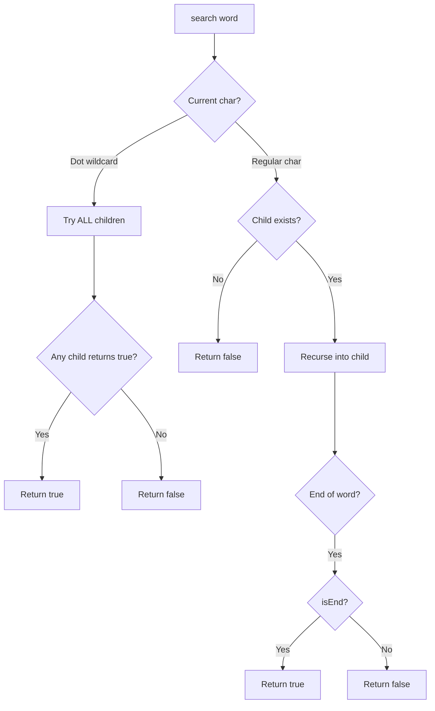

Design a data structure that supports adding new words and finding if a string matches any previously added string. The string may contain dots `'.'` where dots can be matched with any letter.

- `addWord(word)` — Adds word to the data structure.
- `search(word)` — Returns true if there is any string that matches word. `'.'` matches any single character.

## Examples

**Input:** ["WordDictionary","addWord","addWord","addWord","search","search","search","search"]
[[],["bad"],["dad"],["mad"],["pad"],["bad"],[".ad"],["b.."]]
**Output:** [null,null,null,null,false,true,true,true]

**Explanation:**
- search("pad") → false (not added)
- search("bad") → true (exact match)
- search(".ad") → true (matches "bad", "dad", or "mad")
- search("b..") → true (matches "bad")


## Brute Force

```js
class WordDictionaryBrute {
  constructor() { this.words = []; }
  addWord(word) { this.words.push(word); }
  search(word) {
    const regex = new RegExp(`^${word.replace(/\./g, '.')}$`);
    return this.words.some(w => regex.test(w));
  }
}
// addWord: O(1) | search: O(n*m)
```

### Brute Force Explanation

Store words in array, use regex for search. Scales poorly with many words. Trie + DFS is much faster for prefix-heavy datasets.

## Solution

```js
class TrieNode {
  constructor() {
    this.children = {};
    this.isEnd = false;
  }
}

class WordDictionary {
  constructor() {
    this.root = new TrieNode();
  }

  addWord(word) {
    let node = this.root;
    for (const char of word) {
      if (!node.children[char]) {
        node.children[char] = new TrieNode();
      }
      node = node.children[char];
    }
    node.isEnd = true;
  }

  search(word) {
    return this._dfs(this.root, word, 0);
  }

  _dfs(node, word, index) {
    if (index === word.length) return node.isEnd;

    const char = word[index];

    if (char === '.') {
      for (const child of Object.values(node.children)) {
        if (this._dfs(child, word, index + 1)) return true;
      }
      return false;
    }

    if (!node.children[char]) return false;
    return this._dfs(node.children[char], word, index + 1);
  }
}
```

## Explanation

APPROACH: Trie + DFS for Wildcard Matching

Standard trie insert. For search, when encountering '.', DFS into all children.

```
After adding "bad", "dad", "mad":

       root
      / | \
     b  d  m
     |  |  |
     a  a  a
     |  |  |
     d  d  d  ← all isEnd=true

search("b.."):
  root → 'b' exists → node(b)
    '.' → try all children of node(b): 'a'
      '.' → try all children of node(a): 'd'
        index=3 = length, isEnd=true → return true ✓

search(".ad"):
  root → '.' → try 'b', 'd', 'm'
    'b' → 'a' → 'd' (isEnd=true) → true ✓
```

WHY THIS WORKS:
- Normal characters follow the exact path in trie
- Wildcards branch out to all children via DFS
- Early termination: return true as soon as any branch matches
- Worst case with all dots is O(26^m) but rare in practice

## Diagram



## TestConfig
```json
{
  "functionName": "WordDictionary",
  "isClass": true,
  "testCases": [
    {
      "operations": ["WordDictionary","addWord","addWord","addWord","search","search","search","search"],
      "args": [[],["bad"],["dad"],["mad"],["pad"],["bad"],[".ad"],["b.."]],
      "expected": [null,null,null,null,false,true,true,true]
    },
    {
      "operations": ["WordDictionary","addWord","addWord","search","search","search"],
      "args": [[],["a"],["ab"],["a"],["a."],["ab"]],
      "expected": [null,null,null,true,true,true],
      "isHidden": true
    },
    {
      "operations": ["WordDictionary","addWord","search","search"],
      "args": [[],["hello"],["hello"],["....."]],
      "expected": [null,null,true,true],
      "isHidden": true
    }
  ]
}
```
