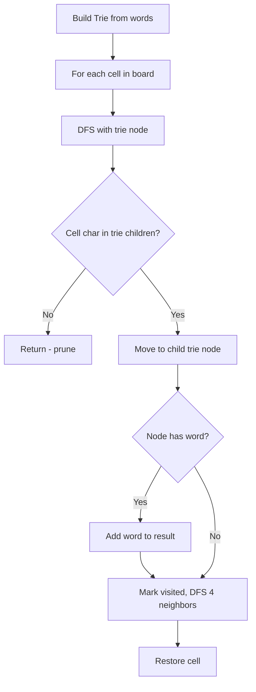

Given an `m x n` board of characters and a list of strings `words`, return all words on the board. Each word must be constructed from letters of sequentially adjacent cells (horizontally or vertically neighboring). The same cell may not be used more than once in a word.

## Examples

**Input:** board = [["o","a","a","n"],["e","t","a","e"],["i","h","k","r"],["i","f","l","v"]], words = ["oath","pea","eat","rain"]
**Output:** ["eat","oath"]

**Input:** board = [["a","b"],["c","d"]], words = ["abcb"]
**Output:** []


## Brute Force

```js
function findWordsBrute(board, words) {
  const result = [];
  for (const word of words) {
    if (existsOnBoard(board, word)) result.push(word);
  }
  return result;

  function existsOnBoard(board, word) {
    for (let i = 0; i < board.length; i++) {
      for (let j = 0; j < board[0].length; j++) {
        if (dfs(i, j, 0)) return true;
      }
    }
    return false;

    function dfs(r, c, idx) {
      if (idx === word.length) return true;
      if (r < 0 || r >= board.length || c < 0 || c >= board[0].length) return false;
      if (board[r][c] !== word[idx]) return false;
      const temp = board[r][c];
      board[r][c] = '#';
      const found = dfs(r+1,c,idx+1) || dfs(r-1,c,idx+1) || dfs(r,c+1,idx+1) || dfs(r,c-1,idx+1);
      board[r][c] = temp;
      return found;
    }
  }
}
// Time: O(W × m × n × 4^L) — repeats full DFS for each word
```

### Brute Force Explanation

Run Word Search I for each word independently. Redundant — the trie approach searches all words simultaneously in one DFS pass.

## Solution

```js
function findWords(board, words) {
  const root = {};
  // Build trie
  for (const word of words) {
    let node = root;
    for (const char of word) {
      if (!node[char]) node[char] = {};
      node = node[char];
    }
    node.word = word;
  }

  const result = [];
  const rows = board.length;
  const cols = board[0].length;

  function dfs(r, c, node) {
    if (r < 0 || r >= rows || c < 0 || c >= cols) return;
    const char = board[r][c];
    if (char === '#' || !node[char]) return;

    const next = node[char];
    if (next.word) {
      result.push(next.word);
      next.word = null; // avoid duplicates
    }

    board[r][c] = '#'; // mark visited
    dfs(r + 1, c, next);
    dfs(r - 1, c, next);
    dfs(r, c + 1, next);
    dfs(r, c - 1, next);
    board[r][c] = char; // restore

    // Prune: remove leaf nodes with no children
    if (Object.keys(next).length === 0 || (Object.keys(next).length === 1 && next.word === null)) {
      delete node[char];
    }
  }

  for (let r = 0; r < rows; r++) {
    for (let c = 0; c < cols; c++) {
      dfs(r, c, root);
    }
  }

  return result;
}
```

## Explanation

APPROACH: Trie + Backtracking DFS

Build trie from words, DFS the board while walking the trie. Found words stored at leaf nodes.

```
words = ["oath", "eat"]

Trie:
  root → o → a → t → h (word="oath")
       → e → a → t (word="eat")

Board:
  o a a n
  e t a e
  i h k r

DFS from (0,0)='o':
  root has 'o' → go to trie node 'o'
  neighbors: (1,0)='e' (no match in trie 'o'), (0,1)='a' ✓
  At (0,1)='a': trie o→a
    neighbor (1,1)='t': trie o→a→t ✓
      neighbor (2,1)='h': trie o→a→t→h → word="oath" found! ✓

DFS from (1,1)='e' (actually need to find 'e' start):
  (no 'e' in root... wait 'e' exists)
  DFS from (0,3)='e' or (1,0)='e':
    At (1,0)='e': root→e
    neighbor (1,1)='t' → nope, need 'a' next
    Actually at root→e→a→t...
  Eventually finds "eat" via e→a→t path ✓
```

WHY THIS WORKS:
- Trie prunes search: if current path doesn't match any word prefix, stop immediately
- All words searched simultaneously in one board traversal
- Marking visited cells prevents reuse; restoring enables other paths
- Deleting found words prevents duplicates

## Diagram



## TestConfig
```json
{
  "functionName": "findWords",
  "testCases": [
    {
      "args": [[["o","a","a","n"],["e","t","a","e"],["i","h","k","r"],["i","f","l","v"]], ["oath","pea","eat","rain"]],
      "expected": ["eat","oath"],
      "unordered": true
    },
    {
      "args": [[["a","b"],["c","d"]], ["abcb"]],
      "expected": []
    },
    {
      "args": [[["a"]], ["a"]],
      "expected": ["a"],
      "isHidden": true
    },
    {
      "args": [[["a","a"]], ["aaa"]],
      "expected": [],
      "isHidden": true
    },
    {
      "args": [[["a","b"],["c","d"]], ["ab","cb","ad","bd","ac","ca","da","bc","db","adcb","dabc","abb","acb"]],
      "expected": ["ab","ac","bd","ca","da","db","adcb","dabc","acb"],
      "unordered": true,
      "isHidden": true
    }
  ]
}
```
