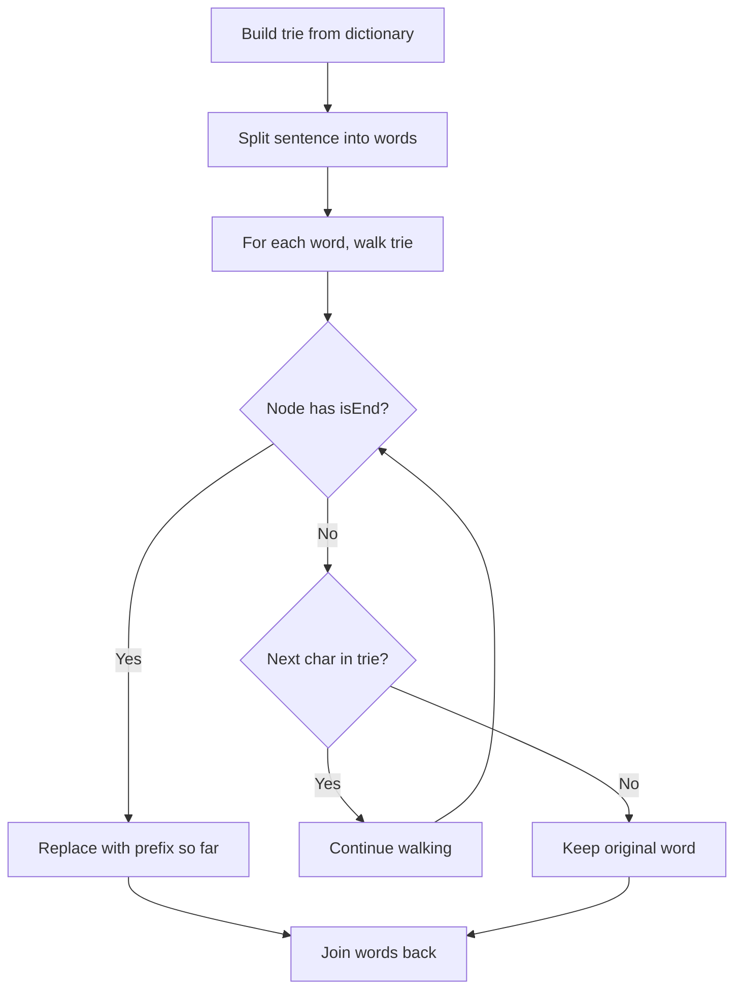

Given a dictionary of root words and a sentence, replace every word in the sentence with its shortest matching root from the dictionary. If a word has no matching root, keep the original.

## Examples

**Input:** dictionary = ["cat","bat","rat"], sentence = "the cattle was rattled by the battery"
**Output:** "the cat was rat by the bat"

**Input:** dictionary = ["a","b","c"], sentence = "aadsfasf absbs bbab cadsfabd"
**Output:** "a a b c"


## Brute Force

```js
function replaceWordsBrute(dictionary, sentence) {
  const words = sentence.split(' ');
  return words.map(word => {
    let shortest = word;
    for (const root of dictionary) {
      if (word.startsWith(root) && root.length < shortest.length) {
        shortest = root;
      }
    }
    return shortest;
  }).join(' ');
}
// Time: O(n × d × m) | Space: O(1) extra
```

### Brute Force Explanation

For each word, check all dictionary roots. Slow for large dictionaries. Trie gives O(m) per word lookup.

## Solution

```js
function replaceWords(dictionary, sentence) {
  // Build trie
  const root = {};
  for (const word of dictionary) {
    let node = root;
    for (const char of word) {
      if (!node[char]) node[char] = {};
      node = node[char];
    }
    node.isEnd = true;
  }

  // Replace words
  return sentence.split(' ').map(word => {
    let node = root;
    let prefix = '';
    for (const char of word) {
      if (!node[char] || node.isEnd) break;
      node = node[char];
      prefix += char;
    }
    return node.isEnd ? prefix : word;
  }).join(' ');
}
```

## Explanation

APPROACH: Trie for Shortest Prefix Match

Build trie from roots. For each word, walk trie until we hit isEnd (shortest root found) or path breaks.

```
dictionary = ["cat", "bat", "rat"]

Trie:
  root → c → a → t (isEnd)
       → b → a → t (isEnd)
       → r → a → t (isEnd)

sentence = "the cattle was rattled by the battery"

"the":    root → no 't'? Wait, 't' not in trie → keep "the"
"cattle": root → 'c' → 'a' → 't' (isEnd!) → replace with "cat"
"was":    root → no 'w' → keep "was"
"rattled": root → 'r' → 'a' → 't' (isEnd!) → replace with "rat"
"battery": root → 'b' → 'a' → 't' (isEnd!) → replace with "bat"

Result: "the cat was rat by the bat"
```

WHY THIS WORKS:
- Trie naturally finds the shortest prefix — we stop at the first isEnd
- O(m) per word where m is the word length (often shorter due to early termination)
- No need to sort dictionary or compare all roots

## Diagram



## TestConfig
```json
{
  "functionName": "replaceWords",
  "testCases": [
    {
      "args": [["cat","bat","rat"], "the cattle was rattled by the battery"],
      "expected": "the cat was rat by the bat"
    },
    {
      "args": [["a","b","c"], "aadsfasf absbs bbab cadsfabd"],
      "expected": "a a b c"
    },
    {
      "args": [["a","aa","aaa"], "aaa aaaa aa"],
      "expected": "a a a",
      "isHidden": true
    },
    {
      "args": [["catt","cat","bat","rat"], "the]cattle was rattled by the battery"],
      "expected": "the]cat was rat by the bat",
      "isHidden": true
    },
    {
      "args": [["xyz"], "hello world"],
      "expected": "hello world",
      "isHidden": true
    },
    {
      "args": [["e","k","c","harbn","hbh","s","cl","by","or","bbd"], "眐ebc]klded"],
      "expected": "e k",
      "isHidden": true
    }
  ]
}
```
