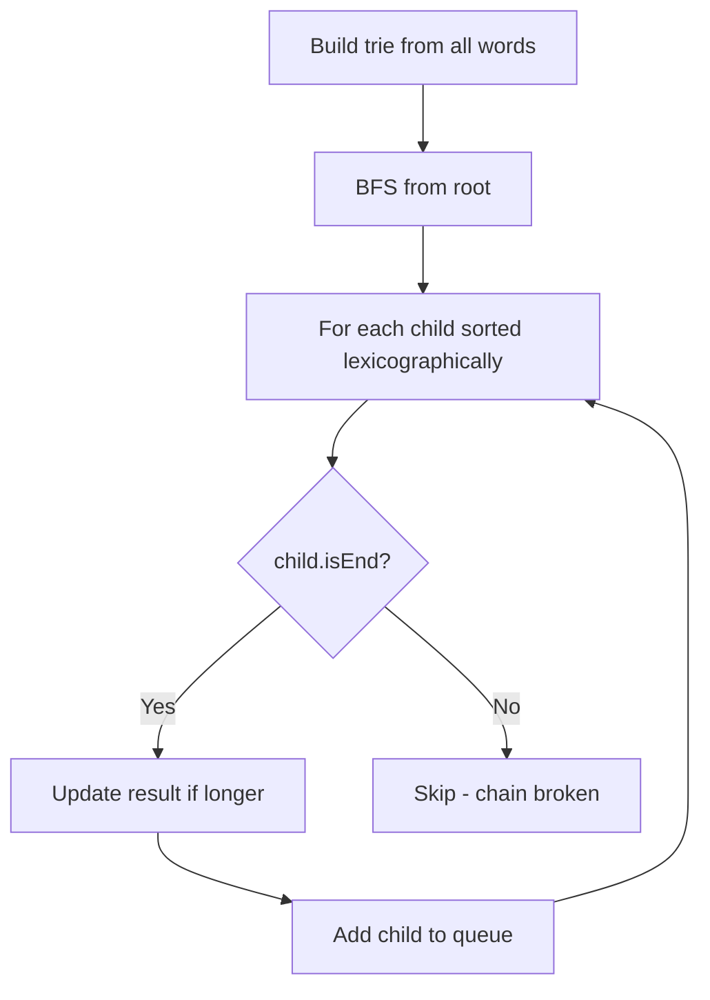

Given an array of strings `words`, return the longest word in `words` that can be built one character at a time by other words in `words`. If there are multiple answers, return the one that is lexicographically smallest. If no answer exists, return `""`.

## Examples

**Input:** words = ["w","wo","wor","worl","world"]
**Output:** "world"
**Explanation:** "world" can be built: "w" → "wo" → "wor" → "worl" → "world".

**Input:** words = ["a","banana","app","appl","ap","apply","apple"]
**Output:** "apple"
**Explanation:** Both "apply" and "apple" can be built, but "apple" < "apply" lexicographically.


## Brute Force

```js
function longestWordBrute(words) {
  const wordSet = new Set(words);
  let result = '';

  for (const word of words) {
    let valid = true;
    for (let i = 1; i < word.length; i++) {
      if (!wordSet.has(word.slice(0, i))) {
        valid = false;
        break;
      }
    }
    if (valid && (word.length > result.length ||
        (word.length === result.length && word < result))) {
      result = word;
    }
  }
  return result;
}
// Time: O(n × m²) due to slicing | Space: O(n × m)
```

### Brute Force Explanation

For each word, check that all prefixes exist in the set. String slicing makes it O(m²) per word. Trie avoids repeated prefix checking.

## Solution

```js
function longestWord(words) {
  // Build trie
  const root = { isEnd: false, children: {} };
  for (const word of words) {
    let node = root;
    for (const char of word) {
      if (!node.children[char]) {
        node.children[char] = { isEnd: false, children: {} };
      }
      node = node.children[char];
    }
    node.isEnd = true;
    node.word = word;
  }

  // BFS: only traverse nodes where isEnd is true
  let result = '';
  const queue = [root];

  while (queue.length > 0) {
    const node = queue.shift();
    for (const char of Object.keys(node.children).sort()) {
      const child = node.children[char];
      if (child.isEnd) {
        if (child.word.length > result.length) {
          result = child.word;
        }
        queue.push(child);
      }
    }
  }

  return result;
}
```

## Explanation

APPROACH: Trie + BFS (only valid prefix chains)

Build trie, then BFS only following nodes marked as word ends. This ensures every prefix of the path is a word.

```
words = ["a","banana","app","appl","ap","apply","apple"]

Trie (relevant paths):
  root → a (isEnd) → p (isEnd "ap") → p (isEnd "app")
                                          → l (isEnd "appl")
                                              → e (isEnd "apple") ✓
                                              → y (isEnd "apply") ✓
       → b → a → n → a → n → a (isEnd "banana")
         ↑ 'b' is NOT isEnd → can't build "banana" one char at a time

BFS from root:
  Level 1: 'a' (isEnd) → result = "a"
  Level 2: 'ap' (isEnd) → result = "ap"
  Level 3: 'app' (isEnd) → result = "app"
  Level 4: 'appl' (isEnd) → result = "appl"
  Level 5: 'apple' and 'apply' both isEnd
    "apple" < "apply" lexicographically → result = "apple"

Note: "banana" — 'b' node is NOT isEnd, so BFS never enters that branch.
```

WHY THIS WORKS:
- BFS only follows isEnd nodes, ensuring every prefix is a valid word
- Lexicographic ordering handled by sorting children keys
- Longest valid chain found naturally by BFS depth

## Diagram



## TestConfig
```json
{
  "functionName": "longestWord",
  "testCases": [
    {
      "args": [["w","wo","wor","worl","world"]],
      "expected": "world"
    },
    {
      "args": [["a","banana","app","appl","ap","apply","apple"]],
      "expected": "apple"
    },
    {
      "args": [["a","b","c"]],
      "expected": "a",
      "isHidden": true
    },
    {
      "args": [["yo","ew","fc","zrc","yodn","fcm","qm","qmo","fcmz","z","ewq","yod","ewqz","y"]],
      "expected": "yodn",
      "isHidden": true
    },
    {
      "args": [["abc"]],
      "expected": "",
      "isHidden": true
    },
    {
      "args": [["a","ab","abc","abcd","b","bc","bcd","bcde"]],
      "expected": "abcd",
      "isHidden": true
    }
  ]
}
```
