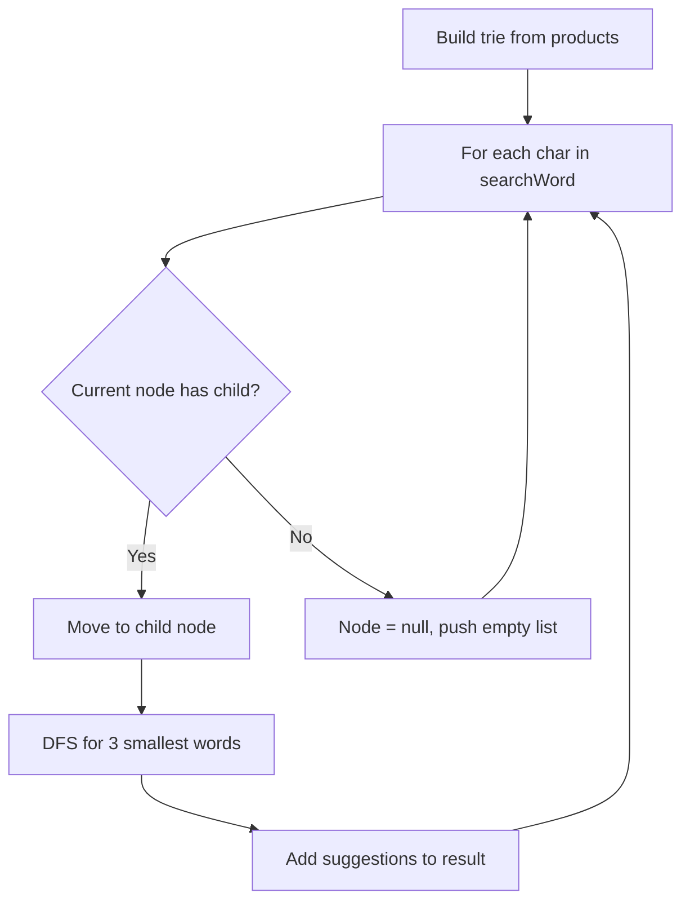

You are given an array of strings `products` and a string `searchWord`. Design a system that suggests at most three product names from `products` after each character of `searchWord` is typed. Suggested products should have common prefix with `searchWord`. If there are more than three products with a common prefix, return the three lexicographically smallest.

Return a list of lists of the suggested products after each character of `searchWord` is typed.

## Examples

**Input:** products = ["mobile","mouse","moneypot","monitor","mousepad"], searchWord = "mouse"
**Output:** [["mobile","moneypot","monitor"],["mobile","moneypot","monitor"],["mouse","mousepad"],["mouse","mousepad"],["mouse","mousepad"]]

**Input:** products = ["havana"], searchWord = "havana"
**Output:** [["havana"],["havana"],["havana"],["havana"],["havana"],["havana"]]


## Brute Force

```js
function suggestedProductsBrute(products, searchWord) {
  products.sort();
  const result = [];
  for (let i = 1; i <= searchWord.length; i++) {
    const prefix = searchWord.slice(0, i);
    result.push(
      products.filter(p => p.startsWith(prefix)).slice(0, 3)
    );
  }
  return result;
}
// Time: O(n × m × s) | Space: O(1) extra
```

### Brute Force Explanation

For each prefix, filter all products. Works but scans all products for every prefix. Trie navigates directly to the prefix node.

## Solution

```js
function suggestedProducts(products, searchWord) {
  // Build trie
  const root = {};
  for (const product of products) {
    let node = root;
    for (const char of product) {
      if (!node[char]) node[char] = {};
      node = node[char];
    }
    node.isEnd = true;
  }

  const result = [];
  let node = root;

  for (const char of searchWord) {
    if (node && node[char]) {
      node = node[char];
      // DFS to collect up to 3 lexicographically smallest words
      const suggestions = [];
      dfs(node, searchWord.slice(0, result.length + 1), suggestions);
      result.push(suggestions);
    } else {
      node = null;
      result.push([]);
    }
  }

  return result;

  function dfs(node, prefix, list) {
    if (list.length === 3) return;
    if (node.isEnd) list.push(prefix);
    for (const c of Object.keys(node).sort()) {
      if (c === 'isEnd') continue;
      dfs(node[c], prefix + c, list);
      if (list.length === 3) return;
    }
  }
}
```

## Explanation

APPROACH: Trie + DFS for Top 3 Suggestions

Walk trie with each typed character. At each node, DFS in sorted order to find first 3 words.

```
products = ["mobile","moneypot","monitor","mouse","mousepad"]

Trie (simplified):
  root → m → o → b → i → l → e (isEnd "mobile")
                 → n → e → y → p → o → t (isEnd "moneypot")
                     → i → t → o → r (isEnd "monitor")
                 → u → s → e (isEnd "mouse")
                             → p → a → d (isEnd "mousepad")

Type "m": DFS from m-node → ["mobile","moneypot","monitor"] (first 3 sorted)
Type "mo": DFS from o-node → ["mobile","moneypot","monitor"]
Type "mou": DFS from u-node → ["mouse","mousepad"]
Type "mous": DFS from s-node → ["mouse","mousepad"]
Type "mouse": DFS from e-node → ["mouse","mousepad"]
```

WHY THIS WORKS:
- Trie walk to prefix is O(prefix length) — no scanning
- DFS in sorted key order naturally produces lexicographic results
- Stop DFS after 3 results → bounded work per query
- Once node becomes null (no match), all subsequent prefixes return []

## Diagram



## TestConfig
```json
{
  "functionName": "suggestedProducts",
  "testCases": [
    {
      "args": [["mobile","mouse","moneypot","monitor","mousepad"], "mouse"],
      "expected": [["mobile","moneypot","monitor"],["mobile","moneypot","monitor"],["mouse","mousepad"],["mouse","mousepad"],["mouse","mousepad"]]
    },
    {
      "args": [["havana"], "havana"],
      "expected": [["havana"],["havana"],["havana"],["havana"],["havana"],["havana"]]
    },
    {
      "args": [["bags","baggage","banner","box","cloths"], "bags"],
      "expected": [["baggage","bags","banner"],["baggage","bags","banner"],["baggage","bags"],["bags"]],
      "isHidden": true
    },
    {
      "args": [["a","aa","aaa"], "aaaa"],
      "expected": [["a","aa","aaa"],["aa","aaa"],["aaa"],[]],
      "isHidden": true
    }
  ]
}
```
