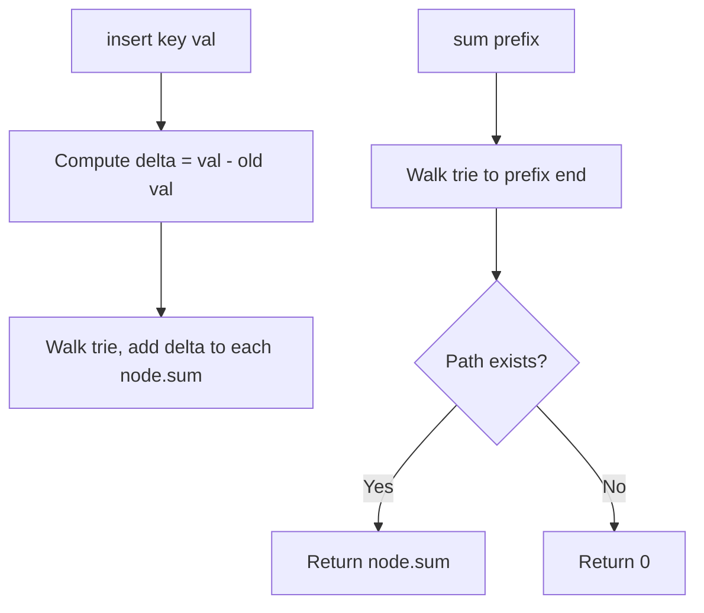

Design a map that supports two operations: `insert(key, val)` inserts or updates a key-value pair, and `sum(prefix)` returns the sum of all values whose keys start with the given prefix.

## Examples

**Input:** ["MapSum", "insert", "sum", "insert", "sum"]
[[], ["apple", 3], ["ap"], ["app", 2], ["ap"]]
**Output:** [null, null, 3, null, 5]

**Explanation:**
- insert("apple", 3) → trie has apple=3
- sum("ap") → 3 (only "apple" has prefix "ap")
- insert("app", 2) → trie has apple=3, app=2
- sum("ap") → 5 (3 + 2)


## Brute Force

```js
class MapSumBrute {
  constructor() { this.map = {}; }
  insert(key, val) { this.map[key] = val; }
  sum(prefix) {
    let total = 0;
    for (const [key, val] of Object.entries(this.map)) {
      if (key.startsWith(prefix)) total += val;
    }
    return total;
  }
}
// insert: O(1) | sum: O(n × m)
```

### Brute Force Explanation

Store in a hash map, scan all keys for sum. O(n) per sum query. Trie with prefix sums makes it O(m).

## Solution

```js
class MapSum {
  constructor() {
    this.root = {};
    this.map = {};
  }

  insert(key, val) {
    const delta = val - (this.map[key] || 0);
    this.map[key] = val;

    let node = this.root;
    for (const char of key) {
      if (!node[char]) node[char] = { sum: 0 };
      node = node[char];
      node.sum += delta;
    }
  }

  sum(prefix) {
    let node = this.root;
    for (const char of prefix) {
      if (!node[char]) return 0;
      node = node[char];
    }
    return node.sum;
  }
}
```

## Explanation

APPROACH: Trie with Prefix Sums

Each node stores the sum of all values passing through it. On insert, add the delta (new - old value) to every node along the path.

```
insert("apple", 3):
  delta = 3 - 0 = 3
  root → a(sum=3) → p(sum=3) → p(sum=3) → l(sum=3) → e(sum=3)

sum("ap"):
  Walk to p → sum = 3 ✓

insert("app", 2):
  delta = 2 - 0 = 2
  root → a(sum=5) → p(sum=5) → p(sum=5)   ← existing nodes get +2
  (app shares path with apple up to second 'p')

sum("ap"):
  Walk to p → sum = 5 ✓ (apple's 3 + app's 2)

Update: insert("apple", 5):
  delta = 5 - 3 = 2  (old value was 3)
  root → a(sum=7) → p(sum=7) → p(sum=7) → l(sum=5) → e(sum=5)

sum("ap") → 7 (apple's 5 + app's 2)
```

WHY THIS WORKS:
- Delta-based updates handle overwrites correctly
- Each node accumulates sums of all words passing through it
- Sum query is just a walk to prefix end → O(m)
- HashMap tracks current values for delta calculation

## Diagram



## TestConfig
```json
{
  "functionName": "MapSum",
  "isClass": true,
  "testCases": [
    {
      "operations": ["MapSum", "insert", "sum", "insert", "sum"],
      "args": [[], ["apple", 3], ["ap"], ["app", 2], ["ap"]],
      "expected": [null, null, 3, null, 5]
    },
    {
      "operations": ["MapSum", "insert", "sum", "insert", "sum"],
      "args": [[], ["apple", 3], ["ap"], ["apple", 5], ["ap"]],
      "expected": [null, null, 3, null, 5],
      "isHidden": true
    },
    {
      "operations": ["MapSum", "insert", "insert", "sum", "sum"],
      "args": [[], ["aa", 3], ["ab", 2], ["a"], ["aa"]],
      "expected": [null, null, null, 5, 3],
      "isHidden": true
    }
  ]
}
```
