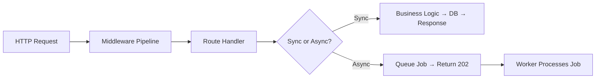

## Backend Architecture

Good backend architecture is about organizing code and infrastructure so that requests are handled reliably, work can scale, and teams can move independently.

### The Request Lifecycle

Every backend request follows a path: **Client → Load Balancer → Server → Middleware → Route Handler → Business Logic → Database → Response**. Understanding this flow is essential. HTTP methods (GET, POST, PUT, DELETE) map to CRUD operations. Status codes (2xx success, 4xx client error, 5xx server error) communicate outcomes. Headers carry metadata like authentication tokens, content types, and CORS policies.

**Middleware** intercepts requests at each stage — authentication, rate limiting, logging, body parsing, error handling. The middleware pattern (used in Express, Koa, Django) composes these concerns into a pipeline so your route handlers stay focused on business logic.

### Data Access Patterns

**ORMs** (Sequelize, Prisma, SQLAlchemy) map database tables to objects, generating SQL automatically. They boost productivity but can produce inefficient queries. **Query builders** (Knex, Kysely) give you SQL-like syntax with type safety. **Raw SQL** gives maximum control and performance. Most teams use an ORM for CRUD and drop to raw SQL for complex queries.

### Async Processing

Not everything belongs in the request-response cycle. **Background jobs** (Bull, Celery, Sidekiq) handle email sending, report generation, image processing — anything that takes too long for a synchronous response. **Message queues** (RabbitMQ, Kafka, SQS) decouple producers from consumers, enabling event-driven architectures where services react to events rather than making direct calls.

### Monolith vs Microservices

Start with a monolith. It's simpler to develop, test, deploy, and debug. Extract microservices when you have a compelling reason: a team needs to deploy independently, a component needs to scale differently, or a bounded context is clearly separate. Microservices introduce distributed systems complexity — network failures, data consistency, service discovery — that you shouldn't take on prematurely.



## ELI5

Think of a restaurant. The **HTTP request** is a customer walking in. **Middleware** is the host who checks your reservation (auth), the coat check (parsing), and the hostess seating you (routing).

The **route handler** is your waiter — takes your order and brings food. The **kitchen** (business logic + database) actually makes the meal.

**Background jobs** are like takeout orders. The restaurant doesn't make you wait at the counter — they give you a number and call you when it's ready.

**Monolith vs microservices**: a single restaurant (monolith) vs a food court with specialized stalls (microservices). The food court can serve more cuisines, but coordinating across stalls is harder.

## Poem

Requests arrive through HTTP's gate,
Middleware checks them, early or late.
Handlers route to logic within,
Where business rules and data begin.

When work is slow, don't block the thread,
Queue it up in the background instead.
Start with one service, simple and whole,
Split when you must, but keep control.

## Template

```typescript
// Middleware pattern (Express-style)
app.use(authMiddleware);        // Check JWT token
app.use(rateLimiter);           // Rate limiting
app.use(requestLogger);         // Log request details

// Route handler
app.post('/orders', async (req, res) => {
  const order = await OrderService.create(req.body);

  // Offload heavy work to background job
  await queue.add('send-confirmation-email', { orderId: order.id });

  res.status(201).json(order);
});

// Background worker
queue.process('send-confirmation-email', async (job) => {
  await EmailService.sendOrderConfirmation(job.data.orderId);
});
```
