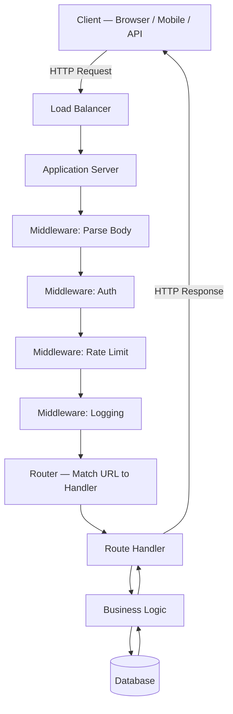
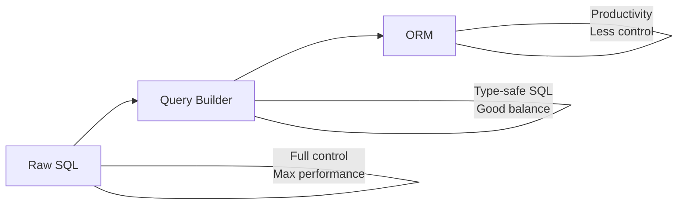
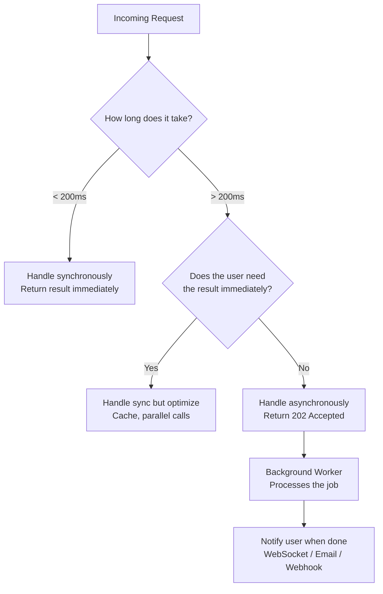
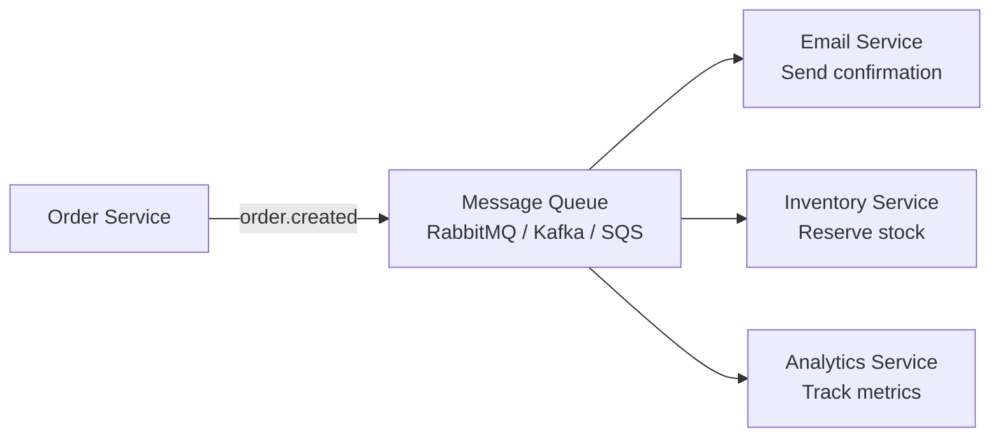
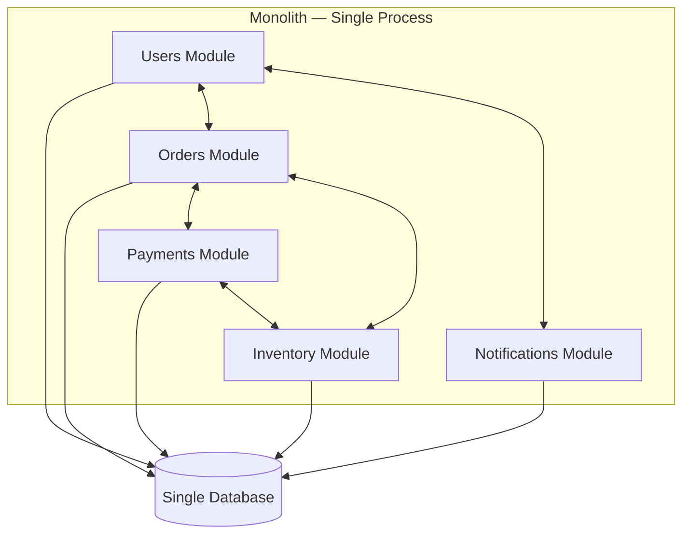
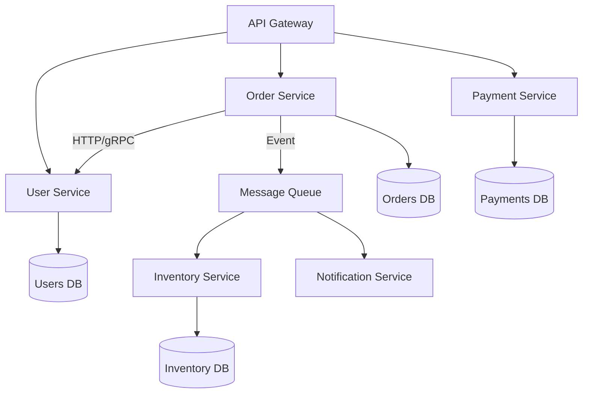
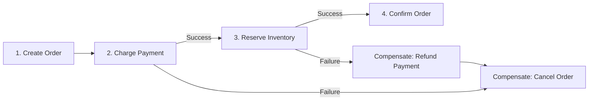

## Backend Architecture

Good backend architecture is about organizing code and infrastructure so that requests are handled reliably, work can scale, and teams can move independently.

### The Request Lifecycle

Every backend request follows a predictable path through your system. Understanding this flow is the foundation for debugging, performance tuning, and designing new features.

#### The Full Journey of a Request



1. **DNS resolution** — The client resolves your domain to an IP address
2. **TCP + TLS handshake** — Connection established, encrypted for HTTPS
3. **Load balancer** — Distributes the request to one of your application servers (round-robin, least connections, or IP hash)
4. **Middleware pipeline** — Cross-cutting concerns execute in order (parsing, auth, rate limiting, logging)
5. **Routing** — URL + HTTP method matched to a handler function
6. **Business logic** — Your application code runs, talks to databases/caches/external APIs
7. **Response** — Status code + headers + body sent back through the same chain

#### HTTP Methods and When to Use Them

| Method | Purpose | Idempotent | Safe | Example |
|--------|---------|-----------|------|---------|
| **GET** | Read data | Yes | Yes | `GET /users/42` |
| **POST** | Create resource | No | No | `POST /orders` |
| **PUT** | Replace entire resource | Yes | No | `PUT /users/42` |
| **PATCH** | Partial update | No | No | `PATCH /users/42` |
| **DELETE** | Remove resource | Yes | No | `DELETE /users/42` |

**Idempotent** means calling it multiple times has the same effect as calling it once. `PUT /users/42` with the same body always produces the same result. `POST /orders` creates a new order each time.

#### HTTP Status Codes You Must Know

```
2xx — Success
  200 OK              — Request succeeded (GET, PUT, PATCH)
  201 Created          — New resource created (POST)
  202 Accepted         — Request accepted but processing async
  204 No Content       — Success with no body (DELETE)

3xx — Redirection
  301 Moved Permanently — URL has changed forever
  304 Not Modified      — Cached version is still valid

4xx — Client Error
  400 Bad Request       — Invalid request body or parameters
  401 Unauthorized      — Not authenticated (no/bad token)
  403 Forbidden         — Authenticated but not authorized
  404 Not Found         — Resource doesn't exist
  409 Conflict          — Conflicts with current state (duplicate email)
  422 Unprocessable     — Valid syntax but semantic errors
  429 Too Many Requests — Rate limit exceeded

5xx — Server Error
  500 Internal Server Error — Unhandled exception
  502 Bad Gateway           — Upstream server returned invalid response
  503 Service Unavailable   — Server overloaded or in maintenance
  504 Gateway Timeout       — Upstream server didn't respond in time
```

#### Headers That Matter

```http
# Request headers
Authorization: Bearer eyJhbGc...     # Auth token
Content-Type: application/json        # Body format
Accept: application/json              # Desired response format
X-Request-ID: abc-123                 # Trace requests across services

# Response headers
Cache-Control: max-age=3600           # Browser caching
X-RateLimit-Remaining: 95            # Rate limit info
Access-Control-Allow-Origin: *        # CORS policy
Set-Cookie: session=abc; HttpOnly     # Session management
```

#### REST API Design Principles

```
# Resource naming — nouns, not verbs, plural
GET    /users          — list users
POST   /users          — create user
GET    /users/42       — get specific user
PUT    /users/42       — replace user
DELETE /users/42       — delete user

# Nested resources for relationships
GET    /users/42/orders          — list user's orders
POST   /users/42/orders          — create order for user

# Filtering, sorting, pagination via query params
GET    /users?status=active&sort=-created_at&page=2&limit=20

# Versioning
GET    /api/v1/users
GET    /api/v2/users
```

**Key takeaway:** The request lifecycle is a pipeline. Each layer has a single responsibility. Understanding the full flow — from DNS to response — helps you debug issues at any point in the chain.

### Data Access Patterns

How your application talks to the database is one of the most impactful architectural decisions. The spectrum ranges from raw SQL (maximum control) to full ORMs (maximum productivity), with query builders in between.

#### The Spectrum of Data Access



#### Raw SQL — Maximum Control

You write the SQL directly. The database does exactly what you tell it.

```typescript
// Raw SQL with parameterized queries
const result = await db.query(
  `SELECT u.name, COUNT(o.id) AS order_count, SUM(o.total) AS revenue
   FROM users u
   LEFT JOIN orders o ON o.user_id = u.id
   WHERE u.created_at > $1
   GROUP BY u.id
   HAVING SUM(o.total) > $2
   ORDER BY revenue DESC
   LIMIT $3`,
  ['2024-01-01', 1000, 20]
);
```

**When to use:** Complex analytical queries, performance-critical paths, queries the ORM can't express, database-specific features (window functions, CTEs, recursive queries).

**Tradeoffs:** No type safety, no protection against schema changes, requires SQL expertise.

#### Query Builders — The Middle Ground

Query builders like **Knex** and **Kysely** give you SQL-like syntax with type safety and composability:

```typescript
// Knex — JavaScript query builder
const users = await knex('users')
  .select('users.name', knex.raw('COUNT(orders.id) AS order_count'))
  .leftJoin('orders', 'orders.user_id', 'users.id')
  .where('users.created_at', '>', '2024-01-01')
  .groupBy('users.id')
  .havingRaw('SUM(orders.total) > ?', [1000])
  .orderBy('order_count', 'desc')
  .limit(20);

// Kysely — TypeScript query builder with full type inference
const result = await db
  .selectFrom('users')
  .innerJoin('orders', 'orders.user_id', 'users.id')
  .select(['users.name', db.fn.count('orders.id').as('order_count')])
  .where('users.status', '=', 'active')
  .groupBy('users.id')
  .execute();
// ↑ Return type is automatically inferred from your schema
```

**When to use:** Dynamic queries (filters that change based on user input), when you want SQL control with type safety, composable query fragments.

#### ORMs — Maximum Productivity

**ORMs** (Prisma, Sequelize, TypeORM, SQLAlchemy, Django ORM) map database tables to classes/objects. You work with objects, the ORM generates SQL.

```typescript
// Prisma — modern TypeScript ORM
const user = await prisma.user.findUnique({
  where: { id: 42 },
  include: {
    orders: {
      where: { status: 'paid' },
      orderBy: { createdAt: 'desc' },
      take: 10,
    },
    profile: true,
  },
});
// Returns a fully typed object with nested relations

// Create with nested relations
const order = await prisma.order.create({
  data: {
    userId: 42,
    total: 99.99,
    items: {
      create: [
        { productId: 101, quantity: 2, price: 29.99 },
        { productId: 202, quantity: 1, price: 39.99 },
      ],
    },
  },
  include: { items: true },
});
```

**When to use:** CRUD-heavy applications, rapid development, when type safety matters more than query control, teams without deep SQL expertise.

#### The N+1 Query Problem with ORMs

The most common ORM performance trap:

```typescript
// ❌ N+1 — 1 query for users + N queries for orders
const users = await prisma.user.findMany({ take: 100 });
for (const user of users) {
  const orders = await prisma.order.findMany({
    where: { userId: user.id },
  });
  // 101 total queries!
}

// ✅ Eager loading — 2 queries total
const users = await prisma.user.findMany({
  take: 100,
  include: { orders: true },
});
// Query 1: SELECT * FROM users LIMIT 100
// Query 2: SELECT * FROM orders WHERE user_id IN (1, 2, 3, ...)
```

#### The Repository Pattern

Abstract your data access behind an interface. This lets you swap implementations (ORM → raw SQL) without changing business logic:

```typescript
// Interface
interface UserRepository {
  findById(id: number): Promise<User | null>;
  findByEmail(email: string): Promise<User | null>;
  create(data: CreateUserInput): Promise<User>;
  updateBalance(id: number, amount: number): Promise<void>;
}

// Prisma implementation
class PrismaUserRepository implements UserRepository {
  async findById(id: number) {
    return prisma.user.findUnique({ where: { id } });
  }

  // For complex queries, drop to raw SQL
  async updateBalance(id: number, amount: number) {
    await prisma.$executeRaw`
      UPDATE users SET balance = balance + ${amount}
      WHERE id = ${id} AND balance + ${amount} >= 0
    `;
  }
}
```

#### Comparison Table

| Aspect | Raw SQL | Query Builder | ORM |
|--------|---------|--------------|-----|
| Learning curve | SQL knowledge | Low | Medium |
| Type safety | None | Good | Excellent |
| Query control | Full | High | Limited |
| Performance | Best | Good | Can be poor |
| Migrations | Manual | Built-in | Built-in |
| Best for | Complex queries | Dynamic filters | CRUD apps |

**Key takeaway:** Most teams use an ORM for standard CRUD and drop to raw SQL or a query builder for complex queries. Don't fight the ORM — if a query is hard to express, just write SQL.

### Async Processing

Not all work belongs in the request-response cycle. When an operation is slow, unreliable, or doesn't need an immediate result, move it to a background process. This keeps your API fast and your users happy.

#### Sync vs Async — When to Choose What



| Handle Synchronously | Handle Asynchronously |
|---------------------|----------------------|
| User login / auth | Sending emails |
| Read a user profile | Generating PDF reports |
| Create a simple record | Image/video processing |
| Validate input | Data import/export |
| Check permissions | Payment processing callbacks |
| Return cached data | Analytics aggregation |

#### Background Jobs

Background jobs are tasks that run outside the request-response cycle, processed by worker processes.

```typescript
// Producer: API handler enqueues the job
app.post('/reports', async (req, res) => {
  const report = await ReportService.create(req.body);

  // Don't generate the report now — enqueue it
  await queue.add('generate-report', {
    reportId: report.id,
    userId: req.user.id,
    dateRange: req.body.dateRange,
  }, {
    attempts: 3,              // Retry up to 3 times on failure
    backoff: { type: 'exponential', delay: 5000 },  // 5s, 10s, 20s
    removeOnComplete: true,
  });

  // Return immediately with a reference
  res.status(202).json({
    reportId: report.id,
    status: 'processing',
    statusUrl: `/reports/${report.id}/status`,
  });
});

// Consumer: Worker processes jobs from the queue
const worker = new Worker('generate-report', async (job) => {
  const { reportId, dateRange } = job.data;

  // Update status
  await ReportService.updateStatus(reportId, 'processing');

  // Do the heavy work
  const data = await db.query(COMPLEX_ANALYTICS_QUERY, [dateRange]);
  const pdf = await generatePDF(data);
  const url = await uploadToS3(pdf);

  // Mark complete
  await ReportService.complete(reportId, url);

  // Notify the user
  await NotificationService.send(job.data.userId, {
    title: 'Report ready',
    url,
  });
});

// Error handling
worker.on('failed', (job, err) => {
  logger.error(`Job ${job.id} failed after ${job.attemptsMade} attempts`, err);
  if (job.attemptsMade >= job.opts.attempts) {
    await ReportService.updateStatus(job.data.reportId, 'failed');
  }
});
```

**Popular job queue libraries:**
- **BullMQ** (Node.js + Redis) — feature-rich, supports priorities, rate limiting, repeatable jobs
- **Celery** (Python + Redis/RabbitMQ) — the standard for Python backends
- **Sidekiq** (Ruby + Redis) — efficient multi-threaded workers

#### Message Queues — Decoupling Services

Message queues let services communicate without knowing about each other. The producer sends a message, the consumer processes it later.



**Without a queue** (tight coupling):
```typescript
// ❌ Order service must know about every downstream service
async function createOrder(data) {
  const order = await db.insert('orders', data);
  await emailService.sendConfirmation(order);     // What if email is down?
  await inventoryService.reserve(order.items);     // What if this is slow?
  await analyticsService.track('order.created');   // Adding a new consumer = code change
  return order;
}
```

**With a queue** (loose coupling):
```typescript
// ✅ Order service just publishes an event
async function createOrder(data) {
  const order = await db.insert('orders', data);
  await messageQueue.publish('order.created', {
    orderId: order.id,
    userId: data.userId,
    items: data.items,
    total: data.total,
  });
  return order;
  // Each consumer subscribes independently — no code changes needed to add more
}
```

#### Message Queue Options

| Queue | Best For | Key Feature |
|-------|---------|-------------|
| **RabbitMQ** | Task distribution, RPC | Flexible routing, message acknowledgment |
| **Apache Kafka** | Event streaming, high throughput | Persistent log, replay events, partitioned |
| **AWS SQS** | Simple cloud queuing | Managed, no infrastructure, dead-letter queues |
| **Redis Streams** | Lightweight streaming | Use Redis you already have |

#### Delivery Guarantees

| Guarantee | Meaning | Example |
|-----------|---------|---------|
| **At-most-once** | Message may be lost, never duplicated | Fire-and-forget logging |
| **At-least-once** | Message delivered, but may be duplicated | Most job queues (need idempotent consumers) |
| **Exactly-once** | Message delivered exactly once | Kafka with transactions (hard to achieve) |

**Idempotent consumers** are critical for at-least-once delivery:

```typescript
// ❌ Not idempotent — processing twice charges the customer twice
async function processPayment(event) {
  await chargeCustomer(event.userId, event.amount);
}

// ✅ Idempotent — use an idempotency key
async function processPayment(event) {
  const existing = await db.query(
    'SELECT id FROM payments WHERE idempotency_key = $1',
    [event.idempotencyKey]
  );
  if (existing) return; // Already processed

  await chargeCustomer(event.userId, event.amount);
  await db.query(
    'INSERT INTO payments (idempotency_key, amount) VALUES ($1, $2)',
    [event.idempotencyKey, event.amount]
  );
}
```

#### Event-Driven Architecture Patterns

**Event Sourcing** — Store events as the source of truth, not current state:
```
Events: [OrderCreated, ItemAdded, ItemRemoved, OrderPaid, OrderShipped]
→ Current state is derived by replaying events
→ Full audit trail, can rebuild state at any point in time
```

**CQRS (Command Query Responsibility Segregation)** — Separate read and write models:
```
Writes → Command Model (normalized, PostgreSQL)
Reads  → Query Model (denormalized, Elasticsearch/Redis)
→ Each optimized for its workload
```

**Key takeaway:** Use background jobs for slow operations, message queues for decoupling services. Design consumers to be idempotent since messages may be delivered more than once. Start simple (BullMQ) and add Kafka only when you need event streaming at scale.

### Monolith vs Microservices

This is one of the most debated topics in backend engineering. The answer is almost always: **start with a monolith**, extract microservices only when you have a specific reason.

#### The Monolith

A single deployable unit containing all your application code:

```
monolith/
├── src/
│   ├── modules/
│   │   ├── users/          # User registration, profiles
│   │   ├── orders/         # Order creation, management
│   │   ├── payments/       # Payment processing
│   │   ├── inventory/      # Stock management
│   │   └── notifications/  # Email, SMS, push
│   ├── shared/
│   │   ├── middleware/
│   │   ├── database/
│   │   └── utils/
│   └── app.ts
├── package.json
└── Dockerfile
```



**Advantages:**
- **Simple development** — one codebase, one IDE, one language
- **Easy debugging** — stack traces span the full request, no network hops to trace
- **Simple deployment** — build once, deploy once
- **Simple testing** — integration tests run against one process
- **No network overhead** — module-to-module calls are function calls (nanoseconds vs milliseconds)
- **ACID transactions** — one database means real transactions across modules

**Disadvantages:**
- **Scaling is all-or-nothing** — can't scale the payment module independently
- **Deployment coupling** — changing one module means redeploying everything
- **Team coupling** — large teams stepping on each other in one codebase
- **Technology lock-in** — one language, one framework for everything

#### The Modular Monolith — Best of Both Worlds

Before jumping to microservices, organize your monolith into well-defined modules with clear boundaries:

```typescript
// ✅ Modular monolith — modules communicate through defined interfaces
// orders/OrderService.ts
import { UserService } from '../users/UserService';  // Import the interface, not internals
import { InventoryService } from '../inventory/InventoryService';

class OrderService {
  async createOrder(userId: number, items: CartItem[]) {
    const user = await UserService.getById(userId);     // Clean interface call
    await InventoryService.reserve(items);               // Clean interface call
    const order = await this.orderRepo.create({ userId, items });
    await EventBus.emit('order.created', order);         // Internal event bus
    return order;
  }
}
```

**Rules for a modular monolith:**
1. Modules only communicate through public interfaces (never reach into another module's database tables)
2. Each module owns its data — no shared tables between modules
3. Use an internal event bus for cross-module notifications
4. If you later need microservices, each module becomes a service

#### Microservices

Each service is independently deployable, has its own database, and communicates over the network:



**Advantages:**
- **Independent deployment** — ship changes to one service without touching others
- **Independent scaling** — scale the search service to 20 instances while auth stays at 2
- **Technology freedom** — use Python for ML service, Go for high-perf service, Node for APIs
- **Team autonomy** — each team owns their service end-to-end
- **Fault isolation** — a crash in notifications doesn't take down payments

**Disadvantages (the hidden costs):**
- **Distributed systems complexity** — network failures, timeouts, partial failures
- **Data consistency** — no ACID transactions across services; eventual consistency
- **Operational overhead** — each service needs CI/CD, monitoring, logging, alerting
- **Service discovery** — services need to find each other (Consul, Kubernetes DNS)
- **Distributed tracing** — debugging a request that spans 5 services is hard
- **Testing complexity** — integration tests need multiple services running

#### When to Extract a Microservice

Don't extract because you read a blog post. Extract when you have a real problem:

| Signal | Example |
|--------|---------|
| **Different scaling needs** | Search handles 100x more traffic than admin |
| **Different deployment cadence** | ML model updates daily, auth changes monthly |
| **Team independence** | Team A is blocked by Team B's deploy schedule |
| **Technology mismatch** | ML team needs Python, backend team uses Node |
| **Fault isolation** | A bug in recommendations shouldn't break checkout |

#### Communication Patterns Between Services

**Synchronous (HTTP/gRPC):**
```typescript
// Service A calls Service B directly
const user = await fetch('http://user-service/users/42').then(r => r.json());
// ⚠️ If user-service is down, this request fails
```

**Asynchronous (Events/Messages):**
```typescript
// Service A publishes an event, doesn't care who consumes it
await kafka.send('order.created', { orderId: 123, userId: 42 });
// ✅ If notification-service is down, the event is stored in Kafka
// It will be processed when the service recovers
```

**The rule of thumb:** Use synchronous calls when the response is needed to continue (user auth check). Use async events when you're notifying other services of something that happened (order created, payment processed).

#### The Saga Pattern — Distributed Transactions

Without a shared database, you can't use ACID transactions across services. The **Saga pattern** breaks a distributed transaction into a sequence of local transactions, each with a compensating action:

```
Create Order Saga:
1. Order Service    → Create order (status: pending)
2. Payment Service  → Charge customer
   ↳ If fails → Order Service: Cancel order (compensate step 1)
3. Inventory Service → Reserve items
   ↳ If fails → Payment Service: Refund (compensate step 2)
             → Order Service: Cancel order (compensate step 1)
4. Order Service    → Confirm order (status: confirmed)
```



#### The Migration Path

```
Stage 1: Messy Monolith
  → Refactor into modular monolith with clear module boundaries

Stage 2: Modular Monolith
  → Identify the module that needs independent scaling/deployment

Stage 3: Extract one service
  → Move the module to its own service + database
  → Replace function calls with HTTP/events

Stage 4: Extract more as needed
  → Each extraction is justified by a specific problem
```

**Key takeaway:** The monolith is not the enemy — a poorly structured monolith is. Build a well-organized modular monolith first. Extract microservices only when you have a concrete scaling, deployment, or team autonomy problem that the monolith can't solve.

## ELI5

Think of a restaurant. The **HTTP request** is a customer walking in. **Middleware** is the host who checks your reservation (auth), the coat check (parsing), and the hostess seating you (routing).

The **route handler** is your waiter — takes your order and brings food. The **kitchen** (business logic + database) actually makes the meal.

**Background jobs** are like takeout orders. The restaurant doesn't make you wait at the counter — they give you a number and call you when it's ready.

**Monolith vs microservices**: a single restaurant (monolith) vs a food court with specialized stalls (microservices). The food court can serve more cuisines, but coordinating across stalls is harder.

## Poem

Requests arrive through HTTP's gate,
Middleware checks them, early or late.
Handlers route to logic within,
Where business rules and data begin.

When work is slow, don't block the thread,
Queue it up in the background instead.
Start with one service, simple and whole,
Split when you must, but keep control.

## Template

```typescript
// Middleware pattern (Express-style)
app.use(authMiddleware);        // Check JWT token
app.use(rateLimiter);           // Rate limiting
app.use(requestLogger);         // Log request details

// Route handler
app.post('/orders', async (req, res) => {
  const order = await OrderService.create(req.body);

  // Offload heavy work to background job
  await queue.add('send-confirmation-email', { orderId: order.id });

  res.status(201).json(order);
});

// Background worker
queue.process('send-confirmation-email', async (job) => {
  await EmailService.sendOrderConfirmation(job.data.orderId);
});
```
