## Database Fundamentals

Databases are where your application's state lives. Getting the data layer right — schema design, indexing, transactions, and migration strategy — is the foundation of a reliable backend.

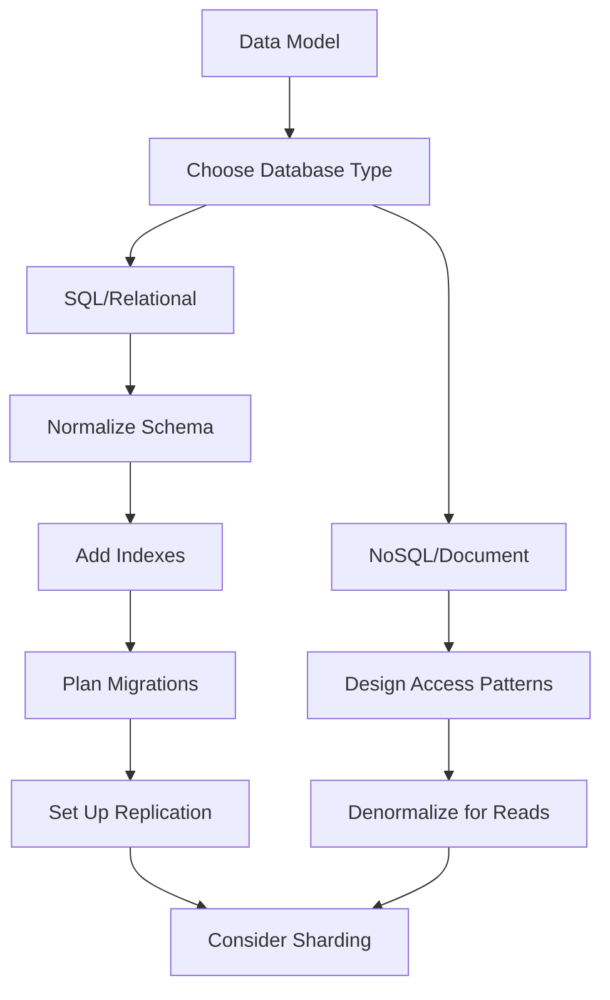

### SQL & Querying

Relational databases (PostgreSQL, MySQL) organize data into tables with defined relationships. SQL is the language you use to interact with that data. Mastering SQL means understanding how to retrieve, combine, filter, and aggregate data efficiently.

#### JOINs — Combining Data from Multiple Tables

JOINs are how you pull related data together. Each type serves a different purpose:

- **INNER JOIN** — returns only rows that have a match in both tables. Use when you need data that exists on both sides.
- **LEFT JOIN** — returns all rows from the left table, plus matches from the right (NULL if no match). Use when you want all records from one side regardless.
- **RIGHT JOIN** — opposite of LEFT JOIN. Rarely used — just swap the table order and use LEFT JOIN instead.
- **FULL OUTER JOIN** — returns all rows from both tables, with NULLs where there's no match. Use for reconciliation queries.
- **SELF JOIN** — a table joined to itself. Use for hierarchical data (employees → managers) or comparing rows within the same table.

```sql
-- Find all users and their orders (including users with no orders)
SELECT u.name, o.total
FROM users u
LEFT JOIN orders o ON o.user_id = u.id;

-- Self join: find employees and their managers
SELECT e.name AS employee, m.name AS manager
FROM employees e
LEFT JOIN employees m ON e.manager_id = m.id;
```

#### GROUP BY & Aggregation

GROUP BY collapses rows into groups and lets you run aggregate functions on each group:

```sql
-- Total revenue per customer
SELECT user_id, COUNT(*) AS order_count, SUM(total) AS revenue
FROM orders
GROUP BY user_id
HAVING SUM(total) > 1000  -- filter AFTER grouping
ORDER BY revenue DESC;
```

Key aggregates: `COUNT(*)`, `SUM()`, `AVG()`, `MIN()`, `MAX()`, `COUNT(DISTINCT ...)`. Remember: `WHERE` filters rows before grouping, `HAVING` filters after.

#### Subqueries vs CTEs vs Window Functions

**Subqueries** nest a query inside another. They can appear in WHERE, FROM, or SELECT:

```sql
-- Users who spent more than average
SELECT name FROM users
WHERE id IN (
  SELECT user_id FROM orders
  GROUP BY user_id
  HAVING SUM(total) > (SELECT AVG(total) FROM orders)
);
```

**CTEs** (Common Table Expressions) make complex queries readable by naming intermediate steps:

```sql
WITH monthly_revenue AS (
  SELECT DATE_TRUNC('month', created_at) AS month, SUM(total) AS revenue
  FROM orders GROUP BY 1
),
growth AS (
  SELECT month, revenue,
         LAG(revenue) OVER (ORDER BY month) AS prev_revenue
  FROM monthly_revenue
)
SELECT month, revenue,
       ROUND((revenue - prev_revenue) / prev_revenue * 100, 1) AS growth_pct
FROM growth;
```

**Window functions** aggregate without collapsing rows — essential for rankings, running totals, and comparisons:

```sql
-- Rank users by total spending
SELECT user_id, SUM(total) AS spent,
       RANK() OVER (ORDER BY SUM(total) DESC) AS rank
FROM orders GROUP BY user_id;

-- Running total per user
SELECT user_id, created_at, total,
       SUM(total) OVER (PARTITION BY user_id ORDER BY created_at) AS running_total
FROM orders;
```

#### Performance Tips

- Prefer `EXISTS` over `IN` for large subqueries — `EXISTS` short-circuits once a match is found
- Always check `EXPLAIN ANALYZE` for slow queries to see the actual execution plan
- Avoid `SELECT *` — fetch only the columns you need
- Use `LIMIT` during development to avoid accidentally scanning millions of rows

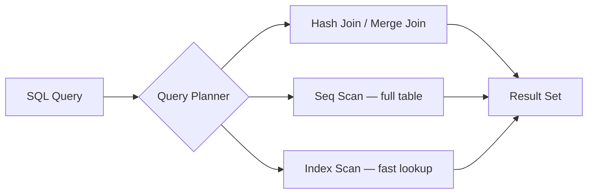

**Key takeaway:** SQL is declarative — you say *what* you want, the database decides *how*. Understanding the query planner helps you write SQL that the database can execute efficiently.

#### Real World
> **GitHub** — When generating contribution graphs for millions of users, GitHub's engineers found that naive GROUP BY + COUNT queries on the events table were timing out at scale. They rewrote them using window functions and CTEs to pre-aggregate data incrementally, reducing dashboard query time from seconds to milliseconds.

#### Practice
1. Write a query to find the top 5 customers by total revenue in the last 30 days, including customers with zero orders.
2. Given a `posts` table and a `comments` table, you need to display a feed showing each post alongside its comment count and the most recent commenter's name — what SQL would you write, and why?
3. When would you choose a CTE over a subquery, and are there cases where a subquery is the better choice?

### Indexing & Query Optimization

An index is a separate data structure that the database maintains alongside your table to speed up lookups. Without an index, the database must scan every row (Seq Scan). With an index, it can jump directly to matching rows.

#### How B-tree Indexes Work

The default index type in PostgreSQL and MySQL is a **B-tree** (balanced tree). It keeps data sorted, enabling:

- **Equality lookups**: `WHERE email = 'alice@example.com'` → O(log n) instead of O(n)
- **Range queries**: `WHERE created_at > '2024-01-01'` → walks the tree to the start point, then scans forward
- **Sorting**: `ORDER BY created_at` → the index is already sorted, no extra sort needed

```sql
-- Create a basic index
CREATE INDEX idx_users_email ON users(email);

-- Verify the index is used
EXPLAIN ANALYZE SELECT * FROM users WHERE email = 'alice@example.com';
-- Expected: Index Scan using idx_users_email (not Seq Scan)
```

#### Index Types for Specific Use Cases

| Index Type | Best For | Example |
|-----------|---------|---------|
| **B-tree** | Equality, range, sorting | `WHERE price > 100 ORDER BY price` |
| **Hash** | Exact equality only | `WHERE session_id = 'abc123'` |
| **GIN** | Full-text search, JSONB, arrays | `WHERE tags @> '{javascript}'` |
| **GiST** | Spatial/geometric data | `WHERE location <@ circle(point(0,0), 10)` |
| **BRIN** | Large tables with natural ordering | `WHERE created_at > '2024-01-01'` on append-only tables |

#### Composite Indexes and the Leftmost Prefix Rule

A composite index on `(user_id, created_at)` is like a phone book sorted by last name, then first name:

```sql
CREATE INDEX idx_orders_user_date ON orders(user_id, created_at);

-- ✅ Uses the index (matches leftmost prefix)
SELECT * FROM orders WHERE user_id = 42;
SELECT * FROM orders WHERE user_id = 42 AND created_at > '2024-01-01';

-- ❌ Cannot use this index (skips the leftmost column)
SELECT * FROM orders WHERE created_at > '2024-01-01';
```

#### Covering Indexes (Index-Only Scans)

If an index contains all columns the query needs, the database never touches the table at all:

```sql
-- Covering index: includes the columns we SELECT
CREATE INDEX idx_orders_covering ON orders(user_id, created_at) INCLUDE (total);

-- This query can be answered entirely from the index
SELECT created_at, total FROM orders WHERE user_id = 42;
```

#### When NOT to Index

- **Small tables** (< 1000 rows) — Seq Scan is faster than the overhead of index lookup
- **Low-cardinality columns** — a boolean `is_active` column has only 2 values; the index barely helps
- **Write-heavy tables** — every INSERT/UPDATE/DELETE must also update all indexes
- **Columns with functions** — `WHERE LOWER(email) = '...'` won't use an index on `email` (use an expression index instead)

```sql
-- Expression index for case-insensitive lookup
CREATE INDEX idx_users_email_lower ON users(LOWER(email));
```

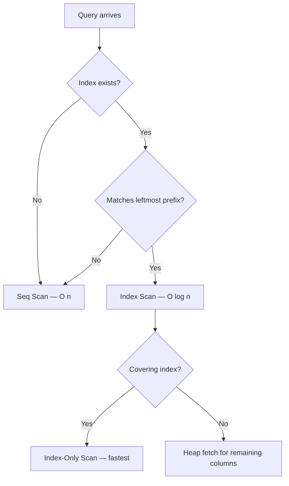

**Key takeaway:** Indexes are a tradeoff — they speed up reads but slow down writes. Add them intentionally based on your actual query patterns, not speculatively.

#### Real World
> **Shopify** — During high-traffic flash sales, Shopify engineers discovered that several queries on the `orders` table were performing sequential scans because the composite index was being queried with the leftmost column skipped. Adding the correct composite index `(shop_id, created_at)` cut p99 query latency from 400ms to under 5ms during peak load.

#### Practice
1. You have a `messages` table with 50 million rows and a query `WHERE user_id = ? AND created_at > ?` that is slow. What index would you create, and why that column order?
2. Given a table with a GIN index on a JSONB column, a query using `embedding <=> ?` for vector similarity, and a query doing `LIKE '%keyword%'` — which queries can use which indexes, and what would you do for the ones that can't?
3. Why can adding too many indexes hurt a write-heavy table, and how would you decide which indexes to remove?

### ACID Transactions & Isolation Levels

A transaction groups multiple database operations into a single atomic unit. Either all operations succeed (commit) or all are rolled back. This is essential for data integrity — think transferring money between bank accounts.

#### The Four ACID Properties

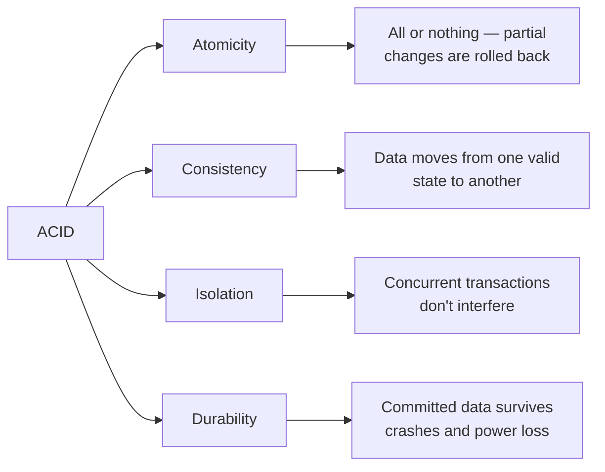

**Atomicity** — If any operation in a transaction fails, all changes are undone. A bank transfer that debits $100 from Account A but fails to credit Account B will roll back the debit too.

**Consistency** — The database enforces constraints (foreign keys, unique constraints, CHECK constraints) so data always moves from one valid state to another. You can't end up with an order referencing a non-existent user.

**Isolation** — Concurrent transactions behave as if they're running one at a time. Without isolation, two transactions reading and writing the same row can produce wrong results.

**Durability** — Once a transaction is committed, the data is persisted to disk (via Write-Ahead Logging). Even if the server crashes immediately after, the data is safe.

#### Transaction Example

```sql
BEGIN;
  -- Debit from Account A
  UPDATE accounts SET balance = balance - 100 WHERE id = 1;

  -- Credit to Account B
  UPDATE accounts SET balance = balance + 100 WHERE id = 2;

  -- Verify no negative balance
  DO $$
  BEGIN
    IF (SELECT balance FROM accounts WHERE id = 1) < 0 THEN
      RAISE EXCEPTION 'Insufficient funds';
    END IF;
  END $$;
COMMIT;
-- If any step fails, all changes are rolled back automatically
```

#### Isolation Levels — The Concurrency vs Consistency Tradeoff

Each isolation level prevents different types of anomalies:

| Isolation Level | Dirty Read | Non-Repeatable Read | Phantom Read | Performance |
|----------------|-----------|-------------------|-------------|-------------|
| **Read Uncommitted** | Possible | Possible | Possible | Fastest |
| **Read Committed** (PG default) | Prevented | Possible | Possible | Fast |
| **Repeatable Read** (MySQL default) | Prevented | Prevented | Possible | Medium |
| **Serializable** | Prevented | Prevented | Prevented | Slowest |

**Dirty read** — Reading data from a transaction that hasn't committed yet. If that transaction rolls back, you read data that never existed.

**Non-repeatable read** — Reading the same row twice in a transaction and getting different values because another transaction modified it in between.

**Phantom read** — Running the same query twice and getting different rows because another transaction inserted or deleted matching rows.

```sql
-- Set isolation level for a transaction
BEGIN TRANSACTION ISOLATION LEVEL SERIALIZABLE;
  SELECT SUM(balance) FROM accounts;  -- No other transaction can change accounts until we commit
COMMIT;
```

#### Optimistic vs Pessimistic Locking

**Pessimistic locking** — Lock the row when you read it, preventing others from modifying it until you're done:

```sql
BEGIN;
  SELECT * FROM inventory WHERE product_id = 42 FOR UPDATE;  -- row is locked
  UPDATE inventory SET quantity = quantity - 1 WHERE product_id = 42;
COMMIT;  -- lock released
```

**Optimistic locking** — Don't lock anything. Instead, check that the row hasn't changed before writing:

```sql
-- Read the current version
SELECT quantity, version FROM inventory WHERE product_id = 42;
-- Returns: quantity=10, version=5

-- Update only if version hasn't changed
UPDATE inventory
SET quantity = 9, version = 6
WHERE product_id = 42 AND version = 5;

-- If 0 rows affected → someone else modified it → retry
```

| | Pessimistic | Optimistic |
|-|------------|-----------|
| **How it works** | Lock rows upfront | Check version on write |
| **Best for** | High contention (many writers) | Low contention (rare conflicts) |
| **Risk** | Deadlocks | Retry storms under load |
| **Example** | Seat booking | Shopping cart updates |

#### Deadlocks

A deadlock happens when two transactions are each waiting for a lock the other holds:

```
Transaction A: locks row 1, then tries to lock row 2
Transaction B: locks row 2, then tries to lock row 1
→ Both wait forever → Database detects and kills one
```

Prevention: always acquire locks in the same order (e.g., sort by ID before locking).

**Key takeaway:** Choose the weakest isolation level that still gives you correct results. Most applications work fine with Read Committed (Postgres default). Only use Serializable when absolute correctness matters more than throughput.

#### Real World
> **Stripe** — Stripe's payment processing uses serializable transactions for balance-critical operations to prevent double-charges. When they found serializable isolation causing throughput bottlenecks at scale, they moved to optimistic locking with version columns for lower-contention paths, reserving serializable only for the final ledger write.

#### Practice
1. Two users simultaneously try to book the last seat on a flight — walk through what happens under Read Committed vs Serializable isolation.
2. You're building a ticket-purchasing system where overselling must never happen. Which locking strategy would you use — pessimistic or optimistic — and why?
3. What is a phantom read, and in what real-world scenario would it actually cause a bug in your application?

### SQL vs NoSQL

The choice between SQL and NoSQL is not about which is "better" — it's about matching the database to your access patterns, consistency requirements, and scaling needs.

#### When to Choose SQL (Relational)

SQL databases (PostgreSQL, MySQL) excel when:

- Your data has **clear relationships** (users → orders → items)
- You need **complex queries** — JOINs, aggregations, subqueries
- **Transactions** matter — financial data, inventory, anything where partial updates are dangerous
- Your schema is **relatively stable** — the structure doesn't change weekly
- **Strong consistency** is required — every read returns the latest write

```sql
-- SQL shines when you need to combine data across entities
SELECT u.name, COUNT(o.id) AS order_count, SUM(o.total) AS lifetime_value
FROM users u
JOIN orders o ON o.user_id = u.id
WHERE o.created_at > '2024-01-01'
GROUP BY u.id
HAVING SUM(o.total) > 1000
ORDER BY lifetime_value DESC;
```

#### When to Choose NoSQL

NoSQL databases come in several flavors, each optimized for different use cases:

**Document stores (MongoDB, DynamoDB)**
- Each record is a self-contained JSON document
- Schema is flexible — different documents can have different fields
- Best for: product catalogs, user profiles, content management

```json
{
  "_id": "product-123",
  "name": "Wireless Mouse",
  "category": "electronics",
  "specs": { "dpi": 1600, "wireless": true, "battery": "AA" },
  "reviews": [
    { "user": "alice", "rating": 5, "text": "Great mouse!" }
  ]
}
```

**Key-value stores (Redis, Memcached)**
- Simple get/set by key — the fastest possible reads (sub-millisecond)
- Best for: caching, sessions, rate limiting, leaderboards

**Wide-column stores (Cassandra, ScyllaDB)**
- Optimized for massive write throughput and time-series data
- Best for: IoT sensor data, activity logs, metrics at scale

**Graph databases (Neo4j, Amazon Neptune)**
- Data modeled as nodes and edges/relationships
- Best for: social networks, recommendation engines, fraud detection

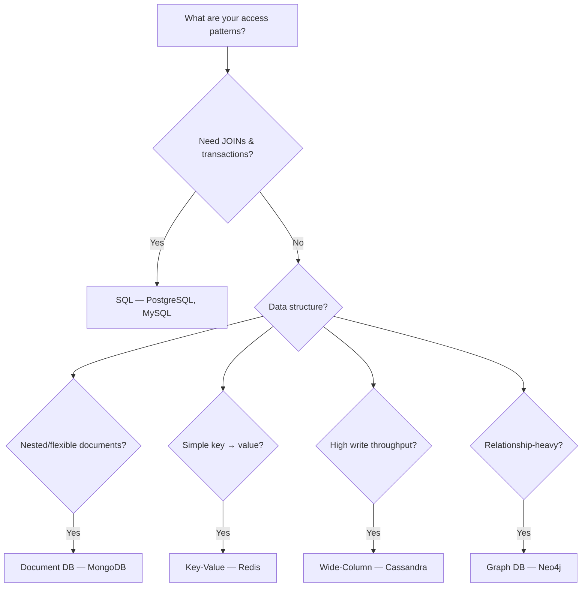

#### The Decision Matrix

| Factor | SQL | NoSQL |
|--------|-----|-------|
| Schema | Fixed, enforced | Flexible, per-document |
| Scaling | Vertical (bigger server) | Horizontal (more servers) |
| Consistency | Strong (ACID) | Tunable (eventual → strong) |
| Query power | Complex JOINs, aggregations | Simple lookups, denormalized reads |
| Best at | Transactional integrity | Throughput & flexibility |

#### Polyglot Persistence

Most real-world systems use multiple databases — each for what it does best:

- **PostgreSQL** → transactional data (orders, users, payments)
- **Redis** → caching, sessions, rate limiting
- **Elasticsearch** → full-text search
- **MongoDB** → flexible documents (product catalogs)

The biggest mistake is choosing a database based on hype rather than your actual access patterns.

**Key takeaway:** Start with PostgreSQL. It handles 90% of use cases. Only add NoSQL when you have a specific problem SQL can't solve efficiently — massive write throughput, truly flexible schemas, or sub-millisecond reads.

#### Real World
> **Airbnb** — Airbnb's listing catalog started in a relational MySQL database but as product attributes exploded across property types (homes, boats, treehouses), sparse columns and complex JOINs became unmanageable. They migrated listing metadata to a document store, keeping transactional data (bookings, payments) in MySQL where ACID guarantees still mattered.

#### Practice
1. You're designing a platform for user-generated content where each post type (article, video, poll) has completely different metadata fields — would you use SQL or a document store, and what are the trade-offs?
2. Given that your startup currently has 50k users and straightforward relational data, a teammate suggests MongoDB for "future flexibility" — how do you respond?
3. Why does horizontal scaling with NoSQL come at a cost to consistency, and when is that trade-off acceptable?

### Schema Design & Normalization

Good schema design is the foundation of a performant, maintainable database. Get it wrong and you'll fight data bugs and slow queries for the life of the application.

#### Normalization — Eliminating Redundancy

Normalization organizes data to reduce duplication and prevent update anomalies. Each normal form builds on the previous:

**First Normal Form (1NF)** — Every column contains atomic (indivisible) values. No arrays or comma-separated lists.

```sql
-- ❌ Violates 1NF: tags is not atomic
CREATE TABLE products (id INT, name TEXT, tags TEXT); -- "electronics,sale,new"

-- ✅ Normalized: separate table for tags
CREATE TABLE products (id INT PRIMARY KEY, name TEXT);
CREATE TABLE product_tags (product_id INT REFERENCES products(id), tag TEXT);
```

**Second Normal Form (2NF)** — Every non-key column depends on the *entire* primary key, not just part of it. Matters for composite keys.

```sql
-- ❌ Violates 2NF: student_name depends only on student_id, not the full key
CREATE TABLE enrollments (
  student_id INT, course_id INT, student_name TEXT, grade TEXT,
  PRIMARY KEY (student_id, course_id)
);

-- ✅ Split: student_name goes to its own table
CREATE TABLE students (id INT PRIMARY KEY, name TEXT);
CREATE TABLE enrollments (student_id INT, course_id INT, grade TEXT);
```

**Third Normal Form (3NF)** — No transitive dependencies. Every non-key column depends directly on the primary key.

```sql
-- ❌ Violates 3NF: city depends on zip_code, not directly on user_id
CREATE TABLE users (id INT, name TEXT, zip_code TEXT, city TEXT);

-- ✅ Split: zip-to-city is its own relationship
CREATE TABLE users (id INT, name TEXT, zip_code TEXT);
CREATE TABLE zip_codes (zip_code TEXT PRIMARY KEY, city TEXT);
```

**3NF is the sweet spot for most applications.** Beyond 3NF (BCNF, 4NF, 5NF) is rarely needed in practice.

#### Strategic Denormalization

After normalizing, selectively denormalize for read performance:

```sql
-- Materialized view: pre-computed dashboard data
CREATE MATERIALIZED VIEW user_stats AS
SELECT u.id, u.name,
       COUNT(o.id) AS order_count,
       COALESCE(SUM(o.total), 0) AS total_spent
FROM users u LEFT JOIN orders o ON o.user_id = u.id
GROUP BY u.id, u.name;

-- Refresh periodically
REFRESH MATERIALIZED VIEW CONCURRENTLY user_stats;

-- Counter cache: avoid COUNT(*) on every page load
ALTER TABLE users ADD COLUMN orders_count INT DEFAULT 0;
-- Update via trigger or application code on each new order
```

#### Practical Schema Design Rules

```sql
CREATE TABLE users (
  id UUID PRIMARY KEY DEFAULT gen_random_uuid(),  -- UUIDs for distributed systems
  email TEXT UNIQUE NOT NULL,
  name TEXT NOT NULL,
  balance NUMERIC(12, 2) NOT NULL DEFAULT 0,      -- NEVER use FLOAT for money
  deleted_at TIMESTAMPTZ,                          -- Soft delete
  created_at TIMESTAMPTZ NOT NULL DEFAULT NOW(),   -- Always track timestamps
  updated_at TIMESTAMPTZ NOT NULL DEFAULT NOW()
);

CREATE TABLE orders (
  id UUID PRIMARY KEY DEFAULT gen_random_uuid(),
  user_id UUID NOT NULL REFERENCES users(id),      -- Foreign key constraint
  status TEXT NOT NULL DEFAULT 'pending'
    CHECK (status IN ('pending', 'paid', 'shipped', 'delivered', 'cancelled')),
  total NUMERIC(12, 2) NOT NULL,
  created_at TIMESTAMPTZ NOT NULL DEFAULT NOW(),
  updated_at TIMESTAMPTZ NOT NULL DEFAULT NOW()
);
```

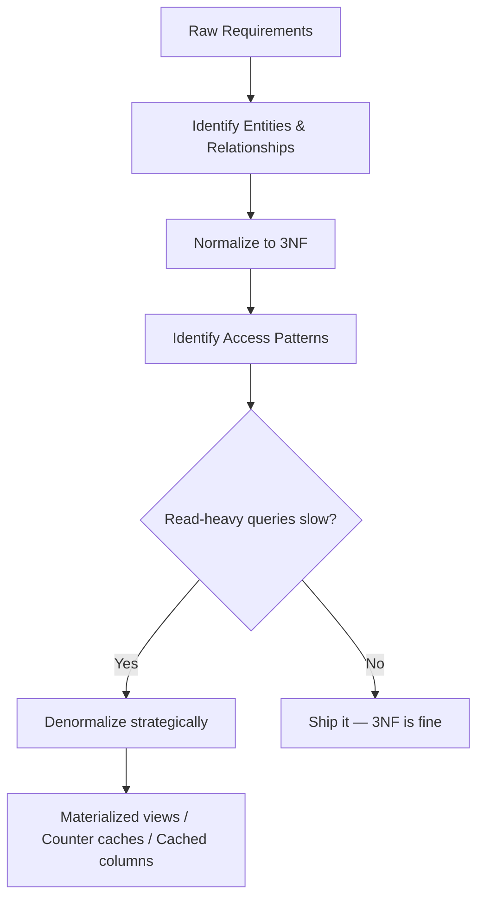

**Key takeaway:** Normalize first to ensure data integrity, then denormalize only where you have measured performance problems. Premature denormalization leads to data inconsistencies.

#### Real World
> **Instagram** — When Instagram's `users` table grew to hundreds of millions of rows, profile pages were making expensive COUNT + SUM queries on the `follows` and `media` tables for every page load. They added denormalized counter columns (`follower_count`, `media_count`) maintained via triggers, cutting profile load time by over 80%.

#### Practice
1. You're designing a schema for an e-commerce platform — a product can belong to multiple categories and have dynamic attributes (size, color, material). How would you model this to 3NF?
2. A dashboard query is joining five tables and taking 2 seconds — you can't change the schema easily. What denormalization strategies would you consider, and what are the consistency trade-offs?
3. When is it correct to store a derived value (like `total_price`) in the database rather than computing it at query time?

### Database Migrations & Schema Evolution

Your database schema will change as your application evolves. Migrations are version-controlled scripts that apply those changes in a repeatable, safe way — like git for your database structure.

#### Migration Basics

Each migration has an **up** function (apply the change) and a **down** function (undo it):

```sql
-- Migration: 20240315_add_user_status.sql

-- UP
ALTER TABLE users ADD COLUMN status VARCHAR(20) NOT NULL DEFAULT 'active';
CREATE INDEX idx_users_status ON users(status);

-- DOWN
DROP INDEX idx_users_status;
ALTER TABLE users DROP COLUMN status;
```

Migrations run in order (usually by timestamp). A migrations table tracks which have been applied:

```
| migration                        | applied_at          |
|----------------------------------|---------------------|
| 20240101_create_users.sql        | 2024-01-01 10:00:00 |
| 20240215_add_orders_table.sql    | 2024-02-15 14:30:00 |
| 20240315_add_user_status.sql     | 2024-03-15 09:00:00 |
```

#### The Backwards-Compatibility Rule

In production, your old application code is still running during deployment. The migration must not break it.

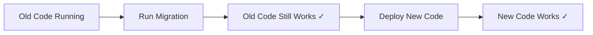

**Safe operations** (backwards-compatible):
- Adding a new column with a default
- Adding a new table
- Adding an index (use `CONCURRENTLY` to avoid locking)
- Adding a new enum value

**Dangerous operations** (break old code):
- Renaming a column — old code still reads the old name
- Changing a column type — old code expects the old type
- Dropping a column — old code still selects it
- Adding NOT NULL without a default — existing inserts fail

#### The Expand-and-Contract Pattern

For breaking changes, use a multi-step approach:

```
Step 1 (Expand): Add new column, keep old column
  → Old code works: reads/writes old column
  → New code works: writes BOTH columns

Step 2: Backfill existing data from old → new column

Step 3: Deploy code that reads from new column

Step 4 (Contract): Drop old column
```

```sql
-- Step 1: Add new column
ALTER TABLE users ADD COLUMN full_name TEXT;

-- Step 2: Backfill (do this in batches for large tables!)
UPDATE users SET full_name = first_name || ' ' || last_name
WHERE full_name IS NULL
LIMIT 10000;  -- batch to avoid locking

-- Step 3: Deploy code reading full_name
-- Step 4: Drop old columns (after verifying no code reads them)
ALTER TABLE users DROP COLUMN first_name;
ALTER TABLE users DROP COLUMN last_name;
```

#### Safe Index Creation

Creating an index on a large table can lock it for minutes. Always use `CONCURRENTLY`:

```sql
-- ❌ Locks the entire table while building
CREATE INDEX idx_orders_status ON orders(status);

-- ✅ Builds in the background, no lock
CREATE INDEX CONCURRENTLY idx_orders_status ON orders(status);
```

#### Large Data Backfills

Never update millions of rows in a single transaction — it locks the table and can crash replication:

```sql
-- ❌ Locks millions of rows
UPDATE users SET status = 'active' WHERE status IS NULL;

-- ✅ Batch updates
DO $$
DECLARE batch_size INT := 10000;
BEGIN
  LOOP
    UPDATE users SET status = 'active'
    WHERE id IN (
      SELECT id FROM users WHERE status IS NULL LIMIT batch_size
    );
    EXIT WHEN NOT FOUND;
    PERFORM pg_sleep(0.1);  -- Brief pause to let replicas catch up
  END LOOP;
END $$;
```

**Key takeaway:** Migrations must be backwards-compatible in production. Use the expand-and-contract pattern for breaking changes, batch large backfills, and always create indexes concurrently.

#### Real World
> **GitHub** — GitHub famously took down their site for several hours in 2012 when a schema migration on a large MySQL table locked it for the duration of the ALTER TABLE. They subsequently built `gh-ost`, an online schema change tool that applies migrations via CDC without taking a table lock, now used widely in the industry.

#### Practice
1. You need to rename the column `user_name` to `full_name` on a table with 10 million rows and zero downtime — walk through each step you would take.
2. You need to add a `NOT NULL` column `status` to an existing table in production that already has 5 million rows — what could go wrong if you just run the migration, and how do you do it safely?
3. Why is it dangerous to both deploy new application code and run a destructive migration (e.g., dropping a column) in the same release?

### Database Replication

Replication copies data from one database server to others. It serves three purposes: **read scaling** (spread read queries across replicas), **fault tolerance** (if the primary fails, promote a replica), and **geographic distribution** (replicas close to users reduce latency).

#### Primary-Replica Architecture

The most common setup: one **primary** (handles all writes) and one or more **replicas** (serve read queries).

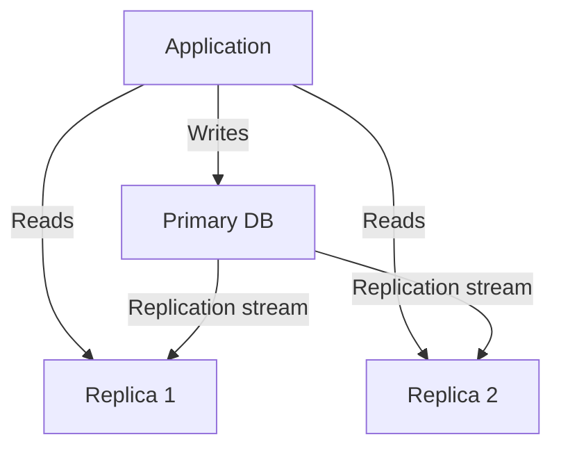

```sql
-- Application-level routing
-- Writes always go to primary
INSERT INTO orders (user_id, total) VALUES (42, 99.99);  -- → Primary

-- Reads can go to replicas
SELECT * FROM orders WHERE user_id = 42;  -- → Replica
```

#### Synchronous vs Asynchronous Replication

| | Synchronous | Asynchronous |
|-|------------|-------------|
| **How it works** | Primary waits for replica to confirm write | Primary writes and moves on immediately |
| **Consistency** | Replica always has latest data | Replica may be seconds behind |
| **Latency** | Higher (wait for network round trip) | Lower (no waiting) |
| **Data safety** | No data loss on primary failure | May lose recent writes on failover |
| **Use when** | Financial data, critical state | Most read-scaling scenarios |

PostgreSQL supports **synchronous_commit** per-transaction, so you can mix:

```sql
-- Critical: wait for replica
SET synchronous_commit = 'on';
UPDATE accounts SET balance = balance - 100 WHERE id = 1;

-- Non-critical: don't wait
SET synchronous_commit = 'off';
INSERT INTO activity_log (user_id, action) VALUES (42, 'page_view');
```

#### Replication Lag

The delay between a write on the primary and its appearance on replicas. This causes stale reads:

```
User writes: UPDATE profile SET name = 'Alice 2.0' WHERE id = 42;
  → Primary: name = 'Alice 2.0' ✓
  → Replica (50ms later): name = 'Alice'  ← STALE!
User reads (from replica): SELECT name WHERE id = 42;
  → Returns 'Alice' — the old value!
```

**Solutions:**
- **Read-your-writes**: After a write, read from the primary (not replica) for that user's session
- **Sticky sessions**: Route a user to the same replica throughout their session
- **Replication position tracking**: The app records the WAL position of its last write, and only reads from replicas that have caught up past that position

#### Failover and Split-Brain

When the primary fails, a replica must be promoted. The challenge is the **split-brain** problem — if the old primary comes back online, you now have two nodes accepting writes.

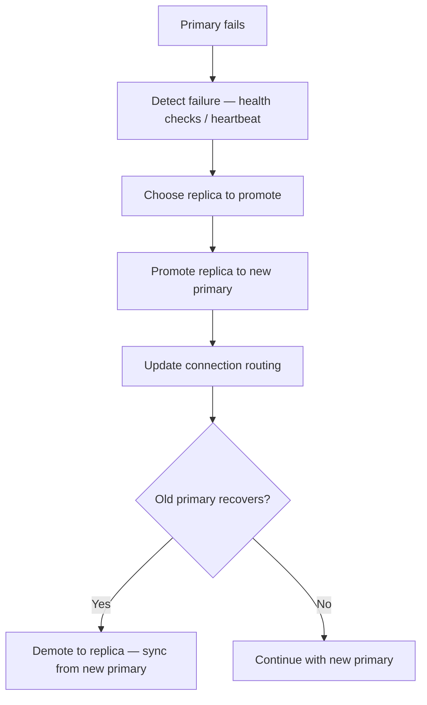

Solutions: Use a consensus protocol (Raft, Paxos) or a tool like Patroni (PostgreSQL) / Orchestrator (MySQL) to automate failover with fencing (ensuring the old primary can't accept writes).

**Key takeaway:** Replication is essential for production databases. Use asynchronous replication for most cases, handle replication lag at the application level, and automate failover with proper fencing to prevent split-brain.

#### Real World
> **Twitter** — Twitter's MySQL setup used asynchronous replication with dozens of read replicas per shard to handle the massive read load on user timelines. They encountered replication lag issues where users would post a tweet and immediately not see it on their own feed because the read was routed to a lagging replica. They solved this with "read-your-writes" routing: for a brief window after a write, that user's reads are always directed to the primary.

#### Practice
1. You have a primary PostgreSQL instance and two async replicas. A user updates their profile and immediately refreshes the page — explain why they might see stale data and what you'd do about it.
2. Your primary database goes down and you need to promote a replica. What steps would you take, and what is the risk of split-brain in this scenario?
3. When would you choose synchronous over asynchronous replication, and what is the concrete cost you pay for the stronger guarantee?

### Database Sharding

Sharding splits your data horizontally across multiple database instances. Each shard holds a subset of the data. This is the nuclear option for scaling — powerful but complex.

#### When Do You Need Sharding?

Exhaust these options first:
1. **Vertical scaling** — bigger server (more CPU, RAM, faster disks)
2. **Read replicas** — spread read load across replicas
3. **Caching** — Redis for frequently accessed data
4. **Table partitioning** — split a single table into partitions within one server
5. **If none of these are enough** → sharding

#### Sharding Strategies

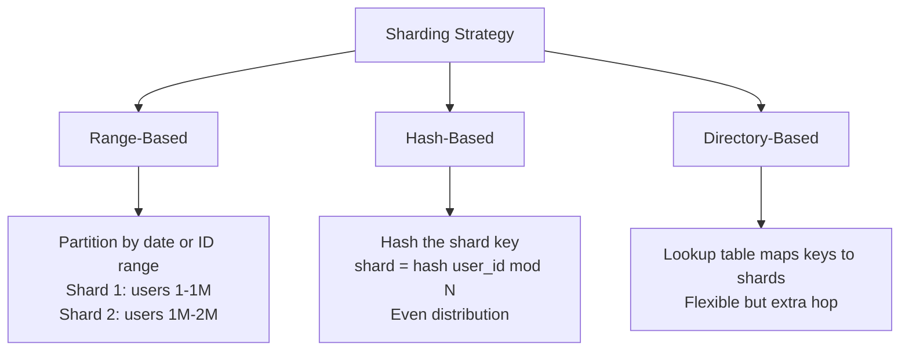

**Range-based sharding:**
```
Shard 1: orders from Jan-Mar
Shard 2: orders from Apr-Jun
Shard 3: orders from Jul-Sep
```
Pros: Simple, range queries stay on one shard. Cons: Hotspots — the current month's shard gets all the writes.

**Hash-based sharding:**
```
shard_id = hash(user_id) % num_shards
```
Pros: Even distribution of data and load. Cons: Range queries must hit all shards. Adding a shard requires rehashing (use consistent hashing to minimize this).

**Directory-based sharding:**
```
Lookup table: { user_42 → shard_3, user_99 → shard_1, ... }
```
Pros: Maximum flexibility — can move specific users between shards. Cons: The lookup table is a single point of failure and adds latency.

#### Choosing a Shard Key

The shard key determines which shard each row lives on. A bad choice causes hotspots and pain.

| Criteria | Good Key | Bad Key |
|----------|----------|---------|
| High cardinality | `user_id` (millions of values) | `country` (few values) |
| Even distribution | `hash(user_id)` | `created_at` (recent dates get all traffic) |
| Immutable | `user_id` | `email` (can change → need to move data) |
| Matches queries | Shard by what you query by | Shard by something unrelated to queries |

#### The Cross-Shard Problem

The biggest challenge with sharding — queries that span multiple shards:

```sql
-- If sharded by user_id, this query hits EVERY shard
SELECT COUNT(*) FROM orders WHERE status = 'pending';

-- This query hits ONE shard (efficient)
SELECT * FROM orders WHERE user_id = 42;
```

Cross-shard JOINs are extremely expensive. Solutions:
- **Denormalize** data so each shard has what it needs
- **Application-level aggregation** — query all shards, combine results in code
- **Global tables** — small reference tables (countries, currencies) replicated to all shards

#### Consistent Hashing

When you add or remove a shard, consistent hashing minimizes data movement:

```
Without consistent hashing:
  Add 1 shard (3 → 4): ~75% of data moves

With consistent hashing:
  Add 1 shard (3 → 4): ~25% of data moves
```

Each shard owns a range on a hash ring. Adding a shard only affects its neighbors, not the entire cluster.

**Key takeaway:** Sharding is a last resort. It adds massive operational complexity (cross-shard queries, rebalancing, distributed transactions). Exhaust vertical scaling, replicas, caching, and partitioning first.

#### Real World
> **Discord** — Discord sharded their message storage by `channel_id` to distribute load across Cassandra nodes. They initially chose timestamp-based sharding within channels, but this created hot partitions for busy channels like large gaming servers. Switching to a hash of `(channel_id, bucket)` — where bucket is a time-range prefix — distributed load evenly while keeping message retrieval efficient.

#### Practice
1. You're sharding a `users` table across 8 nodes using `user_id % 8`. A requirement comes in to run a query like `SELECT COUNT(*) FROM users WHERE country = 'US'` — what problem does this create, and how would you handle it?
2. Your system shards by `user_id` and you now need to support a feature that queries all orders across all users for a given product — how would you approach this?
3. Why is consistent hashing preferred over modulo hashing when you expect to add or remove shards over time?

### CAP Theorem & Consistency Models

The CAP theorem is the fundamental constraint of distributed systems. Understanding it helps you make informed tradeoffs when choosing and configuring databases.

#### The CAP Theorem

A distributed system can provide at most **two out of three** guarantees:

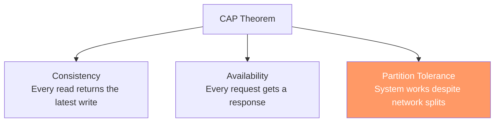

**Network partitions are inevitable** in distributed systems. A cable gets cut, a switch fails, a cloud region goes down. So you can't sacrifice Partition Tolerance — the real choice is between:

- **CP (Consistency + Partition Tolerance)** — During a network partition, the system rejects requests rather than return stale data. Example: PostgreSQL with synchronous replication, MongoDB, HBase.

- **AP (Availability + Partition Tolerance)** — During a partition, the system continues serving requests but may return stale data. Example: Cassandra, DynamoDB, CouchDB.

#### What Happens During a Partition

```
Normal operation:
  Client → Node A (writes) → replicates to → Node B (reads) ✓

Network partition (A can't talk to B):
  CP system: Node B stops accepting reads → returns error ← Consistent but unavailable
  AP system: Node B serves stale data → returns outdated response ← Available but inconsistent
```

#### Consistency Models — The Spectrum

It's not just "strong" or "eventual" — there are useful models in between:

| Model | Guarantee | Example |
|-------|-----------|---------|
| **Strong consistency** | Every read sees the latest write | Single PostgreSQL server |
| **Linearizability** | Operations appear to happen in a single global order | Google Spanner |
| **Causal consistency** | If A caused B, everyone sees A before B | MongoDB sessions |
| **Read-your-writes** | You always see your own updates (others might not yet) | Social media feeds |
| **Session consistency** | Consistent within a user session | Shopping carts |
| **Eventual consistency** | All replicas converge eventually, but may temporarily disagree | DNS, Cassandra |

#### Conflict Resolution in AP Systems

When two nodes accept conflicting writes during a partition, how do you resolve it?

**Last-Write-Wins (LWW):**
```
Node A: SET user.name = "Alice" at t=100
Node B: SET user.name = "Bob"   at t=101
→ After partition heals: name = "Bob" (latest timestamp wins)
→ Problem: Alice's write is silently lost
```

**Vector Clocks:** Track causal ordering. If writes are concurrent (neither caused the other), flag a conflict for the application to resolve.

**CRDTs (Conflict-free Replicated Data Types):** Data structures designed to merge automatically without conflicts:
- **G-Counter**: A counter that only goes up — each node tracks its own count, merge by taking the max per node
- **OR-Set**: A set where adds and removes can happen concurrently without conflicts

```
CRDT Counter example:
  Node A: {A: 5, B: 3} → total = 8
  Node B: {A: 4, B: 4} → total = 8
  Merge:  {A: 5, B: 4} → total = 9  ← correct!
```

#### PACELC — Beyond CAP

CAP only describes behavior during partitions. **PACELC** extends it: "If there is a Partition, choose Availability or Consistency. **Else**, choose **Latency** or **Consistency**."

Even without partitions, you trade latency for consistency. Synchronous replication is more consistent but slower. Most systems operate in the "Else" case most of the time.

| Database | During Partition (PAC) | Normal Operation (ELC) |
|----------|----------------------|----------------------|
| PostgreSQL (sync) | PC — reject requests | EC — wait for replicas |
| Cassandra | PA — serve stale data | EL — fast, eventual |
| MongoDB | PC — reject requests | EL — fast with sessions |

**Key takeaway:** CAP is about tradeoffs during failure, not a menu where you pick two. Understand where your system sits on the spectrum and configure consistency per-operation when possible.

#### Real World
> **Amazon DynamoDB** — DynamoDB is an AP system by default, serving stale data during partition events in exchange for high availability. Amazon's shopping cart uses eventual consistency for reads — if a user adds an item on one device, a simultaneous read from another device might miss it briefly — but they explicitly chose availability over consistency here because a briefly incorrect cart is far less damaging than a cart page that refuses to load.

#### Practice
1. You're designing a collaborative document editor like Google Docs where two users can edit simultaneously — what consistency model would you target, and why would strong consistency be impractical at global scale?
2. A network partition isolates one of your database nodes. If your system is CP, what happens to requests routed to that node? If it's AP, what happens?
3. What is the difference between eventual consistency and causal consistency, and when does causal consistency matter in practice?

### Query Safety & SQL Injection Prevention

SQL injection is one of the oldest and most dangerous web vulnerabilities. It's been in the OWASP Top 10 since the list was created. An attacker modifies your SQL query through user input to read, modify, or delete data they shouldn't have access to.

#### How SQL Injection Works

```sql
-- Vulnerable code (string concatenation)
query = "SELECT * FROM users WHERE email = '" + userInput + "'";

-- Normal input: alice@example.com
-- → SELECT * FROM users WHERE email = 'alice@example.com'  ← works fine

-- Malicious input: ' OR '1'='1
-- → SELECT * FROM users WHERE email = '' OR '1'='1'  ← returns ALL users!

-- Destructive input: '; DROP TABLE users; --
-- → SELECT * FROM users WHERE email = ''; DROP TABLE users; --'  ← deletes the table!
```

#### The Fix: Parameterized Queries

Parameterized queries (prepared statements) separate SQL structure from data. The database compiles the query first, then binds values — user input can never be interpreted as SQL.

```sql
-- ✅ Parameterized query (PostgreSQL)
PREPARE user_lookup (text) AS
  SELECT * FROM users WHERE email = $1;
EXECUTE user_lookup('alice@example.com');
```

In application code:

```javascript
// ❌ VULNERABLE — string concatenation
const query = `SELECT * FROM users WHERE email = '${email}'`;

// ✅ SAFE — parameterized query
const result = await db.query(
  'SELECT * FROM users WHERE email = $1',
  [email]
);

// ✅ SAFE — ORM (Prisma, Sequelize, etc.)
const user = await prisma.user.findUnique({ where: { email } });
```

#### Tricky Injection Vectors

Some SQL constructs can't use parameterized values:

**ORDER BY** — Column names can't be parameterized. Use an allowlist:
```javascript
// ❌ Vulnerable
const query = `SELECT * FROM users ORDER BY ${sortColumn}`;

// ✅ Safe — allowlist
const ALLOWED_COLUMNS = ['name', 'email', 'created_at'];
if (!ALLOWED_COLUMNS.includes(sortColumn)) {
  throw new Error('Invalid sort column');
}
const query = `SELECT * FROM users ORDER BY ${sortColumn}`;
```

**LIKE clauses** — User input can contain wildcards:
```javascript
// User input: "%admin%"
// → WHERE name LIKE '%admin%'  ← may be intentional, but can be slow

// ✅ Escape wildcards in user input
const escaped = userInput.replace(/%/g, '\\%').replace(/_/g, '\\_');
const result = await db.query(
  "SELECT * FROM users WHERE name LIKE $1",
  [`%${escaped}%`]
);
```

**Dynamic IN clauses:**
```javascript
// ✅ Generate the right number of placeholders
const ids = [1, 2, 3];
const placeholders = ids.map((_, i) => `$${i + 1}`).join(', ');
const result = await db.query(
  `SELECT * FROM users WHERE id IN (${placeholders})`,
  ids
);
```

#### Defense in Depth

Parameterized queries are the primary defense. Layer additional protections:

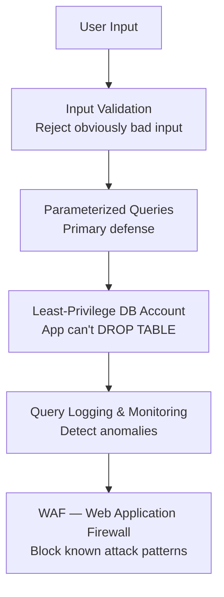

- **Least-privilege accounts**: Your application's database user should only have SELECT, INSERT, UPDATE, DELETE on specific tables — never DROP, ALTER, or GRANT
- **Input validation**: Reject inputs that don't match expected formats (e.g., email must contain @)
- **Query logging**: Monitor for unusual query patterns (many failed logins, queries returning large result sets)

**Key takeaway:** Always use parameterized queries. Never concatenate user input into SQL strings. Use allowlists for column names in ORDER BY and table names. Layer defenses — no single measure is enough.

#### Real World
> **Heartland Payment Systems** — In 2008, Heartland suffered one of the largest data breaches in history when attackers used SQL injection to compromise over 130 million credit card numbers. The vulnerability was in a web application that concatenated user-supplied form data directly into SQL queries. The breach cost Heartland over $145 million in settlements and remains a canonical example of why parameterized queries are non-negotiable.

#### Practice
1. A junior dev writes `const q = "SELECT * FROM orders WHERE status = '" + req.query.status + "'"` — explain exactly what attack is possible and rewrite it safely.
2. You need to build a search endpoint that lets users sort results by any column they choose (`?sort=price` or `?sort=name`) — how do you implement this safely without using parameterized values for column names?
3. Why isn't input validation (e.g., checking that input is alphanumeric) a sufficient defense against SQL injection on its own?

### Query Performance & Optimization Patterns

Slow queries are the most common backend performance problem. The good news: there's a systematic process for finding and fixing them.

#### The Diagnostic Process

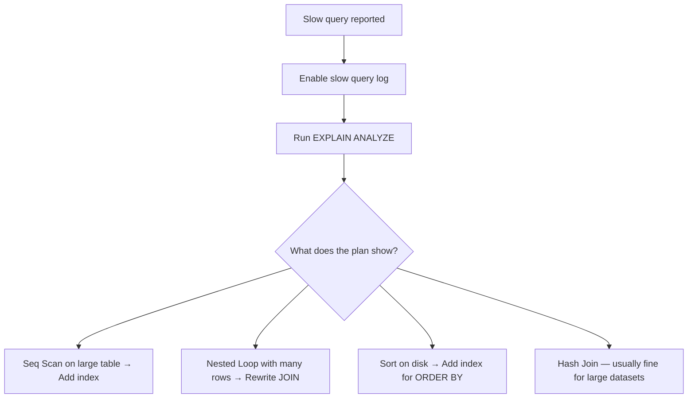

#### Reading EXPLAIN ANALYZE

```sql
EXPLAIN ANALYZE SELECT * FROM orders WHERE user_id = 42 AND status = 'pending';

-- Bad plan (no index):
-- Seq Scan on orders  (cost=0.00..25000.00 rows=50 width=120)
--   (actual time=0.02..89.50 rows=47 loops=1)
--   Filter: ((user_id = 42) AND (status = 'pending'))
--   Rows Removed by Filter: 999953
-- Planning Time: 0.1ms   Execution Time: 89.6ms  ← SLOW

-- Good plan (with index):
-- Index Scan using idx_orders_user_status on orders  (cost=0.42..8.44 rows=50 width=120)
--   (actual time=0.02..0.15 rows=47 loops=1)
-- Planning Time: 0.1ms   Execution Time: 0.2ms  ← 450x FASTER
```

Key things to look for: **Seq Scan** on large tables, **Rows Removed by Filter** (high numbers mean the query is reading lots of unnecessary rows), **Sort Method: external merge** (sorting on disk because it doesn't fit in memory).

#### Pagination: OFFSET vs Keyset

```sql
-- ❌ OFFSET pagination — gets slower as pages increase
SELECT * FROM orders ORDER BY created_at DESC LIMIT 20 OFFSET 10000;
-- Database must scan and discard 10,000 rows before returning 20

-- ✅ Keyset (cursor) pagination — constant performance
SELECT * FROM orders
WHERE created_at < '2024-03-15T10:30:00Z'  -- cursor from last page
ORDER BY created_at DESC
LIMIT 20;
-- Jumps directly to the right position via index
```

#### Common Anti-Patterns and Fixes

**Functions on indexed columns:**
```sql
-- ❌ Index on created_at is useless here
SELECT * FROM orders WHERE YEAR(created_at) = 2024;

-- ✅ Rewrite to use the index
SELECT * FROM orders WHERE created_at >= '2024-01-01' AND created_at < '2025-01-01';
```

**SELECT * when you only need a few columns:**
```sql
-- ❌ Fetches all columns, can't use covering index
SELECT * FROM users WHERE status = 'active';

-- ✅ Fetch only what you need
SELECT id, name, email FROM users WHERE status = 'active';
```

**COUNT(*) on large tables:**
```sql
-- ❌ Scans entire table every time
SELECT COUNT(*) FROM orders WHERE user_id = 42;

-- ✅ Use a counter cache (maintained by triggers or application)
SELECT orders_count FROM users WHERE id = 42;
```

#### Advanced Optimization: Materialized Views & Partitioning

```sql
-- Materialized view for expensive dashboards
CREATE MATERIALIZED VIEW daily_revenue AS
SELECT DATE(created_at) AS day, SUM(total) AS revenue, COUNT(*) AS orders
FROM orders WHERE status = 'paid'
GROUP BY DATE(created_at);

-- Refresh daily via cron
REFRESH MATERIALIZED VIEW CONCURRENTLY daily_revenue;

-- Table partitioning for very large tables (100M+ rows)
CREATE TABLE events (
  id UUID, type TEXT, payload JSONB, created_at TIMESTAMPTZ
) PARTITION BY RANGE (created_at);

CREATE TABLE events_2024_q1 PARTITION OF events
  FOR VALUES FROM ('2024-01-01') TO ('2024-04-01');
CREATE TABLE events_2024_q2 PARTITION OF events
  FOR VALUES FROM ('2024-04-01') TO ('2024-07-01');
```

**Key takeaway:** Always measure with EXPLAIN ANALYZE before and after optimization. The most common fixes are: add an index, fix N+1 queries with JOINs, switch from OFFSET to keyset pagination, and avoid functions on indexed columns.

#### Real World
> **Uber** — Uber's trip history endpoint originally used OFFSET-based pagination, which worked fine for the first few pages but became progressively slower as users scrolled deeper into history. At page 500 (offset 10,000 rows), queries were timing out for high-volume drivers. Switching to keyset pagination using the last seen `trip_id` as a cursor reduced those queries to constant-time index lookups regardless of page depth.

#### Practice
1. Run `EXPLAIN ANALYZE` on a slow query and you see "Seq Scan on orders (rows removed by filter: 2,400,000)". What does this tell you, and what's your next step?
2. Your admin dashboard runs a query grouping and summing orders by day across the past year, and it's taking 8 seconds — what are two distinct strategies to speed it up?
3. Why does `WHERE LOWER(email) = $1` fail to use an index on `email`, and how do you fix it without changing every query?

### N+1 Query Problem

The N+1 problem is the most common performance bug in web applications. It happens when code fetches a list (1 query), then loops over the results and fires an additional query per item (N queries) — totalling N+1 round-trips to the database.

#### How It Happens

```javascript
// ❌ N+1: 1 query for users + 1 query per user for their orders
const users = await db.query('SELECT * FROM users LIMIT 100');  // 1 query
for (const user of users) {
  user.orders = await db.query(
    'SELECT * FROM orders WHERE user_id = $1', [user.id]
  );  // 100 queries — one per user
}
// Total: 101 queries
```

This is especially common in GraphQL servers where each field resolver runs independently:

```javascript
// GraphQL — Post.author resolver fires once per post
const resolvers = {
  Post: {
    author: (post) => db.query('SELECT * FROM users WHERE id = $1', [post.authorId]),
    // If you fetch 50 posts, this fires 50 separate queries
  }
};
```

#### Fix 1: JOIN (SQL-level)

Collapse N+1 into a single query using a JOIN:

```javascript
// ✅ 1 query using JOIN + aggregation
const result = await db.query(`
  SELECT u.*, json_agg(o.*) AS orders
  FROM users u
  LEFT JOIN orders o ON o.user_id = u.id
  GROUP BY u.id
  LIMIT 100
`);
// Total: 1 query
```

Best when: querying your own database and you control the SQL.

#### Fix 2: Eager Loading (ORM-level)

Most ORMs let you declare which relationships to pre-load so they're fetched in a single query (or a small number of targeted queries):

```typescript
// ✅ ORM eager loading — one query with JOINs built automatically
const users = await User.find({
  where: { active: true },
  eager: ['orders', 'profile'],  // pre-loads relationships
});
// Total: 1 query — ORM generates the JOINs for you
```

Best when: using an ORM and the relationships are known at call time.

#### Fix 3: Batching with DataLoader (application-level)

When JOINs aren't practical — e.g. across service boundaries or in GraphQL resolvers — batch individual loads using a tool like DataLoader (Meta):

```javascript
// ✅ DataLoader batches all .load() calls within a single tick
const userLoader = new DataLoader(async (userIds) => {
  const users = await db.query('SELECT * FROM users WHERE id = ANY($1)', [userIds]);
  return userIds.map(id => users.find(u => u.id === id));
});

// GraphQL resolver — looks like individual loads, but DataLoader batches them
const resolvers = {
  Post: {
    author: (post, _, { loaders }) => loaders.user.load(post.authorId),
    // 50 posts → DataLoader collects 50 IDs → fires 1 query
  }
};
```

Best when: you can't rewrite the SQL (e.g. resolvers in separate services), or you want automatic deduplication within a request.

#### Comparison

| Fix | Queries | Best For |
|---|---|---|
| JOIN | 1 | Direct DB access, known relationships |
| Eager loading | 1–few | ORM-based code |
| DataLoader | 1 per batch | GraphQL resolvers, service boundaries |

**Key takeaway:** The N+1 problem always comes from loading related data one-at-a-time in a loop. The fix is always the same idea — batch the lookups — whether via SQL JOINs, ORM eager loading, or an application-level batcher like DataLoader.

#### Real World
> **Shopify** — Shopify's storefront GraphQL API was generating thousands of database queries per request when merchants had large product catalogs with many variant associations. Each `Product.variants` resolver was hitting the database individually. They standardized on eager loading and GraphQL query depth limits to bound the worst-case query count, reducing average DB queries per storefront request from hundreds to single digits.

#### Practice
1. You have a REST endpoint `GET /posts` that returns 50 posts, each with an `author` field populated by a separate DB call — describe exactly what's happening in the database and how you'd fix it.
2. You're building a GraphQL API where `Post.author`, `Post.tags`, and `Comment.author` all resolve independently — without DataLoader, how many queries might a single request generate for a page of 20 posts with 5 comments each?
3. An ORM eager-loads a relationship using a JOIN, but the resulting payload is 50MB because it duplicates parent rows for every child — when is eager loading the wrong fix, and what do you do instead?

### DataLoader (Meta)

DataLoader is an open-source utility created by Facebook/Meta that solves the N+1 query problem through **batching** and **per-request caching**. Originally built for GraphQL servers, it works with any data layer where you need to load many individual records efficiently.

#### The Problem It Solves

In a GraphQL resolver tree, each field resolves independently — so fetching a list of posts and each post's author naively fires one query per author:

```javascript
// ❌ Without DataLoader: 1 + N queries
Query.posts → SELECT * FROM posts LIMIT 10          // 1 query
Post.author → SELECT * FROM users WHERE id = 1      // query per post
Post.author → SELECT * FROM users WHERE id = 2
Post.author → SELECT * FROM users WHERE id = 1      // duplicate!
// ... 10 separate queries, some duplicated
```

#### How Batching Works

DataLoader collects all `.load()` calls made within a single tick of the event loop, then fires them as one batched request on the next tick:

```javascript
import DataLoader from 'dataloader';

// Define a batch function — receives array of keys, returns array of values
const userLoader = new DataLoader(async (userIds) => {
  const users = await db.query(
    'SELECT * FROM users WHERE id = ANY($1)', [userIds]
  );
  // Must return values in the same order as the input keys
  return userIds.map(id => users.find(u => u.id === id) ?? null);
});

// Individual loads — look synchronous but are automatically batched
const [alice, bob] = await Promise.all([
  userLoader.load(1),
  userLoader.load(2),
]);
// Fires ONE query: SELECT * FROM users WHERE id = ANY([1, 2])
```

#### Per-Request Caching

DataLoader memoizes results within the same request — duplicate loads return the cached value without hitting the database again:

```javascript
// ❌ Without caching: same user loaded three times
await userLoader.load(1);  // hits DB
await userLoader.load(1);  // hits DB again
await userLoader.load(1);  // hits DB again

// ✅ With DataLoader: first load fetches, subsequent loads return cached value
await userLoader.load(1);  // hits DB
await userLoader.load(1);  // returns cached result instantly
await userLoader.load(1);  // returns cached result instantly
```

> Create a **new DataLoader instance per request** — not per application. A long-lived loader would serve stale data across requests.

#### Practical GraphQL Setup

```javascript
// Create loaders fresh for each request (e.g. in Express middleware)
app.use((req, res, next) => {
  req.loaders = {
    user: new DataLoader(async (ids) => {
      const users = await db.query(
        'SELECT * FROM users WHERE id = ANY($1)', [ids]
      );
      return ids.map(id => users.find(u => u.id === id));
    }),
    post: new DataLoader(async (ids) => {
      const posts = await db.query(
        'SELECT * FROM posts WHERE id = ANY($1)', [ids]
      );
      return ids.map(id => posts.find(p => p.id === id));
    }),
  };
  next();
});

// GraphQL resolvers stay simple — DataLoader handles batching behind the scenes
const resolvers = {
  Post: {
    author: (post, _, { loaders }) => loaders.user.load(post.authorId),
  },
  Comment: {
    author: (comment, _, { loaders }) => loaders.user.load(comment.authorId),
  },
};
// 100 posts + 100 comments with authors → 2 queries total (one per loader)
```

#### Key Constraints

| Rule | Why |
|---|---|
| Batch function must return same-length array as input | DataLoader maps results back by index |
| Return `null` (not `undefined`) for missing keys | Distinguishes "not found" from "not fetched" |
| One loader instance per request | Prevents stale cache across requests |
| Order results to match input key order | DataLoader doesn't sort for you |

**Key takeaway:** DataLoader shifts the N+1 fix from query-level JOINs to application-level batching — useful when JOINs aren't practical (e.g. federated services, GraphQL). Batching collapses N queries into 1; caching eliminates duplicate loads within the same request.

#### Real World
> **Facebook** — DataLoader was created by Facebook specifically for their GraphQL server, which serves a deeply nested social graph (posts → comments → authors → friends). Without batching, a single news feed query would fan out into thousands of individual user lookups. DataLoader's per-request cache was equally critical — in a typical feed, the same user object appears in dozens of places, and without caching each appearance would re-fetch from the database.

#### Practice
1. You implement a DataLoader but a colleague reports that a user profile is showing stale data an hour after an update — what is the likely cause, and how do you fix it?
2. Your DataLoader's batch function receives `[1, 2, 3]` and the DB returns rows for IDs 1 and 3 but not 2 (the user was deleted). What must your batch function return, and what happens if you get it wrong?
3. Why must you create a new DataLoader instance per HTTP request rather than sharing one instance across the entire application lifetime?

### SQL & NoSQL in Practice

Real-world applications rarely use a single database. **Polyglot persistence** means choosing the right database for each job, then keeping them in sync.

#### A Typical Production Stack

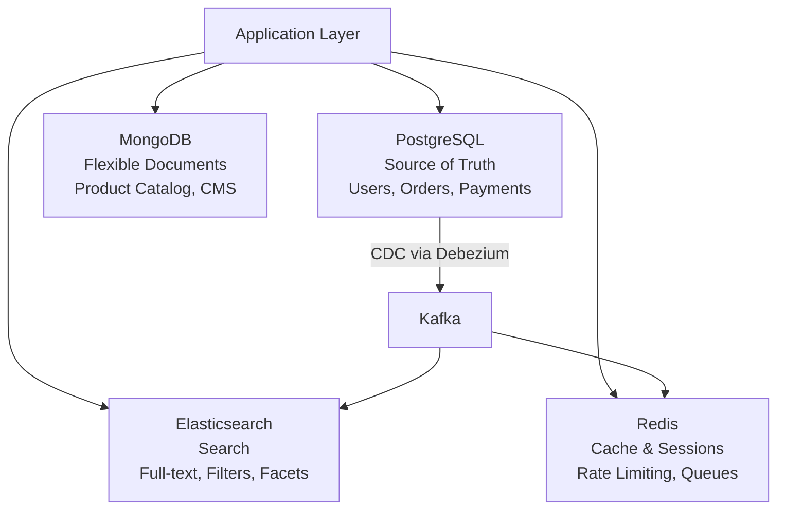

#### PostgreSQL — The Source of Truth

PostgreSQL handles transactional data where correctness is non-negotiable:

```sql
-- E-commerce order with ACID guarantees
BEGIN;
  INSERT INTO orders (user_id, total, status) VALUES (42, 99.99, 'pending');
  UPDATE inventory SET quantity = quantity - 1 WHERE product_id = 101;
  INSERT INTO payments (order_id, amount, method) VALUES (currval('orders_id_seq'), 99.99, 'card');
COMMIT;
-- All three succeed or all roll back — no partial orders
```

#### Redis — Sub-Millisecond Reads

Redis keeps frequently accessed data in memory:

```
# Caching
SET user:42:profile '{"name":"Alice","plan":"pro"}' EX 3600  # TTL: 1 hour
GET user:42:profile  # < 1ms

# Rate limiting (sliding window)
INCR rate:user:42:minute
EXPIRE rate:user:42:minute 60
# If count > 100 → reject request

# Leaderboard
ZADD leaderboard 1500 "alice"
ZADD leaderboard 2300 "bob"
ZREVRANGE leaderboard 0 9  # Top 10 players

# Session storage
SET session:abc123 '{"userId":42,"role":"admin"}' EX 86400
```

#### MongoDB — Flexible Documents

When every record has a different shape, a flexible schema avoids sparse SQL tables:

```json
// Electronics product
{
  "_id": "prod-101",
  "name": "Gaming Laptop",
  "category": "electronics",
  "specs": { "cpu": "i9", "ram": "32GB", "gpu": "RTX 4090", "screen": "16 inch" }
}

// Clothing product — completely different fields
{
  "_id": "prod-202",
  "name": "Winter Jacket",
  "category": "clothing",
  "specs": { "size": ["S", "M", "L", "XL"], "material": "Gore-Tex", "waterproof": true }
}
```

In SQL, you'd need either one massive table with many NULL columns, or complex EAV (Entity-Attribute-Value) patterns.

#### Elasticsearch — Full-Text Search

For search with typo tolerance, relevance ranking, and faceted filtering:

```json
// Search query with fuzzy matching
{
  "query": {
    "bool": {
      "must": { "multi_match": { "query": "wirelss mouse", "fuzziness": "AUTO" } },
      "filter": [
        { "term": { "category": "electronics" } },
        { "range": { "price": { "lte": 50 } } }
      ]
    }
  },
  "aggs": {
    "brands": { "terms": { "field": "brand.keyword" } }
  }
}
```

#### The Data Synchronization Challenge

The hardest part of polyglot persistence is keeping multiple databases in sync. Two approaches:

**Change Data Capture (CDC):** Read the database's transaction log and stream changes to other systems:
```
PostgreSQL WAL → Debezium → Kafka → Elasticsearch/Redis
```
Pros: No application code changes, captures all changes including direct SQL updates. Cons: Infrastructure complexity.

**Application-Level Events:** The application publishes events when it modifies data:
```javascript
await db.query('INSERT INTO orders ...', [orderData]);
await kafka.send('order.created', { orderId, userId, items });
// Other services consume the event and update their stores
```
Pros: Explicit, easy to understand. Cons: Easy to forget, doesn't capture direct DB changes.

**Key takeaway:** PostgreSQL is the source of truth. Other databases are optimized read models. Use CDC (Debezium + Kafka) for reliable synchronization. Accept that secondary stores may be seconds behind — design your UX accordingly.

#### Real World
> **Netflix** — Netflix uses a polyglot stack where MySQL stores subscription and account data (transactional integrity required), Cassandra stores viewing history and play position (high write throughput, availability over consistency), and Elasticsearch powers the search catalog. They use a Kafka-based CDC pipeline to propagate changes from MySQL into Elasticsearch so the search index stays up to date without the application needing to dual-write.

#### Practice
1. A user creates an account in PostgreSQL and immediately searches for their own profile — the search result (backed by Elasticsearch) returns nothing. Why, and how do you handle this in the application?
2. You're building a feature that needs to query both a user's most recent orders (PostgreSQL) and their product recommendations (a vector database) in a single API response — how do you structure this without creating a slow sequential dependency?
3. What are the risks of using application-level dual-writes (writing to PostgreSQL and Elasticsearch in the same function) compared to CDC, and when is each approach appropriate?

### Specialized Databases: Vector, Time-Series & Search

Beyond SQL and traditional NoSQL, specialized databases solve specific problems orders of magnitude better than general-purpose databases.

#### Vector Databases — AI Similarity Search

Vector databases store **embeddings** — numerical representations of text, images, or other data. They enable **semantic search**: finding things by meaning rather than exact keywords.


**How it works:**
1. Convert text/images into vectors using an embedding model
2. Store vectors in a vector database
3. At query time, convert the search query to a vector
4. Find the nearest vectors using distance metrics (cosine similarity, Euclidean distance)

```sql
-- pgvector: PostgreSQL extension for vector search
CREATE EXTENSION vector;

CREATE TABLE documents (
  id SERIAL PRIMARY KEY,
  content TEXT,
  embedding VECTOR(1536)  -- 1536 dimensions for OpenAI embeddings
);

-- Create an index for fast similarity search
CREATE INDEX ON documents USING ivfflat (embedding vector_cosine_ops) WITH (lists = 100);

-- Find the 5 most similar documents
SELECT content, 1 - (embedding <=> '[0.23, -0.14, ...]') AS similarity
FROM documents
ORDER BY embedding <=> '[0.23, -0.14, ...]'
LIMIT 5;
```

**Use cases:** RAG (Retrieval-Augmented Generation) for AI chatbots, semantic search, recommendation engines, image similarity, duplicate detection.

**Options:** **pgvector** (PostgreSQL extension — start here), **Pinecone** (managed, scales to billions), **Weaviate** (open source, hybrid search), **Chroma** (lightweight, great for prototyping).

#### Time-Series Databases — Metrics at Scale

Optimized for timestamped data with high ingestion rates and time-based queries.

```sql
-- TimescaleDB (PostgreSQL extension)
CREATE TABLE metrics (
  time TIMESTAMPTZ NOT NULL,
  device_id TEXT NOT NULL,
  temperature DOUBLE PRECISION,
  humidity DOUBLE PRECISION
);

-- Convert to hypertable for time-series optimizations
SELECT create_hypertable('metrics', 'time');

-- Insert millions of rows per second
INSERT INTO metrics VALUES (NOW(), 'sensor-42', 23.5, 65.2);

-- Time-bucketed aggregation (built-in function)
SELECT time_bucket('1 hour', time) AS hour,
       device_id,
       AVG(temperature) AS avg_temp,
       MAX(temperature) AS max_temp
FROM metrics
WHERE time > NOW() - INTERVAL '7 days'
GROUP BY hour, device_id
ORDER BY hour DESC;
```

**Key features:** Automatic partitioning by time, built-in downsampling (keep minute data for 7 days, hourly for 90 days, daily forever), high ingest rate (millions of rows/sec), compression (10-20x storage savings).

**Options:** **TimescaleDB** (PostgreSQL extension — start here), **InfluxDB** (purpose-built, flux query language), **Prometheus** (metrics & alerting for infrastructure).

#### Columnar Databases — Analytics on Billions of Rows

Traditional databases store data row by row. Columnar databases store data column by column, which is 10-100x faster for analytical queries that scan specific columns across billions of rows.

```
Row storage (PostgreSQL):
  Row 1: [id=1, name="Alice", age=30, city="NYC"]
  Row 2: [id=2, name="Bob", age=25, city="LA"]

Column storage (ClickHouse):
  id:   [1, 2, 3, ...]
  name: ["Alice", "Bob", ...]
  age:  [30, 25, ...]
  city: ["NYC", "LA", ...]
  → Query "AVG(age)" only reads the age column — skips everything else
```

```sql
-- ClickHouse: analyze billions of events
SELECT
  toStartOfHour(timestamp) AS hour,
  countIf(status = 200) AS success,
  countIf(status >= 500) AS errors,
  avg(response_time_ms) AS avg_latency
FROM request_logs
WHERE timestamp > now() - INTERVAL 24 HOUR
GROUP BY hour
ORDER BY hour;
-- Scans 1 billion rows in < 1 second
```

**Options:** **ClickHouse** (open source, fastest), **BigQuery** (Google, serverless), **Redshift** (AWS), **DuckDB** (embedded, great for local analytics).

#### Search Engines — Full-Text with Relevance

Search engines use **inverted indexes** — a mapping from every word to the documents containing it. This enables typo-tolerant, ranked search.

```
Inverted index:
  "database" → [doc1, doc3, doc7]
  "postgres" → [doc1, doc5]
  "mongodb"  → [doc2, doc3]

Search "postgres database" → doc1 (appears in both) ranked highest
```

**Options:** **Elasticsearch** (most mature, distributed), **Meilisearch** (simple, fast, great for product search), **Typesense** (easy to set up, typo-tolerant).

#### When to Use What

| Problem | Use | Why Not General SQL? |
|---------|-----|---------------------|
| AI semantic search | pgvector / Pinecone | SQL can't do nearest-neighbor on vectors efficiently |
| Metrics/IoT ingestion | TimescaleDB / InfluxDB | SQL INSERT throughput and time-based queries are too slow |
| Analytics on billions of rows | ClickHouse / BigQuery | Row-based storage scans too much data |
| Full-text search with typos | Elasticsearch / Meilisearch | SQL LIKE is slow and has no relevance ranking |

**Key takeaway:** Start with PostgreSQL extensions (pgvector, TimescaleDB) before adding dedicated infrastructure. Only introduce a new database when PostgreSQL genuinely can't handle the workload.

#### Real World
> **Notion** — Notion built their AI Q&A feature ("Ask AI") using pgvector on top of their existing PostgreSQL infrastructure rather than spinning up a dedicated vector database. Each user's pages are chunked and embedded at write time, stored as vectors alongside the page content. At query time, the user's question is embedded and the nearest-neighbor search finds relevant page chunks to include in the LLM prompt — all within one database system they already operated.

#### Practice
1. Your application stores IoT sensor readings from 10,000 devices, each sending a data point every second — which database type would you choose and why, and what would break if you used plain PostgreSQL?
2. A product manager asks you to add semantic search ("find products similar in meaning to 'lightweight waterproof jacket'") — what infrastructure do you need, and what are the steps from raw product description to a search result?
3. When would you use Elasticsearch over PostgreSQL full-text search (`tsvector`), and what are the operational costs of adding Elasticsearch to your stack?

### Database Caching Strategies

Caching is the single most impactful performance optimization for read-heavy applications. A Redis cache serves reads in **< 1ms** compared to **5-50ms** for an indexed database query.

#### Caching Patterns

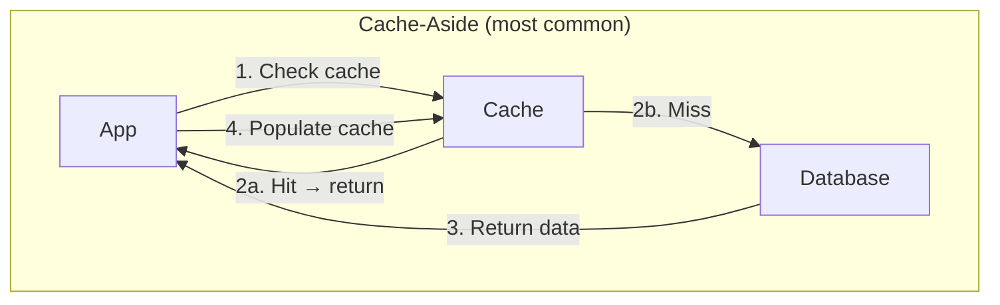

**Cache-Aside** (Lazy Loading) — The application manages the cache:

```javascript
async function getUser(userId) {
  // 1. Check cache
  const cached = await redis.get(`user:${userId}`);
  if (cached) return JSON.parse(cached);  // Cache hit

  // 2. Cache miss — query database
  const user = await db.query('SELECT * FROM users WHERE id = $1', [userId]);

  // 3. Populate cache with TTL
  await redis.set(`user:${userId}`, JSON.stringify(user), 'EX', 3600);

  return user;
}
```

**Write-Through** — Every write goes to both cache and database:

```javascript
async function updateUser(userId, data) {
  // Write to database
  await db.query('UPDATE users SET name = $1 WHERE id = $2', [data.name, userId]);

  // Immediately update cache
  await redis.set(`user:${userId}`, JSON.stringify(data), 'EX', 3600);
}
```

**Write-Behind (Write-Back)** — Write to cache immediately, flush to database asynchronously:

```javascript
// Great for counters and analytics — buffer writes
async function incrementPageView(pageId) {
  await redis.incr(`views:${pageId}`);
  // A background job flushes to DB every minute
}

// Background flush job
async function flushViewCounts() {
  const keys = await redis.keys('views:*');
  for (const key of keys) {
    const pageId = key.split(':')[1];
    const count = await redis.getdel(key);
    await db.query('UPDATE pages SET views = views + $1 WHERE id = $2', [count, pageId]);
  }
}
```

#### Cache Invalidation — The Hard Problem

> "There are only two hard things in Computer Science: cache invalidation and naming things." — Phil Karlton

**TTL (Time-To-Live):** The simplest strategy — cache expires after a set time:
```javascript
await redis.set('user:42', data, 'EX', 3600);  // Expires in 1 hour
// Pro: Simple. Con: Data can be stale for up to 1 hour.
```

**Event-driven invalidation:** Delete the cache when the source data changes:
```javascript
async function updateUser(userId, data) {
  await db.query('UPDATE users SET ...', [...]);
  await redis.del(`user:${userId}`);  // Invalidate cache
  // Next read will miss cache and fetch fresh data
}
```

**Versioned cache keys:** Change the key when data changes:
```javascript
const version = await redis.incr(`user:${userId}:version`);
await redis.set(`user:${userId}:v${version}`, data, 'EX', 3600);
```

#### Cache Stampede

When a popular cache key expires, hundreds of requests simultaneously hit the database:

```
Cache key "homepage:trending" expires
  → 500 concurrent requests all miss the cache
  → 500 identical database queries execute simultaneously
  → Database CPU spikes to 100%
```

**Solutions:**

```javascript
// Mutex lock — only one request queries the DB
async function getTrending() {
  const cached = await redis.get('trending');
  if (cached) return JSON.parse(cached);

  // Try to acquire lock
  const lock = await redis.set('trending:lock', '1', 'NX', 'EX', 5);
  if (lock) {
    const data = await db.query('SELECT ... expensive query ...');
    await redis.set('trending', JSON.stringify(data), 'EX', 300);
    await redis.del('trending:lock');
    return data;
  }

  // Another request is rebuilding — wait briefly and retry
  await sleep(100);
  return getTrending();
}
```

**Stale-while-revalidate:** Return stale data immediately, refresh in the background:
```javascript
async function getTrending() {
  const cached = await redis.get('trending');
  const ttl = await redis.ttl('trending');

  if (cached && ttl > 60) return JSON.parse(cached);  // Fresh enough

  if (cached) {
    // Stale but usable — return it and refresh in background
    refreshInBackground('trending');
    return JSON.parse(cached);
  }

  // No cache at all — must wait for DB
  return await refreshAndCache('trending');
}
```

#### Cache Penetration

Requests for keys that don't exist bypass the cache and always hit the database:

```
GET /user/999999999  → Cache miss → DB returns nothing → no cache set → repeat
```

**Fix:** Cache the "not found" result with a short TTL:
```javascript
const user = await db.query('SELECT * FROM users WHERE id = $1', [userId]);
if (!user) {
  await redis.set(`user:${userId}`, 'NOT_FOUND', 'EX', 60);  // Cache negative result
  return null;
}
```

Or use a **Bloom filter** — a probabilistic data structure that can definitively say "this key does NOT exist" (with a small false-positive rate).

#### What to Cache — and What Not To

| Cache | Don't Cache |
|-------|------------|
| User profiles, sessions | Data that changes every request |
| Product listings, search results | Transactional data (account balances) |
| API responses, rendered HTML | Sensitive data without encryption |
| Configuration, feature flags | Data that must be real-time consistent |

**Key takeaway:** Your application must work correctly without the cache — it's a performance layer, not a data store. Use cache-aside for most cases, TTL as a safety net, and event-driven invalidation for consistency. Watch out for stampedes on popular keys.

#### Real World
> **Reddit** — Reddit's front page is read by millions of users per minute but changes only a few times per minute. They cache the rendered front page in Redis with a short TTL. When the cache expired simultaneously for all users after a popular post went viral, the resulting stampede brought down their PostgreSQL cluster. They added a mutex-based lock so only one process rebuilds the cache at a time, with others waiting briefly and then reading the freshly rebuilt value.

#### Practice
1. You add a Redis cache with a 5-minute TTL for user profile data. A user updates their profile photo but still sees the old one for up to 5 minutes — how would you fix this without removing the cache?
2. Your application caches a product listing page. The cache key is `products:category:electronics`. Three different microservices can update product data — how do you ensure the cache is invalidated when any of them makes a change?
3. Explain the cache penetration problem and describe two strategies to prevent it — when would you choose each?

### Connection Pooling

Every database query requires a connection — opening one takes time (TCP handshake, auth, SSL). **Connection pooling** keeps a set of connections open and reuses them, avoiding this overhead on every request.

#### Without Pooling vs With Pooling

```
// ❌ Without pooling — new connection per query
Request 1 → [open connection] → query → [close connection]   // ~5–20ms overhead
Request 2 → [open connection] → query → [close connection]
Request 3 → [open connection] → query → [close connection]

// ✅ With pooling — reuse existing connections
Request 1 → [borrow conn from pool] → query → [return to pool]  // ~0ms overhead
Request 2 → [borrow conn from pool] → query → [return to pool]
Request 3 → [wait for available conn] → query → [return to pool]
```

#### Pool Sizing

Most teams set pool size too high. The right formula:

```
pool_size = num_cpu_cores * 2 + effective_spindle_count
```

For a 4-core database server: `pool_size = 4 * 2 + 1 = 9`

A large pool doesn't mean more throughput — it means more context switching and memory pressure on the database. Start small and tune up.

```javascript
// Node.js with pg (node-postgres)
const pool = new Pool({
  max: 10,          // max connections in pool
  min: 2,           // keep at least 2 warm
  idleTimeoutMillis: 30000,   // release idle connections after 30s
  connectionTimeoutMillis: 2000,  // fail fast if no conn available
});

// ✅ Borrow and return automatically
const result = await pool.query('SELECT * FROM users WHERE id = $1', [id]);
// Connection returned to pool when query resolves
```

#### The Serverless Problem

Serverless functions (AWS Lambda) spin up and down constantly — each cold start creates new connections. With 1000 concurrent Lambdas each holding 5 connections, you exhaust the database's 200-connection limit instantly.

```
// ❌ Serverless N-connections problem
Lambda 1 → 5 connections
Lambda 2 → 5 connections
...
Lambda 200 → 5 connections  ← PostgreSQL default max_connections = 200 → EXHAUSTED
Lambda 201 → ERROR: too many connections
```

**Solution: external connection pooler** (PgBouncer, RDS Proxy) sits between your app and database:

```
Lambda 1 ─┐
Lambda 2 ─┤──► PgBouncer ──► PostgreSQL
Lambda 3 ─┘   (10 real connections, multiplexed across thousands of clients)
```

PgBouncer modes:
- **Session mode** — one real connection per client session (safest, least efficient)
- **Transaction mode** — real connection held only during a transaction (most common)
- **Statement mode** — real connection held only during one statement (breaks multi-statement transactions)

**Key takeaway:** Always use a connection pool. In serverless environments, use an external pooler like PgBouncer or RDS Proxy — your app-level pool won't save you when you have hundreds of concurrent function instances.

#### Real World
> **Vercel** — When Vercel launched serverless Postgres (backed by Neon), they found that naive connection pooling from their edge functions immediately exhausted PostgreSQL's `max_connections` during even moderate load. Each function invocation tried to hold its own connection, and with hundreds of concurrent edge executions, the database refused new connections. They introduced PgBouncer in transaction mode as a mandatory layer between edge functions and the database, allowing thousands of concurrent serverless invocations to share a small pool of real connections.

#### Practice
1. Your Node.js app has `max: 100` in its connection pool, but your PostgreSQL server keeps logging "too many connections" errors during traffic spikes — what's likely happening, and how do you diagnose and fix it?
2. You're migrating a REST API to AWS Lambda. Your current app-level connection pool works fine on EC2. Why will it stop working correctly on Lambda, and what is the correct solution?
3. What is the difference between PgBouncer's session mode and transaction mode, and why does transaction mode break certain PostgreSQL features?

### MVCC — Multi-Version Concurrency Control

MVCC is how PostgreSQL (and most modern databases) allows reads and writes to happen simultaneously without locking each other out. Instead of locking a row when writing, the database keeps **multiple versions** of each row.

#### The Core Idea

```
// Traditional locking — readers block writers, writers block readers
Reader → wants to read row 42 → BLOCKED because Writer holds lock
Writer → updating row 42 → holds exclusive lock

// MVCC — readers never block writers
Reader → reads the old version of row 42 (snapshot at transaction start)
Writer → creates a new version of row 42 simultaneously
// Both proceed without waiting for each other
```

#### How Row Versions Work

Every row in PostgreSQL has hidden system columns:
- `xmin` — the transaction ID that created this version
- `xmax` — the transaction ID that deleted/updated this version (0 if still live)

```sql
-- Seeing the hidden columns
SELECT xmin, xmax, id, name FROM users WHERE id = 1;
-- xmin=501 xmax=0 id=1 name='Alice'  ← live row, created by txn 501

-- When Alice's name is updated:
-- Old row: xmin=501 xmax=602 id=1 name='Alice'   ← "deleted" by txn 602
-- New row: xmin=602 xmax=0   id=1 name='Bob'     ← created by txn 602
```

#### Snapshot Isolation

Each transaction gets a **snapshot** of the database at start time — it only sees rows committed before its snapshot was taken:

```sql
-- Transaction A (txn id 600) starts at 10:00
BEGIN;
SELECT name FROM users WHERE id = 1;  -- sees 'Alice'

-- Transaction B (txn id 601) updates at 10:01
UPDATE users SET name = 'Bob' WHERE id = 1;
COMMIT;

-- Transaction A still sees old data — it's using its snapshot
SELECT name FROM users WHERE id = 1;  -- still sees 'Alice'
COMMIT;
```

This is why `READ COMMITTED` and `REPEATABLE READ` isolation levels behave differently — they differ in *when* they take their snapshot.

#### VACUUM — Cleaning Up Dead Rows

Old row versions accumulate as "dead tuples". PostgreSQL's `VACUUM` process cleans them up:

```sql
-- Check dead tuples
SELECT relname, n_dead_tup, n_live_tup
FROM pg_stat_user_tables
ORDER BY n_dead_tup DESC;

-- Manual vacuum (autovacuum usually handles this)
VACUUM ANALYZE users;
```

A heavily updated table with bloated dead tuples causes **table bloat** — the table file grows on disk even if the live row count stays the same, degrading scan performance.

**Key takeaway:** MVCC is why PostgreSQL reads are fast even under heavy write load — readers get a consistent snapshot without waiting for locks. The cost is dead row accumulation, which autovacuum must clean up. Tables with very high UPDATE/DELETE rates need careful vacuum tuning.

#### Real World
> **Figma** — Figma's collaborative canvas generates an enormous number of small updates to document state — every cursor move and shape resize writes to the database. They discovered their `document_operations` table was accumulating millions of dead tuples per hour because autovacuum couldn't keep up with the update rate. This caused table bloat and index bloat, degrading query performance over time. They tuned autovacuum aggressively (`autovacuum_vacuum_scale_factor = 0.01`) on high-churn tables and added monitoring for `n_dead_tup` to catch it early.

#### Practice
1. A table has 1 million live rows but its file size on disk is 8GB — autovacuum is running. What is likely happening, and what does it tell you about the workload on this table?
2. Under MVCC, two transactions read the same row at different times and get different values even though neither transaction modified it — how is this possible, and is this a bug?
3. Why does a long-running transaction prevent MVCC from cleaning up dead rows, and what production problem can this cause?

### Write-Ahead Log (WAL)

The WAL is the backbone of PostgreSQL's durability and replication. Every change is written to the WAL *before* it's applied to the actual data files — "write ahead" means the log comes first.

#### Why WAL Exists: The Crash Problem

Without WAL, a crash mid-write corrupts the database:

```
// ❌ Without WAL — crash mid-write
1. Start writing rows to data files
2. CRASH — power failure
3. Data files are half-written → CORRUPTION
   Some pages updated, some not — database is inconsistent

// ✅ With WAL — crash-safe
1. Append change to WAL (sequential write — very fast)
2. Acknowledge to client: "committed"
3. Apply to data files in background
4. CRASH — doesn't matter
5. On restart: replay WAL to restore any un-applied changes
```

Sequential appends to the WAL are much faster than random writes to data files — this is why commits are fast even though data files aren't immediately updated.

#### WAL and Replication

Replicas stay in sync by consuming the primary's WAL stream:

```
Primary:
  [Write] → WAL segment → [Data files updated in background]
                ↓
         WAL stream (TCP)
                ↓
Replica:
  [Receive WAL] → [Replay changes] → [Replica data files match primary]
```

```sql
-- Check replication lag (on primary)
SELECT
  client_addr,
  state,
  sent_lsn,
  write_lsn,
  flush_lsn,
  replay_lsn,
  (sent_lsn - replay_lsn) AS replication_lag_bytes
FROM pg_stat_replication;
```

#### Point-in-Time Recovery (PITR)

Because WAL records every change, you can restore a database to any past moment:

```bash
# Restore base backup + replay WAL up to a specific timestamp
recovery_target_time = '2024-03-15 14:30:00'
```

This is how RDS automated backups work under the hood — base snapshot + WAL archive.

#### WAL in Interviews

Common questions:
- *"How does PostgreSQL guarantee durability?"* → WAL is written to disk before acknowledging commits (`fsync`)
- *"How does streaming replication work?"* → Replica consumes WAL stream from primary
- *"How would you recover a database from accidental `DELETE`?"* → PITR — replay WAL up to just before the delete

**Key takeaway:** WAL makes PostgreSQL both crash-safe and replicable. Every commit is durable because the WAL is fsynced first. Replicas stay consistent by replaying the same WAL stream. PITR lets you roll back to any point in time as long as you kept the WAL archive.

#### Real World
> **Cloudflare** — When Cloudflare engineers accidentally ran a destructive migration that dropped data from a production PostgreSQL table, they used Point-in-Time Recovery to restore the database to the state 47 seconds before the migration ran. The WAL archive they maintained on S3 allowed them to replay every transaction up to a specific LSN (log sequence number), recovering all data with no gap except the seconds during which the bad migration ran.

#### Practice
1. A developer runs `DELETE FROM orders WHERE user_id = 42` intending to target a test environment but hits production instead — you have continuous WAL archiving enabled. What is your recovery procedure?
2. How does WAL enable streaming replication, and what specifically does a replica receive and apply from the primary?
3. Why does PostgreSQL write to the WAL *before* updating data files, and what would happen if it did it the other way around?

### CQRS & Event Sourcing

Two architectural patterns that often appear together in system design interviews, especially for high-scale or audit-heavy systems.

#### CQRS — Command Query Responsibility Segregation

Split your data model into two sides: **Commands** (writes) and **Queries** (reads). Each side can use a different schema, database, or even language.

```
// ❌ Traditional — same model for reads and writes
GET  /orders/:id   → reads from orders table (same schema)
POST /orders       → writes to orders table (same schema)
// Reads need denormalized data for display; writes need normalized data for integrity
// Tension: optimizing one hurts the other

// ✅ CQRS — separate models
Command side:  POST /orders → normalized write DB (PostgreSQL)
                              → emits OrderPlaced event
Query side:    GET  /orders → denormalized read DB (optimized for display)
                              → updated by consuming OrderPlaced event
```

```
┌─────────────┐    Command     ┌──────────────────┐
│   Client    │───────────────►│  Write DB (PG)   │
│             │                │  (normalized)    │
│             │    Query       └────────┬─────────┘
│             │◄───────────────         │ events
│             │                         ▼
└─────────────┘               ┌──────────────────┐
                               │  Read DB (ES/PG) │
                               │  (denormalized)  │
                               └──────────────────┘
```

Trade-off: **eventual consistency** — the read model lags slightly behind the write model.

#### Event Sourcing

Instead of storing the *current state*, store the **sequence of events** that produced it. Current state is derived by replaying events.

```javascript
// ❌ Traditional state storage — only current state
orders table:
  id=1, status='shipped', total=99.99, updated_at=...
  // History is gone — you can't know the previous state

// ✅ Event sourcing — full history
order_events table:
  { type: 'OrderPlaced',   orderId: 1, total: 99.99,  at: '10:00' }
  { type: 'PaymentTaken',  orderId: 1, amount: 99.99, at: '10:01' }
  { type: 'OrderShipped',  orderId: 1, trackingId: 'XY123', at: '10:05' }

// Current state = replay all events
function getCurrentState(events) {
  return events.reduce((state, event) => apply(state, event), {});
}
```

**Why it's powerful:**
- Full audit trail — every change recorded with who/when/why
- Time-travel — reconstruct state at any past moment
- Event replay — rebuild any read model from scratch
- Debugging — reproduce any bug by replaying the exact sequence of events

**Why it's complex:**
- Eventual consistency between write and read models
- Event schema migrations are hard (old events must still be replayable)
- Querying current state requires projection/materialization

#### When to Use Each

| Pattern | Use when |
|---|---|
| CQRS | Read and write workloads have very different shapes; scaling reads independently |
| Event Sourcing | Audit requirements, time-travel debugging, complex domain logic |
| Both together | Financial systems, e-commerce order flows, compliance-heavy domains |
| Neither | Simple CRUD apps — added complexity isn't worth it |

**Key takeaway:** CQRS separates read and write models so each can be optimized independently. Event Sourcing stores history as events instead of current state, enabling full auditability and time-travel. They're often paired, but each can stand alone. Don't reach for them unless you have a concrete reason.

#### Real World
> **Axel Springer (EventSourcing in fintech)** — A European payments company used event sourcing for their account ledger: every debit and credit is an immutable event appended to an event store. When regulators requested a full audit of all transactions for a specific account over 3 years, they replayed the event log to produce an exact reconstruction of every state the account had ever been in — something impossible with a traditional "current state only" table.

#### Practice
1. You're designing an order management system. A PM asks for a feature to show customers a timeline of every status change with timestamps — would CQRS, Event Sourcing, or neither best serve this requirement, and why?
2. Your write model (PostgreSQL) is strongly consistent, but your read model (Elasticsearch, updated via events) is slightly behind — a user places an order and immediately queries "my recent orders" but doesn't see it. How do you handle this UX problem?
3. What makes event schema migrations significantly harder in an Event Sourcing system compared to a traditional database schema migration?

### Distributed Transactions & the Saga Pattern

When a business operation spans multiple databases or services, keeping them consistent is one of the hardest problems in distributed systems.

#### The Problem: Atomic Operations Across Services

```
// ❌ Naive approach — what if step 2 or 3 fails?
1. Deduct $100 from Alice's account (Bank DB)
2. Add $100 to Bob's account (Bank DB)       ← if this crashes, Alice lost $100
3. Record transaction in audit log (Audit DB) ← if this crashes, untracked transfer
```

Within a single database, you'd wrap this in a transaction. But across databases or services, `BEGIN/COMMIT` doesn't work.

#### Two-Phase Commit (2PC)

2PC coordinates an atomic commit across multiple databases using a **coordinator**:

```
Phase 1 — Prepare:
  Coordinator → DB1: "Can you commit?"  → DB1: "Yes, prepared" (holds locks)
  Coordinator → DB2: "Can you commit?"  → DB2: "Yes, prepared" (holds locks)

Phase 2 — Commit:
  All said yes → Coordinator → DB1: "Commit"
                              → DB2: "Commit"

// If any say "No" in Phase 1:
  Coordinator → DB1: "Rollback"
  Coordinator → DB2: "Rollback"
```

**Problems with 2PC:**
- **Blocking** — participants hold locks while waiting for coordinator decision
- **Single point of failure** — if coordinator crashes between phases, participants are stuck
- Rarely used in practice outside of databases that natively support it (e.g. XA transactions)

#### The Saga Pattern (Preferred)

Break the distributed operation into a sequence of **local transactions**, each followed by an event. If a step fails, run **compensating transactions** to undo previous steps:

```javascript
// Saga for an e-commerce order
const orderSaga = [
  {
    action: () => inventoryService.reserve(items),         // Step 1
    compensate: () => inventoryService.release(items),     // Undo Step 1
  },
  {
    action: () => paymentService.charge(userId, amount),   // Step 2
    compensate: () => paymentService.refund(userId, amount), // Undo Step 2
  },
  {
    action: () => shippingService.schedule(orderId),       // Step 3
    compensate: () => shippingService.cancel(orderId),     // Undo Step 3
  },
];

// If Step 3 fails: run compensate for Step 2, then Step 1
```

Two coordination styles:
- **Choreography** — each service publishes events, others listen and react (decentralized)
- **Orchestration** — a central saga orchestrator tells each service what to do (centralized, easier to reason about)

#### 2PC vs Saga

| | 2PC | Saga |
|---|---|---|
| Consistency | Strong (atomic) | Eventual |
| Coupling | Tight (coordinator) | Loose (events) |
| Failure handling | Blocking | Compensating transactions |
| Scalability | Poor | Good |
| Complexity | Protocol complexity | Business logic complexity |

**Key takeaway:** 2PC achieves atomicity but blocks on failure and doesn't scale well. The Saga pattern is the modern alternative — break the operation into steps with compensating actions, accept eventual consistency, and design your business logic to handle rollbacks gracefully.

#### Real World
> **Uber Eats** — An Uber Eats order placement touches at least three separate services: inventory (restaurant item availability), payments (charge the customer), and dispatch (assign a driver). They implement this as an orchestrated saga — a central order service drives each step in sequence. If the payment step succeeds but dispatch fails, the saga's compensating transaction triggers a payment refund. The customer sees "order failed" rather than being silently charged for a never-dispatched order.

#### Practice
1. You're building an e-commerce checkout that must reserve inventory, charge a credit card, and create a shipment — all in separate services. Walk through how you'd implement this as a saga, including what happens if the shipment service is down.
2. A Saga's compensating transaction also fails (e.g., the refund service is unavailable) — how do you handle this, and what pattern prevents sagas from getting permanently stuck?
3. What is the key difference between choreography-based and orchestration-based sagas, and in what situation would you prefer each?

### Hot Spot Problem

A hot spot occurs when a disproportionate share of traffic goes to a single node — one shard, one server, or one partition absorbs all the load while the rest sit idle.

#### How Hot Spots Happen

```
// ❌ Sequential ID as shard key
shard key = user_id % 4
user_id: 1 → shard 1
user_id: 2 → shard 2
user_id: 3 → shard 3
user_id: 4 → shard 0
// Looks balanced — but new users always get the highest IDs
// During a sign-up spike: all writes → shard (max_id % 4) → ONE HOT SHARD

// ❌ Timestamp as shard key (common in time-series)
shard key = created_at month
// All writes go to "current month" shard — one shard does 100% of writes

// ❌ Celebrity problem — a single entity gets enormous traffic
// Elon Musk tweets → his user_id shard handles 10,000x normal read traffic
```

#### Detecting Hot Spots

```sql
-- Find hot shards by row count distribution
SELECT shard_id, COUNT(*) as rows
FROM sharded_table
GROUP BY shard_id
ORDER BY rows DESC;
-- Healthy: even distribution
-- Hot spot: one shard has 10x the rows of others
```

In cloud systems, monitor per-shard CPU/IOPS — a single shard pegged at 100% CPU while others are at 5% is a hot spot.

#### Fixing Hot Spots

**1. Better shard key — use a hash:**
```javascript
// ✅ Consistent hashing distributes evenly
shard = hash(userId) % numShards
// Random-looking distribution — spikes on one user don't overload one shard
```

**2. Add random suffix to "celebrity" keys:**
```javascript
// ❌ All reads for viral tweet go to shard holding tweet_id=123
const tweet = await cache.get(`tweet:123`);

// ✅ Spread across N cache shards with suffix
const suffix = Math.floor(Math.random() * 10);  // 0–9
const tweet = await cache.get(`tweet:123:${suffix}`);
// Writes: fan-out to all 10 keys. Reads: random pick from 10 keys.
```

**3. Read replicas for celebrity entities:**
Direct high-read entities to dedicated read replicas.

**4. Application-level caching:**
Cache the hot entity close to the application — stop the hot reads reaching the database at all.

**Key takeaway:** Hot spots break the premise of sharding — instead of N shards sharing load, you have one shard doing all the work. Choose shard keys that distribute evenly across both data and access patterns. For "celebrity" scenarios, fan-out writes and randomize read keys across multiple shards.

#### Real World
> **Twitter** — When a major celebrity (Katy Perry, then Barack Obama) tweeted, the cache shard storing their follower list and tweet data would saturate instantly — a "thundering herd" hitting one Redis node. Twitter's solution was to detect high-follower accounts at write time and fan the tweet out to multiple cache replicas with random suffixes, so that read traffic for that tweet spread across 10+ cache nodes instead of hammering one.

#### Practice
1. You're designing a Cassandra schema for an IoT platform that ingests sensor readings and you partition by `device_id`. One device sends 100x more data than average — how do you detect this hot partition and what are your options for fixing it?
2. Your system shards user data by `user_id % 16`. During a viral marketing event, 80% of new sign-ups happen within a 2-hour window with sequential IDs — which shards receive the load, and how would you have designed the shard key differently?
3. Why does caching at the application layer solve the celebrity hot-spot problem for reads but not for writes, and what do you do about write hot spots?

### Soft Deletes

A soft delete marks a record as deleted without removing it from the database. The row stays in the table — queries just filter it out.

#### Implementation

```sql
-- Add a deleted_at column (NULL = not deleted)
ALTER TABLE users ADD COLUMN deleted_at TIMESTAMPTZ DEFAULT NULL;

-- Soft delete
UPDATE users SET deleted_at = NOW() WHERE id = 42;

-- ❌ Naive query — still returns deleted users
SELECT * FROM users WHERE id = 42;

-- ✅ Filter deleted records
SELECT * FROM users WHERE id = 42 AND deleted_at IS NULL;
```

#### The Indexing Problem

A partial index on `deleted_at IS NULL` keeps queries fast without bloating the index with deleted rows:

```sql
-- ❌ Full index includes deleted rows — wastes index space and slows scans
CREATE INDEX idx_users_email ON users(email);

-- ✅ Partial index — only indexes non-deleted rows
CREATE INDEX idx_users_email_active ON users(email)
WHERE deleted_at IS NULL;

-- Query must match the WHERE clause to use the partial index
SELECT * FROM users WHERE email = 'alice@example.com' AND deleted_at IS NULL;
```

#### Unique Constraints with Soft Deletes

Soft deletes break unique constraints — you can't re-register a deleted email if the old row still exists:

```sql
-- ❌ Unique constraint blocks re-registration after soft delete
CREATE UNIQUE INDEX idx_users_email_unique ON users(email);
INSERT INTO users (email) VALUES ('alice@example.com');  -- works
UPDATE users SET deleted_at = NOW() WHERE email = 'alice@example.com';
INSERT INTO users (email) VALUES ('alice@example.com');  -- ERROR: duplicate key

-- ✅ Partial unique index — only enforces uniqueness on active rows
CREATE UNIQUE INDEX idx_users_email_unique ON users(email)
WHERE deleted_at IS NULL;
-- Now re-registration works — the deleted row is excluded from the unique check
```

#### When to Use Soft Deletes

| Use soft deletes | Use hard deletes |
|---|---|
| Audit trail required | GDPR right-to-erasure (must hard delete) |
| Data recovery ("oops, I deleted it") | Truly ephemeral data (logs, sessions) |
| Foreign key references that must stay valid | Tables with very high delete volume |
| "Trash" / recycle bin feature | |

**Key takeaway:** Soft deletes are simple but have hidden costs — tables grow unbounded, indexes bloat, and unique constraints need special handling. Use partial indexes (`WHERE deleted_at IS NULL`) to keep queries fast and unique constraints working correctly.

#### Real World
> **GitHub** — GitHub uses soft deletes on repositories so that if a user accidentally deletes a repo, support can restore it within a grace period. However, they found that over time, the `repositories` table accumulated tens of millions of soft-deleted rows, causing full-table operations (backups, vacuums, analytics queries) to slow down significantly. They introduced a nightly archival job to move rows deleted over 90 days ago to a cold storage table, keeping the hot table lean.

#### Practice
1. You add `deleted_at` to a `users` table with 20 million rows. Every query in your ORM must now include `AND deleted_at IS NULL`. What index changes do you make, and how do you ensure no query accidentally returns deleted users?
2. Your `users` table has a unique constraint on `email`. A user deletes their account (soft delete) and tries to re-register with the same email — what happens, and how do you fix the schema to allow it?
3. Under what circumstances should you use a hard delete instead of a soft delete, even if an "undo" feature sounds appealing?

### Upserts & Bulk Operations

High-throughput applications need to write many rows efficiently. Doing it one row at a time is slow; the right SQL constructs can improve write performance by orders of magnitude.

#### Upsert — Insert or Update

An upsert atomically inserts a row, or updates it if it already exists — no separate SELECT needed:

```sql
-- ❌ Naive: SELECT then INSERT or UPDATE — two round-trips + race condition
SELECT * FROM user_stats WHERE user_id = 42;
-- if exists: UPDATE user_stats SET page_views = page_views + 1 WHERE user_id = 42;
-- if not:    INSERT INTO user_stats (user_id, page_views) VALUES (42, 1);

-- ✅ PostgreSQL upsert — INSERT ON CONFLICT
INSERT INTO user_stats (user_id, page_views)
VALUES (42, 1)
ON CONFLICT (user_id)
DO UPDATE SET
  page_views = user_stats.page_views + EXCLUDED.page_views,
  updated_at = NOW();
-- EXCLUDED refers to the row that was proposed for insertion
```

```sql
-- Upsert with "do nothing" (ignore duplicates)
INSERT INTO event_log (event_id, payload)
VALUES ('abc-123', '{"type":"click"}')
ON CONFLICT (event_id) DO NOTHING;
```

#### Bulk Insert

Inserting rows one at a time means one round-trip per row. Multi-row insert sends them all at once:

```javascript
// ❌ N round-trips — one INSERT per row
for (const user of users) {
  await db.query('INSERT INTO users (name, email) VALUES ($1, $2)', [user.name, user.email]);
}
// 1000 users = 1000 queries

// ✅ Single multi-row INSERT
const values = users.map((u, i) => `($${i*2+1}, $${i*2+2})`).join(', ');
const params = users.flatMap(u => [u.name, u.email]);
await db.query(`INSERT INTO users (name, email) VALUES ${values}`, params);
// 1000 users = 1 query
```

For very large datasets, `COPY` is even faster — it bypasses the SQL parser:

```sql
-- COPY from CSV — fastest bulk load method
COPY users (name, email) FROM '/tmp/users.csv' WITH (FORMAT csv, HEADER true);

-- Or from stdin in application code (pg COPY protocol)
```

#### Bulk Upsert

```sql
-- Bulk upsert using a temporary table
CREATE TEMP TABLE users_staging (LIKE users INCLUDING ALL);

-- Bulk insert into staging (fast — no constraints checked)
COPY users_staging FROM '/tmp/users.csv' WITH (FORMAT csv);

-- Upsert from staging into main table
INSERT INTO users (id, name, email)
SELECT id, name, email FROM users_staging
ON CONFLICT (id) DO UPDATE SET
  name = EXCLUDED.name,
  email = EXCLUDED.email;

DROP TABLE users_staging;
```

#### Batch Size Trade-offs

```javascript
// ❌ All 1M rows in one transaction — holds locks for a long time, huge rollback log
await db.query('INSERT INTO events ... VALUES (1M rows)');

// ✅ Batch into chunks — shorter lock time, resumable on failure
const BATCH_SIZE = 1000;
for (let i = 0; i < rows.length; i += BATCH_SIZE) {
  const batch = rows.slice(i, i + BATCH_SIZE);
  await db.query(buildBulkInsert(batch));
}
```

**Key takeaway:** Always use `INSERT ON CONFLICT` for upserts — it's atomic and avoids race conditions. For bulk writes, multi-row `INSERT` is 10–100x faster than individual inserts; `COPY` is fastest of all. Batch large operations into chunks of 500–5000 rows to keep transactions short and avoid lock contention.

#### Real World
> **Stripe** — Stripe's webhook delivery system must track delivery attempts per webhook endpoint. Each HTTP callback attempt results in an upsert: if no row exists for that `(webhook_id, attempt_number)`, insert it; if it already exists (due to a retry of the delivery worker), update the status. Using `INSERT ON CONFLICT DO UPDATE` made this idempotent — retrying a failed delivery worker never creates duplicate attempt records or misses updates.

#### Practice
1. You're syncing 500,000 product records from a supplier's API into your database every night — some are new, some are updates. Describe the most efficient approach and why individual upserts in a loop would be a problem.
2. You use `INSERT INTO events ... ON CONFLICT DO NOTHING` to deduplicate incoming webhook events by `event_id`. What must be true about your schema for this to work correctly, and what does `DO NOTHING` guarantee?
3. Your bulk insert job loads 1 million rows in a single transaction. A colleague says this is dangerous — why, and what is a safer approach?

## ELI5

Imagine a library. The **database** is all the books on the shelves. The **schema** is how you organize them — fiction on floor 1, non-fiction on floor 2, sorted by author.

An **index** is like the card catalog. Without it, to find a book you'd walk through every shelf. With the catalog, you look up the author's name and go straight to the right shelf.

A **transaction** is like checking out multiple books at once. Either you get all of them, or none — you don't want to end up with Volume 2 but not Volume 1.

**SQL vs NoSQL** is like a library (organized shelves, strict rules, easy to find things) vs a storage locker (throw stuff in however you want, super flexible, but harder to search).

## Poem

Tables hold the truth in rows,
Indexes speed where query goes.
ACID keeps your data right,
Transactions guard through read and write.

Normalize first, then think of speed,
Denormalize for what you need.
Migrations flow like rivers wide —
Backwards-compatible is your guide.

## Template

```sql
-- Indexing: Create indexes on frequently queried columns
CREATE INDEX idx_users_email ON users(email);
CREATE INDEX idx_orders_user_date ON orders(user_id, created_at);

-- Transaction: Wrap related operations
BEGIN;
  UPDATE accounts SET balance = balance - 100 WHERE id = 1;
  UPDATE accounts SET balance = balance + 100 WHERE id = 2;
COMMIT;

-- Migration pattern: Add column with default, then backfill
ALTER TABLE users ADD COLUMN status VARCHAR(20) DEFAULT 'active';
```
