## Database Fundamentals

Databases are where your application's state lives. Getting the data layer right — schema design, indexing, transactions, and migration strategy — is the foundation of a reliable backend.

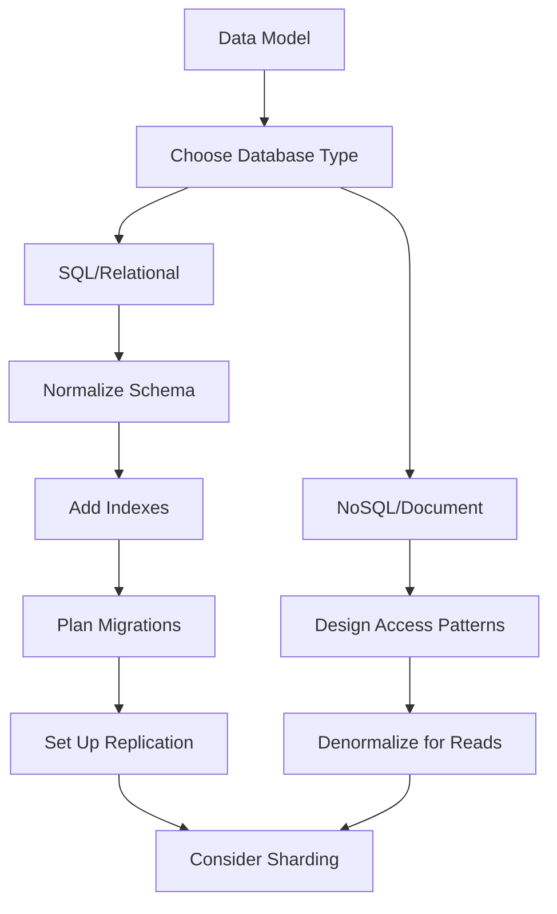

### SQL & Querying

Relational databases (PostgreSQL, MySQL) organize data into tables with defined relationships. SQL is the language you use to interact with that data. Mastering SQL means understanding how to retrieve, combine, filter, and aggregate data efficiently.

#### JOINs — Combining Data from Multiple Tables

JOINs are how you pull related data together. Each type serves a different purpose:

- **INNER JOIN** — returns only rows that have a match in both tables. Use when you need data that exists on both sides.
- **LEFT JOIN** — returns all rows from the left table, plus matches from the right (NULL if no match). Use when you want all records from one side regardless.
- **RIGHT JOIN** — opposite of LEFT JOIN. Rarely used — just swap the table order and use LEFT JOIN instead.
- **FULL OUTER JOIN** — returns all rows from both tables, with NULLs where there's no match. Use for reconciliation queries.
- **SELF JOIN** — a table joined to itself. Use for hierarchical data (employees → managers) or comparing rows within the same table.

```sql
-- Find all users and their orders (including users with no orders)
SELECT u.name, o.total
FROM users u
LEFT JOIN orders o ON o.user_id = u.id;

-- Self join: find employees and their managers
SELECT e.name AS employee, m.name AS manager
FROM employees e
LEFT JOIN employees m ON e.manager_id = m.id;
```

#### GROUP BY & Aggregation

GROUP BY collapses rows into groups and lets you run aggregate functions on each group:

```sql
-- Total revenue per customer
SELECT user_id, COUNT(*) AS order_count, SUM(total) AS revenue
FROM orders
GROUP BY user_id
HAVING SUM(total) > 1000  -- filter AFTER grouping
ORDER BY revenue DESC;
```

Key aggregates: `COUNT(*)`, `SUM()`, `AVG()`, `MIN()`, `MAX()`, `COUNT(DISTINCT ...)`. Remember: `WHERE` filters rows before grouping, `HAVING` filters after.

#### Subqueries vs CTEs vs Window Functions

**Subqueries** nest a query inside another. They can appear in WHERE, FROM, or SELECT:

```sql
-- Users who spent more than average
SELECT name FROM users
WHERE id IN (
  SELECT user_id FROM orders
  GROUP BY user_id
  HAVING SUM(total) > (SELECT AVG(total) FROM orders)
);
```

**CTEs** (Common Table Expressions) make complex queries readable by naming intermediate steps:

```sql
WITH monthly_revenue AS (
  SELECT DATE_TRUNC('month', created_at) AS month, SUM(total) AS revenue
  FROM orders GROUP BY 1
),
growth AS (
  SELECT month, revenue,
         LAG(revenue) OVER (ORDER BY month) AS prev_revenue
  FROM monthly_revenue
)
SELECT month, revenue,
       ROUND((revenue - prev_revenue) / prev_revenue * 100, 1) AS growth_pct
FROM growth;
```

**Window functions** aggregate without collapsing rows — essential for rankings, running totals, and comparisons:

```sql
-- Rank users by total spending
SELECT user_id, SUM(total) AS spent,
       RANK() OVER (ORDER BY SUM(total) DESC) AS rank
FROM orders GROUP BY user_id;

-- Running total per user
SELECT user_id, created_at, total,
       SUM(total) OVER (PARTITION BY user_id ORDER BY created_at) AS running_total
FROM orders;
```

#### Performance Tips

- Prefer `EXISTS` over `IN` for large subqueries — `EXISTS` short-circuits once a match is found
- Always check `EXPLAIN ANALYZE` for slow queries to see the actual execution plan
- Avoid `SELECT *` — fetch only the columns you need
- Use `LIMIT` during development to avoid accidentally scanning millions of rows

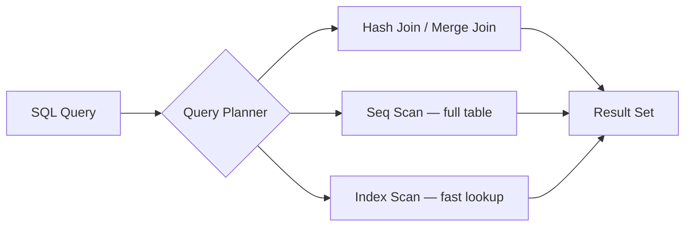

**Key takeaway:** SQL is declarative — you say *what* you want, the database decides *how*. Understanding the query planner helps you write SQL that the database can execute efficiently.

### Indexing & Query Optimization

An index is a separate data structure that the database maintains alongside your table to speed up lookups. Without an index, the database must scan every row (Seq Scan). With an index, it can jump directly to matching rows.

#### How B-tree Indexes Work

The default index type in PostgreSQL and MySQL is a **B-tree** (balanced tree). It keeps data sorted, enabling:

- **Equality lookups**: `WHERE email = 'alice@example.com'` → O(log n) instead of O(n)
- **Range queries**: `WHERE created_at > '2024-01-01'` → walks the tree to the start point, then scans forward
- **Sorting**: `ORDER BY created_at` → the index is already sorted, no extra sort needed

```sql
-- Create a basic index
CREATE INDEX idx_users_email ON users(email);

-- Verify the index is used
EXPLAIN ANALYZE SELECT * FROM users WHERE email = 'alice@example.com';
-- Expected: Index Scan using idx_users_email (not Seq Scan)
```

#### Index Types for Specific Use Cases

| Index Type | Best For | Example |
|-----------|---------|---------|
| **B-tree** | Equality, range, sorting | `WHERE price > 100 ORDER BY price` |
| **Hash** | Exact equality only | `WHERE session_id = 'abc123'` |
| **GIN** | Full-text search, JSONB, arrays | `WHERE tags @> '{javascript}'` |
| **GiST** | Spatial/geometric data | `WHERE location <@ circle(point(0,0), 10)` |
| **BRIN** | Large tables with natural ordering | `WHERE created_at > '2024-01-01'` on append-only tables |

#### Composite Indexes and the Leftmost Prefix Rule

A composite index on `(user_id, created_at)` is like a phone book sorted by last name, then first name:

```sql
CREATE INDEX idx_orders_user_date ON orders(user_id, created_at);

-- ✅ Uses the index (matches leftmost prefix)
SELECT * FROM orders WHERE user_id = 42;
SELECT * FROM orders WHERE user_id = 42 AND created_at > '2024-01-01';

-- ❌ Cannot use this index (skips the leftmost column)
SELECT * FROM orders WHERE created_at > '2024-01-01';
```

#### Covering Indexes (Index-Only Scans)

If an index contains all columns the query needs, the database never touches the table at all:

```sql
-- Covering index: includes the columns we SELECT
CREATE INDEX idx_orders_covering ON orders(user_id, created_at) INCLUDE (total);

-- This query can be answered entirely from the index
SELECT created_at, total FROM orders WHERE user_id = 42;
```

#### When NOT to Index

- **Small tables** (< 1000 rows) — Seq Scan is faster than the overhead of index lookup
- **Low-cardinality columns** — a boolean `is_active` column has only 2 values; the index barely helps
- **Write-heavy tables** — every INSERT/UPDATE/DELETE must also update all indexes
- **Columns with functions** — `WHERE LOWER(email) = '...'` won't use an index on `email` (use an expression index instead)

```sql
-- Expression index for case-insensitive lookup
CREATE INDEX idx_users_email_lower ON users(LOWER(email));
```

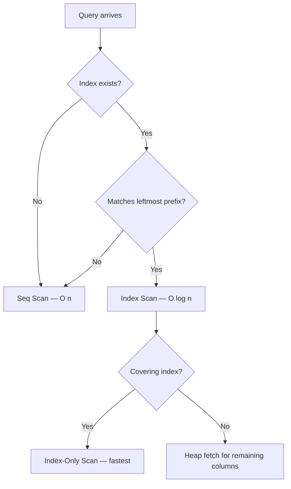

**Key takeaway:** Indexes are a tradeoff — they speed up reads but slow down writes. Add them intentionally based on your actual query patterns, not speculatively.

### ACID Transactions & Isolation Levels

A transaction groups multiple database operations into a single atomic unit. Either all operations succeed (commit) or all are rolled back. This is essential for data integrity — think transferring money between bank accounts.

#### The Four ACID Properties

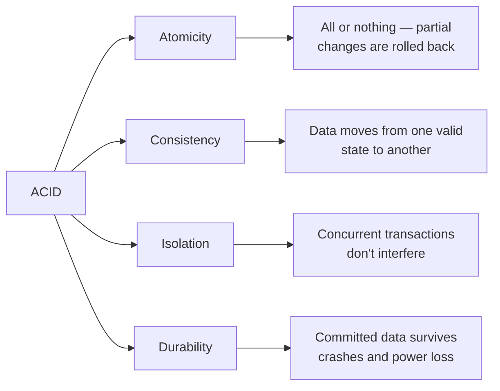

**Atomicity** — If any operation in a transaction fails, all changes are undone. A bank transfer that debits $100 from Account A but fails to credit Account B will roll back the debit too.

**Consistency** — The database enforces constraints (foreign keys, unique constraints, CHECK constraints) so data always moves from one valid state to another. You can't end up with an order referencing a non-existent user.

**Isolation** — Concurrent transactions behave as if they're running one at a time. Without isolation, two transactions reading and writing the same row can produce wrong results.

**Durability** — Once a transaction is committed, the data is persisted to disk (via Write-Ahead Logging). Even if the server crashes immediately after, the data is safe.

#### Transaction Example

```sql
BEGIN;
  -- Debit from Account A
  UPDATE accounts SET balance = balance - 100 WHERE id = 1;

  -- Credit to Account B
  UPDATE accounts SET balance = balance + 100 WHERE id = 2;

  -- Verify no negative balance
  DO $$
  BEGIN
    IF (SELECT balance FROM accounts WHERE id = 1) < 0 THEN
      RAISE EXCEPTION 'Insufficient funds';
    END IF;
  END $$;
COMMIT;
-- If any step fails, all changes are rolled back automatically
```

#### Isolation Levels — The Concurrency vs Consistency Tradeoff

Each isolation level prevents different types of anomalies:

| Isolation Level | Dirty Read | Non-Repeatable Read | Phantom Read | Performance |
|----------------|-----------|-------------------|-------------|-------------|
| **Read Uncommitted** | Possible | Possible | Possible | Fastest |
| **Read Committed** (PG default) | Prevented | Possible | Possible | Fast |
| **Repeatable Read** (MySQL default) | Prevented | Prevented | Possible | Medium |
| **Serializable** | Prevented | Prevented | Prevented | Slowest |

**Dirty read** — Reading data from a transaction that hasn't committed yet. If that transaction rolls back, you read data that never existed.

**Non-repeatable read** — Reading the same row twice in a transaction and getting different values because another transaction modified it in between.

**Phantom read** — Running the same query twice and getting different rows because another transaction inserted or deleted matching rows.

```sql
-- Set isolation level for a transaction
BEGIN TRANSACTION ISOLATION LEVEL SERIALIZABLE;
  SELECT SUM(balance) FROM accounts;  -- No other transaction can change accounts until we commit
COMMIT;
```

#### Optimistic vs Pessimistic Locking

**Pessimistic locking** — Lock the row when you read it, preventing others from modifying it until you're done:

```sql
BEGIN;
  SELECT * FROM inventory WHERE product_id = 42 FOR UPDATE;  -- row is locked
  UPDATE inventory SET quantity = quantity - 1 WHERE product_id = 42;
COMMIT;  -- lock released
```

**Optimistic locking** — Don't lock anything. Instead, check that the row hasn't changed before writing:

```sql
-- Read the current version
SELECT quantity, version FROM inventory WHERE product_id = 42;
-- Returns: quantity=10, version=5

-- Update only if version hasn't changed
UPDATE inventory
SET quantity = 9, version = 6
WHERE product_id = 42 AND version = 5;

-- If 0 rows affected → someone else modified it → retry
```

| | Pessimistic | Optimistic |
|-|------------|-----------|
| **How it works** | Lock rows upfront | Check version on write |
| **Best for** | High contention (many writers) | Low contention (rare conflicts) |
| **Risk** | Deadlocks | Retry storms under load |
| **Example** | Seat booking | Shopping cart updates |

#### Deadlocks

A deadlock happens when two transactions are each waiting for a lock the other holds:

```
Transaction A: locks row 1, then tries to lock row 2
Transaction B: locks row 2, then tries to lock row 1
→ Both wait forever → Database detects and kills one
```

Prevention: always acquire locks in the same order (e.g., sort by ID before locking).

**Key takeaway:** Choose the weakest isolation level that still gives you correct results. Most applications work fine with Read Committed (Postgres default). Only use Serializable when absolute correctness matters more than throughput.

### SQL vs NoSQL

The choice between SQL and NoSQL is not about which is "better" — it's about matching the database to your access patterns, consistency requirements, and scaling needs.

#### When to Choose SQL (Relational)

SQL databases (PostgreSQL, MySQL) excel when:

- Your data has **clear relationships** (users → orders → items)
- You need **complex queries** — JOINs, aggregations, subqueries
- **Transactions** matter — financial data, inventory, anything where partial updates are dangerous
- Your schema is **relatively stable** — the structure doesn't change weekly
- **Strong consistency** is required — every read returns the latest write

```sql
-- SQL shines when you need to combine data across entities
SELECT u.name, COUNT(o.id) AS order_count, SUM(o.total) AS lifetime_value
FROM users u
JOIN orders o ON o.user_id = u.id
WHERE o.created_at > '2024-01-01'
GROUP BY u.id
HAVING SUM(o.total) > 1000
ORDER BY lifetime_value DESC;
```

#### When to Choose NoSQL

NoSQL databases come in several flavors, each optimized for different use cases:

**Document stores (MongoDB, DynamoDB)**
- Each record is a self-contained JSON document
- Schema is flexible — different documents can have different fields
- Best for: product catalogs, user profiles, content management

```json
{
  "_id": "product-123",
  "name": "Wireless Mouse",
  "category": "electronics",
  "specs": { "dpi": 1600, "wireless": true, "battery": "AA" },
  "reviews": [
    { "user": "alice", "rating": 5, "text": "Great mouse!" }
  ]
}
```

**Key-value stores (Redis, Memcached)**
- Simple get/set by key — the fastest possible reads (sub-millisecond)
- Best for: caching, sessions, rate limiting, leaderboards

**Wide-column stores (Cassandra, ScyllaDB)**
- Optimized for massive write throughput and time-series data
- Best for: IoT sensor data, activity logs, metrics at scale

**Graph databases (Neo4j, Amazon Neptune)**
- Data modeled as nodes and edges/relationships
- Best for: social networks, recommendation engines, fraud detection

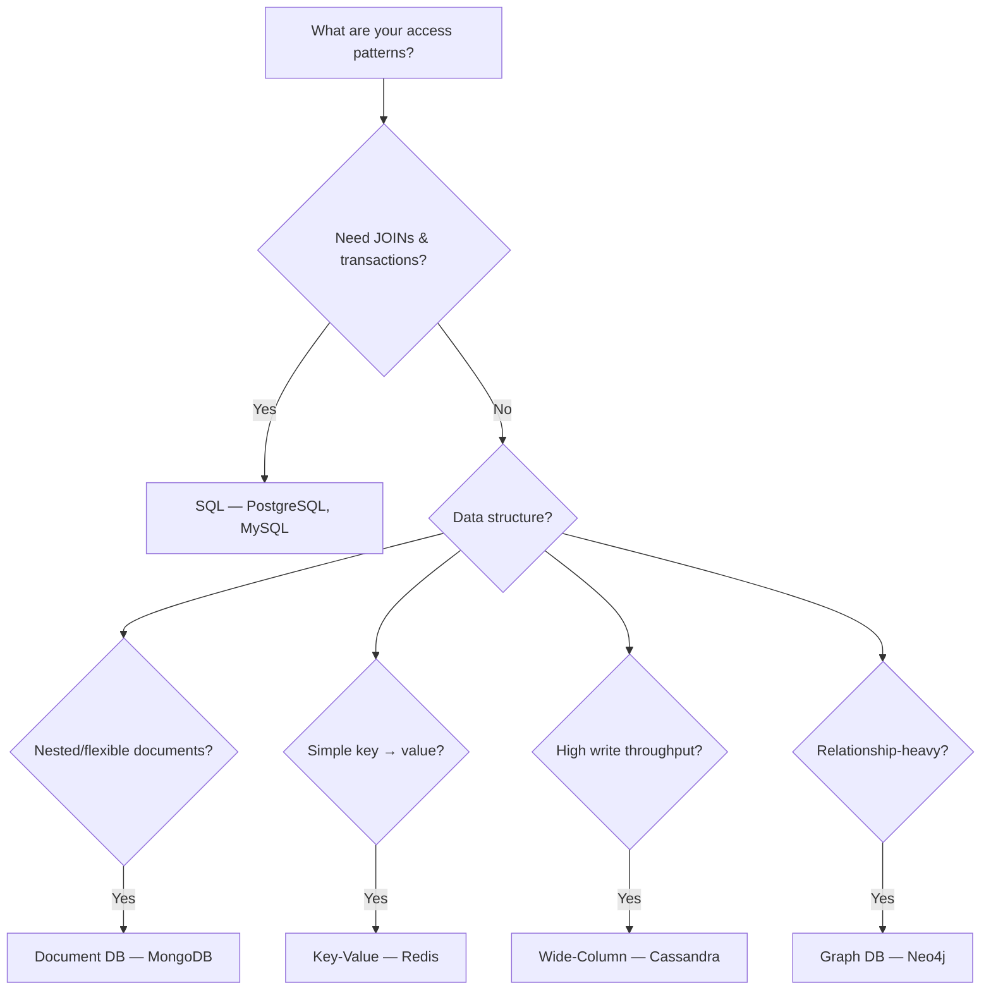

#### The Decision Matrix

| Factor | SQL | NoSQL |
|--------|-----|-------|
| Schema | Fixed, enforced | Flexible, per-document |
| Scaling | Vertical (bigger server) | Horizontal (more servers) |
| Consistency | Strong (ACID) | Tunable (eventual → strong) |
| Query power | Complex JOINs, aggregations | Simple lookups, denormalized reads |
| Best at | Transactional integrity | Throughput & flexibility |

#### Polyglot Persistence

Most real-world systems use multiple databases — each for what it does best:

- **PostgreSQL** → transactional data (orders, users, payments)
- **Redis** → caching, sessions, rate limiting
- **Elasticsearch** → full-text search
- **MongoDB** → flexible documents (product catalogs)

The biggest mistake is choosing a database based on hype rather than your actual access patterns.

**Key takeaway:** Start with PostgreSQL. It handles 90% of use cases. Only add NoSQL when you have a specific problem SQL can't solve efficiently — massive write throughput, truly flexible schemas, or sub-millisecond reads.

### Schema Design & Normalization

Good schema design is the foundation of a performant, maintainable database. Get it wrong and you'll fight data bugs and slow queries for the life of the application.

#### Normalization — Eliminating Redundancy

Normalization organizes data to reduce duplication and prevent update anomalies. Each normal form builds on the previous:

**First Normal Form (1NF)** — Every column contains atomic (indivisible) values. No arrays or comma-separated lists.

```sql
-- ❌ Violates 1NF: tags is not atomic
CREATE TABLE products (id INT, name TEXT, tags TEXT); -- "electronics,sale,new"

-- ✅ Normalized: separate table for tags
CREATE TABLE products (id INT PRIMARY KEY, name TEXT);
CREATE TABLE product_tags (product_id INT REFERENCES products(id), tag TEXT);
```

**Second Normal Form (2NF)** — Every non-key column depends on the *entire* primary key, not just part of it. Matters for composite keys.

```sql
-- ❌ Violates 2NF: student_name depends only on student_id, not the full key
CREATE TABLE enrollments (
  student_id INT, course_id INT, student_name TEXT, grade TEXT,
  PRIMARY KEY (student_id, course_id)
);

-- ✅ Split: student_name goes to its own table
CREATE TABLE students (id INT PRIMARY KEY, name TEXT);
CREATE TABLE enrollments (student_id INT, course_id INT, grade TEXT);
```

**Third Normal Form (3NF)** — No transitive dependencies. Every non-key column depends directly on the primary key.

```sql
-- ❌ Violates 3NF: city depends on zip_code, not directly on user_id
CREATE TABLE users (id INT, name TEXT, zip_code TEXT, city TEXT);

-- ✅ Split: zip-to-city is its own relationship
CREATE TABLE users (id INT, name TEXT, zip_code TEXT);
CREATE TABLE zip_codes (zip_code TEXT PRIMARY KEY, city TEXT);
```

**3NF is the sweet spot for most applications.** Beyond 3NF (BCNF, 4NF, 5NF) is rarely needed in practice.

#### Strategic Denormalization

After normalizing, selectively denormalize for read performance:

```sql
-- Materialized view: pre-computed dashboard data
CREATE MATERIALIZED VIEW user_stats AS
SELECT u.id, u.name,
       COUNT(o.id) AS order_count,
       COALESCE(SUM(o.total), 0) AS total_spent
FROM users u LEFT JOIN orders o ON o.user_id = u.id
GROUP BY u.id, u.name;

-- Refresh periodically
REFRESH MATERIALIZED VIEW CONCURRENTLY user_stats;

-- Counter cache: avoid COUNT(*) on every page load
ALTER TABLE users ADD COLUMN orders_count INT DEFAULT 0;
-- Update via trigger or application code on each new order
```

#### Practical Schema Design Rules

```sql
CREATE TABLE users (
  id UUID PRIMARY KEY DEFAULT gen_random_uuid(),  -- UUIDs for distributed systems
  email TEXT UNIQUE NOT NULL,
  name TEXT NOT NULL,
  balance NUMERIC(12, 2) NOT NULL DEFAULT 0,      -- NEVER use FLOAT for money
  deleted_at TIMESTAMPTZ,                          -- Soft delete
  created_at TIMESTAMPTZ NOT NULL DEFAULT NOW(),   -- Always track timestamps
  updated_at TIMESTAMPTZ NOT NULL DEFAULT NOW()
);

CREATE TABLE orders (
  id UUID PRIMARY KEY DEFAULT gen_random_uuid(),
  user_id UUID NOT NULL REFERENCES users(id),      -- Foreign key constraint
  status TEXT NOT NULL DEFAULT 'pending'
    CHECK (status IN ('pending', 'paid', 'shipped', 'delivered', 'cancelled')),
  total NUMERIC(12, 2) NOT NULL,
  created_at TIMESTAMPTZ NOT NULL DEFAULT NOW(),
  updated_at TIMESTAMPTZ NOT NULL DEFAULT NOW()
);
```

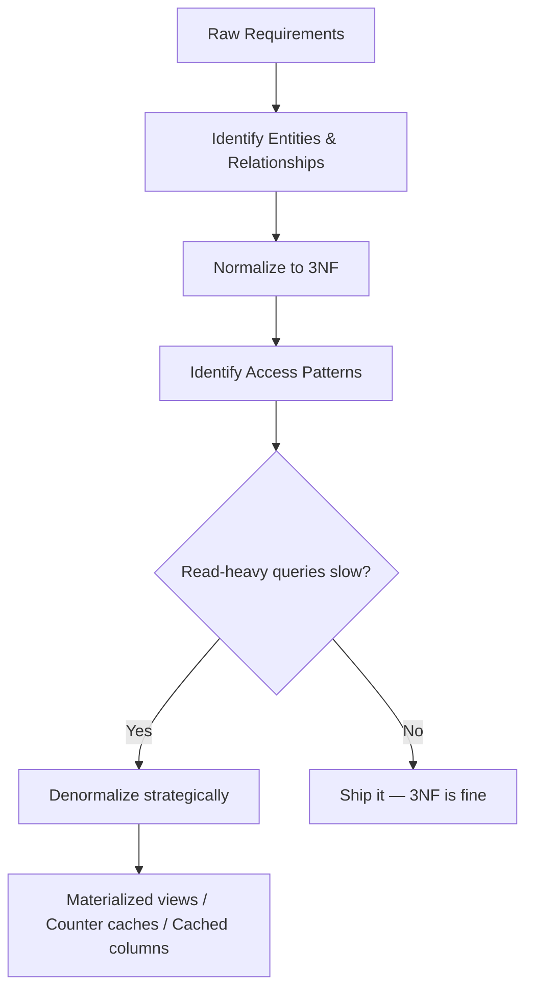

**Key takeaway:** Normalize first to ensure data integrity, then denormalize only where you have measured performance problems. Premature denormalization leads to data inconsistencies.

### Database Migrations & Schema Evolution

Your database schema will change as your application evolves. Migrations are version-controlled scripts that apply those changes in a repeatable, safe way — like git for your database structure.

#### Migration Basics

Each migration has an **up** function (apply the change) and a **down** function (undo it):

```sql
-- Migration: 20240315_add_user_status.sql

-- UP
ALTER TABLE users ADD COLUMN status VARCHAR(20) NOT NULL DEFAULT 'active';
CREATE INDEX idx_users_status ON users(status);

-- DOWN
DROP INDEX idx_users_status;
ALTER TABLE users DROP COLUMN status;
```

Migrations run in order (usually by timestamp). A migrations table tracks which have been applied:

```
| migration                        | applied_at          |
|----------------------------------|---------------------|
| 20240101_create_users.sql        | 2024-01-01 10:00:00 |
| 20240215_add_orders_table.sql    | 2024-02-15 14:30:00 |
| 20240315_add_user_status.sql     | 2024-03-15 09:00:00 |
```

#### The Backwards-Compatibility Rule

In production, your old application code is still running during deployment. The migration must not break it.

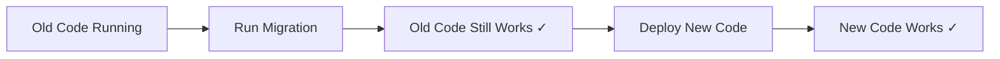

**Safe operations** (backwards-compatible):
- Adding a new column with a default
- Adding a new table
- Adding an index (use `CONCURRENTLY` to avoid locking)
- Adding a new enum value

**Dangerous operations** (break old code):
- Renaming a column — old code still reads the old name
- Changing a column type — old code expects the old type
- Dropping a column — old code still selects it
- Adding NOT NULL without a default — existing inserts fail

#### The Expand-and-Contract Pattern

For breaking changes, use a multi-step approach:

```
Step 1 (Expand): Add new column, keep old column
  → Old code works: reads/writes old column
  → New code works: writes BOTH columns

Step 2: Backfill existing data from old → new column

Step 3: Deploy code that reads from new column

Step 4 (Contract): Drop old column
```

```sql
-- Step 1: Add new column
ALTER TABLE users ADD COLUMN full_name TEXT;

-- Step 2: Backfill (do this in batches for large tables!)
UPDATE users SET full_name = first_name || ' ' || last_name
WHERE full_name IS NULL
LIMIT 10000;  -- batch to avoid locking

-- Step 3: Deploy code reading full_name
-- Step 4: Drop old columns (after verifying no code reads them)
ALTER TABLE users DROP COLUMN first_name;
ALTER TABLE users DROP COLUMN last_name;
```

#### Safe Index Creation

Creating an index on a large table can lock it for minutes. Always use `CONCURRENTLY`:

```sql
-- ❌ Locks the entire table while building
CREATE INDEX idx_orders_status ON orders(status);

-- ✅ Builds in the background, no lock
CREATE INDEX CONCURRENTLY idx_orders_status ON orders(status);
```

#### Large Data Backfills

Never update millions of rows in a single transaction — it locks the table and can crash replication:

```sql
-- ❌ Locks millions of rows
UPDATE users SET status = 'active' WHERE status IS NULL;

-- ✅ Batch updates
DO $$
DECLARE batch_size INT := 10000;
BEGIN
  LOOP
    UPDATE users SET status = 'active'
    WHERE id IN (
      SELECT id FROM users WHERE status IS NULL LIMIT batch_size
    );
    EXIT WHEN NOT FOUND;
    PERFORM pg_sleep(0.1);  -- Brief pause to let replicas catch up
  END LOOP;
END $$;
```

**Key takeaway:** Migrations must be backwards-compatible in production. Use the expand-and-contract pattern for breaking changes, batch large backfills, and always create indexes concurrently.

### Database Replication

Replication copies data from one database server to others. It serves three purposes: **read scaling** (spread read queries across replicas), **fault tolerance** (if the primary fails, promote a replica), and **geographic distribution** (replicas close to users reduce latency).

#### Primary-Replica Architecture

The most common setup: one **primary** (handles all writes) and one or more **replicas** (serve read queries).

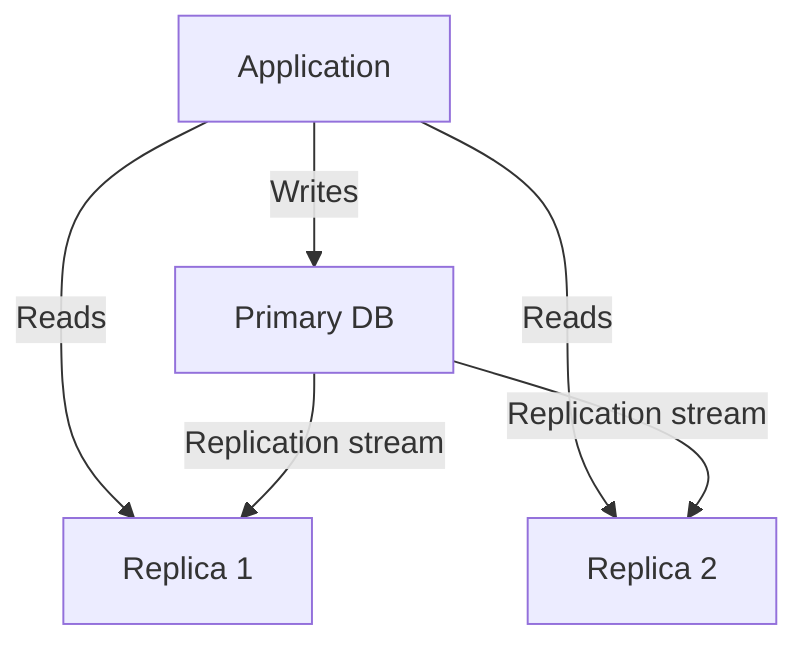

```sql
-- Application-level routing
-- Writes always go to primary
INSERT INTO orders (user_id, total) VALUES (42, 99.99);  -- → Primary

-- Reads can go to replicas
SELECT * FROM orders WHERE user_id = 42;  -- → Replica
```

#### Synchronous vs Asynchronous Replication

| | Synchronous | Asynchronous |
|-|------------|-------------|
| **How it works** | Primary waits for replica to confirm write | Primary writes and moves on immediately |
| **Consistency** | Replica always has latest data | Replica may be seconds behind |
| **Latency** | Higher (wait for network round trip) | Lower (no waiting) |
| **Data safety** | No data loss on primary failure | May lose recent writes on failover |
| **Use when** | Financial data, critical state | Most read-scaling scenarios |

PostgreSQL supports **synchronous_commit** per-transaction, so you can mix:

```sql
-- Critical: wait for replica
SET synchronous_commit = 'on';
UPDATE accounts SET balance = balance - 100 WHERE id = 1;

-- Non-critical: don't wait
SET synchronous_commit = 'off';
INSERT INTO activity_log (user_id, action) VALUES (42, 'page_view');
```

#### Replication Lag

The delay between a write on the primary and its appearance on replicas. This causes stale reads:

```
User writes: UPDATE profile SET name = 'Alice 2.0' WHERE id = 42;
  → Primary: name = 'Alice 2.0' ✓
  → Replica (50ms later): name = 'Alice'  ← STALE!
User reads (from replica): SELECT name WHERE id = 42;
  → Returns 'Alice' — the old value!
```

**Solutions:**
- **Read-your-writes**: After a write, read from the primary (not replica) for that user's session
- **Sticky sessions**: Route a user to the same replica throughout their session
- **Replication position tracking**: The app records the WAL position of its last write, and only reads from replicas that have caught up past that position

#### Failover and Split-Brain

When the primary fails, a replica must be promoted. The challenge is the **split-brain** problem — if the old primary comes back online, you now have two nodes accepting writes.

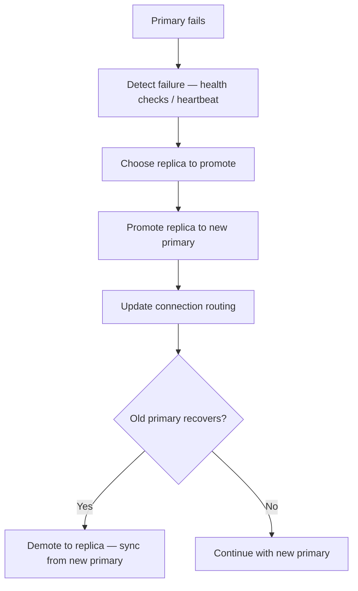

Solutions: Use a consensus protocol (Raft, Paxos) or a tool like Patroni (PostgreSQL) / Orchestrator (MySQL) to automate failover with fencing (ensuring the old primary can't accept writes).

**Key takeaway:** Replication is essential for production databases. Use asynchronous replication for most cases, handle replication lag at the application level, and automate failover with proper fencing to prevent split-brain.

### Database Sharding

Sharding splits your data horizontally across multiple database instances. Each shard holds a subset of the data. This is the nuclear option for scaling — powerful but complex.

#### When Do You Need Sharding?

Exhaust these options first:
1. **Vertical scaling** — bigger server (more CPU, RAM, faster disks)
2. **Read replicas** — spread read load across replicas
3. **Caching** — Redis for frequently accessed data
4. **Table partitioning** — split a single table into partitions within one server
5. **If none of these are enough** → sharding

#### Sharding Strategies

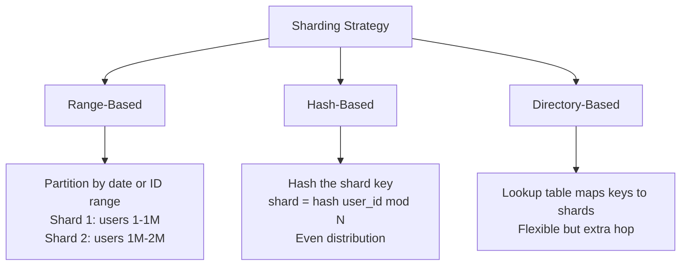

**Range-based sharding:**
```
Shard 1: orders from Jan-Mar
Shard 2: orders from Apr-Jun
Shard 3: orders from Jul-Sep
```
Pros: Simple, range queries stay on one shard. Cons: Hotspots — the current month's shard gets all the writes.

**Hash-based sharding:**
```
shard_id = hash(user_id) % num_shards
```
Pros: Even distribution of data and load. Cons: Range queries must hit all shards. Adding a shard requires rehashing (use consistent hashing to minimize this).

**Directory-based sharding:**
```
Lookup table: { user_42 → shard_3, user_99 → shard_1, ... }
```
Pros: Maximum flexibility — can move specific users between shards. Cons: The lookup table is a single point of failure and adds latency.

#### Choosing a Shard Key

The shard key determines which shard each row lives on. A bad choice causes hotspots and pain.

| Criteria | Good Key | Bad Key |
|----------|----------|---------|
| High cardinality | `user_id` (millions of values) | `country` (few values) |
| Even distribution | `hash(user_id)` | `created_at` (recent dates get all traffic) |
| Immutable | `user_id` | `email` (can change → need to move data) |
| Matches queries | Shard by what you query by | Shard by something unrelated to queries |

#### The Cross-Shard Problem

The biggest challenge with sharding — queries that span multiple shards:

```sql
-- If sharded by user_id, this query hits EVERY shard
SELECT COUNT(*) FROM orders WHERE status = 'pending';

-- This query hits ONE shard (efficient)
SELECT * FROM orders WHERE user_id = 42;
```

Cross-shard JOINs are extremely expensive. Solutions:
- **Denormalize** data so each shard has what it needs
- **Application-level aggregation** — query all shards, combine results in code
- **Global tables** — small reference tables (countries, currencies) replicated to all shards

#### Consistent Hashing

When you add or remove a shard, consistent hashing minimizes data movement:

```
Without consistent hashing:
  Add 1 shard (3 → 4): ~75% of data moves

With consistent hashing:
  Add 1 shard (3 → 4): ~25% of data moves
```

Each shard owns a range on a hash ring. Adding a shard only affects its neighbors, not the entire cluster.

**Key takeaway:** Sharding is a last resort. It adds massive operational complexity (cross-shard queries, rebalancing, distributed transactions). Exhaust vertical scaling, replicas, caching, and partitioning first.

### CAP Theorem & Consistency Models

The CAP theorem is the fundamental constraint of distributed systems. Understanding it helps you make informed tradeoffs when choosing and configuring databases.

#### The CAP Theorem

A distributed system can provide at most **two out of three** guarantees:

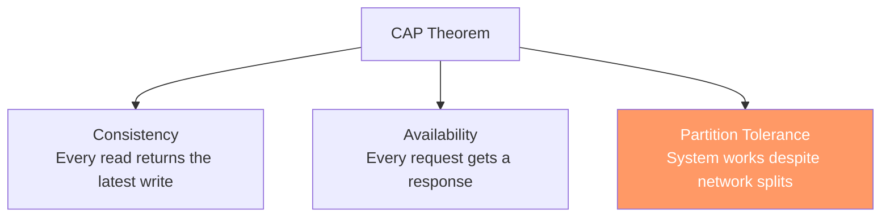

**Network partitions are inevitable** in distributed systems. A cable gets cut, a switch fails, a cloud region goes down. So you can't sacrifice Partition Tolerance — the real choice is between:

- **CP (Consistency + Partition Tolerance)** — During a network partition, the system rejects requests rather than return stale data. Example: PostgreSQL with synchronous replication, MongoDB, HBase.

- **AP (Availability + Partition Tolerance)** — During a partition, the system continues serving requests but may return stale data. Example: Cassandra, DynamoDB, CouchDB.

#### What Happens During a Partition

```
Normal operation:
  Client → Node A (writes) → replicates to → Node B (reads) ✓

Network partition (A can't talk to B):
  CP system: Node B stops accepting reads → returns error ← Consistent but unavailable
  AP system: Node B serves stale data → returns outdated response ← Available but inconsistent
```

#### Consistency Models — The Spectrum

It's not just "strong" or "eventual" — there are useful models in between:

| Model | Guarantee | Example |
|-------|-----------|---------|
| **Strong consistency** | Every read sees the latest write | Single PostgreSQL server |
| **Linearizability** | Operations appear to happen in a single global order | Google Spanner |
| **Causal consistency** | If A caused B, everyone sees A before B | MongoDB sessions |
| **Read-your-writes** | You always see your own updates (others might not yet) | Social media feeds |
| **Session consistency** | Consistent within a user session | Shopping carts |
| **Eventual consistency** | All replicas converge eventually, but may temporarily disagree | DNS, Cassandra |

#### Conflict Resolution in AP Systems

When two nodes accept conflicting writes during a partition, how do you resolve it?

**Last-Write-Wins (LWW):**
```
Node A: SET user.name = "Alice" at t=100
Node B: SET user.name = "Bob"   at t=101
→ After partition heals: name = "Bob" (latest timestamp wins)
→ Problem: Alice's write is silently lost
```

**Vector Clocks:** Track causal ordering. If writes are concurrent (neither caused the other), flag a conflict for the application to resolve.

**CRDTs (Conflict-free Replicated Data Types):** Data structures designed to merge automatically without conflicts:
- **G-Counter**: A counter that only goes up — each node tracks its own count, merge by taking the max per node
- **OR-Set**: A set where adds and removes can happen concurrently without conflicts

```
CRDT Counter example:
  Node A: {A: 5, B: 3} → total = 8
  Node B: {A: 4, B: 4} → total = 8
  Merge:  {A: 5, B: 4} → total = 9  ← correct!
```

#### PACELC — Beyond CAP

CAP only describes behavior during partitions. **PACELC** extends it: "If there is a Partition, choose Availability or Consistency. **Else**, choose **Latency** or **Consistency**."

Even without partitions, you trade latency for consistency. Synchronous replication is more consistent but slower. Most systems operate in the "Else" case most of the time.

| Database | During Partition (PAC) | Normal Operation (ELC) |
|----------|----------------------|----------------------|
| PostgreSQL (sync) | PC — reject requests | EC — wait for replicas |
| Cassandra | PA — serve stale data | EL — fast, eventual |
| MongoDB | PC — reject requests | EL — fast with sessions |

**Key takeaway:** CAP is about tradeoffs during failure, not a menu where you pick two. Understand where your system sits on the spectrum and configure consistency per-operation when possible.

### Query Safety & SQL Injection Prevention

SQL injection is one of the oldest and most dangerous web vulnerabilities. It's been in the OWASP Top 10 since the list was created. An attacker modifies your SQL query through user input to read, modify, or delete data they shouldn't have access to.

#### How SQL Injection Works

```sql
-- Vulnerable code (string concatenation)
query = "SELECT * FROM users WHERE email = '" + userInput + "'";

-- Normal input: alice@example.com
-- → SELECT * FROM users WHERE email = 'alice@example.com'  ← works fine

-- Malicious input: ' OR '1'='1
-- → SELECT * FROM users WHERE email = '' OR '1'='1'  ← returns ALL users!

-- Destructive input: '; DROP TABLE users; --
-- → SELECT * FROM users WHERE email = ''; DROP TABLE users; --'  ← deletes the table!
```

#### The Fix: Parameterized Queries

Parameterized queries (prepared statements) separate SQL structure from data. The database compiles the query first, then binds values — user input can never be interpreted as SQL.

```sql
-- ✅ Parameterized query (PostgreSQL)
PREPARE user_lookup (text) AS
  SELECT * FROM users WHERE email = $1;
EXECUTE user_lookup('alice@example.com');
```

In application code:

```javascript
// ❌ VULNERABLE — string concatenation
const query = `SELECT * FROM users WHERE email = '${email}'`;

// ✅ SAFE — parameterized query
const result = await db.query(
  'SELECT * FROM users WHERE email = $1',
  [email]
);

// ✅ SAFE — ORM (Prisma, Sequelize, etc.)
const user = await prisma.user.findUnique({ where: { email } });
```

#### Tricky Injection Vectors

Some SQL constructs can't use parameterized values:

**ORDER BY** — Column names can't be parameterized. Use an allowlist:
```javascript
// ❌ Vulnerable
const query = `SELECT * FROM users ORDER BY ${sortColumn}`;

// ✅ Safe — allowlist
const ALLOWED_COLUMNS = ['name', 'email', 'created_at'];
if (!ALLOWED_COLUMNS.includes(sortColumn)) {
  throw new Error('Invalid sort column');
}
const query = `SELECT * FROM users ORDER BY ${sortColumn}`;
```

**LIKE clauses** — User input can contain wildcards:
```javascript
// User input: "%admin%"
// → WHERE name LIKE '%admin%'  ← may be intentional, but can be slow

// ✅ Escape wildcards in user input
const escaped = userInput.replace(/%/g, '\\%').replace(/_/g, '\\_');
const result = await db.query(
  "SELECT * FROM users WHERE name LIKE $1",
  [`%${escaped}%`]
);
```

**Dynamic IN clauses:**
```javascript
// ✅ Generate the right number of placeholders
const ids = [1, 2, 3];
const placeholders = ids.map((_, i) => `$${i + 1}`).join(', ');
const result = await db.query(
  `SELECT * FROM users WHERE id IN (${placeholders})`,
  ids
);
```

#### Defense in Depth

Parameterized queries are the primary defense. Layer additional protections:

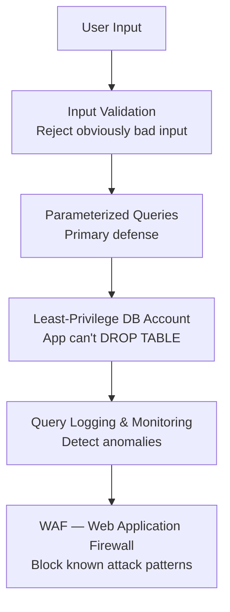

- **Least-privilege accounts**: Your application's database user should only have SELECT, INSERT, UPDATE, DELETE on specific tables — never DROP, ALTER, or GRANT
- **Input validation**: Reject inputs that don't match expected formats (e.g., email must contain @)
- **Query logging**: Monitor for unusual query patterns (many failed logins, queries returning large result sets)

**Key takeaway:** Always use parameterized queries. Never concatenate user input into SQL strings. Use allowlists for column names in ORDER BY and table names. Layer defenses — no single measure is enough.

### Query Performance & Optimization Patterns

Slow queries are the most common backend performance problem. The good news: there's a systematic process for finding and fixing them.

#### The Diagnostic Process

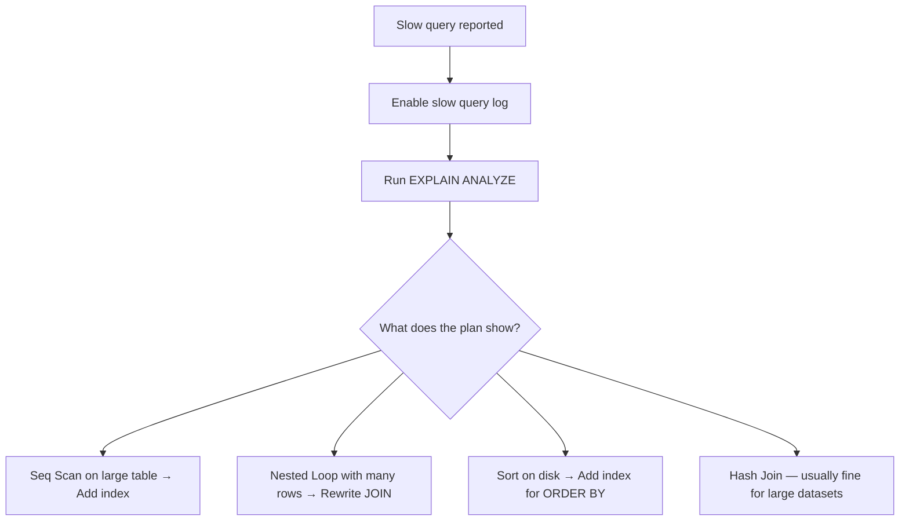

#### Reading EXPLAIN ANALYZE

```sql
EXPLAIN ANALYZE SELECT * FROM orders WHERE user_id = 42 AND status = 'pending';

-- Bad plan (no index):
-- Seq Scan on orders  (cost=0.00..25000.00 rows=50 width=120)
--   (actual time=0.02..89.50 rows=47 loops=1)
--   Filter: ((user_id = 42) AND (status = 'pending'))
--   Rows Removed by Filter: 999953
-- Planning Time: 0.1ms   Execution Time: 89.6ms  ← SLOW

-- Good plan (with index):
-- Index Scan using idx_orders_user_status on orders  (cost=0.42..8.44 rows=50 width=120)
--   (actual time=0.02..0.15 rows=47 loops=1)
-- Planning Time: 0.1ms   Execution Time: 0.2ms  ← 450x FASTER
```

Key things to look for: **Seq Scan** on large tables, **Rows Removed by Filter** (high numbers mean the query is reading lots of unnecessary rows), **Sort Method: external merge** (sorting on disk because it doesn't fit in memory).

#### The N+1 Query Problem

The most common performance bug in web applications:

```javascript
// ❌ N+1 queries: 1 query for users + N queries for orders
const users = await db.query('SELECT * FROM users LIMIT 100');  // 1 query
for (const user of users) {
  user.orders = await db.query(                                   // 100 queries!
    'SELECT * FROM orders WHERE user_id = $1', [user.id]
  );
}
// Total: 101 queries 😱

// ✅ Fixed with a JOIN: 1 query
const result = await db.query(`
  SELECT u.*, json_agg(o.*) AS orders
  FROM users u
  LEFT JOIN orders o ON o.user_id = u.id
  GROUP BY u.id
  LIMIT 100
`);
// Total: 1 query ✓
```

#### Pagination: OFFSET vs Keyset

```sql
-- ❌ OFFSET pagination — gets slower as pages increase
SELECT * FROM orders ORDER BY created_at DESC LIMIT 20 OFFSET 10000;
-- Database must scan and discard 10,000 rows before returning 20

-- ✅ Keyset (cursor) pagination — constant performance
SELECT * FROM orders
WHERE created_at < '2024-03-15T10:30:00Z'  -- cursor from last page
ORDER BY created_at DESC
LIMIT 20;
-- Jumps directly to the right position via index
```

#### Common Anti-Patterns and Fixes

**Functions on indexed columns:**
```sql
-- ❌ Index on created_at is useless here
SELECT * FROM orders WHERE YEAR(created_at) = 2024;

-- ✅ Rewrite to use the index
SELECT * FROM orders WHERE created_at >= '2024-01-01' AND created_at < '2025-01-01';
```

**SELECT * when you only need a few columns:**
```sql
-- ❌ Fetches all columns, can't use covering index
SELECT * FROM users WHERE status = 'active';

-- ✅ Fetch only what you need
SELECT id, name, email FROM users WHERE status = 'active';
```

**COUNT(*) on large tables:**
```sql
-- ❌ Scans entire table every time
SELECT COUNT(*) FROM orders WHERE user_id = 42;

-- ✅ Use a counter cache (maintained by triggers or application)
SELECT orders_count FROM users WHERE id = 42;
```

#### Advanced Optimization: Materialized Views & Partitioning

```sql
-- Materialized view for expensive dashboards
CREATE MATERIALIZED VIEW daily_revenue AS
SELECT DATE(created_at) AS day, SUM(total) AS revenue, COUNT(*) AS orders
FROM orders WHERE status = 'paid'
GROUP BY DATE(created_at);

-- Refresh daily via cron
REFRESH MATERIALIZED VIEW CONCURRENTLY daily_revenue;

-- Table partitioning for very large tables (100M+ rows)
CREATE TABLE events (
  id UUID, type TEXT, payload JSONB, created_at TIMESTAMPTZ
) PARTITION BY RANGE (created_at);

CREATE TABLE events_2024_q1 PARTITION OF events
  FOR VALUES FROM ('2024-01-01') TO ('2024-04-01');
CREATE TABLE events_2024_q2 PARTITION OF events
  FOR VALUES FROM ('2024-04-01') TO ('2024-07-01');
```

**Key takeaway:** Always measure with EXPLAIN ANALYZE before and after optimization. The most common fixes are: add an index, fix N+1 queries with JOINs, switch from OFFSET to keyset pagination, and avoid functions on indexed columns.

### SQL & NoSQL in Practice

Real-world applications rarely use a single database. **Polyglot persistence** means choosing the right database for each job, then keeping them in sync.

#### A Typical Production Stack

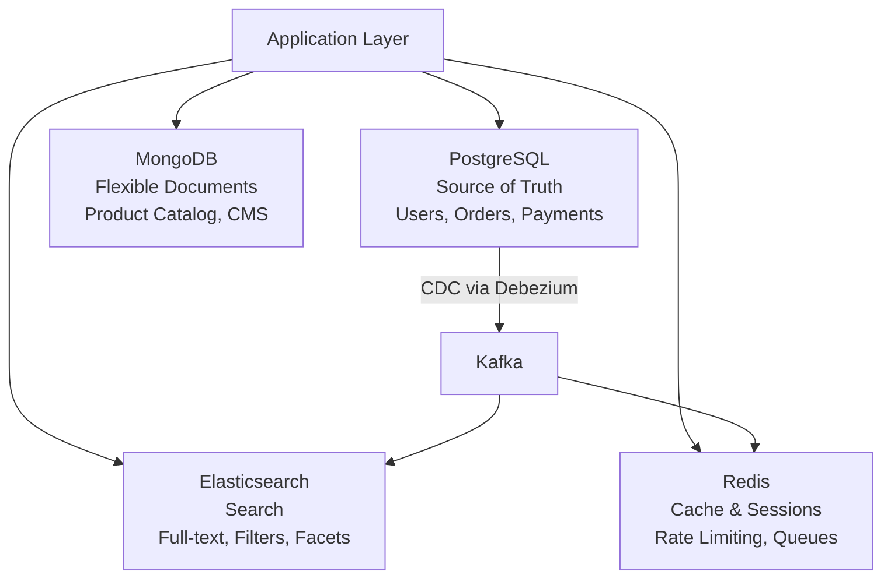

#### PostgreSQL — The Source of Truth

PostgreSQL handles transactional data where correctness is non-negotiable:

```sql
-- E-commerce order with ACID guarantees
BEGIN;
  INSERT INTO orders (user_id, total, status) VALUES (42, 99.99, 'pending');
  UPDATE inventory SET quantity = quantity - 1 WHERE product_id = 101;
  INSERT INTO payments (order_id, amount, method) VALUES (currval('orders_id_seq'), 99.99, 'card');
COMMIT;
-- All three succeed or all roll back — no partial orders
```

#### Redis — Sub-Millisecond Reads

Redis keeps frequently accessed data in memory:

```
# Caching
SET user:42:profile '{"name":"Alice","plan":"pro"}' EX 3600  # TTL: 1 hour
GET user:42:profile  # < 1ms

# Rate limiting (sliding window)
INCR rate:user:42:minute
EXPIRE rate:user:42:minute 60
# If count > 100 → reject request

# Leaderboard
ZADD leaderboard 1500 "alice"
ZADD leaderboard 2300 "bob"
ZREVRANGE leaderboard 0 9  # Top 10 players

# Session storage
SET session:abc123 '{"userId":42,"role":"admin"}' EX 86400
```

#### MongoDB — Flexible Documents

When every record has a different shape, a flexible schema avoids sparse SQL tables:

```json
// Electronics product
{
  "_id": "prod-101",
  "name": "Gaming Laptop",
  "category": "electronics",
  "specs": { "cpu": "i9", "ram": "32GB", "gpu": "RTX 4090", "screen": "16 inch" }
}

// Clothing product — completely different fields
{
  "_id": "prod-202",
  "name": "Winter Jacket",
  "category": "clothing",
  "specs": { "size": ["S", "M", "L", "XL"], "material": "Gore-Tex", "waterproof": true }
}
```

In SQL, you'd need either one massive table with many NULL columns, or complex EAV (Entity-Attribute-Value) patterns.

#### Elasticsearch — Full-Text Search

For search with typo tolerance, relevance ranking, and faceted filtering:

```json
// Search query with fuzzy matching
{
  "query": {
    "bool": {
      "must": { "multi_match": { "query": "wirelss mouse", "fuzziness": "AUTO" } },
      "filter": [
        { "term": { "category": "electronics" } },
        { "range": { "price": { "lte": 50 } } }
      ]
    }
  },
  "aggs": {
    "brands": { "terms": { "field": "brand.keyword" } }
  }
}
```

#### The Data Synchronization Challenge

The hardest part of polyglot persistence is keeping multiple databases in sync. Two approaches:

**Change Data Capture (CDC):** Read the database's transaction log and stream changes to other systems:
```
PostgreSQL WAL → Debezium → Kafka → Elasticsearch/Redis
```
Pros: No application code changes, captures all changes including direct SQL updates. Cons: Infrastructure complexity.

**Application-Level Events:** The application publishes events when it modifies data:
```javascript
await db.query('INSERT INTO orders ...', [orderData]);
await kafka.send('order.created', { orderId, userId, items });
// Other services consume the event and update their stores
```
Pros: Explicit, easy to understand. Cons: Easy to forget, doesn't capture direct DB changes.

**Key takeaway:** PostgreSQL is the source of truth. Other databases are optimized read models. Use CDC (Debezium + Kafka) for reliable synchronization. Accept that secondary stores may be seconds behind — design your UX accordingly.

### Specialized Databases: Vector, Time-Series & Search

Beyond SQL and traditional NoSQL, specialized databases solve specific problems orders of magnitude better than general-purpose databases.

#### Vector Databases — AI Similarity Search

Vector databases store **embeddings** — numerical representations of text, images, or other data. They enable **semantic search**: finding things by meaning rather than exact keywords.

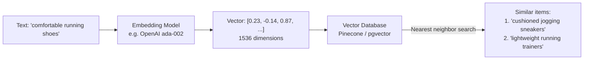

**How it works:**
1. Convert text/images into vectors using an embedding model
2. Store vectors in a vector database
3. At query time, convert the search query to a vector
4. Find the nearest vectors using distance metrics (cosine similarity, Euclidean distance)

```sql
-- pgvector: PostgreSQL extension for vector search
CREATE EXTENSION vector;

CREATE TABLE documents (
  id SERIAL PRIMARY KEY,
  content TEXT,
  embedding VECTOR(1536)  -- 1536 dimensions for OpenAI embeddings
);

-- Create an index for fast similarity search
CREATE INDEX ON documents USING ivfflat (embedding vector_cosine_ops) WITH (lists = 100);

-- Find the 5 most similar documents
SELECT content, 1 - (embedding <=> '[0.23, -0.14, ...]') AS similarity
FROM documents
ORDER BY embedding <=> '[0.23, -0.14, ...]'
LIMIT 5;
```

**Use cases:** RAG (Retrieval-Augmented Generation) for AI chatbots, semantic search, recommendation engines, image similarity, duplicate detection.

**Options:** **pgvector** (PostgreSQL extension — start here), **Pinecone** (managed, scales to billions), **Weaviate** (open source, hybrid search), **Chroma** (lightweight, great for prototyping).

#### Time-Series Databases — Metrics at Scale

Optimized for timestamped data with high ingestion rates and time-based queries.

```sql
-- TimescaleDB (PostgreSQL extension)
CREATE TABLE metrics (
  time TIMESTAMPTZ NOT NULL,
  device_id TEXT NOT NULL,
  temperature DOUBLE PRECISION,
  humidity DOUBLE PRECISION
);

-- Convert to hypertable for time-series optimizations
SELECT create_hypertable('metrics', 'time');

-- Insert millions of rows per second
INSERT INTO metrics VALUES (NOW(), 'sensor-42', 23.5, 65.2);

-- Time-bucketed aggregation (built-in function)
SELECT time_bucket('1 hour', time) AS hour,
       device_id,
       AVG(temperature) AS avg_temp,
       MAX(temperature) AS max_temp
FROM metrics
WHERE time > NOW() - INTERVAL '7 days'
GROUP BY hour, device_id
ORDER BY hour DESC;
```

**Key features:** Automatic partitioning by time, built-in downsampling (keep minute data for 7 days, hourly for 90 days, daily forever), high ingest rate (millions of rows/sec), compression (10-20x storage savings).

**Options:** **TimescaleDB** (PostgreSQL extension — start here), **InfluxDB** (purpose-built, flux query language), **Prometheus** (metrics & alerting for infrastructure).

#### Columnar Databases — Analytics on Billions of Rows

Traditional databases store data row by row. Columnar databases store data column by column, which is 10-100x faster for analytical queries that scan specific columns across billions of rows.

```
Row storage (PostgreSQL):
  Row 1: [id=1, name="Alice", age=30, city="NYC"]
  Row 2: [id=2, name="Bob", age=25, city="LA"]

Column storage (ClickHouse):
  id:   [1, 2, 3, ...]
  name: ["Alice", "Bob", ...]
  age:  [30, 25, ...]
  city: ["NYC", "LA", ...]
  → Query "AVG(age)" only reads the age column — skips everything else
```

```sql
-- ClickHouse: analyze billions of events
SELECT
  toStartOfHour(timestamp) AS hour,
  countIf(status = 200) AS success,
  countIf(status >= 500) AS errors,
  avg(response_time_ms) AS avg_latency
FROM request_logs
WHERE timestamp > now() - INTERVAL 24 HOUR
GROUP BY hour
ORDER BY hour;
-- Scans 1 billion rows in < 1 second
```

**Options:** **ClickHouse** (open source, fastest), **BigQuery** (Google, serverless), **Redshift** (AWS), **DuckDB** (embedded, great for local analytics).

#### Search Engines — Full-Text with Relevance

Search engines use **inverted indexes** — a mapping from every word to the documents containing it. This enables typo-tolerant, ranked search.

```
Inverted index:
  "database" → [doc1, doc3, doc7]
  "postgres" → [doc1, doc5]
  "mongodb"  → [doc2, doc3]

Search "postgres database" → doc1 (appears in both) ranked highest
```

**Options:** **Elasticsearch** (most mature, distributed), **Meilisearch** (simple, fast, great for product search), **Typesense** (easy to set up, typo-tolerant).

#### When to Use What

| Problem | Use | Why Not General SQL? |
|---------|-----|---------------------|
| AI semantic search | pgvector / Pinecone | SQL can't do nearest-neighbor on vectors efficiently |
| Metrics/IoT ingestion | TimescaleDB / InfluxDB | SQL INSERT throughput and time-based queries are too slow |
| Analytics on billions of rows | ClickHouse / BigQuery | Row-based storage scans too much data |
| Full-text search with typos | Elasticsearch / Meilisearch | SQL LIKE is slow and has no relevance ranking |

**Key takeaway:** Start with PostgreSQL extensions (pgvector, TimescaleDB) before adding dedicated infrastructure. Only introduce a new database when PostgreSQL genuinely can't handle the workload.

### Database Caching Strategies

Caching is the single most impactful performance optimization for read-heavy applications. A Redis cache serves reads in **< 1ms** compared to **5-50ms** for an indexed database query.

#### Caching Patterns

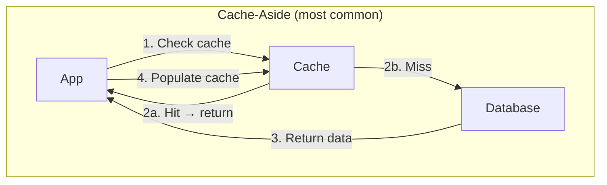

**Cache-Aside** (Lazy Loading) — The application manages the cache:

```javascript
async function getUser(userId) {
  // 1. Check cache
  const cached = await redis.get(`user:${userId}`);
  if (cached) return JSON.parse(cached);  // Cache hit

  // 2. Cache miss — query database
  const user = await db.query('SELECT * FROM users WHERE id = $1', [userId]);

  // 3. Populate cache with TTL
  await redis.set(`user:${userId}`, JSON.stringify(user), 'EX', 3600);

  return user;
}
```

**Write-Through** — Every write goes to both cache and database:

```javascript
async function updateUser(userId, data) {
  // Write to database
  await db.query('UPDATE users SET name = $1 WHERE id = $2', [data.name, userId]);

  // Immediately update cache
  await redis.set(`user:${userId}`, JSON.stringify(data), 'EX', 3600);
}
```

**Write-Behind (Write-Back)** — Write to cache immediately, flush to database asynchronously:

```javascript
// Great for counters and analytics — buffer writes
async function incrementPageView(pageId) {
  await redis.incr(`views:${pageId}`);
  // A background job flushes to DB every minute
}

// Background flush job
async function flushViewCounts() {
  const keys = await redis.keys('views:*');
  for (const key of keys) {
    const pageId = key.split(':')[1];
    const count = await redis.getdel(key);
    await db.query('UPDATE pages SET views = views + $1 WHERE id = $2', [count, pageId]);
  }
}
```

#### Cache Invalidation — The Hard Problem

> "There are only two hard things in Computer Science: cache invalidation and naming things." — Phil Karlton

**TTL (Time-To-Live):** The simplest strategy — cache expires after a set time:
```javascript
await redis.set('user:42', data, 'EX', 3600);  // Expires in 1 hour
// Pro: Simple. Con: Data can be stale for up to 1 hour.
```

**Event-driven invalidation:** Delete the cache when the source data changes:
```javascript
async function updateUser(userId, data) {
  await db.query('UPDATE users SET ...', [...]);
  await redis.del(`user:${userId}`);  // Invalidate cache
  // Next read will miss cache and fetch fresh data
}
```

**Versioned cache keys:** Change the key when data changes:
```javascript
const version = await redis.incr(`user:${userId}:version`);
await redis.set(`user:${userId}:v${version}`, data, 'EX', 3600);
```

#### Cache Stampede

When a popular cache key expires, hundreds of requests simultaneously hit the database:

```
Cache key "homepage:trending" expires
  → 500 concurrent requests all miss the cache
  → 500 identical database queries execute simultaneously
  → Database CPU spikes to 100%
```

**Solutions:**

```javascript
// Mutex lock — only one request queries the DB
async function getTrending() {
  const cached = await redis.get('trending');
  if (cached) return JSON.parse(cached);

  // Try to acquire lock
  const lock = await redis.set('trending:lock', '1', 'NX', 'EX', 5);
  if (lock) {
    const data = await db.query('SELECT ... expensive query ...');
    await redis.set('trending', JSON.stringify(data), 'EX', 300);
    await redis.del('trending:lock');
    return data;
  }

  // Another request is rebuilding — wait briefly and retry
  await sleep(100);
  return getTrending();
}
```

**Stale-while-revalidate:** Return stale data immediately, refresh in the background:
```javascript
async function getTrending() {
  const cached = await redis.get('trending');
  const ttl = await redis.ttl('trending');

  if (cached && ttl > 60) return JSON.parse(cached);  // Fresh enough

  if (cached) {
    // Stale but usable — return it and refresh in background
    refreshInBackground('trending');
    return JSON.parse(cached);
  }

  // No cache at all — must wait for DB
  return await refreshAndCache('trending');
}
```

#### Cache Penetration

Requests for keys that don't exist bypass the cache and always hit the database:

```
GET /user/999999999  → Cache miss → DB returns nothing → no cache set → repeat
```

**Fix:** Cache the "not found" result with a short TTL:
```javascript
const user = await db.query('SELECT * FROM users WHERE id = $1', [userId]);
if (!user) {
  await redis.set(`user:${userId}`, 'NOT_FOUND', 'EX', 60);  // Cache negative result
  return null;
}
```

Or use a **Bloom filter** — a probabilistic data structure that can definitively say "this key does NOT exist" (with a small false-positive rate).

#### What to Cache — and What Not To

| Cache | Don't Cache |
|-------|------------|
| User profiles, sessions | Data that changes every request |
| Product listings, search results | Transactional data (account balances) |
| API responses, rendered HTML | Sensitive data without encryption |
| Configuration, feature flags | Data that must be real-time consistent |

**Key takeaway:** Your application must work correctly without the cache — it's a performance layer, not a data store. Use cache-aside for most cases, TTL as a safety net, and event-driven invalidation for consistency. Watch out for stampedes on popular keys.

## ELI5

Imagine a library. The **database** is all the books on the shelves. The **schema** is how you organize them — fiction on floor 1, non-fiction on floor 2, sorted by author.

An **index** is like the card catalog. Without it, to find a book you'd walk through every shelf. With the catalog, you look up the author's name and go straight to the right shelf.

A **transaction** is like checking out multiple books at once. Either you get all of them, or none — you don't want to end up with Volume 2 but not Volume 1.

**SQL vs NoSQL** is like a library (organized shelves, strict rules, easy to find things) vs a storage locker (throw stuff in however you want, super flexible, but harder to search).

## Poem

Tables hold the truth in rows,
Indexes speed where query goes.
ACID keeps your data right,
Transactions guard through read and write.

Normalize first, then think of speed,
Denormalize for what you need.
Migrations flow like rivers wide —
Backwards-compatible is your guide.

## Template

```sql
-- Indexing: Create indexes on frequently queried columns
CREATE INDEX idx_users_email ON users(email);
CREATE INDEX idx_orders_user_date ON orders(user_id, created_at);

-- Transaction: Wrap related operations
BEGIN;
  UPDATE accounts SET balance = balance - 100 WHERE id = 1;
  UPDATE accounts SET balance = balance + 100 WHERE id = 2;
COMMIT;

-- Migration pattern: Add column with default, then backfill
ALTER TABLE users ADD COLUMN status VARCHAR(20) DEFAULT 'active';
```
