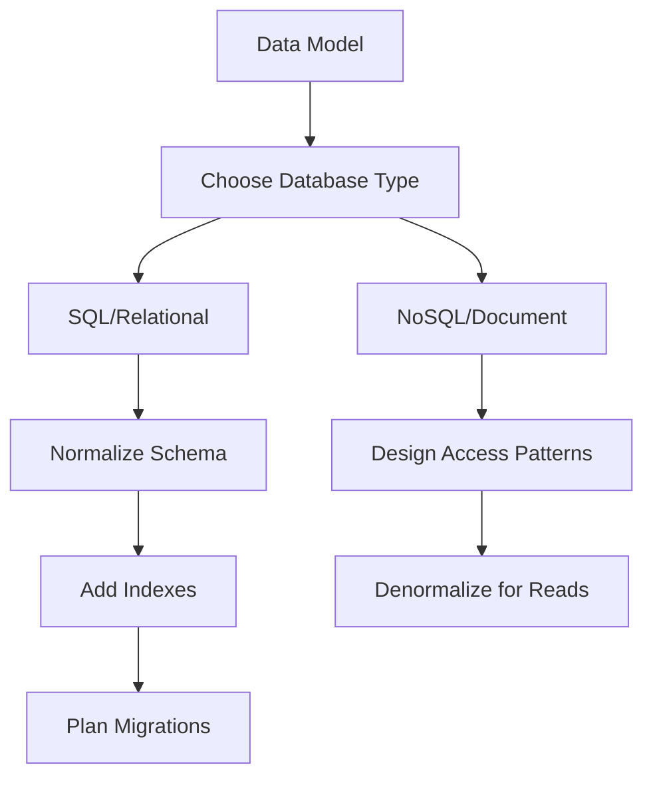

## Database Fundamentals

Databases are where your application's state lives. Getting the data layer right — schema design, indexing, transactions, and migration strategy — is the foundation of a reliable backend.

### Core Concepts

**SQL & Relational Databases:** Relational databases (PostgreSQL, MySQL) organize data into tables with relationships. SQL provides powerful query capabilities — JOINs combine related tables, GROUP BY aggregates data, and subqueries compose complex queries. Understanding how the query planner works helps you write efficient queries.

**Indexing:** An index is a data structure (usually a B-tree) that speeds up lookups. Without an index, the database scans every row (O(n)). With one, it can find rows in O(log n). But indexes have costs: they consume disk space and slow down INSERT/UPDATE/DELETE operations. The key skill is knowing *which* columns to index based on your query patterns.

**Transactions & ACID:** Transactions group multiple operations into an atomic unit — either all succeed or all roll back. ACID properties (Atomicity, Consistency, Isolation, Durability) guarantee data integrity. Isolation levels (Read Uncommitted → Serializable) trade consistency for concurrency. Most applications use Read Committed or Repeatable Read.

**Schema Design:** Good schema design starts with normalization (eliminating data duplication) and then strategically denormalizes for performance. Third Normal Form (3NF) is the sweet spot for most applications. Think about access patterns early — they inform your indexing and denormalization decisions.



### SQL vs NoSQL Decision Framework

Choose SQL when you need complex queries, JOINs, transactions, and strong consistency. Choose NoSQL when you need horizontal scaling, flexible schemas, or your data is naturally document-shaped. Many real-world systems use both — SQL for transactional data, NoSQL for caching or event logs.

## ELI5

Imagine a library. The **database** is all the books on the shelves. The **schema** is how you organize them — fiction on floor 1, non-fiction on floor 2, sorted by author.

An **index** is like the card catalog. Without it, to find a book you'd walk through every shelf. With the catalog, you look up the author's name and go straight to the right shelf.

A **transaction** is like checking out multiple books at once. Either you get all of them, or none — you don't want to end up with Volume 2 but not Volume 1.

**SQL vs NoSQL** is like a library (organized shelves, strict rules, easy to find things) vs a storage locker (throw stuff in however you want, super flexible, but harder to search).

## Poem

Tables hold the truth in rows,
Indexes speed where query goes.
ACID keeps your data right,
Transactions guard through read and write.

Normalize first, then think of speed,
Denormalize for what you need.
Migrations flow like rivers wide —
Backwards-compatible is your guide.

## Template

```sql
-- Indexing: Create indexes on frequently queried columns
CREATE INDEX idx_users_email ON users(email);
CREATE INDEX idx_orders_user_date ON orders(user_id, created_at);

-- Transaction: Wrap related operations
BEGIN;
  UPDATE accounts SET balance = balance - 100 WHERE id = 1;
  UPDATE accounts SET balance = balance + 100 WHERE id = 2;
COMMIT;

-- Migration pattern: Add column with default, then backfill
ALTER TABLE users ADD COLUMN status VARCHAR(20) DEFAULT 'active';
```
