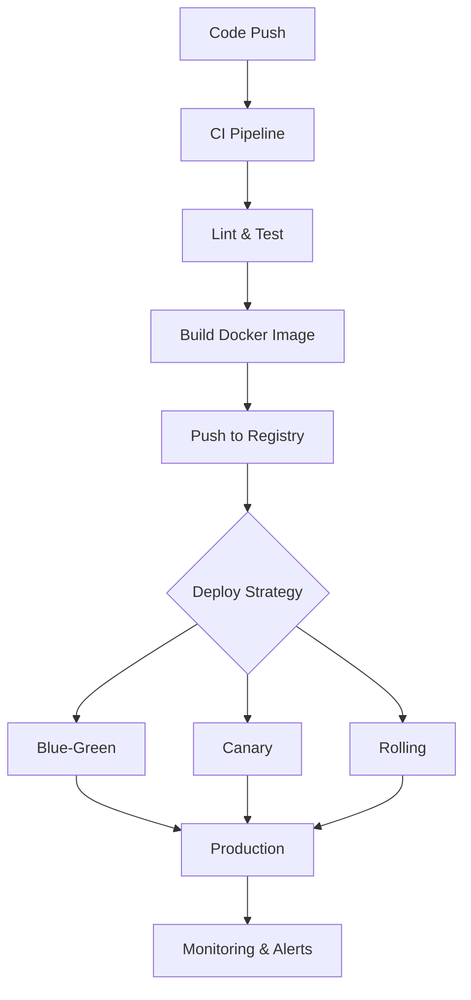

## Infrastructure & DevOps

Infrastructure is what turns your code into a running, reliable service. Docker packages it, CI/CD deploys it, observability lets you understand it, and load balancers keep it available.

### Docker & Containerization

Docker packages your application with all its dependencies into a container — a lightweight, isolated environment that runs the same everywhere. A **Dockerfile** defines how to build the image. **Docker Compose** orchestrates multiple containers (app + database + cache) for local development. In production, container orchestrators like Kubernetes manage scaling, health checks, and rollouts.

Key concepts: layers and caching (order Dockerfile commands from least to most changing), multi-stage builds (separate build and runtime images for smaller sizes), and volume mounts for persistent data.

### CI/CD Pipelines

Continuous Integration automatically builds and tests every commit. Continuous Deployment automatically pushes passing builds to production. A typical pipeline: **lint → test → build → deploy staging → integration tests → deploy production**.

Deployment strategies minimize risk: **Blue-green** runs two identical environments and switches traffic instantly. **Canary** routes a small percentage of traffic to the new version first. **Rolling** updates instances one at a time.

### Observability

You can't fix what you can't see. The three pillars of observability:

- **Logs**: Structured events (JSON) from your application. Use log levels (debug, info, warn, error) meaningfully.
- **Metrics**: Numerical measurements over time — request rate, error rate, latency (the RED method), or saturation and utilization (the USE method).
- **Traces**: Follow a single request across multiple services. Distributed tracing (OpenTelemetry) shows where time is spent.

### Load Balancing

A load balancer distributes incoming requests across multiple server instances. **Reverse proxies** (Nginx, HAProxy) sit in front of your servers, handling SSL termination, compression, and static file serving. Algorithms include round-robin, least connections, and IP hash (for session affinity).



## ELI5

**Docker** is like a lunchbox. Instead of hoping the school cafeteria has what you need, you pack everything yourself. Your app runs the same way everywhere because it brings its own "food" (dependencies).

**CI/CD** is like an assembly line in a factory. Every time someone adds a part (code), the line automatically checks it, tests it, and ships it. No human has to push a button.

**Observability** is like the dashboard in a car. Logs are the check-engine light telling you something happened. Metrics are the speedometer and fuel gauge showing how things are going. Traces are GPS showing the exact route a trip took.

**Load balancing** is like having multiple checkout lanes at a grocery store. A greeter (load balancer) sends each customer to the shortest line.

## Poem

Docker packs your code up tight,
Runs the same in day or night.
CI tests what you commit,
CD ships if all is fit.

Logs will tell you what went wrong,
Metrics hum a steady song.
Traces follow each request —
Observability at its best.

## Template

```dockerfile
# Multi-stage Docker build
FROM node:20-alpine AS builder
WORKDIR /app
COPY package*.json ./
RUN npm ci
COPY . .
RUN npm run build

FROM node:20-alpine
WORKDIR /app
COPY --from=builder /app/dist ./dist
COPY --from=builder /app/node_modules ./node_modules
EXPOSE 3000
CMD ["node", "dist/index.js"]
```
