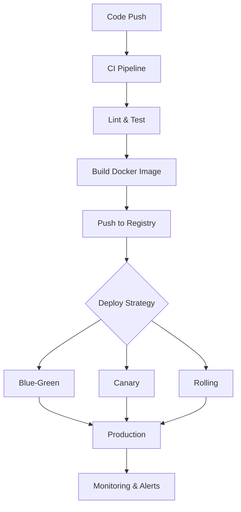

## Infrastructure & DevOps

Infrastructure is what turns your code into a running, reliable service. Docker packages it, CI/CD deploys it, observability lets you understand it, and load balancers keep it available.

### Docker & Containerization

Docker packages your application with all its dependencies into a container — a lightweight, isolated environment that runs the same everywhere. A **Dockerfile** defines how to build the image. **Docker Compose** orchestrates multiple containers (app + database + cache) for local development. In production, container orchestrators like Kubernetes manage scaling, health checks, and rollouts.

Key concepts: layers and caching (order Dockerfile commands from least to most changing), multi-stage builds (separate build and runtime images for smaller sizes), and volume mounts for persistent data.

#### Real World
> **Airbnb** — Airbnb migrated from bare-metal deploys to Docker containers to eliminate environment drift between developer laptops and production. Inconsistent Ruby gem versions were causing subtle production-only bugs; containerization standardized the runtime and cut environment-related incidents by over 60%.

#### Practice
1. Your Docker image is 1.2GB and taking 8 minutes to build in CI. What specific Dockerfile techniques would you apply to reduce both the image size and build time?
2. Given a Node.js application with a build step that produces compiled assets and a runtime that only needs those assets, how would you structure a multi-stage Dockerfile and what is the expected size reduction?
3. What is the tradeoff between running your application directly in a VM versus in a Docker container — when would you prefer the VM approach?

### CI/CD Pipelines

Continuous Integration automatically builds and tests every commit. Continuous Deployment automatically pushes passing builds to production. A typical pipeline: **lint → test → build → deploy staging → integration tests → deploy production**.

Deployment strategies minimize risk: **Blue-green** runs two identical environments and switches traffic instantly. **Canary** routes a small percentage of traffic to the new version first. **Rolling** updates instances one at a time.

#### Real World
> **Netflix** — Netflix uses canary deployments for every production release, routing 1% of traffic to a new version and comparing error rates and latency against the baseline using automated statistical analysis. If metrics diverge, the deployment is automatically rolled back within minutes before the majority of users are affected.

#### Practice
1. Your CI pipeline is passing but a bug ships to production that integration tests would have caught. What stage was likely missing from the pipeline, and where would you add it?
2. Given a high-traffic API where a bad deploy could take down production, which deployment strategy — blue-green, canary, or rolling — would you choose and what are the infrastructure costs of each?
3. What is the difference between Continuous Delivery and Continuous Deployment, and when would a team deliberately stop at Continuous Delivery?

### Observability

You can't fix what you can't see. The three pillars of observability:

- **Logs**: Structured events (JSON) from your application. Use log levels (debug, info, warn, error) meaningfully.
- **Metrics**: Numerical measurements over time — request rate, error rate, latency (the RED method), or saturation and utilization (the USE method).
- **Traces**: Follow a single request across multiple services. Distributed tracing (OpenTelemetry) shows where time is spent.

#### Real World
> **Stripe** — Stripe's on-call engineers were spending hours correlating logs across services to diagnose payment failures. They adopted structured JSON logging with a shared `request_id` field and OpenTelemetry distributed tracing, reducing mean time to diagnosis from 45 minutes to under 5 minutes for most incidents.

#### Practice
1. A user reports that a specific API request is slow but only sometimes. You have logs, metrics, and traces available. Which pillar of observability do you use first and why?
2. Given a microservices architecture where a checkout request spans 6 services, how would you implement distributed tracing so you can pinpoint which service is adding latency?
3. What is the difference between the RED method and the USE method for metrics, and which is more useful for a customer-facing API endpoint?

### Load Balancing

A load balancer distributes incoming requests across multiple server instances. **Reverse proxies** (Nginx, HAProxy) sit in front of your servers, handling SSL termination, compression, and static file serving. Algorithms include round-robin, least connections, and IP hash (for session affinity).

#### Real World
> **Discord** — Discord handles millions of WebSocket connections for real-time messaging. They use IP hash load balancing to ensure a client's connection is always routed to the same server, maintaining WebSocket session state. When scaling out, they migrate connections gradually to avoid mass disconnections.

#### Practice
1. Your application uses server-side sessions stored in memory. You scale from 1 to 3 app servers behind a round-robin load balancer and users start getting randomly logged out. What is happening and what are two ways to fix it?
2. Given an Nginx reverse proxy in front of your application servers, what additional responsibilities would you offload to Nginx beyond just proxying requests, and why does this separation benefit your application servers?
3. When would you choose least-connections load balancing over round-robin, and what type of workload makes round-robin a poor fit?



## ELI5

**Docker** is like a lunchbox. Instead of hoping the school cafeteria has what you need, you pack everything yourself. Your app runs the same way everywhere because it brings its own "food" (dependencies).

**CI/CD** is like an assembly line in a factory. Every time someone adds a part (code), the line automatically checks it, tests it, and ships it. No human has to push a button.

**Observability** is like the dashboard in a car. Logs are the check-engine light telling you something happened. Metrics are the speedometer and fuel gauge showing how things are going. Traces are GPS showing the exact route a trip took.

**Load balancing** is like having multiple checkout lanes at a grocery store. A greeter (load balancer) sends each customer to the shortest line.

## Poem

Docker packs your code up tight,
Runs the same in day or night.
CI tests what you commit,
CD ships if all is fit.

Logs will tell you what went wrong,
Metrics hum a steady song.
Traces follow each request —
Observability at its best.

## Template

```dockerfile
# Multi-stage Docker build
FROM node:20-alpine AS builder
WORKDIR /app
COPY package*.json ./
RUN npm ci
COPY . .
RUN npm run build

FROM node:20-alpine
WORKDIR /app
COPY --from=builder /app/dist ./dist
COPY --from=builder /app/node_modules ./node_modules
EXPOSE 3000
CMD ["node", "dist/index.js"]
```
