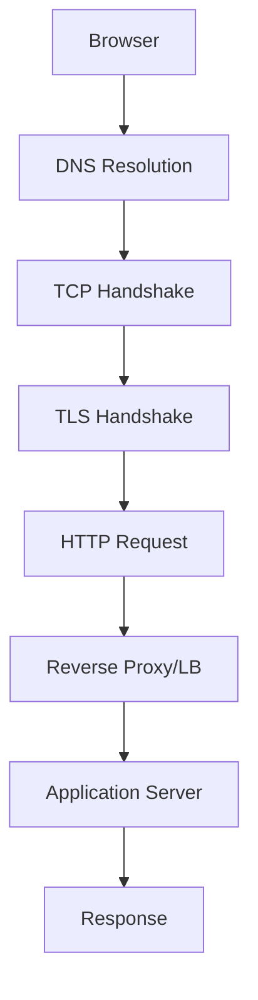

## Networking Fundamentals

Networking is how computers talk to each other. Every API call, database query, and web page load depends on networking protocols working correctly.

### Transport Layer (TCP & UDP)

The transport layer determines how data gets from point A to point B. **TCP** provides reliable, ordered delivery — perfect for HTTP, database connections, and file transfers. **UDP** sacrifices reliability for speed — ideal for gaming, streaming, and DNS. The **3-way handshake** (SYN → SYN-ACK → ACK) establishes TCP connections by synchronizing sequence numbers. Understanding connection lifecycle (including TIME_WAIT and teardown) is essential for debugging connection issues.

### DNS & Domain Resolution

DNS translates human-readable domain names to IP addresses through a **hierarchical distributed system**. Resolution goes through a cache hierarchy (browser → OS → resolver → root → TLD → authoritative). DNS record types (A, CNAME, MX, NS, TXT) serve different purposes. DNS caching with TTL is critical for performance but creates propagation delays when changing records.

### Sockets & Connection Management

Sockets are the fundamental abstraction for network communication. A server handles multiple clients on a single port because connections are uniquely identified by **4-tuples** (src IP, src port, dst IP, dst port). The evolution from process-per-connection to event-driven I/O (epoll/kqueue) solved the C10K problem, enabling modern servers to handle 100K+ concurrent connections.

### Network Infrastructure

**Forward proxies** act on behalf of clients, **reverse proxies** act on behalf of servers. Reverse proxies (Nginx, HAProxy) are essential for SSL termination, caching, compression, and load balancing. **VPNs** create encrypted tunnels for all traffic, unlike proxies which work at the application level.



## ELI5

**TCP vs UDP** is like registered mail vs shouting across a room. Registered mail guarantees delivery but is slow. Shouting is fast but you might miss some words.

**DNS** is like a phone book. You know your friend's name (google.com) but not their number (IP address). You look it up, and once found, you write it on a sticky note (cache) for next time.

**Sockets** are like phone lines at a business. One phone number, but the receptionist transfers each caller to their own line.

**A reverse proxy** is like a restaurant host — customers talk to the host, who routes them to the right table (server).

## Poem

Packets flow from port to port,
TCP ensures the right sort.
UDP is fast but free,
Choose the one that fits your need.

DNS resolves the name you type,
Root to TLD, the chain is tight.
Sockets bind and listen well,
Many clients, one port — all is swell.

## Template

```text
TCP Connection Lifecycle:
  CLOSED → SYN_SENT → ESTABLISHED → FIN_WAIT → TIME_WAIT → CLOSED

DNS Resolution Order:
  Browser Cache → OS Cache → Resolver → Root → TLD → Authoritative

Socket Server Pattern:
  socket() → bind() → listen() → accept() → read/write → close()

Reverse Proxy Config (Nginx):
  upstream backend { server 10.0.0.1:3000; server 10.0.0.2:3000; }
  server { listen 443 ssl; proxy_pass http://backend; }
```
