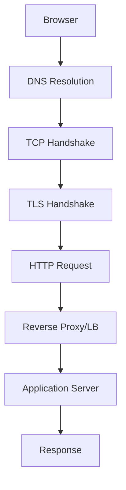

## Networking Fundamentals

Networking is how computers talk to each other. Every API call, database query, and web page load depends on networking protocols working correctly.

### Transport Layer (TCP & UDP)

The transport layer determines how data gets from point A to point B. **TCP** provides reliable, ordered delivery — perfect for HTTP, database connections, and file transfers. **UDP** sacrifices reliability for speed — ideal for gaming, streaming, and DNS. The **3-way handshake** (SYN → SYN-ACK → ACK) establishes TCP connections by synchronizing sequence numbers. Understanding connection lifecycle (including TIME_WAIT and teardown) is essential for debugging connection issues.

#### Real World
> **Google** — Google developed QUIC (now standardized as HTTP/3) because TCP's head-of-line blocking caused poor performance on lossy mobile networks. QUIC runs over UDP and implements its own reliability and multiplexing per stream, so a dropped packet in one stream doesn't stall all others. Chrome adopted it and Google saw a 30% reduction in video rebuffering on mobile.

#### Practice
1. A backend service is running out of ports under load and you see a large number of connections in TIME_WAIT state. What is TIME_WAIT, why does it exist, and what are your options for addressing the port exhaustion?
2. Given that you need to build a multiplayer game that requires the lowest possible latency and can tolerate some packet loss, would you use TCP or UDP for the game state updates? What about for the matchmaking API?
3. What does the 3-way handshake establish that a 2-way handshake could not, and why does this matter for reliable data delivery?

### DNS & Domain Resolution

DNS translates human-readable domain names to IP addresses through a **hierarchical distributed system**. Resolution goes through a cache hierarchy (browser → OS → resolver → root → TLD → authoritative). DNS record types (A, CNAME, MX, NS, TXT) serve different purposes. DNS caching with TTL is critical for performance but creates propagation delays when changing records.

#### Real World
> **Cloudflare** — Cloudflare operates one of the world's largest authoritative DNS networks and launched 1.1.1.1 as a public resolver with a privacy focus. During major BGP route leak incidents, Cloudflare's anycast DNS infrastructure continued resolving queries correctly by routing traffic to the nearest healthy data center, demonstrating how DNS availability is critical infrastructure.

#### Practice
1. You update an A record for your API from the old IP to a new IP but some users still hit the old server for hours after the change. What is the root cause and what TTL strategy should you have used before the migration?
2. Given a multi-region deployment where you want users to automatically resolve to the closest datacenter, which DNS technique would you use and what record types are involved?
3. What is the difference between a CNAME and an A record, and why can't you use a CNAME for a root domain (e.g., `example.com` vs `api.example.com`)?

### Sockets & Connection Management

Sockets are the fundamental abstraction for network communication. A server handles multiple clients on a single port because connections are uniquely identified by **4-tuples** (src IP, src port, dst IP, dst port). The evolution from process-per-connection to event-driven I/O (epoll/kqueue) solved the C10K problem, enabling modern servers to handle 100K+ concurrent connections.

#### Real World
> **LinkedIn** — LinkedIn's early Tomcat-based infrastructure used one thread per connection, which hit a wall at around 3,000 concurrent connections per server due to thread stack memory. They migrated to Netty, an event-driven NIO framework using epoll under the hood, which allowed the same hardware to handle 100,000+ concurrent connections — a key step in their infrastructure scaling.

#### Practice
1. How can a server accept thousands of concurrent connections on port 443 when a port can only be one number? What uniquely identifies each connection?
2. Given a chat application that needs to maintain persistent connections for 500,000 simultaneous users, would you design the connection layer using thread-per-connection or event-driven I/O? What are the memory implications of each at that scale?
3. What is the C10K problem and why did it require a fundamental shift in server architecture rather than just buying bigger hardware?

### Network Infrastructure

**Forward proxies** act on behalf of clients, **reverse proxies** act on behalf of servers. Reverse proxies (Nginx, HAProxy) are essential for SSL termination, caching, compression, and load balancing. **VPNs** create encrypted tunnels for all traffic, unlike proxies which work at the application level.

#### Real World
> **Cloudflare** — Cloudflare's global reverse proxy network sits in front of millions of websites, terminating TLS at the edge (closest data center to the user) rather than at the origin server. This reduces TLS handshake latency from 200ms+ for distant users to under 20ms, while also absorbing DDoS traffic before it reaches the origin.

#### Practice
1. Your origin server's IP address is publicly known and you're receiving direct DDoS attacks that bypass your reverse proxy. What change do you make to your infrastructure to force all traffic through the proxy, and how does the proxy protect the origin?
2. Given a company where engineers need access to internal staging environments from home, would you use a VPN or a reverse proxy to provide that access, and what is the key architectural difference between the two?
3. What are the security and performance benefits of terminating SSL at the reverse proxy layer rather than passing encrypted traffic directly to application servers?



## ELI5

**TCP vs UDP** is like registered mail vs shouting across a room. Registered mail guarantees delivery but is slow. Shouting is fast but you might miss some words.

**DNS** is like a phone book. You know your friend's name (google.com) but not their number (IP address). You look it up, and once found, you write it on a sticky note (cache) for next time.

**Sockets** are like phone lines at a business. One phone number, but the receptionist transfers each caller to their own line.

**A reverse proxy** is like a restaurant host — customers talk to the host, who routes them to the right table (server).

## Poem

Packets flow from port to port,
TCP ensures the right sort.
UDP is fast but free,
Choose the one that fits your need.

DNS resolves the name you type,
Root to TLD, the chain is tight.
Sockets bind and listen well,
Many clients, one port — all is swell.

## Template

```text
TCP Connection Lifecycle:
  CLOSED → SYN_SENT → ESTABLISHED → FIN_WAIT → TIME_WAIT → CLOSED

DNS Resolution Order:
  Browser Cache → OS Cache → Resolver → Root → TLD → Authoritative

Socket Server Pattern:
  socket() → bind() → listen() → accept() → read/write → close()

Reverse Proxy Config (Nginx):
  upstream backend { server 10.0.0.1:3000; server 10.0.0.2:3000; }
  server { listen 443 ssl; proxy_pass http://backend; }
```
