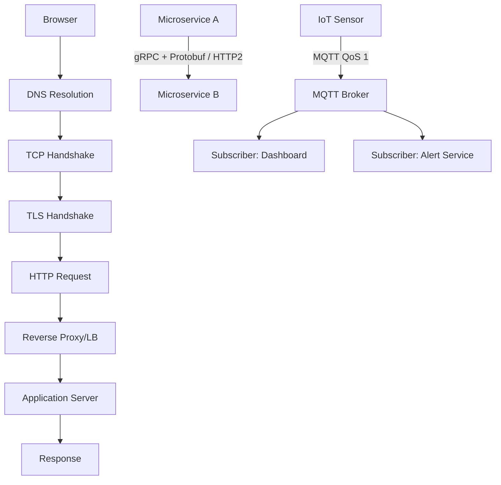

## Networking Fundamentals

Networking is how computers talk to each other. Every API call, database query, and web page load depends on networking protocols working correctly.

### Transport Layer (TCP & UDP)

The transport layer determines how data gets from point A to point B. **TCP** provides reliable, ordered delivery — perfect for HTTP, database connections, and file transfers. **UDP** sacrifices reliability for speed — ideal for gaming, streaming, and DNS. The **3-way handshake** (SYN → SYN-ACK → ACK) establishes TCP connections by synchronizing sequence numbers. Understanding connection lifecycle (including TIME_WAIT and teardown) is essential for debugging connection issues.

#### Real World
> **Google** — Google developed QUIC (now standardized as HTTP/3) because TCP's head-of-line blocking caused poor performance on lossy mobile networks. QUIC runs over UDP and implements its own reliability and multiplexing per stream, so a dropped packet in one stream doesn't stall all others. Chrome adopted it and Google saw a 30% reduction in video rebuffering on mobile.

#### Practice
1. A backend service is running out of ports under load and you see a large number of connections in TIME_WAIT state. What is TIME_WAIT, why does it exist, and what are your options for addressing the port exhaustion?
2. Given that you need to build a multiplayer game that requires the lowest possible latency and can tolerate some packet loss, would you use TCP or UDP for the game state updates? What about for the matchmaking API?
3. What does the 3-way handshake establish that a 2-way handshake could not, and why does this matter for reliable data delivery?

### DNS & Domain Resolution

DNS translates human-readable domain names to IP addresses through a **hierarchical distributed system**. Resolution goes through a cache hierarchy (browser → OS → resolver → root → TLD → authoritative). DNS record types (A, CNAME, MX, NS, TXT) serve different purposes. DNS caching with TTL is critical for performance but creates propagation delays when changing records.

#### Real World
> **Cloudflare** — Cloudflare operates one of the world's largest authoritative DNS networks and launched 1.1.1.1 as a public resolver with a privacy focus. During major BGP route leak incidents, Cloudflare's anycast DNS infrastructure continued resolving queries correctly by routing traffic to the nearest healthy data center, demonstrating how DNS availability is critical infrastructure.

#### Practice
1. You update an A record for your API from the old IP to a new IP but some users still hit the old server for hours after the change. What is the root cause and what TTL strategy should you have used before the migration?
2. Given a multi-region deployment where you want users to automatically resolve to the closest datacenter, which DNS technique would you use and what record types are involved?
3. What is the difference between a CNAME and an A record, and why can't you use a CNAME for a root domain (e.g., `example.com` vs `api.example.com`)?

### Sockets & Connection Management

Sockets are the fundamental abstraction for network communication. A server handles multiple clients on a single port because connections are uniquely identified by **4-tuples** (src IP, src port, dst IP, dst port). The evolution from process-per-connection to event-driven I/O (epoll/kqueue) solved the C10K problem, enabling modern servers to handle 100K+ concurrent connections.

#### Real World
> **LinkedIn** — LinkedIn's early Tomcat-based infrastructure used one thread per connection, which hit a wall at around 3,000 concurrent connections per server due to thread stack memory. They migrated to Netty, an event-driven NIO framework using epoll under the hood, which allowed the same hardware to handle 100,000+ concurrent connections — a key step in their infrastructure scaling.

#### Practice
1. How can a server accept thousands of concurrent connections on port 443 when a port can only be one number? What uniquely identifies each connection?
2. Given a chat application that needs to maintain persistent connections for 500,000 simultaneous users, would you design the connection layer using thread-per-connection or event-driven I/O? What are the memory implications of each at that scale?
3. What is the C10K problem and why did it require a fundamental shift in server architecture rather than just buying bigger hardware?

### Network Infrastructure

**Forward proxies** act on behalf of clients, **reverse proxies** act on behalf of servers. Reverse proxies (Nginx, HAProxy) are essential for SSL termination, caching, compression, and load balancing. **VPNs** create encrypted tunnels for all traffic, unlike proxies which work at the application level.

#### Real World
> **Cloudflare** — Cloudflare's global reverse proxy network sits in front of millions of websites, terminating TLS at the edge (closest data center to the user) rather than at the origin server. This reduces TLS handshake latency from 200ms+ for distant users to under 20ms, while also absorbing DDoS traffic before it reaches the origin.

#### Practice
1. Your origin server's IP address is publicly known and you're receiving direct DDoS attacks that bypass your reverse proxy. What change do you make to your infrastructure to force all traffic through the proxy, and how does the proxy protect the origin?
2. Given a company where engineers need access to internal staging environments from home, would you use a VPN or a reverse proxy to provide that access, and what is the key architectural difference between the two?
3. What are the security and performance benefits of terminating SSL at the reverse proxy layer rather than passing encrypted traffic directly to application servers?

### Binary Serialization (Protobuf)

**Protocol Buffers (Protobuf)** is Google's binary serialization format — a schema-first alternative to JSON. A `.proto` file defines message types using numbered fields; generated code handles encoding and decoding in any supported language. Because the wire format uses **field numbers** (not names), messages are 3–10x smaller than JSON and 5–10x faster to parse. The schema also enables safe evolution: adding a field with a new number is always backward-compatible, but reusing a number is catastrophic — old readers will silently misinterpret the bytes.

#### Real World
> **Uber** — Uber's backend processes millions of location updates and pricing calculations per second. Switching internal service communication from JSON to Protobuf reduced payload sizes by ~60% and cut serialization CPU overhead significantly, improving p99 latency across their microservice mesh without any changes to business logic.

#### Practice
1. You add a new `phone_number` field (field number 7) to a User protobuf message. An old service that doesn't know about field 7 receives a message containing it. What happens? Now what if you reused field number 4 (previously `nickname`, now removed) for `phone_number`? What breaks and why?
2. Given a system sending 50,000 price updates per second, explain the performance case for Protobuf over JSON, covering wire size, parse time, and memory allocation differences.
3. Why does proto3 require all enum values to start at 0, and what is the semantic meaning of that 0 value in terms of schema evolution?

### gRPC

**gRPC** is an RPC framework built on HTTP/2 and Protobuf. Where REST uses URLs and HTTP verbs, gRPC uses `.proto` service definitions that compile into type-safe client stubs and server skeletons. HTTP/2 provides **multiplexing** (many concurrent RPCs over one TCP connection), header compression, and native streaming — enabling gRPC's four communication patterns: unary (like REST), server streaming, client streaming, and bidirectional streaming. **Interceptors** handle cross-cutting concerns (auth, logging, tracing) as clean middleware. The main limitation: browsers can't speak gRPC directly — a grpc-web proxy (e.g., Envoy) is required.

#### Real World
> **Netflix** — After evaluating gRPC for inter-service calls, Netflix found strongly-typed Protobuf contracts caught integration bugs at compile time instead of production. Their service mesh now uses gRPC for the bulk of internal traffic, with generated stubs keeping dozens of polyglot services in sync without manual client maintenance.

#### Practice
1. A data pipeline service needs to upload 10GB log files to a processing service. Which gRPC streaming pattern would you use, and what advantages does it have over a single REST multipart upload?
2. Given a live auction platform where the server pushes price updates to thousands of bidders while each bidder can also send bids, which gRPC streaming pattern fits? What connection lifecycle challenges arise at scale?
3. Why can't browsers use gRPC directly, and what is the grpc-web + Envoy proxy solution? What tradeoffs does it introduce?

### MQTT & Real-Time Protocols

**MQTT** is a lightweight pub/sub protocol designed for constrained devices and unreliable networks. A central **broker** routes messages between publishers and subscribers using hierarchical **topics** (e.g., `sensors/factory/+/temperature`). Three **QoS levels** control delivery guarantees: QoS 0 (fire-and-forget), QoS 1 (at-least-once, retries until PUBACK), QoS 2 (exactly-once, 4-way handshake). **Persistent sessions** let devices reconnect after outages and receive all queued messages — something neither WebSocket nor SSE offers natively. For browser clients, **WebSocket** (full-duplex, DIY pub/sub) and **SSE** (server-push only, simpler) are the alternatives.

#### Real World
> **AWS IoT Core** — Amazon's IoT platform uses MQTT as its primary device protocol, managing hundreds of millions of device connections. The combination of MQTT's 2-byte fixed header, QoS delivery guarantees, and persistent sessions makes fleet-wide firmware updates reliable even on spotty networks — a QoS 1 command is queued by the broker and delivered when each device reconnects.

#### Practice
1. A fleet of 50,000 factory sensors reports temperature every 5 seconds; some lose connectivity for minutes. Design the MQTT topic structure, QoS selection per message type, and session persistence strategy. What QoS should the server use for firmware update commands?
2. You need exactly one worker to process each MQTT message (not fan-out to all subscribers). How do MQTT 5 shared subscriptions (`$share/group/topic`) solve this, and what is the analogous concept in Kafka?
3. Compare WebSocket, SSE, and MQTT for a browser-based live dashboard: which would you choose and why? How does the scaling model differ between WebSocket (stateful connections) and MQTT (broker cluster)?



## ELI5

**TCP vs UDP** is like registered mail vs shouting across a room. Registered mail guarantees delivery but is slow. Shouting is fast but you might miss some words.

**DNS** is like a phone book. You know your friend's name (google.com) but not their number (IP address). You look it up, and once found, you write it on a sticky note (cache) for next time.

**Sockets** are like phone lines at a business. One phone number, but the receptionist transfers each caller to their own line.

**A reverse proxy** is like a restaurant host — customers talk to the host, who routes them to the right table (server).

**Protobuf** is a secret codebook both sides agree on before talking — instead of writing "name=Alice" you write "2:Alice" because you both know field 2 means name. Shorter, faster, but you need the codebook.

**gRPC** is a super-fast intercom between rooms. You press the button for the right room (service), speak in shorthand (Protobuf), and can hold a full two-way conversation (streaming), not just send one message.

**MQTT** is a walkie-talkie relay station. Devices broadcast on channels (topics), the relay (broker) delivers to everyone tuned in — and saves messages for devices that went offline briefly.

## Poem

Packets flow from port to port,
TCP ensures the right sort.
UDP is fast but free,
Choose the one that fits your need.

DNS resolves the name you type,
Root to TLD, the chain is tight.
Sockets bind and listen well,
Many clients, one port — all is swell.

## Template

```text
TCP Connection Lifecycle:
  CLOSED → SYN_SENT → ESTABLISHED → FIN_WAIT → TIME_WAIT → CLOSED

DNS Resolution Order:
  Browser Cache → OS Cache → Resolver → Root → TLD → Authoritative

Socket Server Pattern:
  socket() → bind() → listen() → accept() → read/write → close()

Reverse Proxy Config (Nginx):
  upstream backend { server 10.0.0.1:3000; server 10.0.0.2:3000; }
  server { listen 443 ssl; proxy_pass http://backend; }

Protobuf Field Evolution Rules:
  Add field (new number)   → safe
  Remove field             → reserve the number + name
  Rename field             → safe (wire uses numbers)
  Change field type        → BREAKING
  Reuse field number       → CATASTROPHIC (silent corruption)

gRPC Streaming Patterns:
  Unary:              rpc M(Req)          returns (Resp)
  Server streaming:   rpc M(Req)          returns (stream Resp)
  Client streaming:   rpc M(stream Req)   returns (Resp)
  Bidirectional:      rpc M(stream Req)   returns (stream Resp)

MQTT QoS:
  QoS 0: PUBLISH (no ACK — may lose)
  QoS 1: PUBLISH → PUBACK (retry — may duplicate)
  QoS 2: PUBLISH → PUBREC → PUBREL → PUBCOMP (exactly once)

Real-Time Protocol Selection:
  Internal high-throughput RPC  → gRPC + Protobuf
  Browser bidirectional          → WebSocket
  Browser server-push only       → SSE
  IoT / constrained devices      → MQTT
```
