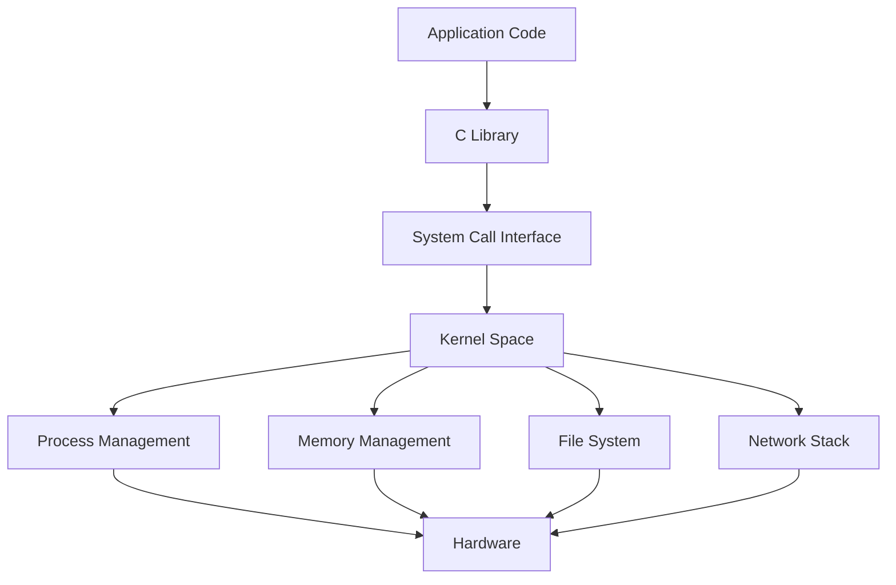

## Operating System Concepts

Operating systems manage the hardware resources that your code runs on. Understanding OS concepts is what separates developers who can debug anything from those who are lost when things go wrong at the system level.

### Processes & Threads

A **process** is an independent execution unit with its own memory space — isolated and safe, but heavy. A **thread** shares memory within a process — lighter and faster to switch, but requires synchronization for shared data. Modern systems use a mix: multi-process for isolation (Chrome tabs, Nginx workers), multi-thread for efficiency (Java web servers), and event loops for high-concurrency I/O (Node.js, Redis).

#### Real World
> **Chrome** — Google Chrome uses a separate OS process for each browser tab specifically for isolation: a crash or memory exploit in one tab cannot access the memory or crash the other tabs. The cost is higher RAM usage (~30MB per process vs per thread), which Chrome accepts as the right tradeoff for security and stability.

#### Practice
1. Nginx uses a master process that forks N worker processes (one per CPU core) rather than threads. What specific advantages does this architecture provide for a high-traffic web server?
2. Given that Node.js runs JavaScript on a single thread using an event loop, how does it handle 10,000 concurrent HTTP connections without blocking, and what type of workload would expose its single-threaded limitations?
3. What are the memory and context-switching tradeoffs between spawning 1,000 threads vs 1,000 processes to handle concurrent connections, and why did this drive the shift to event-driven servers?

### Concurrency & Synchronization

Concurrent access to shared data causes **race conditions** — the result depends on timing. Protect critical sections with **mutex** (mutual exclusion), **semaphore** (counting access), **spinlock** (busy-wait for short waits), or **read-write locks** (multiple readers OR one writer). **Deadlock** occurs when four conditions hold simultaneously — prevent it by enforcing lock ordering.

#### Real World
> **Facebook** — Facebook's Memcached infrastructure hit a thundering herd problem: when a popular cache key expired, thousands of threads simultaneously requested the same data from the database, overwhelming it. They introduced a "lease" mechanism — only the first request gets a token to fetch from DB, while others wait and get the result from the first — a form of mutex applied at the cache layer.

#### Practice
1. Two database transactions each lock table A then try to lock table B, while two others lock table B then try to lock table A. They deadlock. What is the canonical solution to prevent this class of deadlock?
2. Given a counter that tracks page views, shared across 50 threads, you observe that the final count is consistently lower than expected. What synchronization primitive would you use to fix it, and why would using a regular mutex be overkill here?
3. When would you choose a read-write lock over a mutex, and what is the risk of starvation in a read-heavy system using read-write locks?

### Inter-Process Communication

Processes can't directly access each other's memory, so they need IPC. **Pipes** stream data parent-to-child, **shared memory** is fastest (no kernel copying), **message queues** provide structured async messaging, and **sockets** work across machines. **fork()** creates a child with Copy-on-Write memory — fast regardless of process size.

#### Real World
> **Redis** — Redis uses `fork()` for point-in-time snapshotting (RDB persistence). The parent continues serving writes while the child process writes the snapshot to disk. Copy-on-Write means the fork is near-instant even for a 10GB dataset — only pages modified after the fork are copied, so memory usage spikes only proportionally to the write rate during the snapshot.

#### Practice
1. A Python web server forks 8 worker processes from a master, each serving requests independently. A user reports that a counter updated in one worker is not visible in another. Why is this, and how would you architect shared state between the workers?
2. Given a scenario where you need two processes to exchange 500MB of data per second on the same machine, which IPC mechanism would you choose — Unix domain sockets, pipes, or shared memory — and why?
3. What is Copy-on-Write semantics in the context of `fork()`, and why does it make forking a large process fast even though the child gets a copy of the full address space?

### Memory Management

**Virtual memory** gives each process the illusion of a large address space. The OS maps **virtual pages** to **physical frames** via page tables, with the **TLB** caching translations. **Stack** memory is fast and automatic (function calls); **heap** memory is flexible but needs management. **Garbage collectors** automate heap cleanup using mark-and-sweep or generational strategies.

#### Real World
> **Twitter** — Twitter's JVM-based services periodically experienced latency spikes of 500ms+ caused by stop-the-world garbage collection pauses. They tuned GC settings (G1GC, heap sizing, survivor ratios) and eventually migrated latency-sensitive services to Go and Scala with custom GC tuning, reducing GC-induced tail latency from hundreds of milliseconds to single-digit milliseconds.

#### Practice
1. A Java service's heap is set to 8GB but the container is getting OOM-killed with 12GB of memory usage. What memory regions outside the heap could account for the extra 4GB, and how would you diagnose this?
2. Given a recursive function that processes a deeply nested data structure, your service crashes with a stack overflow. Why does the stack overflow but the heap does not, and how would you fix the function?
3. What is the generational hypothesis in garbage collection, and why does it allow GCs to collect most objects without scanning the entire heap?

### System Calls & Kernel

**System calls** are the controlled gateway between user applications (Ring 3) and kernel services (Ring 0). Every file read, network write, and process creation goes through syscalls. In Linux, "everything is a file" — sockets, devices, pipes, and proc entries all use the same read/write interface.

#### Real World
> **Cloudflare** — Cloudflare uses Linux's `seccomp` (secure computing mode) to restrict which system calls each of their sandboxed processes is allowed to make. When running untrusted customer code at the edge, `seccomp` filters block syscalls like `fork` and `exec` entirely, reducing the kernel attack surface and preventing privilege escalation even if the application is compromised.

#### Practice
1. A high-performance network application is spending 40% of its CPU time in kernel mode according to profiling. What is likely causing this, and what architectural change (hint: consider `io_uring` or batching) could reduce the number of syscall transitions?
2. Given that "everything is a file" in Linux, how does this abstraction allow you to use the same `read()` and `write()` syscalls for files, network sockets, and pipes — what does the kernel do differently for each?
3. Why is the boundary between Ring 3 (user space) and Ring 0 (kernel space) enforced by hardware rather than just software convention, and what security property does this enforce?



## ELI5

**Processes vs Threads** are like separate houses vs roommates. Houses are isolated (safe) but expensive. Roommates share everything (fast) but must coordinate.

**Concurrency bugs** are like two people trying to edit the same document — without coordination, changes get lost or corrupted.

**Virtual memory** is like every reader thinking they have the entire library to themselves, when really the librarian maps their requests to shared physical shelves.

**System calls** are like bank transactions — you can't touch the vault yourself; you fill out a form and a teller does it for you.

## Poem

Processes stand in isolation's light,
Threads share memory, swift and tight.
Mutex guards the critical gate,
Deadlock lurks for those who wait.

Virtual pages map to frames,
TLB remembers address names.
Stack grows down and heap grows high,
System calls connect the sky.

## Template

```text
Process States:
  New → Ready ↔ Running → Terminated
                 ↓↑
               Waiting

Lock Ordering (Deadlock Prevention):
  Always acquire: Lock_A before Lock_B before Lock_C

Memory Layout (top to bottom):
  Stack | ... | Heap | BSS | Data | Text

Common Syscalls:
  Files:    open, read, write, close
  Process:  fork, exec, wait, exit
  Network:  socket, bind, listen, accept, connect
  Memory:   mmap, brk, munmap
```
