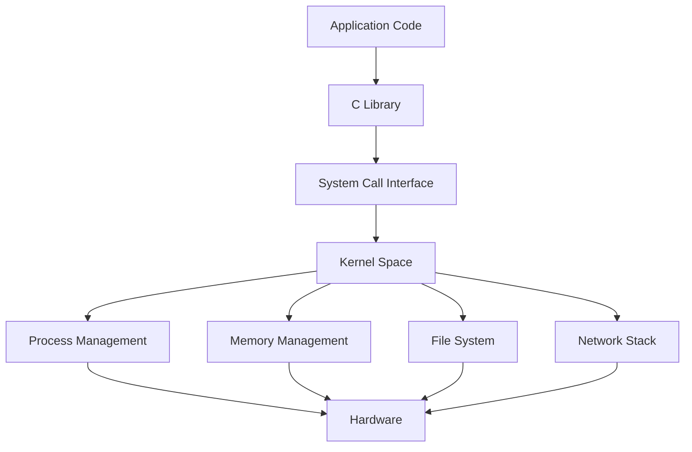

## Operating System Concepts

Operating systems manage the hardware resources that your code runs on. Understanding OS concepts is what separates developers who can debug anything from those who are lost when things go wrong at the system level.

### Processes & Threads

A **process** is an independent execution unit with its own memory space — isolated and safe, but heavy. A **thread** shares memory within a process — lighter and faster to switch, but requires synchronization for shared data. Modern systems use a mix: multi-process for isolation (Chrome tabs, Nginx workers), multi-thread for efficiency (Java web servers), and event loops for high-concurrency I/O (Node.js, Redis).

### Concurrency & Synchronization

Concurrent access to shared data causes **race conditions** — the result depends on timing. Protect critical sections with **mutex** (mutual exclusion), **semaphore** (counting access), **spinlock** (busy-wait for short waits), or **read-write locks** (multiple readers OR one writer). **Deadlock** occurs when four conditions hold simultaneously — prevent it by enforcing lock ordering.

### Inter-Process Communication

Processes can't directly access each other's memory, so they need IPC. **Pipes** stream data parent-to-child, **shared memory** is fastest (no kernel copying), **message queues** provide structured async messaging, and **sockets** work across machines. **fork()** creates a child with Copy-on-Write memory — fast regardless of process size.

### Memory Management

**Virtual memory** gives each process the illusion of a large address space. The OS maps **virtual pages** to **physical frames** via page tables, with the **TLB** caching translations. **Stack** memory is fast and automatic (function calls); **heap** memory is flexible but needs management. **Garbage collectors** automate heap cleanup using mark-and-sweep or generational strategies.

### System Calls & Kernel

**System calls** are the controlled gateway between user applications (Ring 3) and kernel services (Ring 0). Every file read, network write, and process creation goes through syscalls. In Linux, "everything is a file" — sockets, devices, pipes, and proc entries all use the same read/write interface.



## ELI5

**Processes vs Threads** are like separate houses vs roommates. Houses are isolated (safe) but expensive. Roommates share everything (fast) but must coordinate.

**Concurrency bugs** are like two people trying to edit the same document — without coordination, changes get lost or corrupted.

**Virtual memory** is like every reader thinking they have the entire library to themselves, when really the librarian maps their requests to shared physical shelves.

**System calls** are like bank transactions — you can't touch the vault yourself; you fill out a form and a teller does it for you.

## Poem

Processes stand in isolation's light,
Threads share memory, swift and tight.
Mutex guards the critical gate,
Deadlock lurks for those who wait.

Virtual pages map to frames,
TLB remembers address names.
Stack grows down and heap grows high,
System calls connect the sky.

## Template

```text
Process States:
  New → Ready ↔ Running → Terminated
                 ↓↑
               Waiting

Lock Ordering (Deadlock Prevention):
  Always acquire: Lock_A before Lock_B before Lock_C

Memory Layout (top to bottom):
  Stack | ... | Heap | BSS | Data | Text

Common Syscalls:
  Files:    open, read, write, close
  Process:  fork, exec, wait, exit
  Network:  socket, bind, listen, accept, connect
  Memory:   mmap, brk, munmap
```
