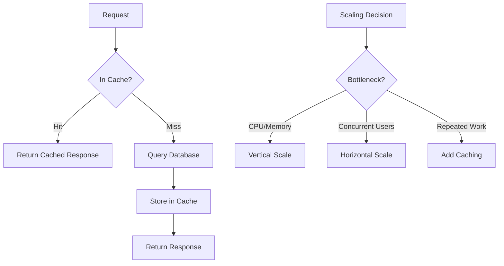

## Security & Scaling

Security protects your system from attackers. Scaling ensures it handles growth. Together, they're what make a backend production-ready.

### OWASP Top 10

The OWASP Top 10 is the industry-standard list of the most critical web application security risks. The most relevant for backend developers:

- **Injection** (SQL, NoSQL, OS command): Always use parameterized queries. Never concatenate user input into queries or commands.
- **Broken Authentication**: Use battle-tested libraries (bcrypt for passwords, JWT with proper validation). Implement rate limiting on login endpoints.
- **Broken Access Control**: Check permissions on every request, not just in the UI. Default to deny.
- **Security Misconfiguration**: Keep dependencies updated, disable debug modes in production, use security headers.
- **Server-Side Request Forgery (SSRF)**: Validate and allowlist URLs when your server makes outbound requests.

### Input Validation & Sanitization

Validate **structure** (is it the right type, length, format?) and **semantics** (does this user own this resource?). Validate on input, sanitize on output. Use schema validation libraries (Zod, Joi, Pydantic) to define expected shapes. For HTML output, escape or use a sanitization library to prevent XSS.

### Scaling Strategies

**Vertical scaling** (scale up): bigger CPU, more RAM. Simple but has a ceiling. **Horizontal scaling** (scale out): more instances behind a load balancer. Requires stateless services — no in-memory sessions, no local file storage. Use external stores (Redis, S3) for shared state.

**When to scale:** Don't scale prematurely. Measure first — profile slow endpoints, identify whether the bottleneck is CPU, memory, I/O, or database. Often the fix is a better query or an index, not more servers.

### Caching

Caching avoids repeating expensive work. Layers of caching:

- **Application cache** (Redis, Memcached): Cache database query results, computed values, API responses.
- **HTTP cache**: Cache-Control headers, ETags, CDN caching for static assets.
- **Database cache**: Query result caching, materialized views.

Cache invalidation is the hard part. Strategies: TTL (time-to-live), write-through (update cache on write), and cache-aside (check cache first, populate on miss).



## ELI5

**Security** is like locking your house. You check who's at the door (authentication), make sure they're allowed in the kitchen (authorization), and don't let strangers rummage through your drawers (input validation). The OWASP Top 10 is a list of the most common ways burglars break in.

**Scaling** is like a lemonade stand getting popular. **Vertical scaling** = getting a bigger table. **Horizontal scaling** = opening more stands. **Caching** = making a big batch in advance instead of squeezing lemons per order.

**Redis** is like a sticky note on your desk. Instead of walking to the filing cabinet (database) every time, you write the answer on a sticky note for quick reference.

## Poem

Validate input, trust no one's claim,
Parameterized queries tame injection's flame.
Lock down access, hash every key,
Security's a habit, not a one-time decree.

When traffic grows and servers strain,
Scale out with care, measure the pain.
Cache what's repeated, skip the slow,
Redis remembers what databases know.

## Template

```typescript
// Input validation with Zod
import { z } from 'zod';

const CreateUserSchema = z.object({
  email: z.string().email().max(255),
  name: z.string().min(1).max(100).trim(),
  age: z.number().int().min(0).max(150).optional(),
});

// Cache-aside pattern with Redis
async function getUser(id: string) {
  // 1. Check cache
  const cached = await redis.get(`user:${id}`);
  if (cached) return JSON.parse(cached);

  // 2. Query database
  const user = await db.users.findById(id);

  // 3. Populate cache with TTL
  await redis.set(`user:${id}`, JSON.stringify(user), 'EX', 3600);

  return user;
}

// Parameterized query (prevents SQL injection)
const user = await db.query(
  'SELECT * FROM users WHERE email = $1',
  [userInput.email]  // Never concatenate!
);
```
