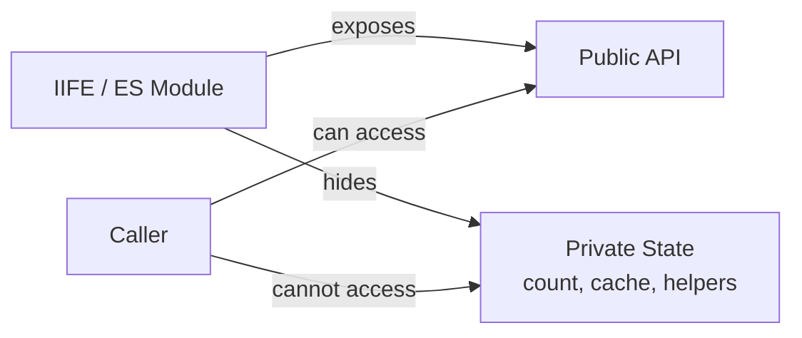
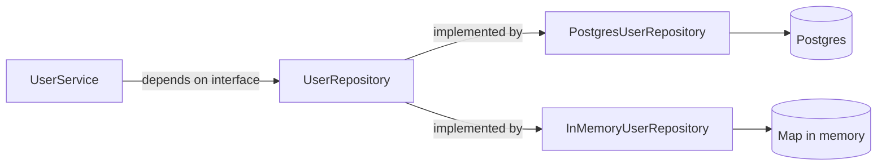
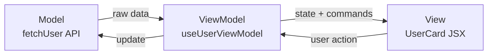
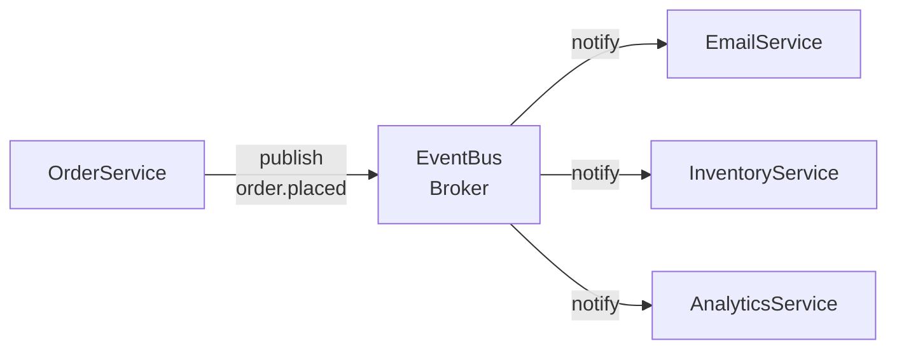
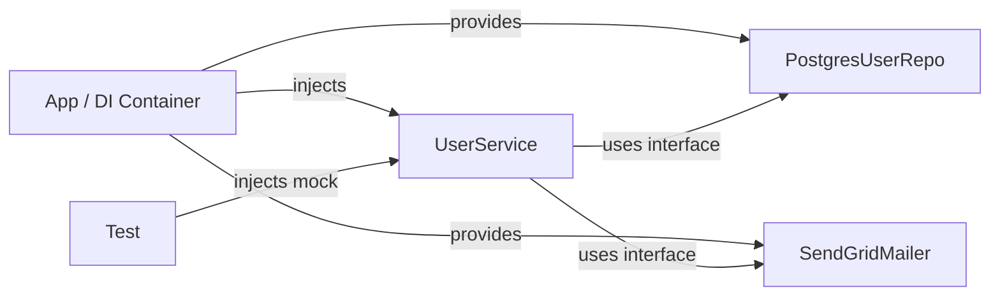

## Application Patterns

These patterns go beyond the classic GoF catalogue to address real architectural concerns in modern JavaScript and full-stack development. They are the patterns most commonly discussed in senior engineering interviews.

### Module Pattern

The Module pattern uses **closures** to create private state and expose only a controlled public API. Variables inside the closure are inaccessible from outside — true encapsulation without classes.

**Three variants:**
- **IIFE Module** — `const Counter = (() => { let n = 0; return { inc: () => n++ }; })();`
- **Revealing Module** — define everything privately, explicitly return the public surface
- **ES Module** — `export` is the built-in modern version; unexported names are private by default

#### When to use Module
- You need **private state** in a singleton-like utility without a full class
- You want to **control the public API surface** of a utility explicitly
- In modern code: just use ES modules — `export` what's public, leave everything else unexported

#### When NOT to use Module
- When you need **multiple instances** — use a class instead
- When you're already using ES modules — the IIFE form is redundant

#### Real World
> **ES Modules** — Every `.ts` or `.js` file in a modern project is a Module. `let cache = new Map()` at the top of `cache.ts` is private module state. Only what you `export` is accessible. This is the Module pattern built into the language.

#### Practice
1. Implement a `CounterModule` using the IIFE pattern with `increment()`, `decrement()`, and `getCount()`. Verify that the internal `count` variable is not accessible from outside.
2. What is the Revealing Module pattern and how does it differ from a standard IIFE module? What is the benefit of explicitly listing the public API at the bottom?
3. How do ES modules (`export` / `import`) implement the Module pattern without IIFE? What happens to unexported variables in a module file?



### Repository Pattern

The Repository pattern **abstracts the data access layer** behind a collection-like interface. Business logic never imports a database driver — it talks to a repository interface. Swapping Postgres for MongoDB means swapping one class.

**Repository vs DAO:**
- **DAO** maps closely to a database table
- **Repository** maps to a *domain concept* — it may coordinate multiple tables or sources

#### When to use Repository
- Business logic should stay **independent of the storage mechanism**
- You need to **test business logic** without hitting a real database (inject an in-memory repo)
- You want a **single place** for all queries related to an entity
- Classic signals: `UserRepository`, `OrderRepository`, data access layer in any layered architecture

#### When NOT to use Repository
- For **simple CRUD apps** with no real business logic — a thin ORM wrapper is sufficient
- When the abstraction would just **mirror the ORM API** one-to-one with no added value

#### Real World
> **NestJS + TypeORM** — `@InjectRepository(User)` injects a `UserRepository` into a service. Tests inject a mock. Production uses Postgres. The service never changes — only the injected repository does.

#### Practice
1. Implement a `UserRepository` interface with `findById`, `findByEmail`, `save`, and `delete`. Write a `PostgresUserRepository` and an `InMemoryUserRepository`. Show how a `UserService` uses the interface without knowing which implementation it has.
2. How does the Repository pattern implement the Dependency Inversion Principle? Draw the dependency diagram showing what depends on what.
3. What is the difference between a Repository and a Service layer? Can a Repository contain business logic?



### MVC / MVVM Pattern

**MVC** separates data (Model), UI (View), and coordination logic (Controller). **MVVM** replaces the Controller with a ViewModel that data-binds directly to the View — changes in the ViewModel automatically update the UI.

**Which is React?**
React is closer to MVVM. A custom hook (`useUserViewModel`) is the ViewModel — it manages state and exposes commands. The JSX component is the View — it binds to the ViewModel's data and calls its commands. The View never fetches data directly.

#### When to use MVC
- **Server-rendered apps** where a controller handles a request, queries the model, and renders a template (Express, Rails)
- When you want a clear **request → handler → response** flow

#### When to use MVVM
- **Reactive UIs** where the View should automatically reflect state changes
- React, Vue, SwiftUI — the framework's binding mechanism makes MVVM natural

#### Real World
> **React custom hooks as ViewModels** — `useCart()` is a ViewModel: it manages cart state, exposes `addItem()`, `removeItem()`, `getTotal()`. The `<CartPage>` component binds to it. Tests for `useCart()` don't need to render any UI. This is MVVM with React hooks.

#### Practice
1. Build a `useProductViewModel(id)` hook that fetches a product, manages loading/error state, and exposes an `addToCart()` command. Write the corresponding `<ProductCard>` component that binds to it. What is the Model, ViewModel, and View?
2. In a traditional Express app, identify the Model, View, and Controller for a `GET /users/:id` route.
3. What problem does MVVM solve that MVC does not? Why does two-way data binding make ViewModel testing easier than testing a Controller?



### Pub/Sub Pattern

**Pub/Sub (Publish/Subscribe)** routes events through a **broker**. Publishers emit events; subscribers register for event types. They never reference each other — the broker decouples them completely.

**Pub/Sub vs Observer:**
- **Observer**: Subject *directly* notifies its registered Observers. Subject holds observer references.
- **Pub/Sub**: A *broker* sits in between. Publishers and subscribers are completely decoupled — they don't need to exist at the same time (in persistent systems like Kafka).

#### When to use Pub/Sub
- Multiple independent modules need to react to the **same business event** without coupling
- You want to add new subscribers **without touching the publisher**
- Cross-service or cross-module communication where direct imports would create cycles
- Classic signals: `order.placed`, `user.registered`, `payment.failed` — domain events

#### When NOT to use Pub/Sub
- When you need a **guaranteed response** from a specific handler — use a direct call or request/reply
- When the event chain is **hard to trace** — Pub/Sub is powerful but can make debugging complex

#### Real World
> **Domain Events in microservices** — When `OrderService` publishes `order.placed` to a message bus (Kafka, RabbitMQ), `EmailService`, `InventoryService`, and `AnalyticsService` all consume it independently. Adding a new consumer never touches `OrderService`. This is Pub/Sub at the system level.

#### Practice
1. Implement an `EventBus` class with `subscribe(topic, handler)` and `publish(topic, payload)`. Demonstrate with `OrderService` publishing `order.placed` and three independent services subscribing.
2. What happens if a subscriber registers *after* an event has already been published? How do persistent message queues (Kafka, RabbitMQ) solve this compared to an in-memory EventBus?
3. What is the difference between Pub/Sub and the Observer pattern structurally? Draw both and identify where the coupling difference lies.



### Dependency Injection

**Dependency Injection (DI)** means a class *receives* its dependencies from outside rather than creating them internally. This is the practical technique that makes the Dependency Inversion Principle (DIP) work in real code.

**Three forms:**
1. **Constructor injection** — dependencies passed via constructor (most common, most explicit)
2. **Method injection** — dependency passed as a method argument
3. **Property injection** — dependency set on a property after construction (avoid when possible)

#### When to use Dependency Injection
- You want to **unit test** a class without hitting real databases, APIs, or file systems
- A class has **multiple implementations** that should be swappable (production vs test vs dev)
- You want to make **dependencies explicit** — visible in the constructor signature
- Classic signals: any service class that talks to a database, sends emails, or calls external APIs

#### When NOT to use Dependency Injection
- For **stateless utilities** with no side effects — pure functions don't need DI
- When a dependency is a **stable, universal constant** (e.g. `Math`, `JSON`) — always safe to use directly

#### Real World
> **NestJS IoC Container** — `@Injectable()` services declare their dependencies in the constructor. NestJS resolves them automatically at runtime, injecting the real implementations. Tests override individual bindings with mocks — the service code never changes.

#### Practice
1. Refactor a `UserService` that calls `new PostgresDB()` and `new SendGridMailer()` internally to accept both as constructor parameters. Write a test that injects `InMemoryUserRepository` and a mock mailer.
2. What is the difference between Dependency Injection and the Service Locator pattern? Why does the DI community consider Service Locator an anti-pattern?
3. When does DI become over-engineered? Describe a scenario where passing a dependency through 5 layers of constructors is worse than a different approach.



## Choosing the Right Pattern

```
Need private state / controlled public API?
  └── Module Pattern

Need to decouple business logic from the database?
  └── Repository Pattern

Building a UI with data, presentation, and logic?
  └── MVC (server-rendered) or MVVM (reactive / React)

Multiple services need to react to the same event without coupling?
  └── Pub/Sub

Class has hard-coded dependencies making testing painful?
  └── Dependency Injection
```

| Pattern | Core problem | Signature signal |
|---|---|---|
| Module | Private state, controlled API | IIFE / `export` |
| Repository | Decouple business logic from storage | `findById / save / delete` interface |
| MVC | Separate data, UI, and coordination | Controller handles request → model → view |
| MVVM | Reactive UI with data binding | Hook/ViewModel binds to declarative View |
| Pub/Sub | Decouple event producers from consumers | Broker in the middle, `publish / subscribe` |
| Dependency Injection | Make dependencies swappable and testable | Constructor receives deps, never creates them |

## ELI5

**Module** — A vending machine. You can press buttons (public API) but you can't reach inside to change the prices (private state).

**Repository** — A librarian. You ask "find book #42." Whether it's in the stacks, the basement, or digital doesn't matter. The librarian (repository) handles the details.

**MVC** — A restaurant. Customer (user) → Waiter (controller) → Kitchen (model) → Table (view).

**MVVM** — A smart display board. When inventory changes (model), the board (view) updates automatically because it's bound to the data. No waiter needed.

**Pub/Sub** — A radio station. The DJ (publisher) broadcasts; anyone tuned in (subscriber) hears it. The DJ doesn't know who's listening. New listeners can tune in any time.

**Dependency Injection** — A lamp with a socket instead of a built-in bulb. Plug in any bulb you want. For testing, plug in a fake bulb that just records if it was switched on.

## Template

```ts
// Module Pattern (ES Module)
let cache = new Map<string, unknown>(); // private
export function get(key: string) { return cache.get(key); }
export function set(key: string, val: unknown) { cache.set(key, val); }

// Repository Pattern
interface UserRepo {
  findById(id: string): Promise<User | null>;
  save(user: User): Promise<User>;
}
class UserService {
  constructor(private repo: UserRepo) {} // DI
  async getUser(id: string) {
    const user = await this.repo.findById(id);
    if (!user) throw new Error('Not found');
    return user;
  }
}

// Pub/Sub
class EventBus {
  private channels = new Map<string, Set<(d: unknown) => void>>();
  subscribe(topic: string, fn: (d: unknown) => void) {
    if (!this.channels.has(topic)) this.channels.set(topic, new Set());
    this.channels.get(topic)!.add(fn);
    return () => this.channels.get(topic)?.delete(fn);
  }
  publish(topic: string, data: unknown) {
    this.channels.get(topic)?.forEach(fn => fn(data));
  }
}

// Dependency Injection
class NotificationService {
  constructor(
    private mailer: { send(to: string, body: string): Promise<void> },
    private logger: { log(msg: string): void }
  ) {}
  async notify(email: string, msg: string) {
    await this.mailer.send(email, msg);
    this.logger.log(`Notified ${email}`);
  }
}
// Test: new NotificationService({ send: jest.fn() }, { log: jest.fn() })
```
