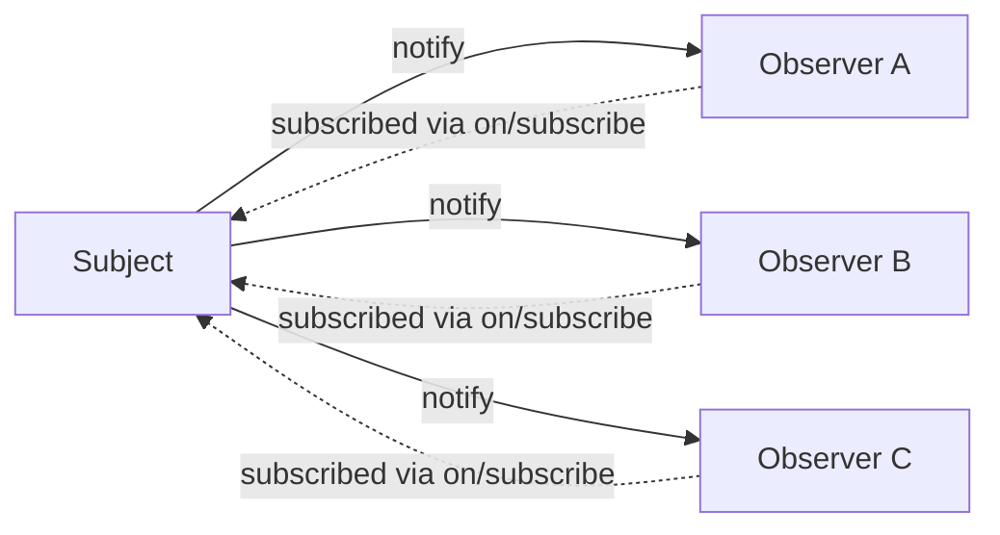
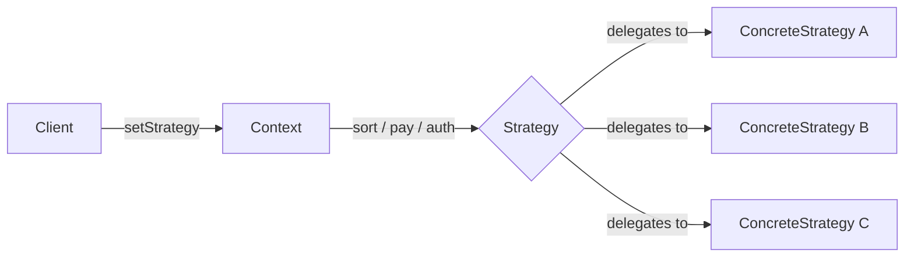
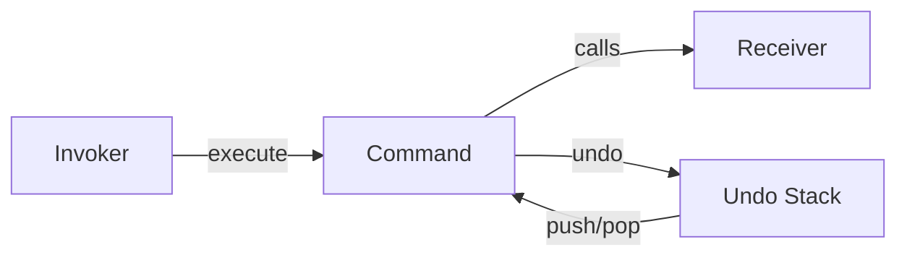
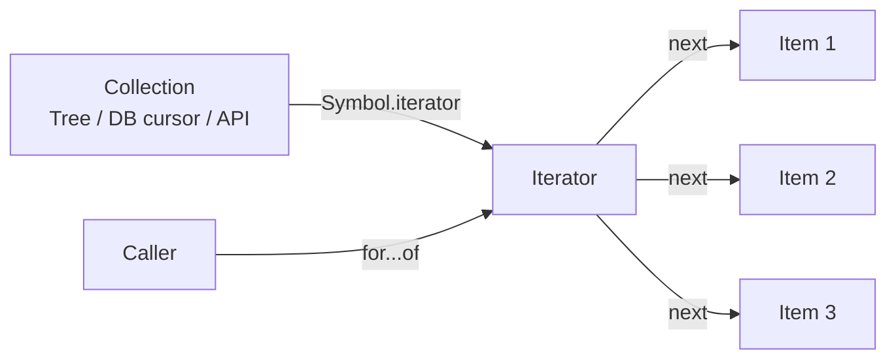
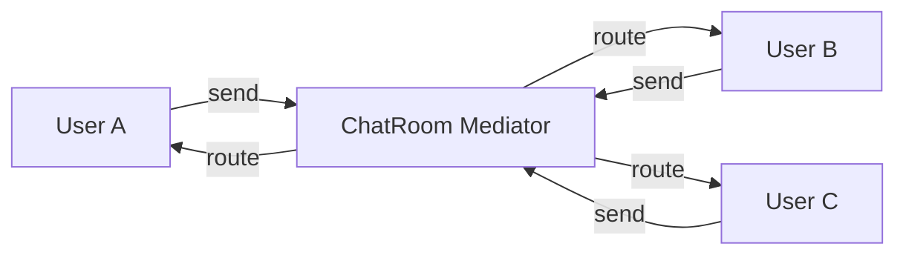
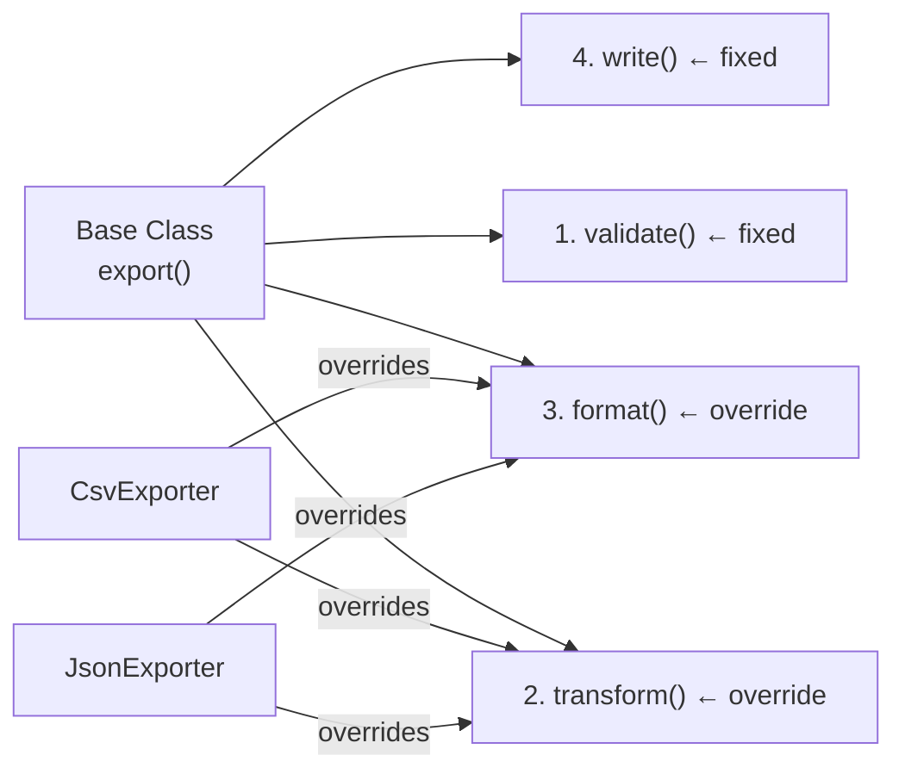
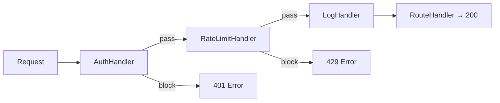
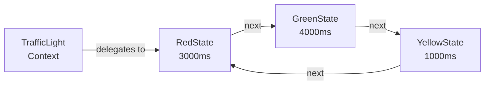

## Behavioral Patterns

Behavioral patterns focus on *communication* between objects — how they send messages, delegate responsibility, and stay loosely coupled. They answer: "How do objects collaborate without depending on each other's concrete implementations?"

### Observer Pattern

The Observer defines a one-to-many dependency. When one object (the **Subject** or Publisher) changes state, all dependent objects (**Observers** or Subscribers) are notified automatically.

Key participants:
- **Subject** — maintains a list of observers; calls `notify()` on all of them when its state changes
- **Observer** — has an `update()` method the subject calls
- **Concrete Observer** — the actual subscriber that reacts to the change

In JavaScript, this is everywhere: DOM `addEventListener`, Node.js `EventEmitter`, RxJS Observables, Redux store subscriptions, Vue's reactivity system.

#### When to use Observer
- **Multiple parts of the system** need to react to the same state change independently
- You want the subject to stay **decoupled** — it shouldn't know who is listening or how many
- The number of subscribers is **dynamic** — they can come and go at runtime
- Classic signals: "notify all listeners", "broadcast an event", "reactive data"

#### When NOT to use Observer
- When you only have **one consumer** — a direct callback is simpler
- When the **order of notification** matters and must be guaranteed — Observer does not promise a specific order
- When debugging is critical — event chains are hard to trace; prefer direct calls when you need clear stack traces

#### Real World
> **WebSocket price feed** — A trading platform's `PriceFeed` is a Subject. Every chart, order book, and P&L panel is an Observer. When a price update arrives over WebSocket, the feed calls `notify()` and all panels update simultaneously — without any panel knowing about the others, and without the feed knowing how many panels exist.

#### Practice
1. Implement an `EventEmitter` class with `on(event, handler)`, `off(event, handler)`, and `emit(event, data)` methods. This is the Observer pattern in pure JavaScript — no frameworks.
2. What is the difference between the Observer pattern and a simple callback? When does the callback approach break down and Observer becomes necessary?
3. How does React's `useEffect` with a dependency array implement the Observer pattern? What is the "subject" and what is the "observer" in this model?



### Strategy Pattern

A Strategy defines a family of algorithms, encapsulates each one, and makes them interchangeable. The client chooses which strategy to use at runtime — the context class delegates to the current strategy without knowing its concrete type.

This is OCP in action: adding a new algorithm means adding a new Strategy class, not modifying the context.

Classic examples: sorting algorithms, payment methods, authentication strategies (Passport.js), discount calculations, serialisation formats.

#### When to use Strategy
- The algorithm or behaviour needs to **change at runtime** based on config, user input, or context
- You have **multiple variants** of the same operation and want to avoid a growing `if/else` or `switch`
- You want to be able to **add new variants** without touching the context class (OCP)
- Classic signals: "pluggable algorithm", "configurable behaviour", "support multiple X providers"

#### When NOT to use Strategy
- When you only have **two variants** and they'll never grow — an `if/else` is perfectly readable
- When the algorithm never changes at runtime — just hardcode it; a Strategy adds indirection for no benefit

#### Real World
> **Passport.js** — Passport's authentication strategies (Local, Google OAuth, JWT, GitHub) are a textbook Strategy implementation. The `passport.authenticate('google')` call doesn't know how Google OAuth works — it delegates to the `GoogleStrategy`. Swapping to GitHub OAuth means swapping the strategy, not rewriting the auth flow.

#### Practice
1. Build a `Sorter` class that accepts a `SortStrategy` (bubble sort, quick sort, merge sort) and delegates `sort(data)` to whichever strategy is currently configured. Show how the calling code swaps strategies without changing the `Sorter`.
2. How does the Strategy pattern relate to first-class functions in JavaScript? Can a plain function serve as a strategy, or does it always need to be a class?
3. What is the difference between Strategy and Template Method patterns? Both define an algorithm skeleton and let parts vary — what is the structural difference?



### Command Pattern

The Command pattern encapsulates a request as an object — storing everything needed to perform the action (receiver, method name, parameters). This turns function calls into storable, passable, replayable objects.

Capabilities unlocked by Command:
- **Undo/Redo** — store an execute + undo pair; replay or reverse the stack
- **Queuing** — schedule commands for later execution, retry on failure
- **Logging** — record all commands for audit trails or debugging
- **Macro recording** — group multiple commands into a single composite command

Key participants: **Command** interface with `execute()`; **ConcreteCommand** that knows how to call the receiver; **Invoker** that triggers commands; **Receiver** that does the actual work.

#### When to use Command
- You need **undo/redo** — storing `execute` + `undo` pairs on a stack is the canonical solution
- You need to **queue, schedule, or retry** actions (job queues, task runners, transactional outboxes)
- You need an **audit log** — every user action is a serialisable Command object you can store and replay
- You need **macro recording** — group multiple commands into one composite

#### When NOT to use Command
- When the action is **fire-and-forget** with no need for undo, queuing, or logging — just call the function directly
- When the overhead of wrapping every action in an object outweighs the benefit

#### Real World
> **Figma's edit history** — Every action in Figma (move, resize, restyle) is a Command object. The undo stack is a list of commands. Ctrl+Z pops the last command and calls its `undo()` method. Ctrl+Shift+Z replays it. None of this works without the Command pattern — a simple function call has no "undo" button.

#### Practice
1. Implement a simple text editor with `TypeCommand` and `DeleteCommand`. Each has `execute()` and `undo()`. Build an `EditHistory` class that tracks the command stack and supports undo/redo.
2. How does the Command pattern enable a "macro" or batch operation? Show how a `MacroCommand` can group multiple commands and execute/undo them as one unit.
3. JavaScript's `Promise` is often compared to the Command pattern. What does a Promise have in common with a Command, and where does the analogy break down?



### Iterator Pattern

An Iterator provides a way to traverse a collection sequentially without exposing the underlying structure. The collection (array, tree, graph, database cursor) is completely hidden behind a common `hasNext()` / `next()` interface.

In JavaScript, this is built into the language: the `Symbol.iterator` protocol and `for...of` loops are the Iterator pattern. Arrays, Sets, Maps, generators, and custom data structures all implement the same iteration contract.

This separation means you can write `for...of` code that works on any iterable — you don't need to know if it's an array, a generator, or a lazy database cursor.

#### When to use Iterator
- You have a **custom data structure** (tree, graph, linked list, paginated API) and want it to work with `for...of`
- You want **lazy evaluation** — produce items one at a time instead of materialising the full collection in memory
- You want callers to traverse your structure **without exposing its internals**
- Classic signals: "stream of items", "paginated results", "infinite sequence"

#### When NOT to use Iterator
- When your data is already a **plain array** — just use `Array` methods directly; adding an Iterator is redundant
- When the consumer always needs the **full collection** at once anyway — lazy iteration adds no benefit

#### Real World
> **GraphQL pagination cursors** — A paginated GraphQL response returns a cursor — an opaque token that represents "where you are in the dataset". The client calls `nextPage(cursor)` repeatedly without knowing whether the server is using offset-based, keyset-based, or cursor-based pagination underneath. That's Iterator hiding the collection's internal traversal logic.

#### Practice
1. Implement a custom `Range` class that is iterable via `for...of` using `Symbol.iterator`. It should produce integers from `start` to `end` lazily without creating an array.
2. What is the difference between an `Iterator` and an `Iterable` in JavaScript? How does `Symbol.iterator` connect them?
3. How do JavaScript generators (`function*`) implement the Iterator pattern? What problem do they solve compared to a manually implemented `{ hasNext, next }` object?



### Mediator Pattern

A Mediator reduces direct dependencies between objects by routing all communication through a central coordinator. Instead of N objects knowing about each other (N×N connections), each object only knows about the mediator (N×1 connections).

This is the "air traffic control" pattern. Planes don't communicate with each other directly — all coordination goes through the tower. The tower (mediator) knows about everyone; no plane needs to know about other planes.

Classic examples: chat rooms (users ↔ chatroom mediator ↔ users), UI component coordination (form fields notifying other fields via a form controller), MVC's Controller as a mediator between Model and View.

#### When to use Mediator
- You have **many objects that need to coordinate** and the direct N×N wiring is becoming unmanageable
- Objects need to **communicate without knowing each other's types** — they only need to know the mediator
- You want a **single place** to change coordination logic without touching every participant
- Classic signals: "chat system", "form with interdependent fields", "event bus between unrelated modules"

#### When NOT to use Mediator
- When only **two objects** need to talk — a mediator is overkill; direct reference is fine
- When the mediator becomes a **God object** that knows too much — if it grows to 500 lines it's a smell, not a pattern

#### Real World
> **Redux as a Mediator** — In a Redux application, components never communicate directly. A button dispatches an `INCREMENT` action to the store (mediator). The store updates state and notifies all subscribed components. The button doesn't know which components re-render, and the counter display doesn't know what triggered the update. The store mediates all coordination.

#### Practice
1. Implement a simple chat room mediator. Multiple `User` objects can `send(message)` and `receive(message)`. The `ChatRoom` mediator routes messages between users so no user holds direct references to other users.
2. What is the difference between the Mediator and Observer patterns? Both route communication between objects — what makes them architecturally distinct?
3. How does the browser's DOM event system act as a Mediator? When a button click triggers a counter update, what plays the mediator role and what are the "colleagues"?



### Template Method Pattern

The Template Method defines the **skeleton of an algorithm** in a base class and lets subclasses override specific steps — without changing the overall structure. The base class controls *when* each step runs; subclasses control *what* each step does.

**Template Method vs Strategy:**
- **Template Method** uses *inheritance* — override steps inside a subclass
- **Strategy** uses *composition* — swap the whole algorithm via an injected object
- Use Template Method when the algorithm structure is fixed and only a few internal steps vary

#### When to use Template Method
- Multiple classes share the **same algorithm structure** but differ in specific steps
- You want to enforce a fixed execution order that subclasses cannot reorder
- Classic signals: "data pipeline with variable transform step", "lifecycle hooks", `beforeEach / test / afterEach`

#### When NOT to use Template Method
- When you need to **swap the whole algorithm** at runtime — use Strategy instead
- When the varying steps are so different that the base class becomes a mess of abstract methods

#### Real World
> **React class components** — `render()`, `componentDidMount()`, `componentDidUpdate()` are template hooks. React's reconciler calls them in a fixed order. You override only the steps you need; the lifecycle skeleton is enforced by the framework.

#### Practice
1. Build a `DataExporter` base class with a fixed `export()` method that calls `validate()`, `transform()`, and `format()` in order. Implement `CsvExporter` and `JsonExporter` as subclasses that override `transform()` and `format()` only.
2. What is the difference between an abstract method and a hook method in Template Method? When would you use a hook (default no-op) instead of forcing subclasses to implement the step?
3. Refactor a class that has duplicate `fetchData → process → save` logic across three subclasses using Template Method to eliminate the duplication.



### Chain of Responsibility

Chain of Responsibility passes a request along a **chain of handlers**. Each handler decides to process it, pass it to the next handler, or stop the chain entirely. No handler knows the full chain — only its next neighbour.

**Key difference from Decorator:** A Decorator *always* passes to the next wrapper. A Chain of Responsibility handler may *stop* the chain (e.g. auth failure blocks the request from going further).

#### When to use Chain of Responsibility
- Multiple handlers may process a request and the set of handlers can vary at runtime
- You want to **decouple senders from receivers** — the sender just fires at the head of the chain
- You need **early termination** — any handler can block the request before it reaches the end
- Classic signals: middleware pipeline, permission checks, validation chains, event bubbling

#### When NOT to use Chain of Responsibility
- When **exactly one** handler should always process the request — a direct call is simpler
- When handler order is complex and interdependent — consider a more explicit orchestration instead

#### Real World
> **Express middleware** — `app.use(auth)`, `app.use(rateLimit)`, `app.use(logger)` build a chain. Each middleware calls `next()` to pass the request forward or returns early to stop it. The route handler is the final link.

#### Practice
1. Implement an HTTP request pipeline with `AuthHandler`, `RateLimitHandler`, and `LogHandler` using Chain of Responsibility. Each handler should call the next or return an error response early.
2. How does DOM event bubbling implement the Chain of Responsibility pattern? What is the equivalent of "passing to the next handler" in the DOM?
3. What is the difference between Chain of Responsibility and a simple array of middleware functions you call in sequence with `for...of`? When does the pattern add value over the simpler approach?



### State Pattern

The State pattern allows an object to **change its behaviour when its internal state changes**. Instead of a growing `switch (this.state)` in every method, each state becomes its own class that knows what to do in that state.

**State vs Strategy:**
- **Strategy** — the algorithm is chosen *externally* by the client, doesn't change itself
- **State** — transitions happen *internally*; the state object decides what comes next

#### When to use State
- An object behaves **fundamentally differently** depending on its current state
- State transitions follow defined rules and you want to make **illegal transitions impossible**
- You have a growing `if/switch` on a state enum repeated across multiple methods
- Classic signals: traffic lights, media player, auth flow, wizard steps, vending machine, order lifecycle

#### When NOT to use State
- When you only have **2 states** with trivial logic — a boolean flag is cleaner
- When state transitions are **random or unconstrained** — a state machine only helps when transitions are defined

#### Real World
> **XState / UI state machines** — React apps model auth as `LoggedOut → Authenticating → LoggedIn → Expired`. Each state defines valid transitions. XState makes illegal transitions impossible — you can't go from `LoggedOut` directly to `Expired`. This eliminates entire classes of UI bugs.

#### Practice
1. Implement a `TrafficLight` using the State pattern with `RedState`, `GreenState`, and `YellowState`. Each state knows its duration and which state comes next.
2. Model a `MediaPlayer` with `IdleState`, `PlayingState`, and `PausedState`. Define what `play()`, `pause()`, and `stop()` do in each state — some combinations should be no-ops.
3. What is the difference between the State pattern and a Finite State Machine (FSM)? Is XState an implementation of the State pattern?



## Choosing the Right Pattern

```
Multiple listeners need to react to one event?
  └── Yes  →  Observer

The algorithm / behaviour needs to swap at runtime?
  └── Yes  →  Strategy

Need undo, queue, or audit log?
  └── Yes  →  Command

Traversing a custom or lazy collection?
  └── Yes  →  Iterator

Many objects coordinate but shouldn't know each other?
  └── Yes  →  Mediator

Algorithm structure is fixed, only specific steps vary?
  └── Yes  →  Template Method

Request passes through multiple independent handlers, any can stop it?
  └── Yes  →  Chain of Responsibility

Object's behaviour changes completely based on its current state?
  └── Yes  →  State
```

| Pattern | Core problem | Signature signal |
|---|---|---|
| Observer | 1 event → many reactions | `subscribe / emit` |
| Strategy | Swappable algorithm | `setStrategy / context.run()` |
| Command | Action as an object | `execute() + undo()` |
| Iterator | Traverse without exposing internals | `Symbol.iterator / for...of` |
| Mediator | Decouple N objects from each other | Central hub, colleagues only talk to it |
| Template Method | Fixed skeleton, variable steps | `abstract transform() / format()` |
| Chain of Responsibility | Pipeline with early-exit | `handler.handle(req) → next or stop` |
| State | Behaviour changes with state | Each state is its own class |

**Observer vs Mediator** — the most common confusion:
- **Observer**: subject broadcasts to *all* subscribers; subject doesn't know who they are
- **Mediator**: colleagues send *targeted* messages through the hub; the hub knows all participants and routes explicitly

**Strategy vs Template Method** — both vary an algorithm:
- **Strategy**: swap the whole algorithm via composition (inject different object)
- **Template Method**: keep the skeleton, override specific steps via inheritance

## ELI5

**Observer** — You subscribe to a YouTube channel. When a new video drops, everyone who subscribed gets a notification — without YouTube knowing who you are personally, and without you having to keep checking.

**Strategy** — A GPS app lets you choose "fastest route", "avoid tolls", or "scenic route". The app (context) stays the same. The routing algorithm (strategy) swaps out. Same destination, different algorithm.

**Command** — A TV remote stores button presses as commands. The "record" button saves all your button presses (commands) so you can replay them later — or undo the last one.

**Iterator** — A library card catalog. You pull the next card, look at it, move to the next. You don't need to know how the cards are organised in the back — you just keep calling "next card."

**Mediator** — An air traffic control tower. Every plane talks to the tower; no plane talks directly to another. The tower coordinates everyone. Without it, planes would need to know about all other planes — chaos.

## Template

```ts
// Observer
type Handler<T> = (data: T) => void;
class EventBus<T> {
  private listeners: Handler<T>[] = [];
  subscribe(fn: Handler<T>) { this.listeners.push(fn); }
  unsubscribe(fn: Handler<T>) { this.listeners = this.listeners.filter(l => l !== fn); }
  publish(data: T) { this.listeners.forEach(fn => fn(data)); }
}

// Strategy
interface SortStrategy { sort(data: number[]): number[]; }
class BubbleSort implements SortStrategy { sort(data: number[]) { /* ... */ return data; } }
class QuickSort implements SortStrategy { sort(data: number[]) { /* ... */ return data; } }
class Sorter {
  constructor(private strategy: SortStrategy) {}
  setStrategy(s: SortStrategy) { this.strategy = s; }
  sort(data: number[]) { return this.strategy.sort(data); }
}

// Command
interface Command { execute(): void; undo(): void; }
class TypeCommand implements Command {
  constructor(private doc: string[], private text: string) {}
  execute() { this.doc.push(this.text); }
  undo() { this.doc.pop(); }
}

// Iterator (custom iterable)
class Range {
  constructor(private start: number, private end: number) {}
  [Symbol.iterator]() {
    let current = this.start;
    const end = this.end;
    return {
      next(): IteratorResult<number> {
        if (current <= end) return { value: current++, done: false };
        return { value: undefined as unknown as number, done: true };
      }
    };
  }
}
// for (const n of new Range(1, 5)) console.log(n); // 1 2 3 4 5

// Mediator
class ChatRoom {
  private users: Map<string, User> = new Map();
  register(user: User) { this.users.set(user.name, user); }
  send(from: string, to: string, message: string) {
    this.users.get(to)?.receive(`${from}: ${message}`);
  }
}
class User {
  constructor(public name: string, private room: ChatRoom) { room.register(this); }
  send(to: string, message: string) { this.room.send(this.name, to, message); }
  receive(message: string) { console.log(`[${this.name}] ${message}`); }
}
```
