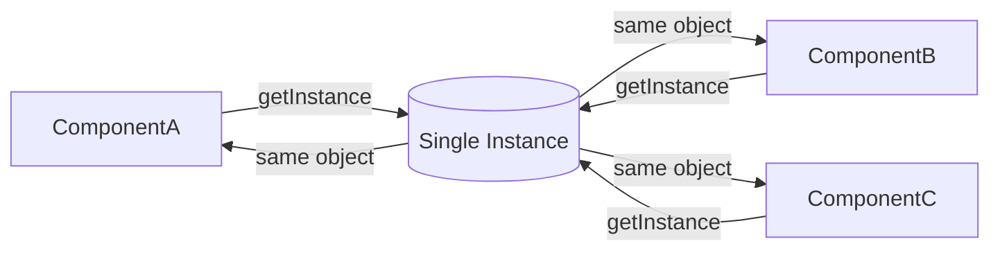
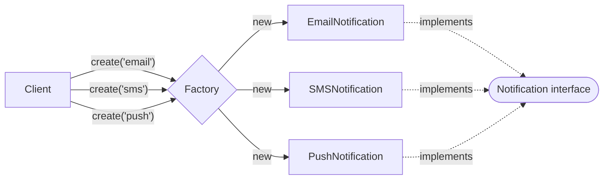
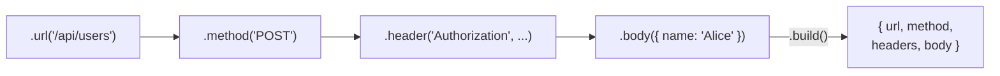

## Creational Patterns

Creational patterns solve the problem of *how objects come into existence*. When you hard-code `new ConcreteClass()` everywhere, changing that class means changing every call site. Creational patterns centralise and abstract that decision.

### Singleton Pattern

A Singleton ensures a class has **only one instance** and provides a global access point to it. The constructor is private; a static `getInstance()` method returns the same instance every time.

Common uses: database connection pools, logger instances, configuration objects, caches. In JavaScript modules, the module system itself enforces singleton behaviour — a module's exported value is created once and cached by the bundler.

**The danger:** Singletons are global state. They make unit testing hard because tests can't easily swap out the singleton for a mock. Prefer dependency injection when testability matters.

#### When to use Singleton
- There must be **exactly one** shared resource (connection pool, config, logger, event bus)
- The resource is **expensive to create** and should be reused across the app
- You need a **global coordination point** that all parts of the app talk to

#### When NOT to use Singleton
- When you need to **swap the implementation** in tests — use dependency injection instead
- When you have **per-request state** (e.g. in a Node.js server, one Singleton auth context would be shared across all users)
- When you just want convenience — a plain exported object (`export const config = {}`) is simpler and equally singleton

#### Real World
> **Redux Store** — A Redux store is a Singleton by design. There is one store for the entire application, and every component reads from and dispatches to that single instance. `createStore()` enforces this — calling it twice creates a second independent store, which would break the whole state management contract.

#### Practice
1. Implement a `Logger` singleton in TypeScript that ensures only one instance exists across the entire application. How would you make this thread-safe if JavaScript were multi-threaded?
2. Why does the ES module system already give you Singleton behaviour for free? Write an example of a module-based singleton that doesn't use the `getInstance()` pattern.
3. You are writing unit tests for a module that uses a global Singleton cache. The cache from one test bleeds into another. What strategies can you use to solve this without abandoning the Singleton?



### Factory Pattern

A Factory is a method or class that **centralises object creation**. Instead of calling `new EmailNotification()` or `new SMSNotification()` at every call site, you call `NotificationFactory.create(type)` and the factory returns the right object.

Two forms:
- **Factory Method** — a method (often on a base class) that subclasses override to create their specific product.
- **Abstract Factory** — a factory of factories; creates families of related objects that need to stay consistent with each other (e.g., a `DarkThemeFactory` that creates dark-themed buttons, inputs, and modals together).

#### When to use Factory
- You have **multiple types** that share an interface and the caller shouldn't pick the concrete class
- The type to create is **determined at runtime** (from config, user input, or an API response)
- You want to **add new variants** in the future without touching calling code (OCP)
- You want to **centralise** the `new SomeClass()` calls so they're easy to find, swap, or mock in tests

#### When NOT to use Factory
- When you only ever create **one concrete type** — a factory around a single class is unnecessary complexity
- When the caller **legitimately needs to control** which concrete type it gets

#### Real World
> **React.createElement / JSX** — `React.createElement('div', props, children)` is a Factory. JSX compiles to `React.createElement` calls, abstracting away whether the result is a DOM element, a class component, or a function component. The factory decides; the caller just describes what it wants.

#### Practice
1. Build a `ShapeFactory.create(type: 'circle' | 'rectangle' | 'triangle'): Shape` that returns the correct shape object. What change is required when a new shape is added, and how does this compare to using a `switch` statement directly in the calling code?
2. What is the difference between a Factory Method and an Abstract Factory? Give an example where Abstract Factory is the right choice over a simple Factory Method.
3. How does the `document.createElement(tag)` DOM API demonstrate the Factory pattern? What problem would exist if the browser required callers to `new HTMLDivElement()` directly?



### Builder Pattern

A Builder separates the **construction of a complex object from its representation**. Instead of a constructor with 10 parameters (`new User(name, email, age, role, avatar, bio, ...)`), a Builder chains method calls to configure only what you need.

The pattern has two key participants:
- **Builder** — the object with chainable setter methods that accumulates configuration
- **Director** (optional) — orchestrates the builder to produce a known configuration

Builders are especially useful for: SQL query builders, HTTP request configuration, test fixture creation, complex DOM structures.

#### When to use Builder
- The object has **many optional parameters** — a constructor with 8 args where most are optional is a smell
- The **construction order matters** (e.g. must set a URL before setting headers)
- You want **readable, self-documenting** object construction at the call site
- You need to **produce different representations** of the same object (e.g. a query that renders as SQL or as a MongoDB filter)

#### When NOT to use Builder
- When the object is **simple** with 1–3 required fields — a plain constructor or object literal is cleaner
- When all parameters are **always required** — a Builder adds no value if nothing is optional

#### Real World
> **Prisma Query Builder** — `prisma.user.findMany({ where: { age: { gt: 18 } }, select: { name: true }, take: 10 })` is a Builder-style API. You declaratively specify only the parts you need, and Prisma assembles the SQL. Without a builder, you'd pass a massive object literal or use a dozen different methods.

#### Practice
1. Implement a `QueryBuilder` class with chainable methods `select()`, `from()`, `where()`, and `build()` that returns an SQL string. Why is this better than passing a configuration object directly?
2. How do you handle **required** parameters in a Builder pattern? If `table` is mandatory for a `QueryBuilder`, where should that validation happen?
3. What is the difference between the Builder pattern and method chaining / fluent interfaces? Is every fluent interface a Builder?



## Choosing the Right Pattern

Ask yourself one question at a time:

```
How many instances do I need?
  └── Exactly one, shared globally  →  Singleton

The right answer depends on runtime input?
  └── Yes, caller passes a type/key  →  Factory

The object is complex to construct?
  └── Many optional parts, order matters  →  Builder

None of the above  →  just use  new MyClass(a, b)
```

| Pattern | Core question | Signature signal |
|---|---|---|
| Singleton | How many instances? | `getInstance()` / module export |
| Factory | Which class do I instantiate? | `create(type)` returns an interface |
| Builder | How do I assemble it? | `.step().step().build()` chain |

## ELI5

**Singleton** — Imagine your town has one post office. No matter where you go to mail a letter, it's the same post office. Everyone shares it. There's only ever one.

**Factory** — You go to a car dealership and say "I want a sedan." You don't build the car yourself — the dealer (factory) figures out which car to give you based on your request. You don't need to know how it's built.

**Builder** — Ordering a custom sandwich: you say "sourdough bread, no mayo, extra cheese, add avocado." The chef (builder) assembles it step by step based on your choices. You can specify as many or as few options as you want.

## Template

```ts
// Singleton
class Config {
  private static instance: Config;
  private data: Record<string, string> = {};
  private constructor() {}
  static getInstance(): Config {
    if (!Config.instance) Config.instance = new Config();
    return Config.instance;
  }
  get(key: string) { return this.data[key]; }
  set(key: string, val: string) { this.data[key] = val; }
}

// Factory Method
interface Notification { send(msg: string): void; }
class EmailNotification implements Notification { send(msg: string) { console.log(`Email: ${msg}`); } }
class SMSNotification implements Notification { send(msg: string) { console.log(`SMS: ${msg}`); } }
function createNotification(type: 'email' | 'sms'): Notification {
  if (type === 'email') return new EmailNotification();
  return new SMSNotification();
}

// Builder
class RequestBuilder {
  private config: { url?: string; method?: string; headers: Record<string, string>; body?: unknown } = { headers: {} };
  url(url: string) { this.config.url = url; return this; }
  method(method: string) { this.config.method = method; return this; }
  header(key: string, val: string) { this.config.headers[key] = val; return this; }
  body(body: unknown) { this.config.body = body; return this; }
  build() {
    if (!this.config.url) throw new Error('URL is required');
    return this.config;
  }
}

// Usage
const req = new RequestBuilder()
  .url('/api/users')
  .method('POST')
  .header('Authorization', 'Bearer token')
  .body({ name: 'Alice' })
  .build();
```
