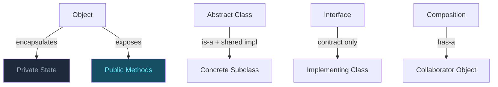

## OOP Fundamentals

Object-Oriented Programming organises code around objects — bundles of state and behaviour. The four pillars (encapsulation, abstraction, inheritance, polymorphism) are not just theory; they are the design vocabulary behind every GoF pattern.

### The Four Pillars

**Encapsulation** means hiding internal state and only exposing controlled behaviour through public methods. A `BankAccount` shouldn't let you directly set `balance`; it exposes `deposit()` and `withdraw()` so invariants (like "balance can't go negative") are always enforced.

**Abstraction** means hiding complexity. A `PaymentGateway` interface exposes `charge(amount)` — callers don't need to know whether it talks to Stripe, PayPal, or a bank API underneath. Abstraction is what makes code swappable and testable.

**Inheritance** lets a subclass reuse and extend a parent's behaviour. A `Dog` extends `Animal` and inherits `eat()` while overriding `speak()`. But inheritance creates tight coupling — changing the parent can break all children.

**Polymorphism** lets you write code against a common type and have different subtypes behave differently at runtime. A function that accepts an `Animal` can call `speak()` without knowing whether it has a `Dog` or `Cat`.

#### Real World
> **React** — React's component model is OOP polymorphism at work. A `renderComponent(component)` function doesn't know whether `component` is a `Button`, `Modal`, or `Form`. Each implements the same `render()` interface. The reconciler calls the same method on all of them and gets the right output.

#### Practice
1. You have a `Shape` base class with an `area()` method. `Circle` and `Rectangle` both extend it. Write this using inheritance, then explain where polymorphism is happening and what benefit it provides.
2. A `UserProfile` class has a `private password` field. Explain why keeping it private is encapsulation, and what invariant it protects. What would go wrong if `password` were public?
3. What is the difference between encapsulation and abstraction? Give a concrete frontend example where they are *both* present in the same class.

### Composition vs Inheritance

**Inheritance** (`is-a` relationship) creates tight coupling. Changing `Animal` can silently break `Dog`. Deep hierarchies become impossible to reason about. JavaScript's single-prototype chain means you can only inherit from one class.

**Composition** (`has-a` relationship) assembles behaviour from small, focused objects. A `User` object can `has-a` `Logger`, `has-a` `Validator`, and `has-a` `Cache` — all independently replaceable and testable. React Hooks are composition applied to UI logic.

The GoF book itself says: *"Favour object composition over class inheritance."* This is one of the most important design principles.

#### Real World
> **React Hooks** — Before hooks, React used class inheritance (`extends Component`) to share logic. After hooks, behaviour is composed: `useAuth()`, `useFetch()`, `useLocalStorage()` are all independent units that any component can mix together without any inheritance hierarchy. This is composition making codebases dramatically more flexible.

#### Practice
1. You have `FlyingAnimal` and `SwimmingAnimal` subclasses of `Animal`. A `Duck` can both fly and swim. How does JavaScript's single-inheritance model make this awkward, and how does composition solve it?
2. Refactor a class that uses `extends Logger` to inherit logging behaviour into one that uses `has-a` composition instead. What does the calling code change look like?
3. When is inheritance still the right choice over composition? Give one case where using composition instead would actually be worse.

### Abstract Classes vs Interfaces

**Abstract classes** can contain both abstract methods (no body — subclasses must implement) and concrete methods (with a shared body). They model an `is-a` relationship and share implementation. TypeScript/JS has `abstract class`.

**Interfaces** are pure contracts — they define the shape but contain no implementation. In TypeScript, `interface` (or a structural type) lets unrelated classes satisfy the same contract. A `Dog` and a `Robot` can both implement `Speakable` even though they have nothing else in common.

**Key rule:**
- Use an abstract class when you want to *share implementation* across related types.
- Use an interface when you want to *define a contract* that unrelated types can fulfil.

#### Real World
> **TypeScript ORM (Prisma/TypeORM)** — Database entity base classes use abstract classes to share `createdAt`, `updatedAt` fields and a `save()` method across all entities. Meanwhile, `Serializable`, `Cacheable`, and `Auditable` are interfaces that individual entities opt into regardless of their inheritance hierarchy.

#### Practice
1. You are building a plugin system. Each plugin has a required `execute()` method, and some plugins share a `retry()` helper. Would you model the base as an abstract class or an interface, and why?
2. In TypeScript, both `interface` and `type` can describe object shapes. What can an `interface` do that a `type` cannot, and when does this matter for OOP design?
3. JavaScript has no native `interface` keyword. How does TypeScript's structural typing achieve interface-like contracts, and what does "duck typing" mean in this context?



## ELI5

**Encapsulation** is like a TV remote. You press buttons (public methods) without needing to know the circuit board inside (private state). The remote protects the internals so you can't accidentally break them.

**Inheritance** is like a family recipe handed down. You get Grandma's base recipe (`Animal`) and add your own twist (`Dog` barks). But if Grandma changes her recipe, everyone's dish changes too.

**Composition** is like building a sandwich. You pick your own bread, filling, and sauce independently. Nothing is locked together. Want a different sauce tomorrow? Just swap it out.

**Abstract class vs Interface:**
- Abstract class = a partly-filled-in form. Some answers are already there (shared methods), you just fill in the blanks.
- Interface = an empty form. You fill in everything yourself. But anyone — no matter their "family" — can fill in the same form.

## Template

```ts
// Encapsulation
class BankAccount {
  private balance = 0;
  deposit(amount: number) { this.balance += amount; }
  withdraw(amount: number) {
    if (amount > this.balance) throw new Error('Insufficient funds');
    this.balance -= amount;
  }
  getBalance() { return this.balance; }
}

// Polymorphism via interface
interface Shape {
  area(): number;
}
class Circle implements Shape {
  constructor(private r: number) {}
  area() { return Math.PI * this.r ** 2; }
}
class Rectangle implements Shape {
  constructor(private w: number, private h: number) {}
  area() { return this.w * this.h; }
}
function printArea(s: Shape) { console.log(s.area()); } // polymorphic

// Composition over inheritance
class Logger {
  log(msg: string) { console.log(`[LOG] ${msg}`); }
}
class Validator {
  validate(email: string) { return /\S+@\S+/.test(email); }
}
class UserService {
  private logger = new Logger();       // has-a
  private validator = new Validator(); // has-a
  register(email: string) {
    if (!this.validator.validate(email)) throw new Error('Bad email');
    this.logger.log(`Registered ${email}`);
  }
}

// Abstract class
abstract class Animal {
  abstract speak(): string;
  breathe() { return 'inhale...exhale'; } // shared concrete method
}
class Dog extends Animal {
  speak() { return 'Woof'; }
}
```
