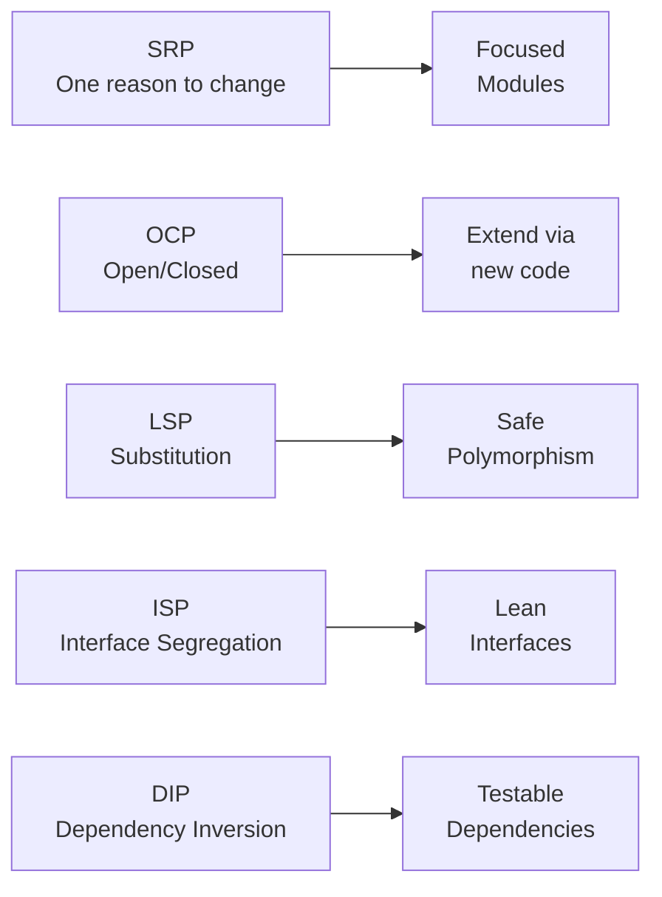

## SOLID Principles

SOLID is an acronym for five object-oriented design principles introduced by Robert C. Martin. They don't tell you *what* to build — they tell you *how* to structure code so it stays maintainable as requirements change.

### S — Single Responsibility Principle

A class or module should have **one reason to change**. "One reason to change" means one person or team could request a modification. A `UserManager` that fetches users, caches them, validates emails, and formats names has four reasons to change — one per concern.

Splitting into `UserApi`, `UserCache`, `EmailValidator`, and `formatUserName` means each module changes independently, can be tested alone, and can be swapped without affecting the others.

#### Real World
> **GitHub Actions** — Each Action in a workflow is a single-responsibility unit: one action fetches code (`actions/checkout`), another sets up Node (`actions/setup-node`), another runs tests. If the test runner changes, only that step is updated — the checkout step is untouched. This is SRP applied to CI pipelines.

#### Practice
1. A `ReportService` class fetches data from an API, formats it as a PDF, sends it via email, and logs the result. Identify each responsibility and sketch how you would split this into focused modules.
2. How is SRP different from the rule "each function should do one thing"? Can a class with ten methods still follow SRP?
3. Why is "one reason to change" a better mental model than "one method per class"? Give an example where a class with multiple methods still has a single responsibility.

### O — Open/Closed Principle

Software entities should be **open for extension, closed for modification**. Once a module is written and tested, you shouldn't have to edit it to add new behaviour. Instead, you add new code (a new class, plugin, or strategy) that plugs in.

The classic implementation: use polymorphism. A `DiscountCalculator` with a big `if/else` chain for each discount type must be modified for every new type. Replace it with a `Discount` interface and a list of strategies — adding a new discount type means adding a new class without touching `DiscountCalculator`.

#### Real World
> **Express.js Middleware** — Express itself never needs to change when you add a new middleware (auth, logging, rate limiting). The pipeline is closed for modification but open for extension: you plug in new middleware without editing Express's core. This is OCP at the framework level.

#### Practice
1. A `NotificationService` has `if (type === 'email') {...} else if (type === 'sms') {...}`. Every new channel requires editing this method. Refactor it to follow OCP.
2. Why does OCP not mean "never modify code"? What does it mean for a module to be "stable" and when is it appropriate to modify it?
3. What is the relationship between OCP and the Strategy pattern? How does Strategy help achieve OCP for algorithms?

### L — Liskov Substitution Principle

Subclasses must be **substitutable for their base class** without breaking the program. If you have code that works with a `Bird`, it should work correctly with a `Parrot` — a subclass — without any special-casing.

The famous violation: `Square extends Rectangle`. A `Rectangle` lets you set width and height independently. A `Square` must keep them equal. Code that sets `rect.width = 5; rect.height = 10` and expects area `50` breaks with a `Square`. The class hierarchy is wrong — Square is not a substitutable Rectangle.

#### Real World
> **React components as LSP** — A base `Button` component and a `PrimaryButton` subcomponent should be interchangeable anywhere a `Button` is expected. If `PrimaryButton` changes the `onClick` signature or silently ignores `disabled`, it violates LSP and becomes a trap for callers.

#### Practice
1. `ReadOnlyList extends List`. `List` has a `push()` method. `ReadOnlyList.push()` throws an exception. Does this violate LSP? Why or why not?
2. What are preconditions and postconditions, and how do they relate to LSP? Give an example of a subclass that strengthens preconditions and why that is a violation.
3. How does LSP relate to interface design? If you notice that a subclass keeps throwing `NotImplementedError` for some parent methods, what does that tell you about the abstraction?

### I — Interface Segregation Principle

Clients should not be forced to depend on interfaces they don't use. A fat `Worker` interface with `work()`, `eat()`, `sleep()`, and `configure()` forces a `Robot` class to implement `eat()` and `sleep()` that make no sense for it.

Split fat interfaces into focused ones: `Workable`, `Feedable`, `Configurable`. A class implements only the interfaces relevant to it. Callers depend only on the narrow interface they actually need — making the system more flexible and easier to test.

#### Real World
> **TypeScript generics in React** — A `<List<T>>` component shouldn't require `T` to implement a full `Model` interface with `save()`, `validate()`, and `serialize()` when all it needs is `id` and `label`. ISP says: define a minimal interface `{ id: string; label: string }` for what the component actually uses.

#### Practice
1. A `Printer` interface has `print()`, `scan()`, `fax()`, and `staple()`. A `BasicPrinter` class only supports printing but must implement the others as stubs. How do you fix this with ISP?
2. How does ISP relate to the concept of "role interfaces" vs "header interfaces"? Which style does ISP recommend?
3. In TypeScript, how do intersection types (`A & B`) and union types (`A | B`) help implement ISP? Give a scenario where you'd use each.

### D — Dependency Inversion Principle

High-level modules should not depend on low-level modules. **Both should depend on abstractions.** Abstractions should not depend on details — details should depend on abstractions.

In practice: a `UserService` (high-level) should not `import MySQLUserRepository` (low-level, concrete). Instead, define an `IUserRepository` interface and inject the implementation. Now `UserService` depends on the abstraction; `MySQLUserRepository` implements it. Swapping to Postgres requires zero changes to `UserService`.

This is what makes unit testing possible: inject a mock `IUserRepository` in tests without touching a real database.

#### Real World
> **Dependency injection in NestJS** — NestJS's `@Injectable()` and constructor injection are DIP made explicit. A `UserService` declares `constructor(private repo: UserRepository)` against the abstract class/interface, and the IoC container resolves the concrete implementation at runtime. Tests inject a mock; production uses the real Postgres repo — same service code throughout.

#### Practice
1. A `PaymentService` directly instantiates `new StripeClient()` inside its constructor. Explain what problem this causes for testing and how DIP solves it.
2. What is the difference between "Dependency Inversion" and "Dependency Injection"? Are they the same thing?
3. How do React's Context API and custom hooks implement DIP for UI components? Show how a component can depend on a `useAuth` abstraction instead of directly calling `firebase.auth()`.



## ELI5

**SRP** — A chef should only cook, not also deliver food and do accounting. One job, one reason to show up.

**OCP** — A USB port never changes, but you can plug in anything new. The port is closed for modification, open for extension.

**LSP** — If a recipe says "use a cup of liquid", water, milk, or juice should all work fine — they're substitutable liquids. If one of them explodes the dish, it wasn't a valid substitute.

**ISP** — Don't make a pizza chef learn to change car tires just because the restaurant hired a "universal worker". Split the job into focused roles.

**DIP** — A TV remote controls any brand TV because both follow the same IR signal standard. The remote (high-level) depends on the standard (abstraction), not on the specific TV model (concrete detail).

## Template

```ts
// SRP — separate concerns
class UserApi { async fetch(id: string) { /* ... */ } }
class UserCache { get(id: string) { /* ... */ } set(id: string, u: unknown) { /* ... */ } }

// OCP — extend via strategy
interface Discount { apply(price: number): number; }
class PercentDiscount implements Discount { apply(p: number) { return p * 0.9; } }
class FlatDiscount implements Discount { apply(p: number) { return p - 10; } }
class Cart {
  constructor(private discounts: Discount[]) {}
  total(price: number) { return this.discounts.reduce((p, d) => d.apply(p), price); }
}

// LSP — safe substitution
abstract class Storage {
  abstract read(key: string): string | null;
  abstract write(key: string, val: string): void;
}
class LocalStorage extends Storage { /* ... */ }
class SessionStorage extends Storage { /* ... */ }

// ISP — lean interfaces
interface Readable { read(): string; }
interface Writable { write(data: string): void; }
class ReadOnlyFile implements Readable { read() { return '...'; } }
class ReadWriteFile implements Readable, Writable { read() { return '...'; } write(d: string) { /* ... */ } }

// DIP — depend on abstraction
interface IUserRepo { find(id: string): Promise<{ name: string }> }
class UserService {
  constructor(private repo: IUserRepo) {}
  async getName(id: string) { return (await this.repo.find(id)).name; }
}
// In tests: new UserService({ find: async () => ({ name: 'Mock' }) })
// In prod:  new UserService(new PostgresUserRepo())
```
