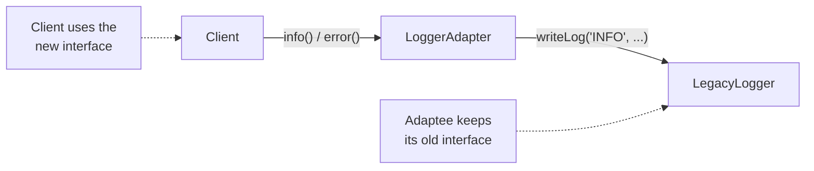
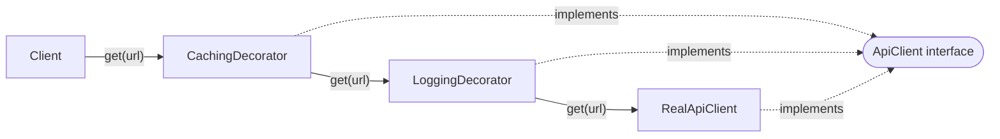
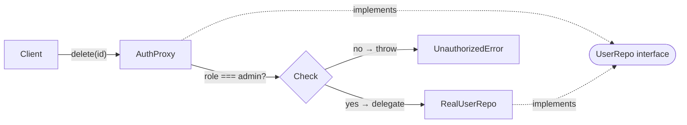
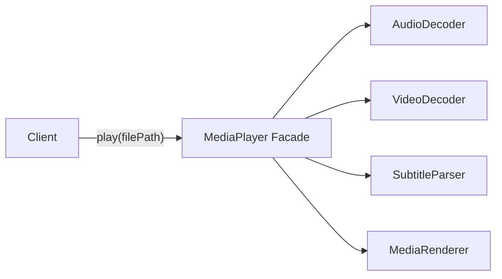
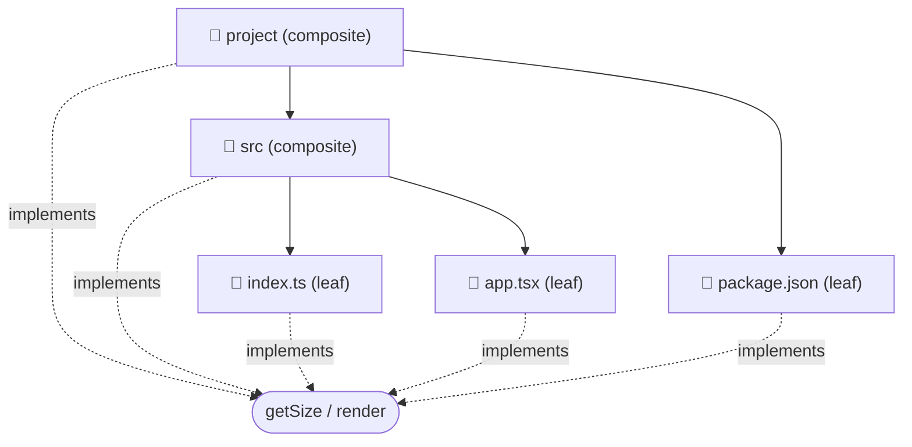

## Structural Patterns

Structural patterns are about *composition* — how you connect objects and classes to build larger, more capable structures. All four patterns here are "wrapper" patterns: they wrap an existing object and expose it through a new or modified interface.

### Adapter Pattern

An Adapter converts the interface of a class into another interface that the client expects. It acts as a translator between incompatible interfaces without changing the source code of either side.

Classic analogy: a travel power adapter. The socket in Europe speaks `220V/Type-C`; your device speaks `110V/Type-A`. The adapter translates without modifying the wall socket or your device.

Two forms:
- **Object adapter** — wraps the adaptee as a field (preferred in JS/TS)
- **Class adapter** — extends the adaptee (only works with single-inheritance languages)

#### When to use Adapter
- You need to integrate a **third-party library or legacy class** whose interface doesn't match what your app expects
- You want to **swap out a dependency** (e.g. replace `fetch` with Axios) without touching every call site
- You're working with **multiple data sources** that return different shapes — adapt each one to a common interface
- Classic signals: "wrap this library", "make X work like Y", "legacy integration"

#### When NOT to use Adapter
- When you **control both sides** — just change the interface directly instead of adding an indirection layer
- When the interfaces are so different that the adapter becomes large and complex — consider redesigning instead

#### Real World
> **Axios / Fetch wrapper** — Many codebases write an `ApiClient` adapter over `fetch`. The application depends on `ApiClient.get(url)` — a simple interface. Inside, the adapter maps that to `fetch(url, { method: 'GET', headers: {...} })`. Swapping `fetch` for Axios later only changes the adapter, not a single call site in the application.

#### Practice
1. You have a legacy `OldLogger` class with a `writeLog(level, message)` method. The rest of your app uses a `Logger` interface with `info(message)`, `warn(message)`, and `error(message)`. Write an Adapter that makes `OldLogger` satisfy the `Logger` interface.
2. What is the difference between an Adapter and a Facade? Both wrap something and expose a new interface — what is the key distinction?
3. How does the Adapter pattern appear in the context of React's `useReducer` + `Context` pattern when used to wrap a complex state library?



### Decorator Pattern

A Decorator adds new behaviour to an object dynamically by wrapping it. Both the decorator and the wrapped object implement the same interface — so the caller can't tell whether they're talking to the original or a decorated version.

Decorators are composable: you can stack multiple decorators, each adding its own behaviour, without any of them knowing about the others. `new LoggingDecorator(new CachingDecorator(new UserService()))`.

Key insight: this is composition at runtime, not compile-time subclassing. You choose which behaviours to stack without an explosion of subclasses.

#### When to use Decorator
- You need to add **cross-cutting concerns** (logging, caching, retry, auth) to an existing object without modifying it
- The behaviours need to be **composable and stackable** — different combinations for different contexts
- You want to follow **OCP** — extend behaviour without editing the original class
- Classic signals: "wrap with extra behaviour", "add logging/caching/retry transparently", "middleware pipeline"

#### When NOT to use Decorator
- When you only need to add behaviour **once, to one class** — just subclass or modify it directly
- When the wrapping chain gets **too deep** — more than 3–4 layers becomes hard to debug and reason about

#### Real World
> **Express Middleware** — Each `app.use(middleware)` adds a decorator layer. A request passes through logging, then auth, then rate-limiting, then the route handler. Each layer wraps the next. The route handler doesn't know or care about the layers around it. Adding or removing cross-cutting behaviour is just adding or removing a middleware.

#### Practice
1. Implement a `CachedApiClient` decorator that wraps any `ApiClient` and caches responses by URL. It must implement the same `ApiClient` interface so it can be used as a drop-in replacement.
2. Explain why using the Decorator pattern is better than subclassing when you want to add caching *and* logging *and* retry logic to an existing service. How many subclasses would the inheritance approach require?
3. TypeScript has a `@decorator` syntax (experimental). How does it relate to the GoF Decorator pattern? What is different about TypeScript class decorators?



### Proxy Pattern

A Proxy provides a surrogate or placeholder that controls access to another object. It implements the same interface as the real object but adds logic around each method call — access control, lazy initialisation, caching, logging, or remote communication.

Three common proxy types:
- **Virtual proxy** — delays expensive initialisation until the object is actually needed (lazy loading)
- **Protection proxy** — checks permissions before delegating to the real object
- **Remote proxy** — represents an object in a different process or server (gRPC stubs are remote proxies)

**Decorator vs Proxy:** Both wrap an object with the same interface. The difference is *intent*. A Decorator adds new features. A Proxy controls or mediates access to the existing features. In practice, the code looks nearly identical.

#### When to use Proxy
- You need **access control** — check permissions before delegating (protection proxy)
- You need **lazy initialisation** — defer creating an expensive object until it's actually used (virtual proxy)
- You need **transparent caching** — intercept reads and serve cached results without the caller knowing (caching proxy)
- You need to represent an object **in a different process or server** — gRPC stubs, remote API clients (remote proxy)
- Classic signals: "guard access to X", "lazy-load X", "intercept property reads/writes"

#### When NOT to use Proxy
- When you want to **add new behaviour** — that's Decorator, not Proxy
- When the interception logic is simple enough to just put **inside the real class** directly

#### Real World
> **JavaScript Proxy object** — The built-in `new Proxy(target, handler)` is the language-level implementation of this pattern. Vue 3's reactivity system wraps component data in a `Proxy` — when you read or write a property, the proxy's `get`/`set` traps run, triggering dependency tracking and re-renders automatically.

#### Practice
1. Implement a `PermissionProxy` that wraps a `UserRepository` and throws an `UnauthorizedError` if the current user's role is not `'admin'` before delegating `delete()` calls.
2. How does JavaScript's built-in `Proxy` object implement the Proxy pattern? What are the `get` and `set` traps and how does Vue 3 use them for reactivity?
3. What is a "lazy loading proxy" and how would you implement one for an expensive database connection that should only be created when first used?



### Facade Pattern

A Facade provides a simplified interface to a complex subsystem. It doesn't wrap a single object — it wraps an entire set of classes, coordinating them behind a single, easy-to-use entry point. The subsystem classes still exist and can be used directly by advanced users; the Facade just makes the common case simple.

The Facade doesn't hide the subsystem — it provides a *convenience layer* over it. Libraries often expose a Facade as their public API while their internals are far more complex.

#### When to use Facade
- A subsystem has **many interdependent classes** and callers only ever use a small, predictable subset of operations
- You want to **reduce coupling** between client code and a complex library or set of services
- You're building a **public API** over internal complexity — the facade becomes the contract, the internals can change freely
- Classic signals: "simplify this subsystem", "one entry point for the common case", "wrap multiple services into one call"

#### When NOT to use Facade
- When callers genuinely need **fine-grained control** over the subsystem — a facade would hide too much
- When the subsystem is **already simple** — a facade over three trivial methods adds indirection for no gain

#### Real World
> **jQuery's `$.ajax()`** — Under the hood, `$.ajax()` coordinates `XMLHttpRequest`, serialisation, content-type negotiation, error handling, and callbacks. The caller just writes `$.ajax({ url, method, data, success })`. The complex subsystem is still there; the Facade makes the common case trivial.

#### Practice
1. You have a complex media processing subsystem: `AudioDecoder`, `VideoDecoder`, `SubtitleParser`, and `MediaRenderer`. Build a `MediaPlayer` Facade with a single `play(filePath)` method that coordinates all four.
2. What is the difference between a Facade and an Adapter? They both expose a new interface — what is the key architectural distinction?
3. When would you *not* want to use a Facade? Describe a scenario where exposing the subsystem directly to callers is the better design choice.



### Composite Pattern

The Composite pattern lets you **treat individual objects and groups of objects uniformly** through a shared interface. Both a single `File` (leaf) and a `Folder` full of files (composite) respond to `getSize()` — the caller never needs to know which one it has.

**Key insight:** A Folder's `getSize()` recursively sums its children. The recursion terminates at File leaves. The calling code is identical for both.

#### When to use Composite
- You have a **tree structure** where individual nodes and groups of nodes need to be treated the same way
- You want to apply an operation **recursively** over a hierarchy without caring whether a node is a leaf or a branch
- Classic signals: file system, DOM tree, organisation chart, React component tree, menu with submenus

#### When NOT to use Composite
- When the leaf and composite interfaces are **too different** to unify — forcing a common interface creates awkward no-op methods on leaves
- When the tree is shallow and fixed — a simple recursive function over plain objects may be cleaner

#### Real World
> **React component tree** — Every React component, whether a leaf `<Button>` or a composite `<Form>` wrapping dozens of children, responds to the same `render()` call. React's reconciler recurses through the tree calling render on each node without distinguishing leaves from composites.

#### Practice
1. Build a `FileSystem` using Composite where `File` (leaf) and `Folder` (composite) both implement `getSize()` and `render(indent)`. A folder's `getSize()` should recursively sum all children.
2. How does the DOM implement the Composite pattern? What are the `leaf` and `composite` types in the DOM tree?
3. What problem arises when you need a method that only makes sense on a composite (e.g. `add(child)`) but not on a leaf? How do you handle this in the interface?



## Choosing the Right Pattern

```
Incompatible interface from a library or legacy class?
  └── Yes  →  Adapter

Want to add behaviour (logging, caching, retry) without modifying the class?
  └── Yes  →  Decorator

Want to control access, lazy-load, or intercept calls?
  └── Yes  →  Proxy

Want to simplify a whole subsystem behind one entry point?
  └── Yes  →  Facade

Have a tree structure — leaves and branches need the same interface?
  └── Yes  →  Composite
```

| Pattern | Wraps | Intent | Key question |
|---|---|---|---|
| Adapter | One class | Convert interface A → B | "How do I make this fit?" |
| Decorator | One object | Add behaviour | "How do I extend without modifying?" |
| Proxy | One object | Control access | "How do I guard or intercept?" |
| Facade | Entire subsystem | Simplify complexity | "How do I make this easier to use?" |
| Composite | Tree of objects | Uniform leaf + branch interface | "How do I treat parts and wholes the same?" |

**Decorator vs Proxy** — the most common confusion:
- Both wrap an object behind the same interface and the code looks identical
- **Decorator**: the wrapper *enriches* — it adds logging, caching, retry on top of the original
- **Proxy**: the wrapper *controls* — it decides whether to forward the call at all (permission check, lazy init)
- Ask: "Am I adding something new, or gating what already exists?" — the answer tells you which one it is

## ELI5

**Adapter** — Your phone charger has a USB-C plug but the hotel only has old USB-A ports. You use a little adapter in between. Neither the phone nor the hotel changes — the adapter translates.

**Decorator** — A plain coffee cup. You add a sleeve (warm), then a lid (spill-proof), then a label (personalised). Each addition wraps the previous. The cup is still a cup — it just has more features now.

**Proxy** — A secretary who sits outside the CEO's office. You have to go through them to get to the CEO. They check if you have an appointment (protection proxy), or maybe handle simple requests themselves (caching proxy) so the CEO isn't bothered.

**Facade** — The cockpit of an airplane has thousands of buttons. But the autopilot button is the Facade — one button that coordinates all of them for the common case. The buttons are still there for experts; the Facade makes the routine case easy.

## Template

```ts
// Adapter
interface Logger { info(msg: string): void; error(msg: string): void; }
class LegacyLogger { writeLog(level: string, msg: string) { console.log(`[${level}] ${msg}`); } }
class LoggerAdapter implements Logger {
  constructor(private legacy: LegacyLogger) {}
  info(msg: string) { this.legacy.writeLog('INFO', msg); }
  error(msg: string) { this.legacy.writeLog('ERROR', msg); }
}

// Decorator
interface TextTransformer { transform(text: string): string; }
class UpperCaseTransformer implements TextTransformer { transform(t: string) { return t.toUpperCase(); } }
class TrimDecorator implements TextTransformer {
  constructor(private wrapped: TextTransformer) {}
  transform(t: string) { return this.wrapped.transform(t.trim()); }
}

// Proxy (protection)
interface UserRepo { delete(id: string): void; }
class RealUserRepo implements UserRepo { delete(id: string) { console.log(`deleted ${id}`); } }
class AuthProxy implements UserRepo {
  constructor(private repo: UserRepo, private role: string) {}
  delete(id: string) {
    if (this.role !== 'admin') throw new Error('Unauthorized');
    this.repo.delete(id);
  }
}

// Facade
class VideoFacade {
  private decoder = new VideoDecoder();
  private audio = new AudioDecoder();
  private renderer = new MediaRenderer();
  play(path: string) {
    const video = this.decoder.decode(path);
    const audio = this.audio.decode(path);
    this.renderer.render(video, audio);
  }
}
```
