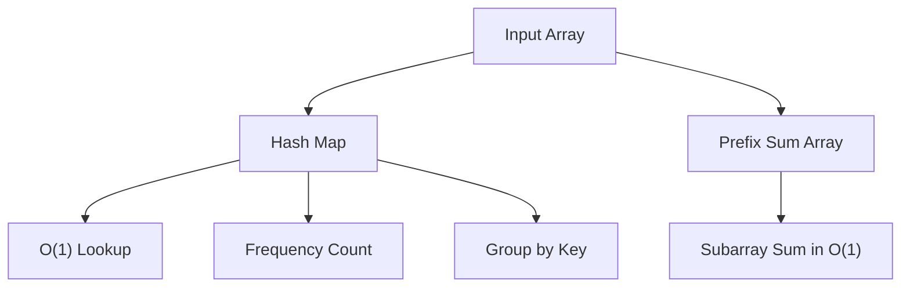

## Arrays & Hashing

Arrays and hash maps form the backbone of most coding interview problems. The key insight is trading space for time: by storing values in a hash map, you convert O(n) lookups into O(1) operations.

### Core Techniques

**Hash Map for O(1) Lookup:** When you need to check if a value exists or find its index, store elements in a hash map as you iterate. The classic "Two Sum" problem exemplifies this: instead of checking every pair in O(n²), store each number's index and look up the complement in O(1).

**Frequency Counting:** Use a hash map to count occurrences of each element. This unlocks problems like finding duplicates, checking anagrams, identifying the most common element, and validating permutations.

**Grouping by Key:** Transform each element into a canonical key and group elements that share the same key. For example, group anagrams by sorting each word to produce a key, or group by frequency to solve top-K problems.

**Prefix Sums:** Precompute cumulative sums so that any subarray sum can be calculated in O(1) as `prefix[right] - prefix[left - 1]`. Combined with a hash map tracking prefix sums seen so far, this solves subarray-sum-equals-K problems efficiently.

#### Real World
> **[Google Search]** — Autocomplete and search-result deduplication rely on frequency maps to count and rank candidate terms across billions of queries. Hash maps make these lookups O(1) per query instead of scanning the full index each time.

#### Practice
1. Given an array of integers and a target, return the indices of two numbers that add up to the target (Two Sum). Implement this in O(n) using a hash map.
2. Given a list of strings, group all anagrams together and return the groups.
3. Why is a hash map preferred over sorting for the "find duplicates" problem when the array is unsorted and large?



### Complexity

Most hash-based solutions run in O(n) time and O(n) space. The pattern is: iterate once, store what you need, and look up in constant time. When you see a problem asking about pairs, duplicates, frequencies, or subarray sums, reach for a hash map first.

#### Real World
> **[Amazon / E-commerce]** — Recommendation engines count item co-occurrences across millions of orders using frequency maps, then surface the top-K items in O(n log K) time using a min-heap combined with the frequency count.

#### Practice
1. Given an array of integers, find the top K frequent elements. What is the optimal time complexity?
2. Given a list of integers where every element appears twice except one, find the unique element. Can you do it in O(n) time and O(1) space?
3. When would you prefer a frequency array over a hash map, and why does this matter for performance?

### Common Pitfalls

Watch for hash collisions in edge cases, handle missing keys gracefully, and remember that the space-time tradeoff is almost always worth it in interviews.

#### Real World
> **[Financial Systems]** — Portfolio analytics systems use prefix sums to answer "what was the total return over any date range?" in O(1) after an O(n) preprocessing step, enabling real-time queries over years of daily data.

#### Practice
1. Given an integer array and a target sum K, count the number of contiguous subarrays whose sum equals K. Solve in O(n).
2. Given a binary array, find the maximum length of a contiguous subarray with an equal number of 0s and 1s.
3. Why does the prefix-sum-plus-hash-map approach need to initialize `prefixCount[0] = 1` before iterating? What bug does this prevent?

## ELI5

Imagine you have a big box of LEGO bricks mixed together, and you need to find two bricks of the same color.

**Without a hash map**, you pick up every brick and compare it to every other brick. That takes forever.

**With a hash map**, as you pick up each brick you drop it into a labeled bin — "red bin," "blue bin," "yellow bin." Checking if you've already seen a color is instant: just look at the bin label.

```
LEGO bricks: [red, blue, red, green, blue]

As you pick up each brick:

  pick up "red"   → drop in RED bin      → bins: { red: 1 }
  pick up "blue"  → drop in BLUE bin     → bins: { red: 1, blue: 1 }
  pick up "red"   → RED bin already has one! → FOUND A PAIR!

Without bins: compare every brick to every other brick (slow)
With bins:    check the label in one second (fast)
```

**Prefix sums** are like keeping a running total score in a game. Instead of adding up a range of scores from scratch every time, you pre-compute the totals so any range sum is just two numbers subtracted.

```
Scores:       [3,  1,  4,  1,  5]
Prefix sums:  [0,  3,  4,  8,  9, 14]

Sum from index 1 to 3 = prefix[4] - prefix[1] = 9 - 3 = 6  ✓
(No need to add 1+4+1 again — already computed!)
```

**The core trade-off:** you use more memory (the bins, the prefix array) to save time. Space for speed — almost always worth it.

## Poem

A hash map holds the key,
To lookups fast and free.
Count the frequencies with care,
Group by keys — find what pairs.

Prefix sums across the line,
Subarray totals work out fine.
Trade some space to conquer time,
Arrays and hashing — paradigm.

## Template

```ts
function hashMapPattern(nums: number[], target: number): number[] {
  const map = new Map<number, number>(); // value -> index

  for (let i = 0; i < nums.length; i++) {
    const complement = target - nums[i];

    if (map.has(complement)) {
      return [map.get(complement)!, i];
    }

    map.set(nums[i], i);
  }

  return [];
}

// Frequency counting pattern
function frequencyCount(arr: string[]): Map<string, number> {
  const freq = new Map<string, number>();

  for (const item of arr) {
    freq.set(item, (freq.get(item) ?? 0) + 1);
  }

  return freq;
}

// Prefix sum pattern
function prefixSum(nums: number[]): number[] {
  const prefix = new Array(nums.length + 1).fill(0);

  for (let i = 0; i < nums.length; i++) {
    prefix[i + 1] = prefix[i] + nums[i];
  }

  // Range sum [left, right] = prefix[right + 1] - prefix[left]
  return prefix;
}
```
