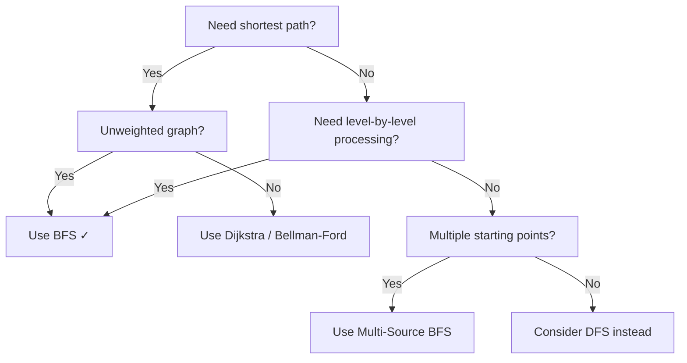
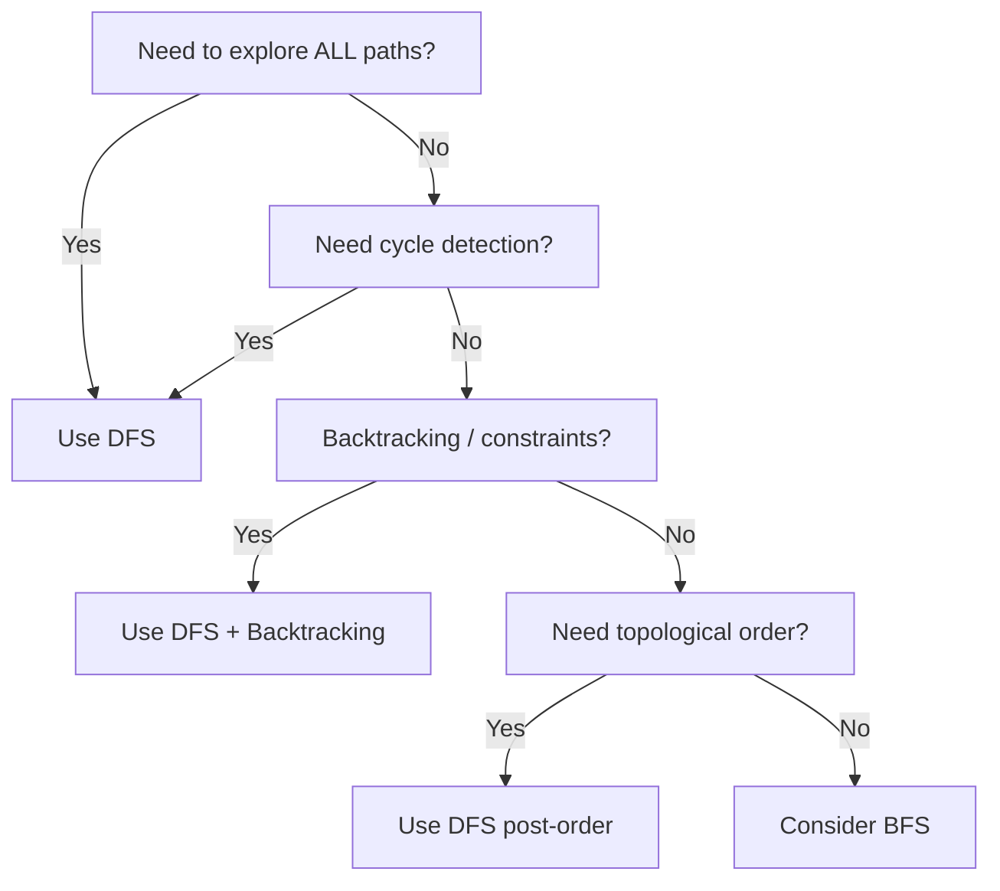
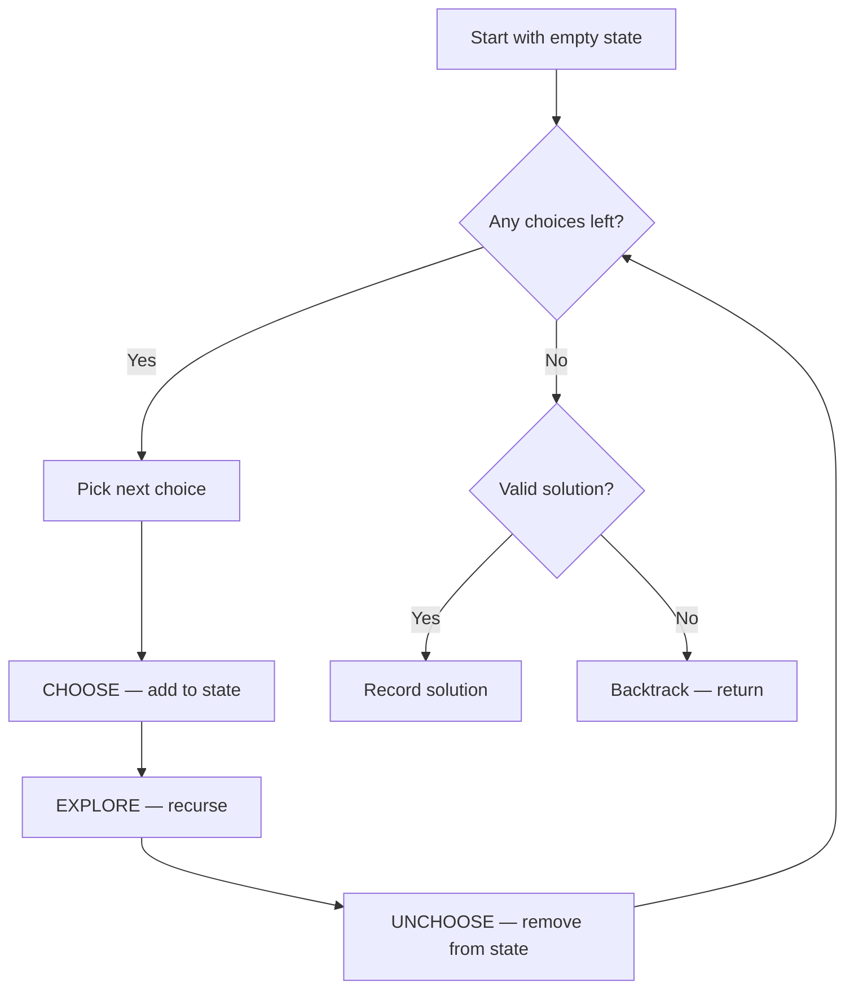
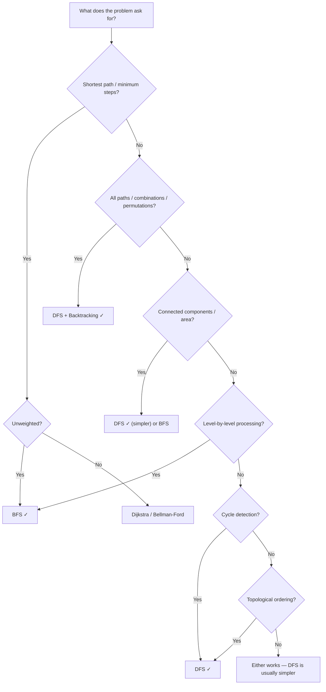

## BFS / DFS Deep Dive

BFS and DFS are the two fundamental graph traversal strategies. BFS explores level by level using a queue; DFS explores depth-first using a stack (or recursion). Together they form the backbone of nearly every graph, tree, and grid algorithm.

### BFS Fundamentals

BFS explores a graph level by level using a **queue** (first-in, first-out). It processes all nodes at distance 1 before distance 2, all at distance 2 before distance 3, and so on. This property guarantees the **shortest path in unweighted graphs**.

#### How BFS Works — Step by Step

```
Graph:  1 --- 2 --- 5
        |     |
        3 --- 4

Start at node 1. Goal: visit all nodes.

Queue: [1]         Visited: {1}
─────────────────────────────────────
Step 1: Dequeue 1 → neighbors 2, 3
  Queue: [2, 3]     Visited: {1, 2, 3}

Step 2: Dequeue 2 → neighbors 1(skip), 4, 5
  Queue: [3, 4, 5]  Visited: {1, 2, 3, 4, 5}

Step 3: Dequeue 3 → neighbors 1(skip), 4(skip)
  Queue: [4, 5]     Visited: {1, 2, 3, 4, 5}

Step 4: Dequeue 4 → neighbors 2(skip), 3(skip)
  Queue: [5]         Visited: {1, 2, 3, 4, 5}

Step 5: Dequeue 5 → neighbors 2(skip)
  Queue: []          Visited: {1, 2, 3, 4, 5}

Done! BFS order: 1 → 2 → 3 → 4 → 5
```

#### The BFS Template

```ts
function bfs(graph: Map<number, number[]>, start: number): number[] {
  const visited = new Set<number>([start]);
  const queue: number[] = [start];
  const order: number[] = [];

  while (queue.length > 0) {
    const node = queue.shift()!;
    order.push(node);

    for (const neighbor of graph.get(node) ?? []) {
      if (!visited.has(neighbor)) {
        visited.add(neighbor);   // mark visited BEFORE enqueuing — critical!
        queue.push(neighbor);
      }
    }
  }
  return order;
}
```

**Why mark visited when enqueuing, not when dequeuing?** If you wait until dequeuing, the same node can be added to the queue multiple times by different neighbors, leading to duplicate processing and TLE.

```
❌ Mark when dequeuing:
  Queue: [A] → dequeue A → add B, C
  Queue: [B, C] → dequeue B → B's neighbor C not yet dequeued → add C AGAIN
  Queue: [C, C] → C processed twice!

✅ Mark when enqueuing:
  Queue: [A] → dequeue A → mark B, C visited → add B, C
  Queue: [B, C] → dequeue B → C already visited → skip
  Queue: [C] → C processed once ✓
```

#### Level-Order BFS

When you need to know which "level" each node is on (distance from start), process the queue one level at a time:

```ts
function bfsLevels(graph: Map<number, number[]>, start: number): number[][] {
  const visited = new Set([start]);
  let queue = [start];
  const levels: number[][] = [];

  while (queue.length > 0) {
    levels.push([...queue]);       // all nodes at this level
    const nextQueue: number[] = [];

    for (const node of queue) {
      for (const neighbor of graph.get(node) ?? []) {
        if (!visited.has(neighbor)) {
          visited.add(neighbor);
          nextQueue.push(neighbor);
        }
      }
    }
    queue = nextQueue;
  }
  return levels;
}
// levels[0] = [start], levels[1] = distance-1 nodes, levels[2] = distance-2 nodes...
```

This is the basis for **Binary Tree Level Order Traversal**, **Right Side View**, **Zigzag Traversal**, and any problem that asks "what is at level K?"

#### Complexity

- **Time:** O(V + E) — every node and edge visited once
- **Space:** O(V) — visited set + queue (at most O(width) nodes in queue at once)



**Key takeaway:** BFS guarantees shortest path in unweighted graphs. Always mark visited when enqueuing. Use level-order processing when you need distance information.

### BFS on Grids

Many BFS problems use a 2D grid instead of an adjacency list. Each cell is a "node" and its neighbors are the 4 (or 8) adjacent cells. The same BFS logic applies — just translate grid coordinates into neighbor traversal.

#### Grid as a Graph

```
Grid:                   As a graph:
. . #                   (0,0)─(0,1)     (0,2)
. # .                   │               │
. . .                   (1,0)     (1,2)
                        │         │
                        (2,0)─(2,1)─(2,2)

Each '.' cell connects to adjacent '.' cells (up/down/left/right).
'#' cells are walls — not connected to anything.
```

#### 4-directional vs 8-directional Movement

```ts
// 4-directional (up, down, left, right) — most common
const dirs4 = [[0, 1], [0, -1], [1, 0], [-1, 0]];

// 8-directional (includes diagonals)
const dirs8 = [[0,1],[0,-1],[1,0],[-1,0],[1,1],[1,-1],[-1,1],[-1,-1]];

// Neighbor generation pattern
for (const [dr, dc] of dirs4) {
  const nr = r + dr, nc = c + dc;
  if (nr >= 0 && nr < rows && nc >= 0 && nc < cols  // bounds check
      && grid[nr][nc] !== '#'                         // not a wall
      && !visited.has(`${nr},${nc}`)) {               // not visited
    visited.add(`${nr},${nc}`);
    queue.push([nr, nc, dist + 1]);
  }
}
```

#### Shortest Path in a Grid — Full Example

```ts
function shortestPath(grid: number[][]): number {
  const rows = grid.length, cols = grid[0].length;
  if (grid[0][0] !== 0 || grid[rows-1][cols-1] !== 0) return -1;

  const dirs = [[0,1],[0,-1],[1,0],[-1,0]];
  const visited = new Set<string>(['0,0']);
  const queue: [number, number, number][] = [[0, 0, 1]];

  while (queue.length > 0) {
    const [r, c, dist] = queue.shift()!;
    if (r === rows-1 && c === cols-1) return dist;  // reached target

    for (const [dr, dc] of dirs) {
      const nr = r + dr, nc = c + dc;
      const key = `${nr},${nc}`;
      if (nr >= 0 && nr < rows && nc >= 0 && nc < cols
          && grid[nr][nc] === 0 && !visited.has(key)) {
        visited.add(key);
        queue.push([nr, nc, dist + 1]);
      }
    }
  }
  return -1;  // no path
}
```

#### Visual Walkthrough

```
Find shortest path from S to E:

Grid:           BFS expansion (numbers = distance from S):
. . . . .       0 1 2 3 4
. # # # .       1 # # # 5
. . . # .       2 3 4 # 6
. # . . .       3 # 5 6 7
. . . . E       4 5 6 7 8  ← E found at distance 8

# = wall, . = open, S = top-left, E = bottom-right.

BFS expands like ripples in water — wavefront grows outward from S.
Level 0: (0,0)
Level 1: (0,1), (1,0)
Level 2: (0,2), (2,0)
Level 3: (0,3), (2,1), (3,0)
...each level = 1 more step from S.
```

#### Optimization: Array Index Instead of String Key

For large grids, using `Set<string>` with `"r,c"` keys is slow. Use a flat boolean array:

```ts
// ❌ Slow — string hashing for every cell
const visited = new Set<string>();
visited.add(`${r},${c}`);

// ✅ Fast — direct array access
const visited = new Array(rows * cols).fill(false);
visited[r * cols + c] = true;
```

#### Common Grid BFS Problems

| Problem | Key Idea |
|---------|----------|
| **Shortest Path in Binary Matrix** | Standard BFS, 8-directional |
| **Rotting Oranges** | Multi-source BFS from all rotten oranges |
| **Walls and Gates** | Multi-source BFS from all gates |
| **The Maze** | BFS but ball rolls until hitting a wall |
| **Word Ladder** | BFS on implicit graph — each word is a node |

**Key takeaway:** Grid BFS is just regular BFS where neighbors = adjacent cells. Always check bounds, walls, and visited status. Use array indexing over string keys for performance.

### Multi-Source BFS

Standard BFS starts from one source. Multi-source BFS starts from **all sources simultaneously** — it finds the shortest distance from **any** source to every other cell. This is dramatically faster than running BFS from each source separately.

#### The Intuition

Imagine dropping multiple pebbles into a pond at the same time. Each creates ripples. Where ripples meet, the distance is determined by the nearest pebble. Multi-source BFS simulates this — all sources start expanding at the same time.

```
Single-source BFS from each 0 (SLOW):
  BFS from (0,0): O(n²)
  BFS from (2,3): O(n²)
  BFS from (3,2): O(n²)
  Total: O(k × n²) where k = number of sources

Multi-source BFS (FAST):
  All 0s start in queue together
  Single pass: O(n²) total
```

#### Step-by-Step Example

```
Input grid (0 = source, 1 = compute distance):
0  1  1  1
1  1  1  1
1  1  1  0
1  1  0  1

Step 0 — Initialize queue with ALL sources at distance 0:
Queue: [(0,0), (2,3), (3,2)]
Distance grid:
0  ∞  ∞  ∞
∞  ∞  ∞  ∞
∞  ∞  ∞  0
∞  ∞  0  ∞

Step 1 — Process level 0, expand to distance 1:
Queue: [(0,1), (1,0), (1,3), (2,2), (3,3), (3,1)]
Distance grid:
0  1  ∞  ∞
1  ∞  ∞  1
∞  ∞  1  0
∞  1  0  1

Step 2 — Process level 1, expand to distance 2:
Distance grid:
0  1  2  ∞
1  2  2  1
2  ∞  1  0
2  1  0  1

Step 3 — Fill remaining:
Distance grid:
0  1  2  3
1  2  2  1
2  3  1  0
3  2  0  1

Each cell = distance to its NEAREST source.
```

#### The Template

```ts
function multiSourceBFS(grid: number[][]): number[][] {
  const rows = grid.length, cols = grid[0].length;
  const dist = Array.from({ length: rows }, () => new Array(cols).fill(Infinity));
  const queue: [number, number][] = [];

  // Initialize: ALL sources start at distance 0
  for (let r = 0; r < rows; r++) {
    for (let c = 0; c < cols; c++) {
      if (grid[r][c] === 0) {
        dist[r][c] = 0;
        queue.push([r, c]);
      }
    }
  }

  const dirs = [[0,1],[0,-1],[1,0],[-1,0]];
  let idx = 0;

  while (idx < queue.length) {
    const [r, c] = queue[idx++];
    for (const [dr, dc] of dirs) {
      const nr = r + dr, nc = c + dc;
      if (nr >= 0 && nr < rows && nc >= 0 && nc < cols
          && dist[nr][nc] > dist[r][c] + 1) {
        dist[nr][nc] = dist[r][c] + 1;
        queue.push([nr, nc]);
      }
    }
  }
  return dist;
}
```

**Note:** We use `idx` pointer instead of `queue.shift()` to avoid O(n) shift operations. This is an important optimization for large grids.

#### Classic Multi-Source BFS Problems

| Problem | Sources | What Expands |
|---------|---------|-------------|
| **01 Matrix** | All 0 cells | Distance to nearest 0 |
| **Rotting Oranges** | All rotten oranges | Time for each orange to rot |
| **Walls and Gates** | All gates | Distance from each room to nearest gate |
| **Pacific Atlantic Water Flow** | Two separate multi-source BFS from ocean edges | Cells that can reach both oceans |

#### Rotting Oranges — Complete Walkthrough

```
Grid: 2=rotten, 1=fresh, 0=empty
2  1  1
1  1  0
0  1  1

Minute 0: Queue all rotten oranges = [(0,0)]
Minute 1: (0,0) rots (0,1) and (1,0)
  2  2  1
  2  1  0
  0  1  1
Minute 2: (0,1) rots (0,2), (1,0) rots (1,1)
  2  2  2
  2  2  0
  0  1  1
Minute 3: (1,1) rots (2,1)
  2  2  2
  2  2  0
  0  2  1
Minute 4: (2,1) rots (2,2)
  2  2  2
  2  2  0
  0  2  2

Answer: 4 minutes. All fresh oranges are rotten.
If any fresh orange remains after BFS → return -1 (impossible).
```

**Key takeaway:** Multi-source BFS is the same as regular BFS but with multiple starting nodes in the queue. It computes nearest-source distances in a single O(n) pass instead of O(k×n) for k sources.

### DFS Fundamentals

DFS explores as deep as possible before backtracking, using a **stack** (explicit or the call stack via recursion). It naturally follows paths to their end, making it ideal for path exploration, cycle detection, topological sorting, and backtracking problems.

#### How DFS Works — Step by Step

```
Graph:  1 --- 2 --- 5
        |     |
        3 --- 4

Start at node 1.

Call Stack: [1]        Visited: {1}
─────────────────────────────────────
Step 1: Visit 1 → go to neighbor 2
  Stack: [1, 2]       Visited: {1, 2}

Step 2: Visit 2 → go to neighbor 4
  Stack: [1, 2, 4]    Visited: {1, 2, 4}

Step 3: Visit 4 → go to neighbor 3
  Stack: [1, 2, 4, 3] Visited: {1, 2, 3, 4}

Step 4: Visit 3 → all neighbors visited → BACKTRACK
  Stack: [1, 2, 4]    Visited: {1, 2, 3, 4}

Step 5: Back to 4 → no more → BACKTRACK
  Stack: [1, 2]       Visited: {1, 2, 3, 4}

Step 6: Back to 2 → go to neighbor 5
  Stack: [1, 2, 5]    Visited: {1, 2, 3, 4, 5}

Step 7: Visit 5 → done → BACKTRACK all the way
  Stack: []            Visited: {1, 2, 3, 4, 5}

DFS order: 1 → 2 → 4 → 3 → 5
```

#### Recursive vs Iterative DFS

```ts
// Recursive DFS — clean, natural for trees and backtracking
function dfsRecursive(graph: Map<number, number[]>, start: number): number[] {
  const visited = new Set<number>();
  const order: number[] = [];

  function dfs(node: number): void {
    visited.add(node);
    order.push(node);
    for (const neighbor of graph.get(node) ?? []) {
      if (!visited.has(neighbor)) dfs(neighbor);
    }
  }

  dfs(start);
  return order;
}

// Iterative DFS — avoids stack overflow for deep graphs
function dfsIterative(graph: Map<number, number[]>, start: number): number[] {
  const visited = new Set<number>();
  const stack = [start];
  const order: number[] = [];

  while (stack.length > 0) {
    const node = stack.pop()!;
    if (visited.has(node)) continue;
    visited.add(node);
    order.push(node);

    // Push neighbors in reverse to maintain left-to-right order
    const neighbors = graph.get(node) ?? [];
    for (let i = neighbors.length - 1; i >= 0; i--) {
      if (!visited.has(neighbors[i])) stack.push(neighbors[i]);
    }
  }
  return order;
}
```

**When to use which:**
- **Recursive** — cleaner code, natural for backtracking. Use for most problems.
- **Iterative** — avoids stack overflow for very deep graphs (10,000+ depth). Required in some constrained environments.

#### DFS Traversal Orders (Pre-order, In-order, Post-order)

```ts
function dfsOrders(node: TreeNode | null): void {
  if (!node) return;

  // PRE-ORDER: process BEFORE children
  console.log(node.val);      // e.g., serialize tree, copy tree

  dfsOrders(node.left);

  // IN-ORDER: process BETWEEN children (BST gives sorted order)
  console.log(node.val);      // e.g., validate BST, kth smallest

  dfsOrders(node.right);

  // POST-ORDER: process AFTER children
  console.log(node.val);      // e.g., delete tree, calculate heights
}
```

```
Tree:       1
          /   \
         2     3
        / \
       4   5

Pre-order:  1, 2, 4, 5, 3  (root → left → right)
In-order:   4, 2, 5, 1, 3  (left → root → right)
Post-order: 4, 5, 2, 3, 1  (left → right → root)
```

#### DFS for Cycle Detection

In a directed graph, use **3 colors**: white (unvisited), gray (in current DFS path), black (fully processed).

```ts
function hasCycle(graph: Map<number, number[]>, n: number): boolean {
  const color = new Array(n).fill(0); // 0=white, 1=gray, 2=black

  function dfs(node: number): boolean {
    color[node] = 1; // gray — currently exploring

    for (const neighbor of graph.get(node) ?? []) {
      if (color[neighbor] === 1) return true;  // back edge = cycle!
      if (color[neighbor] === 0 && dfs(neighbor)) return true;
    }

    color[node] = 2; // black — fully processed
    return false;
  }

  for (let i = 0; i < n; i++) {
    if (color[i] === 0 && dfs(i)) return true;
  }
  return false;
}
```

#### Complexity

- **Time:** O(V + E) — every node and edge visited once
- **Space:** O(V) — visited set + call stack (depth of the deepest path)



**Key takeaway:** DFS is the go-to for exploring all paths, detecting cycles, topological sorting, and any recursive structure. Use recursive for clean code, iterative to avoid stack overflow.

### DFS on Grids

Grid-based DFS is used for **flood fill**, **connected components** (island counting), **path existence**, and **area calculation**. It's simpler than BFS on grids because you don't need a queue — just recurse into neighbors.

#### Island Counting — The Classic Grid DFS Problem

```
Grid:                   DFS marks connected components:
1  1  0  0  0           A  A  0  0  0
1  1  0  0  0           A  A  0  0  0
0  0  1  0  0           0  0  B  0  0
0  0  0  1  1           0  0  0  C  C

Algorithm:
1. Scan grid left-to-right, top-to-bottom
2. When you find an unvisited '1', increment island count
3. DFS from that cell — mark all connected '1's as visited
4. Continue scanning

DFS from (0,0):
  Visit (0,0) → Visit (0,1) → no more right
  → Visit (1,1) → Visit (1,0) → all visited
  → Island A = 4 cells

Answer: 3 islands
```

```ts
function numIslands(grid: string[][]): number {
  const rows = grid.length, cols = grid[0].length;
  let count = 0;

  function dfs(r: number, c: number): void {
    if (r < 0 || r >= rows || c < 0 || c >= cols || grid[r][c] !== '1') return;
    grid[r][c] = '0';  // mark visited by modifying grid in-place
    dfs(r + 1, c);     // down
    dfs(r - 1, c);     // up
    dfs(r, c + 1);     // right
    dfs(r, c - 1);     // left
  }

  for (let r = 0; r < rows; r++) {
    for (let c = 0; c < cols; c++) {
      if (grid[r][c] === '1') {
        count++;
        dfs(r, c);
      }
    }
  }
  return count;
}
```

#### Max Area of Island

Same pattern, but track the size of each DFS:

```ts
function maxAreaOfIsland(grid: number[][]): number {
  const rows = grid.length, cols = grid[0].length;
  let maxArea = 0;

  function dfs(r: number, c: number): number {
    if (r < 0 || r >= rows || c < 0 || c >= cols || grid[r][c] !== 1) return 0;
    grid[r][c] = 0;  // mark visited
    return 1 + dfs(r+1, c) + dfs(r-1, c) + dfs(r, c+1) + dfs(r, c-1);
  }

  for (let r = 0; r < rows; r++) {
    for (let c = 0; c < cols; c++) {
      if (grid[r][c] === 1) {
        maxArea = Math.max(maxArea, dfs(r, c));
      }
    }
  }
  return maxArea;
}
```

#### Surrounded Regions — Border DFS

Flip all 'O' to 'X' except those connected to the border:

```
Input:          Output:
X X X X         X X X X
X O O X    →    X X X X
X X O X         X X X X
X O X X         X O X X

Strategy: DFS from all border 'O' cells first → mark them as safe.
Then flip everything else.
```

```ts
function solve(board: string[][]): void {
  const rows = board.length, cols = board[0].length;

  function dfs(r: number, c: number): void {
    if (r < 0 || r >= rows || c < 0 || c >= cols || board[r][c] !== 'O') return;
    board[r][c] = 'S';  // safe — connected to border
    dfs(r+1, c); dfs(r-1, c); dfs(r, c+1); dfs(r, c-1);
  }

  // Mark all border-connected 'O' as safe
  for (let r = 0; r < rows; r++) { dfs(r, 0); dfs(r, cols - 1); }
  for (let c = 0; c < cols; c++) { dfs(0, c); dfs(rows - 1, c); }

  // Flip: remaining 'O' → 'X', 'S' → 'O'
  for (let r = 0; r < rows; r++) {
    for (let c = 0; c < cols; c++) {
      if (board[r][c] === 'O') board[r][c] = 'X';
      else if (board[r][c] === 'S') board[r][c] = 'O';
    }
  }
}
```

#### When to Use DFS vs BFS on Grids

| Use DFS | Use BFS |
|---------|---------|
| Count connected components | Shortest path between two cells |
| Calculate area of regions | Distance from nearest source |
| Flood fill | Level-by-level expansion |
| Check if path exists (any path) | Find the shortest path |
| Surrounded regions / border problems | Multi-source distance problems |

**Key takeaway:** Grid DFS is for connectivity and area problems. Modify the grid in-place to mark visited cells (or use a separate visited array if you can't modify the input). Think of the grid as a graph where each cell connects to its 4 neighbors.

### DFS Backtracking

Backtracking is DFS applied to a **decision tree**. At each step you make a choice, recurse to explore that choice, then **undo the choice** to try the next option. This systematically explores all possible solutions.

#### The Choose-Explore-Unchoose Pattern

Every backtracking problem follows the same structure:

```
function backtrack(state, choices):
  if state is a complete solution:
    record it
    return

  for each choice in choices:
    1. CHOOSE    — modify state to include this choice
    2. EXPLORE   — recurse with updated state and remaining choices
    3. UNCHOOSE  — undo the modification (restore state)
```



#### Subsets — Generate All Subsets of an Array

```
Decision tree for [1, 2, 3]:

                       []
                /       |       \
             [1]       [2]      [3]
            /   \       |
        [1,2]  [1,3]  [2,3]
          |
       [1,2,3]

At each node: choose to include the next element or skip it.
Every node in the tree is a valid subset → collect them all.
```

```ts
function subsets(nums: number[]): number[][] {
  const result: number[][] = [];
  const current: number[] = [];

  function backtrack(start: number): void {
    result.push([...current]);       // every state is a valid subset

    for (let i = start; i < nums.length; i++) {
      current.push(nums[i]);         // CHOOSE
      backtrack(i + 1);               // EXPLORE (move forward, no reuse)
      current.pop();                  // UNCHOOSE
    }
  }

  backtrack(0);
  return result;
}
```

#### Permutations — All Orderings

```
Decision tree for [1, 2, 3]:

                        []
              /          |          \
           [1]          [2]         [3]
          /   \        /   \       /   \
       [1,2] [1,3]  [2,1] [2,3] [3,1] [3,2]
         |     |      |     |     |     |
     [1,2,3][1,3,2][2,1,3][2,3,1][3,1,2][3,2,1]

Unlike subsets, we can pick any unused element at each step.
Use a "used" set to track which elements are already chosen.
```

```ts
function permutations(nums: number[]): number[][] {
  const result: number[][] = [];
  const current: number[] = [];
  const used = new Array(nums.length).fill(false);

  function backtrack(): void {
    if (current.length === nums.length) {
      result.push([...current]);
      return;
    }

    for (let i = 0; i < nums.length; i++) {
      if (used[i]) continue;

      used[i] = true;               // CHOOSE
      current.push(nums[i]);
      backtrack();                    // EXPLORE
      current.pop();                  // UNCHOOSE
      used[i] = false;
    }
  }

  backtrack();
  return result;
}
```

#### Combination Sum — Choices with Constraints

Find all combinations that sum to a target:

```ts
function combinationSum(candidates: number[], target: number): number[][] {
  const result: number[][] = [];
  const current: number[] = [];
  candidates.sort((a, b) => a - b);    // sort for pruning

  function backtrack(start: number, remaining: number): void {
    if (remaining === 0) {
      result.push([...current]);
      return;
    }

    for (let i = start; i < candidates.length; i++) {
      if (candidates[i] > remaining) break;  // PRUNE — sorted, so all future too big

      current.push(candidates[i]);
      backtrack(i, remaining - candidates[i]);  // same element reusable
      current.pop();
    }
  }

  backtrack(0, target);
  return result;
}
```

#### N-Queens — Constraint Satisfaction

Place N queens on an N×N board so no two attack each other:

```
N=4 solution:
. Q . .       Column 1  → row 0
. . . Q       Column 3  → row 1
Q . . .       Column 0  → row 2
. . Q .       Column 2  → row 3

Constraints at each step:
- No two queens in the same row (place one per row)
- No two queens in the same column → track used columns
- No two queens on the same diagonal → track used diagonals
  - Main diagonal: row - col is constant
  - Anti-diagonal: row + col is constant
```

```ts
function solveNQueens(n: number): string[][] {
  const result: string[][] = [];
  const queens: number[] = [];  // queens[row] = col
  const cols = new Set<number>();
  const diag1 = new Set<number>();  // row - col
  const diag2 = new Set<number>();  // row + col

  function backtrack(row: number): void {
    if (row === n) {
      result.push(queens.map(c =>
        '.'.repeat(c) + 'Q' + '.'.repeat(n - c - 1)
      ));
      return;
    }

    for (let col = 0; col < n; col++) {
      if (cols.has(col) || diag1.has(row - col) || diag2.has(row + col)) continue;

      queens.push(col);
      cols.add(col); diag1.add(row - col); diag2.add(row + col);

      backtrack(row + 1);

      queens.pop();
      cols.delete(col); diag1.delete(row - col); diag2.delete(row + col);
    }
  }

  backtrack(0);
  return result;
}
```

#### Backtracking Problem Categories

| Category | Approach | Examples |
|----------|---------|---------|
| **Subsets/Combinations** | Include or skip each element | Subsets, Combinations, Combination Sum |
| **Permutations** | Pick any unused element | Permutations, Letter Combinations |
| **Grid search** | Try each direction | Word Search, Sudoku Solver |
| **Constraint satisfaction** | Place + validate | N-Queens, Sudoku |
| **Partitioning** | Split into valid groups | Palindrome Partitioning |

**Key takeaway:** Every backtracking problem is a DFS on a decision tree. The pattern is always CHOOSE → EXPLORE → UNCHOOSE. The key is defining what "choices" exist at each step and what makes a solution valid.

### Pruning Strategies

Pruning is the art of cutting off branches of the decision tree that **cannot possibly lead to a valid solution**. Without pruning, backtracking is brute force. With good pruning, it becomes practical.

#### Why Pruning Matters

```
Combination Sum: find combos that sum to 7 from [2, 3, 6, 7]
(candidates sorted for pruning)

Without pruning:                With pruning:
  [2] → [2,2] → [2,2,2] →      [2] → [2,2] → [2,2,2] →
    [2,2,2,2] ✗ sum=8              [2,2,2,2] ✗ PRUNE (8>7)
    [2,2,2,3] ✗ sum=9            [2,2,3] ✓ FOUND!
    [2,2,2,6] ✗ sum=12           [2,3] → [2,3,3] ✗ PRUNE
    [2,2,2,7] ✗ sum=13           [2,6] ✗ PRUNE (8>7)
    ...many more branches...      [3] → [3,3] ✗ PRUNE
                                  [6] → skip (6+2>7, 6+3>7...)
~50 branches explored             [7] ✓ FOUND!
                                  ~12 branches explored
```

#### Types of Pruning

**1. Value-based pruning** — Current value exceeds target, skip:
```ts
if (candidates[i] > remaining) break;  // sorted → all future too big
```

**2. Duplicate pruning** — Skip choices that create duplicate results:
```ts
// For [1, 1, 2], avoid generating [1, 2] twice
for (let i = start; i < nums.length; i++) {
  if (i > start && nums[i] === nums[i - 1]) continue;  // skip duplicate
  // ... choose, explore, unchoose
}
```

**3. Constraint pruning** — Check validity before recursing:
```ts
// N-Queens: don't place queen if column/diagonal occupied
if (cols.has(col) || diag1.has(row-col) || diag2.has(row+col)) continue;
```

**4. Bound pruning** — Remaining choices can't possibly reach the goal:
```ts
// If remaining elements are too few to fill the required combination length
if (nums.length - start < k - current.length) return;  // not enough elements left
```

#### Word Search — Pruning in Action

```
Board:          Find "ABCCED"
A B C E
S F C S
A D E E

DFS from each 'A', try all 4 directions at each step.
Prune when:
- Out of bounds
- Cell doesn't match next character
- Cell already used in current path
```

```ts
function exist(board: string[][], word: string): boolean {
  const rows = board.length, cols = board[0].length;

  function dfs(r: number, c: number, idx: number): boolean {
    if (idx === word.length) return true;                    // found!
    if (r < 0 || r >= rows || c < 0 || c >= cols) return false;  // bounds
    if (board[r][c] !== word[idx]) return false;             // PRUNE: wrong char

    const temp = board[r][c];
    board[r][c] = '#';  // mark used

    const found = dfs(r+1,c,idx+1) || dfs(r-1,c,idx+1)
               || dfs(r,c+1,idx+1) || dfs(r,c-1,idx+1);

    board[r][c] = temp; // UNCHOOSE — restore
    return found;
  }

  for (let r = 0; r < rows; r++) {
    for (let c = 0; c < cols; c++) {
      if (dfs(r, c, 0)) return true;
    }
  }
  return false;
}
```

#### Pruning Effectiveness

| Problem | Without Pruning | With Pruning |
|---------|----------------|-------------|
| N-Queens (N=8) | 16M+ branches | ~15K branches |
| Combination Sum | O(2^n) branches | Much smaller in practice |
| Sudoku | 9^81 ≈ 10^77 possibilities | Typically ~1000 branches |
| Word Search | 4^L paths per start | Most pruned in first 2 steps |

**Key takeaway:** Always sort input when possible (enables early termination). Skip duplicates to avoid redundant work. Check constraints before recursing, not after. Good pruning is the difference between TLE and AC.

### BFS vs DFS Comparison

Understanding when to use BFS vs DFS is one of the most important skills in algorithm interviews. Here's the complete comparison.

#### Side-by-Side Traversal

```
Same tree:        1
                /   \
               2     3
              / \     \
             4   5     6

BFS (level by level):        DFS (depth first):
Queue: [1]                   Stack: [1]
  → visit 1, add 2,3          → visit 1, go to 2
Queue: [2, 3]                Stack: [1, 2]
  → visit 2, add 4,5          → visit 2, go to 4
Queue: [3, 4, 5]             Stack: [1, 2, 4]
  → visit 3, add 6            → visit 4, dead end, backtrack
Queue: [4, 5, 6]             Stack: [1, 2]
  → visit 4, 5, 6             → go to 5, dead end, backtrack
                              Stack: [1]
                                → go to 3, go to 6, done

BFS order: 1, 2, 3, 4, 5, 6     DFS order: 1, 2, 4, 5, 3, 6
(wide, level by level)           (deep, branch by branch)
```

#### The Complete Comparison Table

| | BFS | DFS |
|---|---|---|
| **Data structure** | Queue (FIFO) | Stack / Recursion (LIFO) |
| **Exploration** | Level by level (wide) | Branch by branch (deep) |
| **Shortest path** | Guaranteed in unweighted graphs | Not guaranteed |
| **Memory** | O(width) — can be large for wide graphs | O(depth) — usually smaller |
| **Best for** | Shortest path, level-order, nearest source | All paths, cycles, backtracking, topo sort |
| **Completeness** | Always finds solution if one exists | May get stuck without visited check |
| **Grid problems** | Shortest path, multi-source distance | Flood fill, island counting, word search |
| **Implementation** | More code (queue management) | Less code (recursion) |

#### Decision Flowchart



#### Common Mistakes

**BFS mistakes:**
- Marking visited **when dequeuing** instead of when enqueuing → duplicates, TLE
- Using BFS when you need all paths → BFS finds shortest, not all
- Forgetting to handle disconnected components → start BFS from all unvisited nodes

**DFS mistakes:**
- Not **restoring state** during backtracking → corrupts results for other branches
- Forgetting **base cases** → infinite recursion, stack overflow
- Not handling visited nodes in graphs → infinite loop (trees don't need this since no cycles)
- Mutating shared state without copying → `result.push(current)` instead of `result.push([...current])`

**Both:**
- Not handling **disconnected components** — iterate all nodes, not just one start
- Wrong **direction array** — forgetting a direction or adding diagonal when not needed
- Off-by-one errors in grid bounds checking

#### Quick Reference: Which Problems Use Which?

| BFS Problems | DFS Problems |
|-------------|-------------|
| Shortest Path in Binary Matrix | Number of Islands |
| Word Ladder | Word Search |
| Rotting Oranges | Permutations / Subsets |
| 01 Matrix | Combination Sum |
| Binary Tree Level Order | N-Queens |
| Open the Lock | Course Schedule (cycle detection) |
| Walls and Gates | Surrounded Regions |
| Minimum Knight Moves | Generate Parentheses |

**Key takeaway:** BFS = shortest path / level-order. DFS = all paths / backtracking / cycles / connectivity. When in doubt, ask yourself: "Do I need the shortest or all possibilities?" That determines the choice.

## ELI5

Imagine you lost your toy somewhere in your house.

**BFS is like searching room by room.** You check every room on the first floor before going upstairs. Then you check every room on the second floor. You search close rooms first, far rooms last. If you find the toy, you know it was the closest one — you took the fewest steps to get there.

**DFS is like going down one hallway as far as you can.** You walk into a room, then through a door into another room, then another, going deeper and deeper. When you hit a dead end, you walk back and try a different door. You explore one entire path before trying another.

```
Your House:

         [Front Door]
          /        \
      [Kitchen]   [Living Room]
       /    \          \
   [Pantry] [Garage]  [Bedroom]
                        /    \
                  [Closet]  [Bathroom]

BFS order: Front Door → Kitchen → Living Room → Pantry → Garage → Bedroom → Closet → Bathroom
  (check all nearby rooms first, then go deeper)

DFS order: Front Door → Kitchen → Pantry → (back up) → Garage → (back up) → Living Room → Bedroom → Closet → (back up) → Bathroom
  (go as deep as possible, then come back)
```

**When does this matter?**
- If the toy is probably nearby (under the couch), BFS finds it faster — it checks close things first.
- If the toy could be hidden deep (in the back of a closet), DFS dives deep quickly.
- BFS always finds the **shortest** path. DFS finds **a** path (not necessarily the shortest).

## Poem

BFS fans out like ripples in a lake,
Each level explored for shortest path's sake.
DFS plunges down every winding trail,
Backtracking when the journey starts to fail.

Multiple sources? Queue them all at once,
Prune dead branches — don't be a dunce.
On grids of cells, four neighbors to explore,
Mark visited, recurse, then try once more.

## Template

```ts
// ═══════════════════════════════════════════════
// BFS — Breadth-First Search
// ═══════════════════════════════════════════════

// Standard BFS on a graph (adjacency list)
function bfs(graph: Map<number, number[]>, start: number): number[] {
  const visited = new Set<number>([start]);
  const queue: number[] = [start];
  const order: number[] = [];

  while (queue.length > 0) {
    const node = queue.shift()!;
    order.push(node);

    for (const neighbor of graph.get(node) ?? []) {
      if (!visited.has(neighbor)) {
        visited.add(neighbor);   // mark visited BEFORE enqueuing
        queue.push(neighbor);
      }
    }
  }

  return order;
}

// BFS on a grid (shortest path from top-left to bottom-right)
function shortestPathGrid(grid: number[][]): number {
  const rows = grid.length;
  const cols = grid[0].length;
  if (grid[0][0] !== 0 || grid[rows - 1][cols - 1] !== 0) return -1;

  const dirs = [[0, 1], [0, -1], [1, 0], [-1, 0]];
  const queue: [number, number, number][] = [[0, 0, 1]]; // [row, col, distance]
  const visited = new Set<string>(["0,0"]);

  while (queue.length > 0) {
    const [r, c, dist] = queue.shift()!;

    if (r === rows - 1 && c === cols - 1) return dist;

    for (const [dr, dc] of dirs) {
      const nr = r + dr;
      const nc = c + dc;
      const key = `${nr},${nc}`;

      if (nr >= 0 && nr < rows && nc >= 0 && nc < cols
          && grid[nr][nc] === 0 && !visited.has(key)) {
        visited.add(key);
        queue.push([nr, nc, dist + 1]);
      }
    }
  }

  return -1; // no path found
}

// Multi-source BFS (e.g., distance from nearest 0 in a grid)
function multiSourceBFS(grid: number[][]): number[][] {
  const rows = grid.length;
  const cols = grid[0].length;
  const dist = Array.from({ length: rows }, () => new Array(cols).fill(Infinity));
  const queue: [number, number][] = [];

  // Initialize: add ALL sources to the queue at distance 0
  for (let r = 0; r < rows; r++) {
    for (let c = 0; c < cols; c++) {
      if (grid[r][c] === 0) {
        dist[r][c] = 0;
        queue.push([r, c]);
      }
    }
  }

  const dirs = [[0, 1], [0, -1], [1, 0], [-1, 0]];
  let idx = 0;

  while (idx < queue.length) {
    const [r, c] = queue[idx++];

    for (const [dr, dc] of dirs) {
      const nr = r + dr;
      const nc = c + dc;

      if (
        nr >= 0 && nr < rows &&
        nc >= 0 && nc < cols &&
        dist[nr][nc] > dist[r][c] + 1
      ) {
        dist[nr][nc] = dist[r][c] + 1;
        queue.push([nr, nc]);
      }
    }
  }

  return dist;
}

// ═══════════════════════════════════════════════
// DFS — Depth-First Search
// ═══════════════════════════════════════════════

// Standard DFS on a graph (adjacency list)
function dfsGraph(graph: Map<number, number[]>, start: number): number[] {
  const visited = new Set<number>();
  const order: number[] = [];

  function dfs(node: number): void {
    visited.add(node);
    order.push(node);

    for (const neighbor of graph.get(node) ?? []) {
      if (!visited.has(neighbor)) {
        dfs(neighbor);
      }
    }
  }

  dfs(start);
  return order;
}

// DFS on a grid (flood fill / island counting)
function numIslands(grid: string[][]): number {
  const rows = grid.length;
  const cols = grid[0].length;
  let count = 0;

  function dfs(r: number, c: number): void {
    if (r < 0 || r >= rows || c < 0 || c >= cols || grid[r][c] !== '1') return;
    grid[r][c] = '0'; // mark visited by modifying grid
    dfs(r + 1, c);
    dfs(r - 1, c);
    dfs(r, c + 1);
    dfs(r, c - 1);
  }

  for (let r = 0; r < rows; r++) {
    for (let c = 0; c < cols; c++) {
      if (grid[r][c] === '1') {
        count++;
        dfs(r, c);
      }
    }
  }

  return count;
}

// DFS Backtracking (e.g., generate all subsets)
function subsets(nums: number[]): number[][] {
  const result: number[][] = [];
  const current: number[] = [];

  function backtrack(start: number): void {
    result.push([...current]);   // record current state

    for (let i = start; i < nums.length; i++) {
      current.push(nums[i]);    // CHOOSE
      backtrack(i + 1);          // EXPLORE
      current.pop();             // UN-CHOOSE (backtrack)
    }
  }

  backtrack(0);
  return result;
}

// DFS Backtracking with pruning (e.g., combination sum)
function combinationSum(candidates: number[], target: number): number[][] {
  const result: number[][] = [];
  const current: number[] = [];

  candidates.sort((a, b) => a - b); // sort to enable pruning

  function backtrack(start: number, remaining: number): void {
    if (remaining === 0) {
      result.push([...current]);
      return;
    }

    for (let i = start; i < candidates.length; i++) {
      if (candidates[i] > remaining) break; // PRUNE: all future candidates too large

      current.push(candidates[i]);
      backtrack(i, remaining - candidates[i]); // same element can be reused
      current.pop();
    }
  }

  backtrack(0, target);
  return result;
}
```
