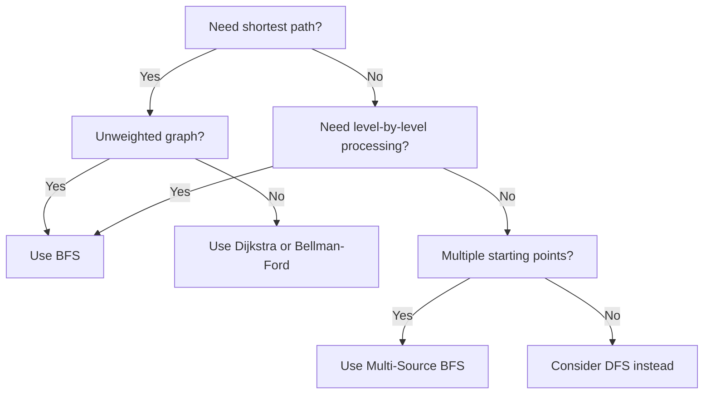
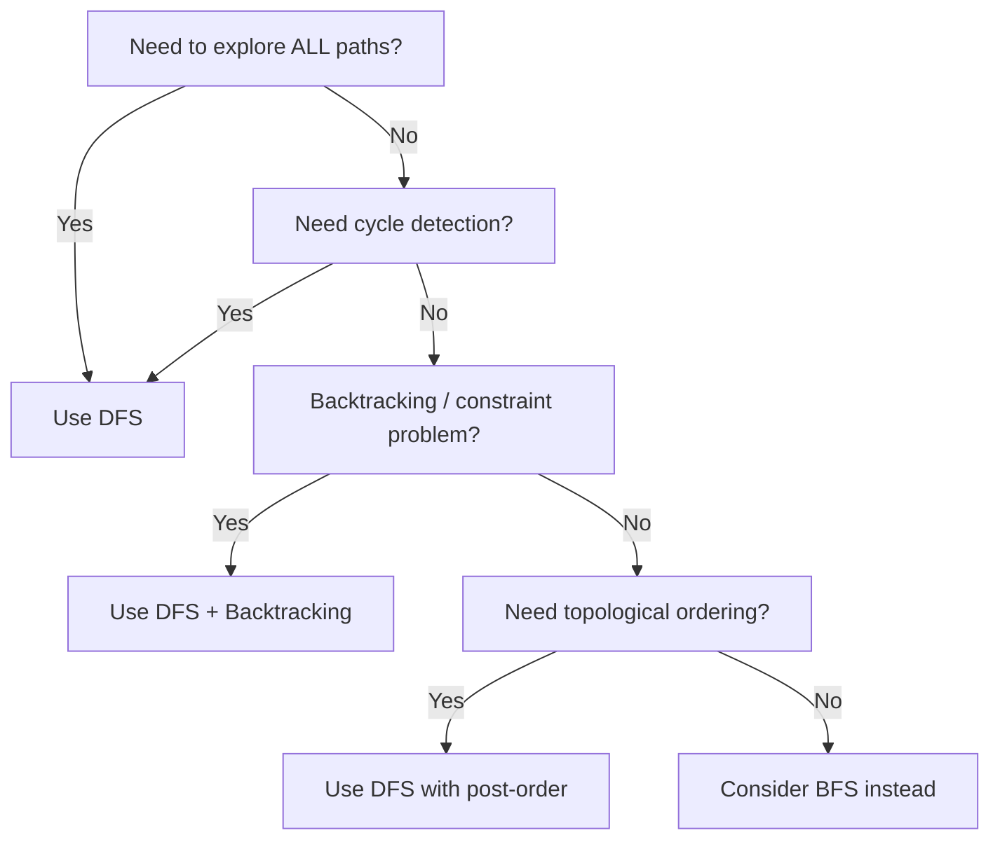

## BFS — Breadth-First Search

BFS explores a graph level by level using a **queue** (first-in, first-out). It processes all nodes at distance 1 before any node at distance 2, all nodes at distance 2 before distance 3, and so on. This guarantees the shortest path in unweighted graphs.

### How BFS Works Step by Step

```
Graph:  1 --- 2 --- 5
        |     |
        3 --- 4

Start at node 1. Goal: visit all nodes.

Queue: [1]         Visited: {1}
─────────────────────────────────────
Step 1: Dequeue 1 → neighbors 2, 3
  Queue: [2, 3]     Visited: {1, 2, 3}

Step 2: Dequeue 2 → neighbors 1(skip), 4, 5
  Queue: [3, 4, 5]  Visited: {1, 2, 3, 4, 5}

Step 3: Dequeue 3 → neighbors 1(skip), 4(skip)
  Queue: [4, 5]     Visited: {1, 2, 3, 4, 5}

Step 4: Dequeue 4 → neighbors 2(skip), 3(skip)
  Queue: [5]         Visited: {1, 2, 3, 4, 5}

Step 5: Dequeue 5 → neighbors 2(skip)
  Queue: []          Visited: {1, 2, 3, 4, 5}

Done! BFS order: 1 → 2 → 3 → 4 → 5
```

### BFS Decision Flowchart



### BFS on a Grid (Visual Walkthrough)

Many BFS problems use a grid instead of a traditional graph. Each cell has 4 neighbors (up, down, left, right).

```
Find shortest path from S to E:

Grid:           BFS expansion (numbers = distance from S):
. . . . .       0 1 2 3 4
. # # # .       1 # # # 5
. . . # .       2 3 4 # 6
. # . . .       3 # 5 6 7
. . . . E       4 5 6 7 8  ← E found at distance 8

# = wall, . = open, S = start (top-left), E = end (bottom-right)

BFS expands like ripples in water — wavefront grows outward from S.
Level 0: (0,0)
Level 1: (0,1), (1,0)
Level 2: (0,2), (2,0)
Level 3: (0,3), (2,1), (3,0)
...and so on until E is reached.
```

### Multi-Source BFS

Sometimes the search starts from **multiple sources simultaneously**. Classic example: "Distance to the nearest zero in a matrix."

Instead of running BFS from each zero separately (slow), push ALL zeros into the queue at once with distance 0, then expand outward. Each cell is visited exactly once.

```
Grid (0 = source, 1 = needs distance):    Result (distance to nearest 0):
0  1  1  1                                 0  1  2  3
1  1  1  1           Multi-source          1  2  3  4
1  1  1  0           BFS gives:            2  3  2  1
1  1  0  1                                 3  2  1  1

All three 0s start in the queue at distance 0.
Wavefronts expand from all sources simultaneously.
Each cell gets the distance to its NEAREST source.
```

### BFS Patterns Summary

| Pattern | When to Use | Example Problems |
|---------|------------|-----------------|
| **Standard BFS** | Shortest path in unweighted graph | Shortest Path in Binary Matrix |
| **Level-order BFS** | Process nodes layer by layer | Binary Tree Level Order, Right Side View |
| **Multi-source BFS** | Distance from nearest source | Walls and Gates, Rotting Oranges, 01 Matrix |
| **Bidirectional BFS** | Shortest path between two known nodes | Word Ladder (optimization) |

## DFS — Depth-First Search

DFS explores a graph by going as deep as possible before backtracking, using a **stack** (or recursion, which uses the call stack). It is the basis for cycle detection, topological sorting, connected components, and backtracking problems.

### How DFS Works Step by Step

```
Same graph:  1 --- 2 --- 5
             |     |
             3 --- 4

Start at node 1. Goal: visit all nodes.

Call Stack: [1]        Visited: {1}
─────────────────────────────────────
Step 1: Visit 1 → go to neighbor 2
  Stack: [1, 2]       Visited: {1, 2}

Step 2: Visit 2 → go to neighbor 4
  Stack: [1, 2, 4]    Visited: {1, 2, 4}

Step 3: Visit 4 → go to neighbor 3
  Stack: [1, 2, 4, 3] Visited: {1, 2, 3, 4}

Step 4: Visit 3 → neighbors 1(skip), 4(skip) → dead end, backtrack
  Stack: [1, 2, 4]    Visited: {1, 2, 3, 4}

Step 5: Back to 4 → no more neighbors → backtrack
  Stack: [1, 2]       Visited: {1, 2, 3, 4}

Step 6: Back to 2 → go to neighbor 5
  Stack: [1, 2, 5]    Visited: {1, 2, 3, 4, 5}

Step 7: Visit 5 → no unvisited neighbors → backtrack all the way
  Stack: []            Visited: {1, 2, 3, 4, 5}

Done! DFS order: 1 → 2 → 4 → 3 → 5
```

### DFS Decision Flowchart



### DFS Backtracking (Visual Walkthrough)

Backtracking = DFS + undo. At each step, you make a choice, recurse, then **undo the choice** to try the next option. This explores all possibilities systematically.

```
Generate all subsets of [1, 2, 3]:

                       []
                /       |       \
             [1]       [2]      [3]
            /   \       |
        [1,2]  [1,3]  [2,3]
          |
       [1,2,3]

DFS traversal of this decision tree:
  []  →  [1]  →  [1,2]  →  [1,2,3]  →  backtrack to [1,2]
  →  backtrack to [1]  →  [1,3]  →  backtrack to [1]
  →  backtrack to []  →  [2]  →  [2,3]  →  backtrack to [2]
  →  backtrack to []  →  [3]  →  backtrack to []

Result: [[], [1], [1,2], [1,2,3], [1,3], [2], [2,3], [3]]

At each node:
  CHOOSE  → add element to current subset
  EXPLORE → recurse with remaining elements
  UNCHOOSE → remove element (backtrack)
```

### DFS on a Grid (Island Counting)

```
Grid:                   DFS marks connected components:
1  1  0  0  0           A  A  0  0  0
1  1  0  0  0           A  A  0  0  0
0  0  1  0  0           0  0  B  0  0
0  0  0  1  1           0  0  0  C  C

Start at (0,0): DFS floods all connected 1s → island A
Start at (2,2): DFS floods all connected 1s → island B
Start at (3,3): DFS floods all connected 1s → island C

Answer: 3 islands

DFS from (0,0):
  Visit (0,0) → go right to (0,1) → no more 1s right
  → go down from (0,1) to (1,1) → go left to (1,0)
  → all neighbors visited → backtrack all the way
  → island A complete, all 4 cells marked
```

### Pruning Strategies

Pruning means cutting off branches early when you can prove they will not lead to a valid solution. This turns exponential brute force into something manageable.

```
Combination Sum: find combos that sum to 7 from [2, 3, 6, 7]
(candidates sorted for pruning)

Without pruning:                With pruning:
  [2]  → [2,2] → [2,2,2] →      [2] → [2,2] → [2,2,2] →
    [2,2,2,2] ✗ (sum=8)            [2,2,2,2] ✗ PRUNE (8>7)
    [2,2,2,3] ✗ (sum=9)          [2,2,3] ✓ (sum=7!) FOUND
    [2,2,2,6] ✗ (sum=12)         [2,3] → [2,3,3] ✗ PRUNE (8>7)
    [2,2,2,7] ✗ (sum=13)         [2,6] ✗ PRUNE (8>7)
    ...so many branches...        [3] → [3,3] ✗ PRUNE (9>7)
                                  [6] ✗ PRUNE (6<7, but 6+6>7)
Explores ~50 branches             [7] ✓ (sum=7!) FOUND
                                  Explores ~12 branches

Key: once candidate > remaining, STOP. All subsequent candidates
are bigger (array is sorted), so they will also exceed the target.
```

### DFS Patterns Summary

| Pattern | When to Use | Example Problems |
|---------|------------|-----------------|
| **Standard DFS** | Graph traversal, connected components | Number of Islands, Max Area of Island |
| **DFS + Backtracking** | Generate all combinations/permutations | Subsets, Permutations, N-Queens |
| **DFS with pruning** | Optimization / constraint satisfaction | Combination Sum, Word Search |
| **DFS post-order** | Process children before parent | Topological Sort, Tree diameter |
| **DFS on grid** | Flood-fill, island problems | Number of Islands, Surrounded Regions |

## BFS vs DFS — Side by Side

```
Same tree:        1
                /   \
               2     3
              / \     \
             4   5     6

BFS (level by level):        DFS (depth first):
Queue: [1]                   Stack: [1]
  → visit 1, add 2,3          → visit 1, go to 2
Queue: [2, 3]                Stack: [1, 2]
  → visit 2, add 4,5          → visit 2, go to 4
Queue: [3, 4, 5]             Stack: [1, 2, 4]
  → visit 3, add 6            → visit 4, dead end, backtrack
Queue: [4, 5, 6]             Stack: [1, 2]
  → visit 4, 5, 6             → go to 5, dead end, backtrack
                              Stack: [1]
                                → go to 3, go to 6, done

BFS order: 1, 2, 3, 4, 5, 6     DFS order: 1, 2, 4, 5, 3, 6
(wide, level by level)           (deep, branch by branch)
```

| | BFS | DFS |
|---|---|---|
| **Data structure** | Queue (FIFO) | Stack / Recursion (LIFO) |
| **Exploration** | Level by level (wide) | Branch by branch (deep) |
| **Shortest path** | Guaranteed in unweighted graphs | Not guaranteed |
| **Memory** | O(width of graph) — can be large | O(depth of graph) — usually smaller |
| **Best for** | Shortest path, level-order, nearest source | All paths, cycles, backtracking, topological sort |
| **Completeness** | Always finds solution if one exists | May get stuck in infinite paths (without visited check) |
| **Grid problems** | Shortest path, multi-source distance | Flood fill, island counting, word search |

### Common Mistakes

- **BFS**: Forgetting to mark nodes as visited **when enqueuing** (not when dequeuing) — causes duplicates and TLE.
- **BFS**: Using BFS for problems that need all-paths exploration — BFS finds shortest, not all.
- **DFS**: Not restoring state during backtracking — corrupts results for subsequent branches.
- **DFS**: Forgetting base cases — causes infinite recursion or stack overflow.
- **Both**: Not handling disconnected components — always check all nodes, not just one start.

## ELI5

Imagine you lost your toy somewhere in your house.

**BFS is like searching room by room.** You check every room on the first floor before going upstairs. Then you check every room on the second floor. You search close rooms first, far rooms last. If you find the toy, you know it was the closest one — you took the fewest steps to get there.

**DFS is like going down one hallway as far as you can.** You walk into a room, then through a door into another room, then another, going deeper and deeper. When you hit a dead end, you walk back and try a different door. You explore one entire path before trying another.

```
Your House:

         [Front Door]
          /        \
      [Kitchen]   [Living Room]
       /    \          \
   [Pantry] [Garage]  [Bedroom]
                        /    \
                  [Closet]  [Bathroom]

BFS order: Front Door → Kitchen → Living Room → Pantry → Garage → Bedroom → Closet → Bathroom
  (check all nearby rooms first, then go deeper)

DFS order: Front Door → Kitchen → Pantry → (back up) → Garage → (back up) → Living Room → Bedroom → Closet → (back up) → Bathroom
  (go as deep as possible, then come back)
```

**When does this matter?**
- If the toy is probably nearby (under the couch), BFS finds it faster — it checks close things first.
- If the toy could be hidden deep (in the back of a closet), DFS dives deep quickly.
- BFS always finds the **shortest** path. DFS finds **a** path (not necessarily the shortest).

## Poem

BFS fans out like ripples in a lake,
Each level explored for shortest path's sake.
DFS plunges down every winding trail,
Backtracking when the journey starts to fail.

Multiple sources? Queue them all at once,
Prune dead branches — don't be a dunce.
On grids of cells, four neighbors to explore,
Mark visited, recurse, then try once more.

## Template

```ts
// ═══════════════════════════════════════════════
// BFS — Breadth-First Search
// ═══════════════════════════════════════════════

// Standard BFS on a graph (adjacency list)
function bfs(graph: Map<number, number[]>, start: number): number[] {
  const visited = new Set<number>([start]);
  const queue: number[] = [start];
  const order: number[] = [];

  while (queue.length > 0) {
    const node = queue.shift()!;
    order.push(node);

    for (const neighbor of graph.get(node) ?? []) {
      if (!visited.has(neighbor)) {
        visited.add(neighbor);   // mark visited BEFORE enqueuing
        queue.push(neighbor);
      }
    }
  }

  return order;
}

// BFS on a grid (shortest path from top-left to bottom-right)
function shortestPathGrid(grid: number[][]): number {
  const rows = grid.length;
  const cols = grid[0].length;
  if (grid[0][0] !== 0 || grid[rows - 1][cols - 1] !== 0) return -1;

  const dirs = [[0, 1], [0, -1], [1, 0], [-1, 0]];
  const queue: [number, number, number][] = [[0, 0, 1]]; // [row, col, distance]
  const visited = new Set<string>(["0,0"]);

  while (queue.length > 0) {
    const [r, c, dist] = queue.shift()!;

    if (r === rows - 1 && c === cols - 1) return dist;

    for (const [dr, dc] of dirs) {
      const nr = r + dr;
      const nc = c + dc;
      const key = `${nr},${nc}`;

      if (nr >= 0 && nr < rows && nc >= 0 && nc < cols
          && grid[nr][nc] === 0 && !visited.has(key)) {
        visited.add(key);
        queue.push([nr, nc, dist + 1]);
      }
    }
  }

  return -1; // no path found
}

// Multi-source BFS (e.g., distance from nearest 0 in a grid)
function multiSourceBFS(grid: number[][]): number[][] {
  const rows = grid.length;
  const cols = grid[0].length;
  const dist = Array.from({ length: rows }, () => new Array(cols).fill(Infinity));
  const queue: [number, number][] = [];

  // Initialize: add ALL sources to the queue at distance 0
  for (let r = 0; r < rows; r++) {
    for (let c = 0; c < cols; c++) {
      if (grid[r][c] === 0) {
        dist[r][c] = 0;
        queue.push([r, c]);
      }
    }
  }

  const dirs = [[0, 1], [0, -1], [1, 0], [-1, 0]];
  let idx = 0;

  while (idx < queue.length) {
    const [r, c] = queue[idx++];

    for (const [dr, dc] of dirs) {
      const nr = r + dr;
      const nc = c + dc;

      if (
        nr >= 0 && nr < rows &&
        nc >= 0 && nc < cols &&
        dist[nr][nc] > dist[r][c] + 1
      ) {
        dist[nr][nc] = dist[r][c] + 1;
        queue.push([nr, nc]);
      }
    }
  }

  return dist;
}

// ═══════════════════════════════════════════════
// DFS — Depth-First Search
// ═══════════════════════════════════════════════

// Standard DFS on a graph (adjacency list)
function dfsGraph(graph: Map<number, number[]>, start: number): number[] {
  const visited = new Set<number>();
  const order: number[] = [];

  function dfs(node: number): void {
    visited.add(node);
    order.push(node);

    for (const neighbor of graph.get(node) ?? []) {
      if (!visited.has(neighbor)) {
        dfs(neighbor);
      }
    }
  }

  dfs(start);
  return order;
}

// DFS on a grid (flood fill / island counting)
function numIslands(grid: string[][]): number {
  const rows = grid.length;
  const cols = grid[0].length;
  let count = 0;

  function dfs(r: number, c: number): void {
    if (r < 0 || r >= rows || c < 0 || c >= cols || grid[r][c] !== '1') return;
    grid[r][c] = '0'; // mark visited by modifying grid
    dfs(r + 1, c);
    dfs(r - 1, c);
    dfs(r, c + 1);
    dfs(r, c - 1);
  }

  for (let r = 0; r < rows; r++) {
    for (let c = 0; c < cols; c++) {
      if (grid[r][c] === '1') {
        count++;
        dfs(r, c);
      }
    }
  }

  return count;
}

// DFS Backtracking (e.g., generate all subsets)
function subsets(nums: number[]): number[][] {
  const result: number[][] = [];
  const current: number[] = [];

  function backtrack(start: number): void {
    result.push([...current]);   // record current state

    for (let i = start; i < nums.length; i++) {
      current.push(nums[i]);    // CHOOSE
      backtrack(i + 1);          // EXPLORE
      current.pop();             // UN-CHOOSE (backtrack)
    }
  }

  backtrack(0);
  return result;
}

// DFS Backtracking with pruning (e.g., combination sum)
function combinationSum(candidates: number[], target: number): number[][] {
  const result: number[][] = [];
  const current: number[] = [];

  candidates.sort((a, b) => a - b); // sort to enable pruning

  function backtrack(start: number, remaining: number): void {
    if (remaining === 0) {
      result.push([...current]);
      return;
    }

    for (let i = start; i < candidates.length; i++) {
      if (candidates[i] > remaining) break; // PRUNE: all future candidates too large

      current.push(candidates[i]);
      backtrack(i, remaining - candidates[i]); // same element can be reused
      current.pop();
    }
  }

  backtrack(0, target);
  return result;
}
```
