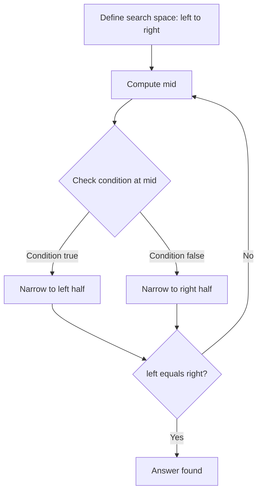

## Binary Search

Binary search halves the search space with each comparison, achieving O(log n) time on sorted or monotonic data. Beyond simple "find the target," binary search is a powerful framework for boundary finding and searching on an answer space.

### Classic Binary Search

Set left and right boundaries. Compute mid. If the target matches, return. If the target is smaller, search left; if larger, search right. The key is maintaining the invariant: the answer is always within the current boundaries.

#### Real World
> **[Database engines]** — B-tree indexes in databases like PostgreSQL and MySQL use binary search at each node level to locate rows in O(log n) time, enabling fast lookups across tables with billions of records.

#### Practice
1. Given a sorted array of integers, return the index of the target value, or -1 if not found. What should `right` be initialized to — `n-1` or `n`?
2. Given a sorted array that has been rotated at some unknown pivot, find the index of a target element.
3. Why does `Math.floor((left + right) / 2)` prevent integer overflow when compared to `(left + right) / 2` in languages with fixed-width integers?

### Boundary Finding

Often you need the leftmost or rightmost position satisfying a condition. Instead of returning immediately on a match, continue narrowing: for the leftmost, set `right = mid` on a match; for the rightmost, set `left = mid + 1`. This template solves "first bad version," "search insert position," and "find first and last position."

#### Real World
> **[Version control / CI systems]** — `git bisect` is a real-world binary search that finds the first commit introducing a bug by repeatedly bisecting the commit history — exactly the "first bad version" pattern applied to software development.

#### Practice
1. Given a sorted array, find the first and last position of a target value. Return `[-1, -1]` if not found.
2. Given a sorted array of integers and a target, return the index where the target should be inserted to keep the array sorted (Search Insert Position).
3. What is the difference between using `right = mid` versus `right = mid - 1` when searching for the leftmost occurrence, and when does each cause an infinite loop?

### Search on Answer Space

When the answer itself is a number in a range, and you can write a function `feasible(x)` that checks whether x is a valid answer, binary search over the answer space. Examples: "minimum capacity to ship packages in D days," "koko eating bananas," and "split array largest sum."

#### Real World
> **[Cloud infrastructure]** — Auto-scaling systems binary search for the minimum number of servers needed to handle a given load: guess a count, simulate whether it handles peak traffic, and halve the remaining search space each step.

#### Practice
1. A conveyor belt ships packages with given weights over D days. Find the minimum weight capacity of the ship so all packages can be shipped within D days.
2. You have N piles of bananas and H hours. Find the minimum eating speed K (bananas per hour) such that you can eat all piles within H hours (Koko Eating Bananas).
3. Why must the `feasible(x)` function be monotonic (once true, always true for larger x) for binary search on the answer space to work correctly?



### Off-by-One Prevention

Use the template: `left = 0, right = n` with `while left < right`. Choose `mid = left + Math.floor of half the range` for leftmost, or round up for rightmost. Stick to one consistent template and you will avoid infinite loops and off-by-one errors.

#### Real World
> **[Production debugging]** — Senior engineers at companies like Netflix and Meta often bisect deployments or configuration changes when hunting bugs in production, applying the same half-elimination logic that prevents off-by-one issues in code.

#### Practice
1. Implement a binary search that finds the leftmost index where `nums[mid] >= target`. Verify your loop terminates correctly by tracing it on `[1,1,2,3]` with target 1.
2. Given a sorted array with possible duplicates, count the total occurrences of a target value using two boundary searches.
3. What is the risk of using `while left <= right` with `right = mid` (instead of `right = mid - 1`) in the leftmost-boundary template, and how does it cause an infinite loop?

### Complexity

O(log n) time, O(1) space. Even for "search on answer" problems where each feasibility check costs O(n), the total is O(n log n) — far better than brute force.

#### Real World
> **[Competitive programming / interviews]** — Binary search is one of the most tested patterns at top tech companies precisely because O(log n) vs O(n) matters enormously at scale: a 1-billion-element search takes ~30 steps with binary search vs 1 billion with linear scan.

#### Practice
1. Given a sorted array of distinct integers, find any "peak" element — an element greater than its neighbors. Solve in O(log n).
2. Given a sorted 2D matrix where each row and column is sorted, search for a target value. What is the optimal approach and its complexity?
3. Under what conditions does binary search degrade to O(n) performance in practice, and how would you detect this in a code review?

## ELI5

Imagine you're looking for a word in a physical dictionary. You don't start from page 1 — you open it in the **middle**.

If the word you want comes **before** the middle, you throw away the right half and open the middle of the left half. If it comes **after**, throw away the left half. Every time, half the pages are gone.

```
Dictionary: [apple ... mango ... zebra]   Looking for "mango"

Open middle → "mango"!
                  ↑
              Found it!

Looking for "tiger":
Step 1: open middle → "mango"   → tiger > mango → throw left half away
Step 2: open middle → "whale"   → tiger < whale → throw right half away
Step 3: open middle → "tiger"   → Found!

1000 pages → 500 → 250 → 125 → ... → found in ~10 steps instead of 1000
```

**Binary search on answers** is trickier but the same idea. If you're asked "what's the minimum speed to finish in time?", you don't try every speed. You guess the middle speed, check if it works, and eliminate half the possibilities.

```
Possible speeds: [1, 2, 3, 4, 5, 6, 7, 8, 9, 10]

Try speed 5 → too slow → throw away [1..5]
Try speed 8 → fast enough → throw away [9..10], keep [6..8]
Try speed 7 → fast enough → throw away [8], answer is 7!
```

**The key insight:** you can binary search anything that has a monotonic yes/no boundary — "fast enough or not," "possible or impossible," "valid or invalid."

## Poem

Cut the space in half each turn,
Left or right — decide and learn.
Sorted data, monotone,
Binary search can find the zone.

Leftmost, rightmost, boundary calls,
Narrow down between the walls.
Search the answers, not the list,
Feasibility — the clever twist.

Log of n, so swift, so clean,
The sharpest search you've ever seen.

## Template

```ts
// Standard binary search — find leftmost position where condition is true
function binarySearch(nums: number[], target: number): number {
  let left = 0;
  let right = nums.length; // right is exclusive

  while (left < right) {
    const mid = Math.floor((left + right) / 2);

    if (nums[mid] < target) {
      left = mid + 1;
    } else {
      right = mid;
    }
  }

  // left === right, pointing to the first element >= target
  return left < nums.length && nums[left] === target ? left : -1;
}

// Binary search on answer space (e.g., minimum capacity to ship within D days)
function shipWithinDays(weights: number[], days: number): number {
  let left = Math.max(...weights);           // minimum possible capacity
  let right = weights.reduce((a, b) => a + b); // maximum possible capacity

  while (left < right) {
    const mid = Math.floor((left + right) / 2);

    if (canShip(weights, days, mid)) {
      right = mid;        // try smaller capacity
    } else {
      left = mid + 1;     // need more capacity
    }
  }

  return left;
}

function canShip(weights: number[], days: number, capacity: number): boolean {
  let daysNeeded = 1;
  let currentLoad = 0;

  for (const w of weights) {
    if (currentLoad + w > capacity) {
      daysNeeded++;
      currentLoad = 0;
    }
    currentLoad += w;
  }

  return daysNeeded <= days;
}
```
