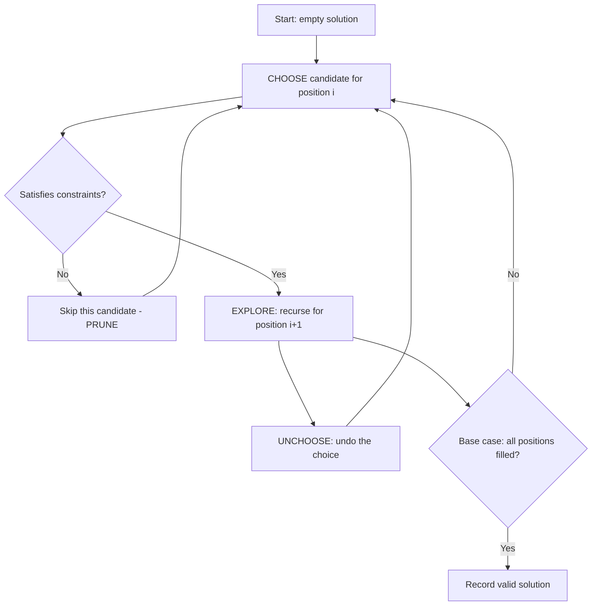

## Brute Force and Backtracking: The Choice-Explore-Unchoose Framework

Brute force means trying every possibility. Backtracking is brute force with intelligence — it abandons a path the moment it detects that the path cannot lead to a valid solution. Together, they form the foundation for solving constraint satisfaction problems, generating combinatorial objects, and tackling NP-hard problems at small scale.

### The Framework: Choose, Explore, Unchoose

Nearly every backtracking problem follows the same three-step pattern:

1. **Choose**: Pick a candidate for the current position from the available options.
2. **Explore**: Recurse to fill in the next position, carrying forward any constraints.
3. **Unchoose**: Undo the choice so you can try the next candidate.

This framework generates a decision tree. Each node is a partial solution, and each branch is a choice. Backtracking prunes entire subtrees when constraints are violated.

#### Real World
> **[Constraint solvers / scheduling]** — Automated employee scheduling tools at companies like Workday use backtracking with constraint propagation to assign shifts while satisfying hundreds of labor rules — the same choose-explore-unchoose pattern applied to real-world planning.

#### Practice
1. Given a collection of candidate numbers and a target, find all unique combinations that sum to the target (Combination Sum). Each number may be used unlimited times.
2. Given a string containing digits 2-9, return all letter combinations it could represent on a phone keypad (Letter Combinations of a Phone Number).
3. What is the difference between the decision tree for subsets (collect at every node) and permutations (collect only at leaves), and why does this affect the base case?



### Permutations

Generate all orderings of n elements. At each step, choose an unused element, mark it as used, recurse, then unmark it. The decision tree has n! leaves. Use a `used` boolean array or swap elements in place.

#### Real World
> **[Logistics / operations research]** — Generating all permutations is the brute-force baseline for the Traveling Salesman Problem. At n=12 cities, it is feasible (12! ≈ 479M); at n=20 it becomes intractable, motivating heuristic algorithms like nearest-neighbor or branch-and-bound.

#### Practice
1. Given an array of distinct integers, return all possible permutations.
2. Given an array that may contain duplicates, return all unique permutations. How do you avoid generating identical permutations?
3. The decision tree for permutations has n! leaves and n×n! total nodes. Why does storing each permutation still give O(n × n!) overall space complexity, not O(n!)?

### Combinations

Generate all subsets of size k from n elements. To avoid duplicates, enforce an ordering: each recursive call starts from the index after the last chosen element. The decision tree has C(n,k) leaves.

#### Real World
> **[Machine learning / feature selection]** — Evaluating every subset of k features from n candidates is an exact O(C(n,k)) backtracking problem. For n=20 and k=5 this is manageable (~15K combos); for larger n, heuristic search replaces brute-force enumeration.

#### Practice
1. Given two integers n and k, return all combinations of k numbers from the range 1 to n.
2. Given a set of candidate numbers with possible duplicates, find all unique combinations that sum to a target (Combination Sum II — each number used at most once).
3. Why is enforcing that each call starts from `i + 1` (not just any unused index) the key to avoiding duplicate combinations in the output?

### Subsets

Generate all 2^n subsets. At each index, make a binary choice: include the element or skip it. Alternatively, iterate and at each level branch into "take" or "leave."

#### Real World
> **[Power set / privacy engineering]** — Privacy tools that enumerate all data-sharing permission combinations for a user's profile (share with A? share with B? etc.) are literally computing subsets — manageable up to ~20 attributes, then requiring approximation.

#### Practice
1. Given an integer array of unique elements, return all possible subsets (the power set). No duplicates in the output.
2. Given an array with possible duplicates, return all unique subsets. What preprocessing step and skip condition are needed?
3. There are two equivalent ways to generate subsets: recursion (include/exclude) and iteration (bitmask from 0 to 2^n-1). When would you prefer the bitmask approach over the recursive approach?

### Constraint Satisfaction

Problems like N-Queens, Sudoku, and crossword puzzles are constraint satisfaction problems. The backtracking template is the same, but the "satisfies constraints?" check does the heavy lifting — rejecting invalid placements early.

#### Real World
> **[Compiler register allocation]** — Assigning CPU registers to variables is a graph coloring problem — a classic constraint satisfaction problem solved in practice with backtracking plus heuristics, where each "color" is a register and constraints are live-variable conflicts.

#### Practice
1. Place N queens on an N×N chessboard such that no two queens attack each other. Return the total number of distinct solutions (N-Queens II).
2. Write a Sudoku solver that fills in a 9×9 board by trying digits 1–9 in each empty cell and backtracking when a constraint is violated.
3. What pruning techniques make the N-Queens solver dramatically faster than the naive "try all N^N placements" approach, and why does column/diagonal tracking matter?

### Optimization Tips

- **Sort candidates** so that pruning happens sooner.
- **Use bitmasks** to represent used elements when n is small — checking and toggling a bit is faster than array lookups.
- **Prune aggressively**: the more constraints you check at each step, the smaller the search tree.
- **Avoid duplicates**: when the input contains duplicates, sort first and skip consecutive identical elements at the same recursion level.

Backtracking is your universal fallback. When no greedy or DP approach works, backtracking will always find the answer — the question is just whether it is fast enough.

#### Real World
> **[Game AI / puzzle solvers]** — Chess engines like Stockfish combine backtracking (minimax search) with aggressive pruning (alpha-beta) to reduce the effective branching factor from ~35 to ~6, making the search tractable. The optimization tips here — sort, use bitmasks, prune early — are exactly what separates amateur from production backtracking.

#### Practice
1. Given a list of words forming a word ladder, how would you use DFS with backtracking to find ALL paths from the start word to the end word, not just the shortest? What pruning prevents revisiting?
2. Given a Sudoku board, implement a solver that uses forward-checking as a pruning strategy: before recursing, verify that each unfilled cell still has at least one valid digit.
3. When would you choose bitmask representation over a `used[]` boolean array for tracking chosen elements, and what is the practical performance difference for n ≤ 20?

## ELI5

Imagine you lost your house key and need to try every possible hiding spot.

**Brute force** is going to every single spot in the house, one by one, no matter what.

**Backtracking** is smarter: if you're looking in the bedroom and you realize the key is too big to fit under the mouse pad, you stop looking in that corner entirely and move on. You prune entire sections of the search.

```
Rooms to search: [Kitchen, Bedroom, Bathroom, Garage]

Brute force order:
  Kitchen → every drawer, every shelf, every corner...
  Bedroom → every drawer, every shelf, every corner...
  ... (searches EVERYTHING)

Backtracking:
  Kitchen → open junk drawer → key isn't here (too messy, key would be visible)
    → PRUNE: skip rest of kitchen
  Bedroom → check nightstand → key not there
    → check under pillow → FOUND IT!
    → stop immediately

Backtracking can skip huge sections early, saving tons of time.
```

**The choose-explore-unchoose pattern** is like trying outfits:

```
Tops: [red, blue]   Bottoms: [jeans, shorts]

Choose red top
  → choose jeans  → explore (take photo) → unchoose jeans
  → choose shorts → explore (take photo) → unchoose shorts
Unchoose red top

Choose blue top
  → choose jeans  → explore (take photo) → unchoose jeans
  → choose shorts → explore (take photo) → unchoose shorts
Unchoose blue top

Result: 4 outfit photos, explored all combinations systematically
```

**Pruning** is the key: if red top + jeans is clearly terrible (violates a constraint), skip the photo and all further red-top combinations immediately.

## Poem

Choose a path, step forward with care,
Explore what's ahead, see what waits there.
If the road hits a wall, don't despair —
Unchoose, step back, try the next square.

Permutations, combos, queens on a board,
Constraint by constraint, solutions explored.
Brute force with pruning — that's the key,
A backtracker's life: choose, explore, then set free.

## Template

```ts
// General backtracking template
function backtrack(result: any[], current: any[], start: number, input: any[]): void {
  // Base case: found a valid solution
  if (isComplete(current)) {
    result.push([...current]); // copy current state
    return;
  }

  for (let i = start; i < input.length; i++) {
    // Pruning: skip invalid choices early
    if (!isValid(current, input[i])) continue;

    // Skip duplicates (when input has duplicates)
    if (i > start && input[i] === input[i - 1]) continue;

    current.push(input[i]);       // 1. CHOOSE
    backtrack(result, current, i + 1, input); // 2. EXPLORE
    current.pop();                 // 3. UN-CHOOSE
  }
}

// Subsets: collect at every node
function subsets(nums: number[]): number[][] {
  const result: number[][] = [];
  function bt(start: number, current: number[]): void {
    result.push([...current]);     // every node is a valid subset
    for (let i = start; i < nums.length; i++) {
      current.push(nums[i]);
      bt(i + 1, current);
      current.pop();
    }
  }
  bt(0, []);
  return result;
}

// Permutations: collect only at leaves
function permute(nums: number[]): number[][] {
  const result: number[][] = [];
  const used = new Array(nums.length).fill(false);

  function bt(current: number[]): void {
    if (current.length === nums.length) {
      result.push([...current]);
      return;
    }
    for (let i = 0; i < nums.length; i++) {
      if (used[i]) continue;
      used[i] = true;
      current.push(nums[i]);
      bt(current);
      current.pop();
      used[i] = false;
    }
  }

  bt([]);
  return result;
}

// N-Queens: constraint-based backtracking
function nQueens(n: number): string[][] {
  const result: string[][] = [];
  const cols = new Set<number>();
  const d1 = new Set<number>(); // row - col
  const d2 = new Set<number>(); // row + col

  function bt(row: number, board: string[]): void {
    if (row === n) { result.push([...board]); return; }
    for (let col = 0; col < n; col++) {
      if (cols.has(col) || d1.has(row - col) || d2.has(row + col)) continue;
      cols.add(col); d1.add(row - col); d2.add(row + col);
      board.push('.'.repeat(col) + 'Q' + '.'.repeat(n - col - 1));
      bt(row + 1, board);
      board.pop();
      cols.delete(col); d1.delete(row - col); d2.delete(row + col);
    }
  }

  bt(0, []);
  return result;
}
```
