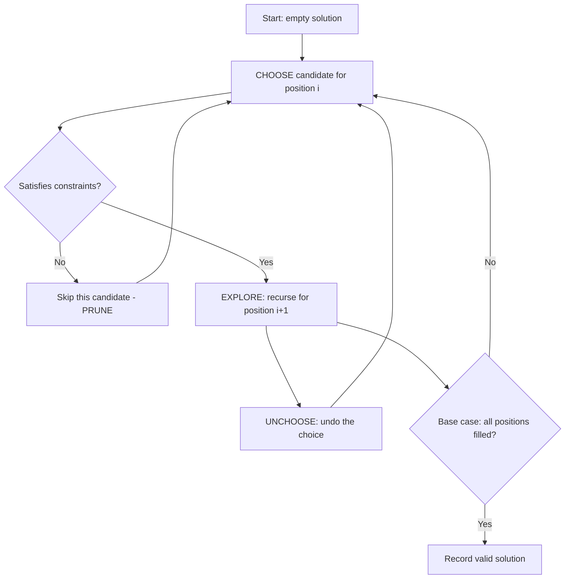

## Brute Force and Backtracking: The Choice-Explore-Unchoose Framework

Brute force means trying every possibility. Backtracking is brute force with intelligence — it abandons a path the moment it detects that the path cannot lead to a valid solution. Together, they form the foundation for solving constraint satisfaction problems, generating combinatorial objects, and tackling NP-hard problems at small scale.

### The Framework: Choose, Explore, Unchoose

Nearly every backtracking problem follows the same three-step pattern:

1. **Choose**: Pick a candidate for the current position from the available options.
2. **Explore**: Recurse to fill in the next position, carrying forward any constraints.
3. **Unchoose**: Undo the choice so you can try the next candidate.

This framework generates a decision tree. Each node is a partial solution, and each branch is a choice. Backtracking prunes entire subtrees when constraints are violated.



### Permutations

Generate all orderings of n elements. At each step, choose an unused element, mark it as used, recurse, then unmark it. The decision tree has n! leaves. Use a `used` boolean array or swap elements in place.

### Combinations

Generate all subsets of size k from n elements. To avoid duplicates, enforce an ordering: each recursive call starts from the index after the last chosen element. The decision tree has C(n,k) leaves.

### Subsets

Generate all 2^n subsets. At each index, make a binary choice: include the element or skip it. Alternatively, iterate and at each level branch into "take" or "leave."

### Constraint Satisfaction

Problems like N-Queens, Sudoku, and crossword puzzles are constraint satisfaction problems. The backtracking template is the same, but the "satisfies constraints?" check does the heavy lifting — rejecting invalid placements early.

### Optimization Tips

- **Sort candidates** so that pruning happens sooner.
- **Use bitmasks** to represent used elements when n is small — checking and toggling a bit is faster than array lookups.
- **Prune aggressively**: the more constraints you check at each step, the smaller the search tree.
- **Avoid duplicates**: when the input contains duplicates, sort first and skip consecutive identical elements at the same recursion level.

Backtracking is your universal fallback. When no greedy or DP approach works, backtracking will always find the answer — the question is just whether it is fast enough.

## ELI5

Imagine you lost your house key and need to try every possible hiding spot.

**Brute force** is going to every single spot in the house, one by one, no matter what.

**Backtracking** is smarter: if you're looking in the bedroom and you realize the key is too big to fit under the mouse pad, you stop looking in that corner entirely and move on. You prune entire sections of the search.

```
Rooms to search: [Kitchen, Bedroom, Bathroom, Garage]

Brute force order:
  Kitchen → every drawer, every shelf, every corner...
  Bedroom → every drawer, every shelf, every corner...
  ... (searches EVERYTHING)

Backtracking:
  Kitchen → open junk drawer → key isn't here (too messy, key would be visible)
    → PRUNE: skip rest of kitchen
  Bedroom → check nightstand → key not there
    → check under pillow → FOUND IT!
    → stop immediately

Backtracking can skip huge sections early, saving tons of time.
```

**The choose-explore-unchoose pattern** is like trying outfits:

```
Tops: [red, blue]   Bottoms: [jeans, shorts]

Choose red top
  → choose jeans  → explore (take photo) → unchoose jeans
  → choose shorts → explore (take photo) → unchoose shorts
Unchoose red top

Choose blue top
  → choose jeans  → explore (take photo) → unchoose jeans
  → choose shorts → explore (take photo) → unchoose shorts
Unchoose blue top

Result: 4 outfit photos, explored all combinations systematically
```

**Pruning** is the key: if red top + jeans is clearly terrible (violates a constraint), skip the photo and all further red-top combinations immediately.

## Poem

Choose a path, step forward with care,
Explore what's ahead, see what waits there.
If the road hits a wall, don't despair —
Unchoose, step back, try the next square.

Permutations, combos, queens on a board,
Constraint by constraint, solutions explored.
Brute force with pruning — that's the key,
A backtracker's life: choose, explore, then set free.

## Template

```ts
// General backtracking template
function backtrack(result: any[], current: any[], start: number, input: any[]): void {
  // Base case: found a valid solution
  if (isComplete(current)) {
    result.push([...current]); // copy current state
    return;
  }

  for (let i = start; i < input.length; i++) {
    // Pruning: skip invalid choices early
    if (!isValid(current, input[i])) continue;

    // Skip duplicates (when input has duplicates)
    if (i > start && input[i] === input[i - 1]) continue;

    current.push(input[i]);       // 1. CHOOSE
    backtrack(result, current, i + 1, input); // 2. EXPLORE
    current.pop();                 // 3. UN-CHOOSE
  }
}

// Subsets: collect at every node
function subsets(nums: number[]): number[][] {
  const result: number[][] = [];
  function bt(start: number, current: number[]): void {
    result.push([...current]);     // every node is a valid subset
    for (let i = start; i < nums.length; i++) {
      current.push(nums[i]);
      bt(i + 1, current);
      current.pop();
    }
  }
  bt(0, []);
  return result;
}

// Permutations: collect only at leaves
function permute(nums: number[]): number[][] {
  const result: number[][] = [];
  const used = new Array(nums.length).fill(false);

  function bt(current: number[]): void {
    if (current.length === nums.length) {
      result.push([...current]);
      return;
    }
    for (let i = 0; i < nums.length; i++) {
      if (used[i]) continue;
      used[i] = true;
      current.push(nums[i]);
      bt(current);
      current.pop();
      used[i] = false;
    }
  }

  bt([]);
  return result;
}

// N-Queens: constraint-based backtracking
function nQueens(n: number): string[][] {
  const result: string[][] = [];
  const cols = new Set<number>();
  const d1 = new Set<number>(); // row - col
  const d2 = new Set<number>(); // row + col

  function bt(row: number, board: string[]): void {
    if (row === n) { result.push([...board]); return; }
    for (let col = 0; col < n; col++) {
      if (cols.has(col) || d1.has(row - col) || d2.has(row + col)) continue;
      cols.add(col); d1.add(row - col); d2.add(row + col);
      board.push('.'.repeat(col) + 'Q' + '.'.repeat(n - col - 1));
      bt(row + 1, board);
      board.pop();
      cols.delete(col); d1.delete(row - col); d2.delete(row + col);
    }
  }

  bt(0, []);
  return result;
}
```
