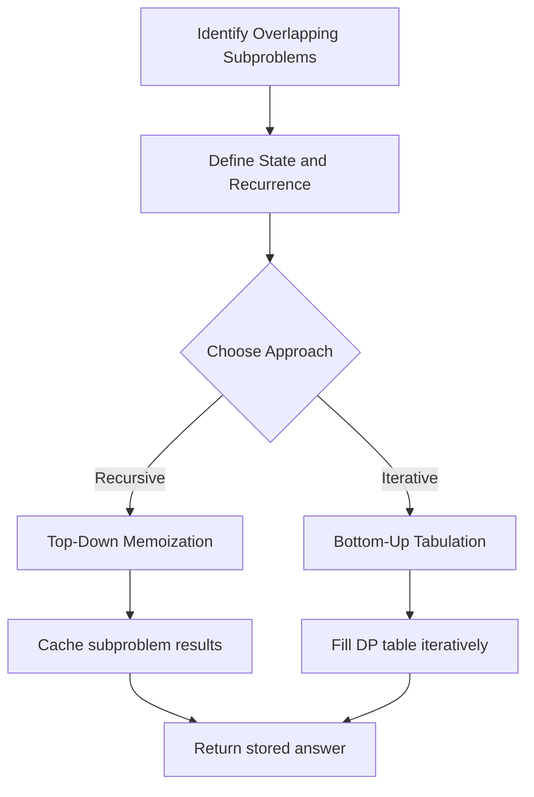

## Dynamic Programming: Master the Art of Optimal Substructure

Dynamic Programming — DP — is a powerful algorithmic technique that solves complex problems by breaking them down into simpler, overlapping subproblems. Instead of recomputing the same results over and over, DP stores intermediate answers and reuses them, turning exponential brute-force solutions into efficient polynomial ones.

### The Two Pillars of DP

**Optimal Substructure** means the optimal solution to a problem can be constructed from optimal solutions of its subproblems. **Overlapping Subproblems** means the same subproblems are encountered repeatedly during recursion.

#### Real World
> **[Bioinformatics]** — Sequence alignment tools like BLAST use DP (Smith-Waterman algorithm) to find the optimal local alignment between two DNA or protein sequences, with the recurrence table being the cornerstone of computational biology at scale.

#### Practice
1. Given a string, find the length of the longest palindromic subsequence. Define the DP state and write the recurrence relation.
2. Given two strings, find the length of their longest common subsequence (LCS). What does `dp[i][j]` represent in your table?
3. How do you recognize whether a problem has "overlapping subproblems" before writing any code, and what is the tell-tale sign in its recursion tree?

### Top-Down vs Bottom-Up

There are two classic approaches:

- **Memoization — Top-Down**: Start from the original problem, recurse into subproblems, and cache results in a hash map or array. This is intuitive because it mirrors the recursive definition.
- **Tabulation — Bottom-Up**: Build a table starting from the smallest subproblems and iteratively fill in larger ones. This avoids recursion overhead and is often more space-efficient.

#### Real World
> **[Compilers / JIT optimization]** — Modern JIT compilers (like V8 for JavaScript) use memoized type inference: each expression's type is computed once and cached, avoiding exponential re-derivation in deeply nested generic code.

#### Practice
1. Implement Fibonacci using top-down memoization. Then rewrite it bottom-up. Which uses less space, and why?
2. Given a staircase with n steps where you can climb 1 or 2 steps at a time, count the number of ways to reach the top. Solve both top-down and bottom-up.
3. When would you prefer top-down memoization over bottom-up tabulation in a production system, considering call stack depth limits and cache miss patterns?



### The DP Recipe

1. **Define the state**: What does `dp[i]` or `dp[i][j]` represent? This is the hardest and most important step. A well-chosen state makes the recurrence obvious.
2. **Write the recurrence relation**: Express `dp[i]` in terms of smaller subproblems. For example, the Fibonacci sequence: `dp[i] = dp[i-1] + dp[i-2]`.
3. **Set base cases**: What are the trivially solvable smallest subproblems?
4. **Determine traversal order**: Ensure that when you compute `dp[i]`, all subproblems it depends on are already solved.
5. **Optimize space if possible**: Often you only need the last one or two rows of the table, reducing space from O(n^2) to O(n).

#### Real World
> **[Natural language processing]** — The Viterbi algorithm for part-of-speech tagging follows this exact recipe: state = (word index, POS tag), recurrence = max over previous tags, base case = first word probabilities. It powers POS tagging in production NLP pipelines.

#### Practice
1. Given an array of integers, find the length of the longest strictly increasing subsequence (LIS). What is the DP state, recurrence, and time complexity of the O(n²) solution?
2. Given a string, partition it so that every substring is a palindrome. Find the minimum number of cuts needed (Palindrome Partitioning II).
3. How do you determine the right traversal order when filling a 2D DP table — specifically, when should you iterate left-to-right vs right-to-left over the capacity dimension?

### Common DP Families

- **Linear DP**: Longest Increasing Subsequence, House Robber
- **Grid DP**: Unique Paths, Minimum Path Sum
- **Knapsack DP**: 0/1 Knapsack, Coin Change, Subset Sum
- **Interval DP**: Matrix Chain Multiplication, Burst Balloons
- **String DP**: Edit Distance, Longest Common Subsequence

The key insight is always the same: if you find yourself solving the same subproblem multiple times, DP can help. Start by writing the brute-force recursion, spot the repeated work, then add caching.

#### Real World
> **[E-commerce / resource planning]** — The 0/1 knapsack problem directly models inventory selection: which products to stock given warehouse capacity constraints to maximize expected profit. This is solved with DP at companies like Amazon's fulfillment planning teams.

#### Practice
1. Given a set of items each with a weight and a value, and a knapsack with a weight limit, find the maximum value you can carry (0/1 Knapsack).
2. Given an array of integers and a target sum, determine if any subset sums to the target (Subset Sum). Reduce it to a knapsack variant.
3. What is the key difference between 0/1 Knapsack and Unbounded Knapsack in terms of the DP traversal order, and why does iterating backwards avoid reusing items?

## ELI5

Imagine you're climbing a staircase and someone asks: "How many ways can you reach step 5?"

**Without DP**, you'd figure out all the paths from scratch: 1+4, 2+3, 1+1+3, 1+2+2, ... and you'd be recalculating the same sub-paths over and over.

**With DP**, you write the answer on a sticky note as you go. "3 ways to reach step 3." Later, when you need that number, you just read the note — no recalculating.

```
Ways to climb n stairs (1 or 2 steps at a time):

Without DP:
  ways(5) = ways(4) + ways(3)
  ways(4) = ways(3) + ways(2)   ← calculates ways(3) AGAIN
  ways(3) = ways(2) + ways(1)   ← calculates ways(2) AGAIN
  ... huge repeated work tree

With DP (sticky notes):
  step 1: 1 way   📝
  step 2: 2 ways  📝
  step 3: 3 ways  📝  (just read step1 + step2 notes)
  step 4: 5 ways  📝  (just read step2 + step3 notes)
  step 5: 8 ways  📝  (just read step3 + step4 notes)

Each answer computed exactly ONCE, then reused.
```

**Top-down** (memoization) = solve it recursively but tape a sticky note on every answer you compute.

**Bottom-up** (tabulation) = fill in a table from the smallest answers upward, like building a pyramid.

```
Bottom-up table for Fibonacci:

Index:   0  1  2  3  4  5  6
Value:   0  1  1  2  3  5  8

Fill left to right: each cell = sum of the two to its left
No recursion needed — just a simple loop!
```

**The hardest part** is figuring out what the "state" is — what information describes each subproblem. Once you have that, the rest follows naturally.

## Poem

When recursion repeats the same old call,
And the call tree grows impossibly tall,
Cache each answer you find,
Leave no work behind —
That's DP: remember, don't re-solve it all.

Define your state, write the base case tight,
Fill the table from left to right.
Top-down or bottom-up, pick your lane,
Turn exponential into a polynomial gain.

## Template

```ts
// Top-down (memoization) template
function solveTopDown(nums: number[]): number {
  const memo = new Map<string, number>();

  function dp(index: number, state: number): number {
    // Base case
    if (index === nums.length) return 0;

    const key = `${index},${state}`;
    if (memo.has(key)) return memo.get(key)!;

    // Recurrence: try all choices, take the best
    const skip = dp(index + 1, state);
    const take = nums[index] + dp(index + 1, state + 1);

    const result = Math.max(skip, take);
    memo.set(key, result);
    return result;
  }

  return dp(0, 0);
}

// Bottom-up (tabulation) template — e.g., 0/1 Knapsack
function knapsack(weights: number[], values: number[], capacity: number): number {
  const n = weights.length;
  // dp[i] = max value achievable with capacity i
  const dp = new Array(capacity + 1).fill(0);

  for (let i = 0; i < n; i++) {
    // Traverse backward so each item is used at most once
    for (let w = capacity; w >= weights[i]; w--) {
      dp[w] = Math.max(dp[w], dp[w - weights[i]] + values[i]);
    }
  }

  return dp[capacity];
}

// Classic example: Fibonacci with tabulation
function fibonacci(n: number): number {
  if (n <= 1) return n;

  let prev2 = 0;
  let prev1 = 1;

  for (let i = 2; i <= n; i++) {
    const curr = prev1 + prev2;
    prev2 = prev1;
    prev1 = curr;
  }

  return prev1;
}
```
