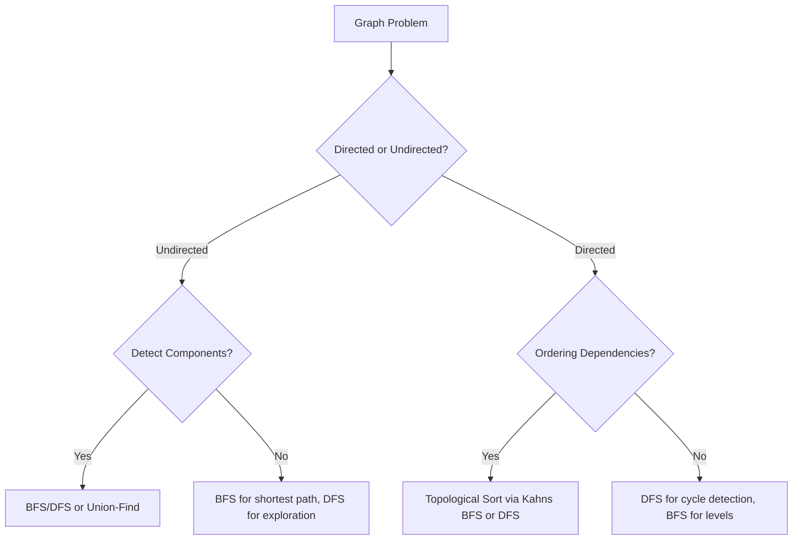

## Graphs: The Universal Data Structure

Graphs model relationships. Nodes represent entities, and edges represent connections between them. From social networks to road maps to dependency chains, graphs are everywhere in computer science. Mastering graph fundamentals is essential for tackling a huge family of algorithm problems.



---

### Representation

Before you can run any algorithm on a graph, you need to store it. The choice of representation affects both your code simplicity and runtime performance.

#### Adjacency List vs Adjacency Matrix

```
Example graph:

    0 --- 1
    |     |
    2 --- 3 --- 4

Adjacency List:                  Adjacency Matrix:
  0 → [1, 2]                      0  1  2  3  4
  1 → [0, 3]                   0 [0, 1, 1, 0, 0]
  2 → [0, 3]                   1 [1, 0, 0, 1, 0]
  3 → [1, 2, 4]                2 [1, 0, 0, 1, 0]
  4 → [3]                      3 [0, 1, 1, 0, 1]
                                4 [0, 0, 0, 1, 0]
```

| Feature | Adjacency List | Adjacency Matrix |
|---|---|---|
| Space | O(V + E) | O(V^2) |
| Check if edge exists | O(degree) | O(1) |
| Iterate neighbors | O(degree) | O(V) |
| Add edge | O(1) | O(1) |
| Best for | Sparse graphs (most interviews) | Dense graphs, quick edge lookup |

**Rule of thumb:** Use adjacency list for interviews. It is more space-efficient and most problems have sparse graphs. Use a matrix only when you need O(1) edge lookup or the graph is dense (E close to V^2).

#### Building from Edge Lists

Most problems give you an edge list like `[[0,1], [1,3], [2,3]]`. Here is how to convert:

```ts
// Undirected graph — adjacency list using Map
function buildGraph(n: number, edges: number[][]): Map<number, number[]> {
  const graph = new Map<number, number[]>();
  for (let i = 0; i < n; i++) graph.set(i, []);

  for (const [u, v] of edges) {
    graph.get(u)!.push(v);
    graph.get(v)!.push(u); // add both directions for undirected
  }
  return graph;
}

// Directed graph — only add one direction
function buildDirectedGraph(n: number, edges: number[][]): Map<number, number[]> {
  const graph = new Map<number, number[]>();
  for (let i = 0; i < n; i++) graph.set(i, []);

  for (const [u, v] of edges) {
    graph.get(u)!.push(v); // only u → v, not v → u
  }
  return graph;
}

// Weighted graph — store [neighbor, weight] pairs
function buildWeightedGraph(
  n: number,
  edges: number[][]  // [u, v, weight]
): Map<number, [number, number][]> {
  const graph = new Map<number, [number, number][]>();
  for (let i = 0; i < n; i++) graph.set(i, []);

  for (const [u, v, w] of edges) {
    graph.get(u)!.push([v, w]);
    graph.get(v)!.push([u, w]); // omit for directed
  }
  return graph;
}
```

#### Directed vs Undirected — Visual Comparison

```
Undirected:              Directed:
  A --- B                  A ──→ B
  |     |                  ↑     |
  C --- D                  C ←── D

Undirected adjacency:    Directed adjacency:
  A → [B, C]               A → [B]
  B → [A, D]               B → [D]
  C → [A, D]               C → [A]
  D → [B, C]               D → [C]

Key difference: In undirected, if A→B exists, then B→A also exists.
In directed, edges are one-way. A→B does NOT imply B→A.
```

#### Alternative: Adjacency List with Array of Arrays

```ts
// Sometimes simpler than Map — use when nodes are 0-indexed integers
const graph: number[][] = Array.from({ length: n }, () => []);
for (const [u, v] of edges) {
  graph[u].push(v);
  graph[v].push(u);
}
// Access: graph[node] gives the list of neighbors
```

#### Common Pitfall: Forgetting to Initialize All Nodes

```
Edges: [[0,1], [2,3]]   with n = 5

❌ Only nodes 0,1,2,3 get entries — node 4 is missing!
   If you later do graph.get(4), you get undefined.

✅ Always initialize ALL nodes from 0 to n-1 first,
   even if they have no edges. Isolated nodes are valid.
```

#### Representation Problem Table

| Problem | Representation Hint |
|---|---|
| Number of Islands (LC 200) | Grid is implicit graph; neighbors = 4-directional cells |
| Clone Graph (LC 133) | Adjacency list; use a map from old node to cloned node |
| Course Schedule (LC 207) | Directed graph from prerequisite pairs |
| Network Delay Time (LC 743) | Weighted directed graph |
| Graph Valid Tree (LC 261) | Undirected; check V-1 edges + connectivity |

---

### BFS — Breadth-First Search

BFS explores level by level using a **queue** (FIFO). It finds the shortest path in unweighted graphs. Time: O(V + E), Space: O(V). Use BFS when you need the minimum number of steps or when exploring layer by layer.

For a full deep dive with step-by-step walkthroughs, level-order processing, grid BFS, and multi-source BFS, see the dedicated **BFS / DFS Deep Dive** section.

**When to reach for BFS:**
- Shortest path in an unweighted graph
- Level-by-level processing (e.g., tree level order)
- Multi-source distance problems (e.g., "distance from nearest 0")
- Any problem asking for "minimum number of moves/steps"

**Key reminder:** Always mark nodes as visited **when enqueuing**, not when dequeuing, to avoid duplicate processing.

---

### DFS — Depth-First Search

DFS goes as deep as possible before backtracking, using a stack or recursion. It is the basis for cycle detection, topological sorting, and finding connected components. Time: O(V + E), Space: O(V) for the recursion stack.

For a full deep dive with backtracking patterns, grid DFS, and advanced variants, see the dedicated **BFS / DFS Deep Dive** section.

**When to reach for DFS:**
- Detecting cycles in directed or undirected graphs
- Exploring all paths or all connected nodes
- Topological sorting (DFS-based approach)
- Backtracking and constraint-satisfaction problems
- Finding connected components

**Key reminder:** For cycle detection in directed graphs, you need three states: unvisited, in-progress (on current recursion stack), and completed. A back-edge to an in-progress node means a cycle exists.

---

### Topological Sort

For directed acyclic graphs (DAGs), topological sort produces a linear ordering where for every edge u -> v, node u comes before v. If a cycle exists, no valid topological ordering is possible.

#### When Do You Need Topological Sort?

- **Course prerequisites:** "Can I finish all courses? In what order?"
- **Build systems:** "Which modules must compile before others?"
- **Task scheduling:** "What is a valid execution order?"
- Any problem with **dependency ordering** in a **directed graph**

#### Two Approaches

There are two classic algorithms. Both run in O(V + E) time.

```
Approach 1: Kahn's Algorithm (BFS-based)
  — Process nodes with in-degree 0 first, peel them off layer by layer.
  — Naturally detects cycles (if result length < n, there is a cycle).

Approach 2: DFS-based
  — Run DFS; add nodes to result in post-order (after visiting all descendants).
  — Reverse the post-order to get topological order.
  — Detects cycles via back-edges (node still on recursion stack).
```

#### Kahn's Algorithm — Step-by-Step Walkthrough

```
Directed graph with 6 nodes:

  5 ──→ 0        Edges:
  5 ──→ 2          5→0, 5→2, 4→0, 4→1,
  4 ──→ 0          2→3, 3→1
  4 ──→ 1
  2 ──→ 3
  3 ──→ 1

           5        4
          / \      / \
         0   2    0   1
             |
             3
             |
             1

Step 0: Compute in-degrees
  Node:      0  1  2  3  4  5
  In-degree: 2  2  1  1  0  0

  Nodes with in-degree 0: [4, 5]  ← start here

Step 1: Dequeue 4, reduce neighbors' in-degrees
  Process 4 → neighbors: 0, 1
  In-degree: 0→1, 1→1, 2→1, 3→1
  Queue: [5]          Result: [4]

Step 2: Dequeue 5, reduce neighbors' in-degrees
  Process 5 → neighbors: 0, 2
  In-degree: 0→0, 1→1, 2→0, 3→1
  Queue: [0, 2]       Result: [4, 5]
  (0 and 2 now have in-degree 0, add them)

Step 3: Dequeue 0
  Process 0 → no outgoing edges
  Queue: [2]           Result: [4, 5, 0]

Step 4: Dequeue 2
  Process 2 → neighbor: 3
  In-degree: 3→0
  Queue: [3]           Result: [4, 5, 0, 2]

Step 5: Dequeue 3
  Process 3 → neighbor: 1
  In-degree: 1→0
  Queue: [1]           Result: [4, 5, 0, 2, 3]

Step 6: Dequeue 1
  Process 1 → no outgoing edges
  Queue: []            Result: [4, 5, 0, 2, 3, 1]

Result length = 6 = n → valid topological order!
```

#### Kahn's Algorithm — Full Template

```ts
function kahnTopologicalSort(n: number, edges: number[][]): number[] {
  const graph = new Map<number, number[]>();
  const inDegree = new Array(n).fill(0);

  for (let i = 0; i < n; i++) graph.set(i, []);

  for (const [u, v] of edges) {
    graph.get(u)!.push(v);
    inDegree[v]++;
  }

  // Start with all nodes that have no prerequisites
  const queue: number[] = [];
  for (let i = 0; i < n; i++) {
    if (inDegree[i] === 0) queue.push(i);
  }

  const order: number[] = [];

  while (queue.length > 0) {
    const node = queue.shift()!;
    order.push(node);

    for (const neighbor of graph.get(node) ?? []) {
      inDegree[neighbor]--;
      if (inDegree[neighbor] === 0) {
        queue.push(neighbor);
      }
    }
  }

  // If we couldn't process all nodes, there is a cycle
  return order.length === n ? order : [];
}
```

#### DFS-Based Topological Sort — Step-by-Step Walkthrough

```
Same graph:  5→0, 5→2, 4→0, 4→1, 2→3, 3→1

We use three states:
  WHITE = unvisited,  GRAY = in-progress,  BLACK = done

Post-order list (added when node turns BLACK): []

Start DFS from node 0:
  0 is WHITE → mark GRAY
  0 has no outgoing edges
  0 turns BLACK → post-order: [0]

Start DFS from node 1:
  1 is WHITE → mark GRAY
  1 has no outgoing edges
  1 turns BLACK → post-order: [0, 1]

Start DFS from node 2:
  2 is WHITE → mark GRAY
  Visit neighbor 3:
    3 is WHITE → mark GRAY
    Visit neighbor 1:
      1 is BLACK → skip (already done)
    3 turns BLACK → post-order: [0, 1, 3]
  2 turns BLACK → post-order: [0, 1, 3, 2]

Start DFS from node 3: already BLACK, skip
Start DFS from node 4:
  4 is WHITE → mark GRAY
  Visit neighbor 0: BLACK → skip
  Visit neighbor 1: BLACK → skip
  4 turns BLACK → post-order: [0, 1, 3, 2, 4]

Start DFS from node 5:
  5 is WHITE → mark GRAY
  Visit neighbor 0: BLACK → skip
  Visit neighbor 2: BLACK → skip
  5 turns BLACK → post-order: [0, 1, 3, 2, 4, 5]

Reverse post-order: [5, 4, 2, 3, 1, 0]  ← valid topological order!

Cycle detection: If during DFS we visit a GRAY node (still on the
recursion stack), we have found a back-edge → cycle exists!
```

#### DFS-Based Topological Sort — Full Template

```ts
function dfsTopologicalSort(n: number, edges: number[][]): number[] {
  const graph = new Map<number, number[]>();
  for (let i = 0; i < n; i++) graph.set(i, []);
  for (const [u, v] of edges) graph.get(u)!.push(v);

  const WHITE = 0, GRAY = 1, BLACK = 2;
  const color = new Array(n).fill(WHITE);
  const postOrder: number[] = [];
  let hasCycle = false;

  function dfs(node: number): void {
    if (hasCycle) return;
    color[node] = GRAY; // mark as in-progress

    for (const neighbor of graph.get(node) ?? []) {
      if (color[neighbor] === GRAY) {
        hasCycle = true; // back-edge found → cycle!
        return;
      }
      if (color[neighbor] === WHITE) {
        dfs(neighbor);
      }
    }

    color[node] = BLACK; // mark as completed
    postOrder.push(node);
  }

  for (let i = 0; i < n; i++) {
    if (color[i] === WHITE) dfs(i);
  }

  if (hasCycle) return []; // no valid ordering
  return postOrder.reverse(); // reverse post-order = topological order
}
```

#### Kahn's vs DFS — When to Use Which?

| Feature | Kahn's (BFS) | DFS-based |
|---|---|---|
| Cycle detection | `order.length < n` | Back-edge to GRAY node |
| Outputs | One valid order (level by level) | One valid order (reverse post-order) |
| Easier to implement? | Slightly simpler | Slightly more code (3-color) |
| Lexicographically smallest? | Use a min-heap instead of queue | Not straightforward |
| Better for | "Can you finish all courses?" | "Find any valid order" |

**Key insight:** Both produce valid topological orderings, but they may differ. There can be many valid orderings for the same DAG.

#### Complexity

- **Time:** O(V + E) — both approaches visit every node and edge once
- **Space:** O(V + E) — graph storage + queue/recursion stack

#### Common Pitfalls

1. **Forgetting to detect cycles.** Always check! Kahn's: `order.length < n`. DFS: back-edge to GRAY node.
2. **Applying topo sort to undirected graphs.** Topological sort is only defined for directed graphs.
3. **Not processing all components.** Some nodes might be unreachable from your starting point. Kahn's handles this naturally (all in-degree-0 nodes start in queue). For DFS, loop through all nodes.

#### Topological Sort Problem Table

| Problem | Key Idea |
|---|---|
| Course Schedule (LC 207) | Can you finish? Detect cycle with Kahn's or DFS |
| Course Schedule II (LC 210) | Return a valid order — Kahn's or DFS topo sort |
| Alien Dictionary (LC 269) | Build directed graph from character orderings, then topo sort |
| Minimum Height Trees (LC 310) | Peel leaves layer by layer (related to Kahn's approach) |
| Parallel Courses (LC 1136) | Kahn's level-by-level; answer = number of levels |
| Sequence Reconstruction (LC 444) | Unique topo order — at each step, queue has exactly 1 node |

---

### Union-Find (Disjoint Set Union)

Union-Find is a data structure that tracks a set of elements partitioned into disjoint (non-overlapping) subsets. It supports two operations:

- **find(x):** Which set does x belong to? (Returns the "root" representative)
- **union(x, y):** Merge the sets containing x and y

With two key optimizations — **path compression** and **union by rank** — both operations run in nearly O(1) amortized time: O(alpha(n)), where alpha is the inverse Ackermann function (effectively constant for all practical inputs).

#### When to Use Union-Find

- "Are X and Y in the same group/component?"
- "Merge group A and group B"
- Counting connected components
- Detecting cycles in undirected graphs
- Kruskal's minimum spanning tree algorithm
- Any problem where groups merge over time and you need fast connectivity queries

#### How It Works — Step-by-Step Example

```
Start: 5 nodes, each is its own component
  parent: [0, 1, 2, 3, 4]    (each node points to itself)
  rank:   [0, 0, 0, 0, 0]

  Trees:  0   1   2   3   4   (5 separate trees)

─────────────────────────────────────────────────
union(0, 1):  Make 1's root point to 0's root (or vice versa)
  parent: [0, 0, 2, 3, 4]
  rank:   [1, 0, 0, 0, 0]

  Trees:  0   2   3   4
          |
          1

─────────────────────────────────────────────────
union(2, 3):
  parent: [0, 0, 2, 2, 4]
  rank:   [1, 0, 1, 0, 0]

  Trees:  0   2   4
          |   |
          1   3

─────────────────────────────────────────────────
union(1, 3):  find(1)=0, find(3)=2 → union roots 0 and 2
  Both have rank 1, so pick one (say 2 points to 0)
  parent: [0, 0, 0, 2, 4]
  rank:   [2, 0, 1, 0, 0]

  Trees:  0       4
         / \
        1   2
            |
            3

─────────────────────────────────────────────────
find(3):  3 → 2 → 0  (path: 3 → 2 → 0)
  Path compression flattens: make 3 point directly to 0
  parent: [0, 0, 0, 0, 4]

  Trees:  0         4
        / | \
       1  2  3

Now find(3) = 0 in one step!

─────────────────────────────────────────────────
find(1) = 0, find(4) = 4 → different roots → NOT connected
find(1) = 0, find(3) = 0 → same root → connected!
```

#### Path Compression — Visual

```
Before path compression:       After find(4) with path compression:

        0                              0
        |                           / | \ \
        1                          1  2  3  4
        |
        2
        |
        3
        |
        4

find(4): 4→3→2→1→0              find(4): 4→0  (direct!)

Every node on the path now points directly to the root.
Future find() calls on any of these nodes are O(1).
```

#### Union by Rank — Why It Matters

```
Without union by rank (naive):     With union by rank:

  union(0,1), union(1,2),           Always attach shorter tree
  union(2,3), union(3,4)            under taller tree's root

  0                                    0
  |                                  / | \
  1                                 1  2   3
  |                                        |
  2                                        4
  |
  3                               Height: O(log n)
  |
  4

  Height: O(n) — degenerates        Combined with path compression:
  to a linked list!                  effectively O(1) per operation
```

#### Union-Find — Full Template

```ts
class UnionFind {
  parent: number[];
  rank: number[];
  count: number; // number of connected components

  constructor(n: number) {
    this.parent = Array.from({ length: n }, (_, i) => i);
    this.rank = new Array(n).fill(0);
    this.count = n;
  }

  find(x: number): number {
    if (this.parent[x] !== x) {
      this.parent[x] = this.find(this.parent[x]); // path compression
    }
    return this.parent[x];
  }

  union(x: number, y: number): boolean {
    const rootX = this.find(x);
    const rootY = this.find(y);

    if (rootX === rootY) return false; // already connected

    // union by rank — attach smaller tree under larger tree
    if (this.rank[rootX] < this.rank[rootY]) {
      this.parent[rootX] = rootY;
    } else if (this.rank[rootX] > this.rank[rootY]) {
      this.parent[rootY] = rootX;
    } else {
      this.parent[rootY] = rootX;
      this.rank[rootX]++;
    }

    this.count--; // one fewer component
    return true;  // successfully merged two different components
  }

  connected(x: number, y: number): boolean {
    return this.find(x) === this.find(y);
  }
}
```

#### Usage Example — Cycle Detection in Undirected Graph

```ts
function hasCycle(n: number, edges: number[][]): boolean {
  const uf = new UnionFind(n);

  for (const [u, v] of edges) {
    if (uf.connected(u, v)) {
      return true; // u and v already connected → adding this edge creates a cycle
    }
    uf.union(u, v);
  }

  return false;
}
```

```
Walkthrough:
  Edges: [[0,1], [1,2], [2,0]]

  Process [0,1]: find(0)=0, find(1)=1 → different → union → OK
  Process [1,2]: find(1)=0, find(2)=2 → different → union → OK
  Process [2,0]: find(2)=0, find(0)=0 → SAME → CYCLE DETECTED!
```

#### Complexity

- **Time:** O(alpha(n)) per find/union, where alpha is the inverse Ackermann function. For all practical purposes, this is O(1).
- **Space:** O(n) for parent and rank arrays.
- **Building from m edges:** O(m * alpha(n)), effectively O(m).

#### Common Pitfalls

1. **Forgetting path compression.** Without it, find() can be O(n) in the worst case.
2. **Returning `true` from `union` when roots are the same.** Always check `rootX === rootY` first and return `false` — this is critical for cycle detection.
3. **Off-by-one on component count.** Initialize `count = n`, decrement only on successful unions.
4. **Using Union-Find for directed graphs.** Union-Find does not track edge direction. Use DFS/BFS or Kahn's for directed connectivity.

#### Union-Find Problem Table

| Problem | Key Idea |
|---|---|
| Number of Connected Components (LC 323) | Union all edges, answer = `uf.count` |
| Redundant Connection (LC 684) | First edge where `union` returns false (cycle) |
| Accounts Merge (LC 721) | Union emails belonging to same account |
| Graph Valid Tree (LC 261) | n-1 edges + no cycles (union returns false) |
| Number of Islands II (LC 305) | Dynamic island counting — union adjacent land cells |
| Longest Consecutive Sequence (LC 128) | Union consecutive numbers, find largest component |
| Smallest String With Swaps (LC 1202) | Union swap indices, sort characters within each component |

---

### Connected Components

A connected component is a maximal set of nodes where every node can reach every other node via some path. Counting and identifying connected components is one of the most common graph tasks in interviews.

#### Three Approaches

```
Approach 1: BFS — start from unvisited node, BFS to mark all reachable nodes
Approach 2: DFS — start from unvisited node, DFS to mark all reachable nodes
Approach 3: Union-Find — union all edges, count distinct roots

All three run in O(V + E) time.
```

#### BFS/DFS Approach — Step-by-Step

```
Graph (7 nodes, undirected):
  Edges: [0,1], [1,2], [3,4], [5,6]

  0 --- 1 --- 2     3 --- 4     5 --- 6

  Component 1: {0, 1, 2}
  Component 2: {3, 4}
  Component 3: {5, 6}

Walkthrough (DFS):
  visited = {}

  i=0: not visited → DFS from 0
    Visit 0 → visit 1 → visit 2 (no more unvisited neighbors)
    Component count = 1

  i=1: visited → skip
  i=2: visited → skip

  i=3: not visited → DFS from 3
    Visit 3 → visit 4
    Component count = 2

  i=4: visited → skip

  i=5: not visited → DFS from 5
    Visit 5 → visit 6
    Component count = 3

  i=6: visited → skip

  Answer: 3 connected components
```

#### Counting Components — Template

```ts
// DFS approach
function countComponents(n: number, edges: number[][]): number {
  const graph = new Map<number, number[]>();
  for (let i = 0; i < n; i++) graph.set(i, []);
  for (const [u, v] of edges) {
    graph.get(u)!.push(v);
    graph.get(v)!.push(u);
  }

  const visited = new Set<number>();
  let components = 0;

  function dfs(node: number): void {
    visited.add(node);
    for (const neighbor of graph.get(node) ?? []) {
      if (!visited.has(neighbor)) {
        dfs(neighbor);
      }
    }
  }

  for (let i = 0; i < n; i++) {
    if (!visited.has(i)) {
      dfs(i);
      components++;
    }
  }

  return components;
}

// Union-Find approach (often simpler)
function countComponentsUF(n: number, edges: number[][]): number {
  const uf = new UnionFind(n);
  for (const [u, v] of edges) {
    uf.union(u, v);
  }
  return uf.count;
}
```

#### BFS/DFS vs Union-Find — When to Use Which?

| Scenario | Recommended | Why |
|---|---|---|
| Count components once | BFS/DFS or UF | Both work; UF is less code |
| Components change over time (edges added) | Union-Find | O(alpha(n)) per new edge; BFS/DFS would recompute from scratch |
| Need to list all nodes in each component | BFS/DFS | Naturally discovers full components; UF needs extra pass |
| Grid-based (Number of Islands) | BFS/DFS | More natural for grids; UF works but requires coordinate mapping |
| Check if graph is connected | Either | DFS from node 0, check `visited.size === n`; or UF, check `uf.count === 1` |

#### Number of Islands — Classic Grid Component Problem

```
Grid:
  1 1 0 0 0
  1 1 0 0 0
  0 0 1 0 0
  0 0 0 1 1

Each '1' is land, '0' is water. Count groups of connected land.

Component 1:  (0,0)(0,1)(1,0)(1,1)   — top-left block
Component 2:  (2,2)                   — center
Component 3:  (3,3)(3,4)             — bottom-right

Answer: 3 islands
```

```ts
function numIslands(grid: string[][]): number {
  const rows = grid.length, cols = grid[0].length;
  let islands = 0;

  function dfs(r: number, c: number): void {
    if (r < 0 || r >= rows || c < 0 || c >= cols) return;
    if (grid[r][c] !== '1') return;

    grid[r][c] = '0'; // mark visited by sinking the island
    dfs(r + 1, c);
    dfs(r - 1, c);
    dfs(r, c + 1);
    dfs(r, c - 1);
  }

  for (let r = 0; r < rows; r++) {
    for (let c = 0; c < cols; c++) {
      if (grid[r][c] === '1') {
        dfs(r, c);
        islands++;
      }
    }
  }

  return islands;
}
```

#### Complexity

- **Time:** O(V + E) for all approaches
- **Space:** O(V) for visited set / union-find arrays

#### Connected Components Problem Table

| Problem | Key Idea |
|---|---|
| Number of Islands (LC 200) | Grid DFS/BFS; sink visited land |
| Number of Connected Components (LC 323) | Classic DFS/BFS or Union-Find |
| Number of Provinces (LC 547) | Adjacency matrix; count components |
| Graph Valid Tree (LC 261) | Exactly 1 component + n-1 edges |
| Number of Islands II (LC 305) | Union-Find for dynamic island creation |
| Max Area of Island (LC 695) | DFS; track size of each component |
| Surrounded Regions (LC 130) | DFS from border 'O' cells; rest are captured |

---

Graph problems are everywhere in interviews. Build your adjacency list, choose BFS or DFS based on the question, and always track visited nodes to avoid infinite loops. For dynamic connectivity, reach for Union-Find. For dependency ordering, reach for topological sort.

## ELI5

Imagine a map of cities connected by roads. Each city is a **node**, and each road is an **edge**. A graph is just a fancy way of drawing this map in code.

```
Cities and roads:

   New York ─── Boston
      |              |
   Philadelphia ─── Providence
      |
   Washington DC

Adjacency list (how the code stores it):
  New York    → [Boston, Philadelphia]
  Boston      → [New York, Providence]
  Philadelphia → [New York, Providence, Washington DC]
  Providence  → [Boston, Philadelphia]
  Washington DC → [Philadelphia]
```

**BFS** (breadth-first) is like dropping a pebble in water and watching the ripples spread. You visit all cities 1 road away first, then 2 roads away, then 3...

**DFS** (depth-first) is like following one road all the way to its end, then backtracking and trying the next road.

**Topological sort** is for when things have to happen in order — like cooking steps. You can't bake the cake before mixing the batter. Topo sort figures out a valid order where every dependency comes first.

```
Recipe dependencies:

  buy eggs ──┐
  buy flour──┤─→ mix batter ──→ bake ──→ frost ──→ eat cake 🎂
  buy butter─┘                   ↑
  preheat oven ──────────────────┘

Topological order: buy ingredients → preheat → mix → bake → frost → eat
```

**Union-Find** is like sorting kids into teams. "Are you on the same team as her?" — check in one step, even after hundreds of team merges.

## Poem

Nodes and edges, a web of ties,
Adjacency lists where connection lies.
BFS spreads outward, level by level,
DFS dives deep like a daring daredevil.

Topological sort lines the DAG up straight,
Union-Find groups components — no debate.
From social graphs to maps on a screen,
Graphs are the mightiest structure you have seen.

## Template

```ts
// Build adjacency list from edge list
function buildGraph(n: number, edges: number[][]): Map<number, number[]> {
  const graph = new Map<number, number[]>();

  for (let i = 0; i < n; i++) graph.set(i, []);

  for (const [u, v] of edges) {
    graph.get(u)!.push(v);
    graph.get(v)!.push(u); // omit for directed graph
  }

  return graph;
}

// BFS traversal
function bfs(graph: Map<number, number[]>, start: number): number[] {
  const visited = new Set<number>([start]);
  const queue: number[] = [start];
  const order: number[] = [];

  while (queue.length > 0) {
    const node = queue.shift()!;
    order.push(node);

    for (const neighbor of graph.get(node) ?? []) {
      if (!visited.has(neighbor)) {
        visited.add(neighbor);
        queue.push(neighbor);
      }
    }
  }

  return order;
}

// DFS traversal
function dfsGraph(graph: Map<number, number[]>, start: number): number[] {
  const visited = new Set<number>();
  const order: number[] = [];

  function dfs(node: number): void {
    visited.add(node);
    order.push(node);

    for (const neighbor of graph.get(node) ?? []) {
      if (!visited.has(neighbor)) {
        dfs(neighbor);
      }
    }
  }

  dfs(start);
  return order;
}

// Topological sort (Kahn's algorithm — BFS-based)
function topologicalSort(n: number, edges: number[][]): number[] {
  const graph = new Map<number, number[]>();
  const inDegree = new Array(n).fill(0);

  for (let i = 0; i < n; i++) graph.set(i, []);

  for (const [u, v] of edges) {
    graph.get(u)!.push(v);
    inDegree[v]++;
  }

  const queue: number[] = [];
  for (let i = 0; i < n; i++) {
    if (inDegree[i] === 0) queue.push(i);
  }

  const order: number[] = [];

  while (queue.length > 0) {
    const node = queue.shift()!;
    order.push(node);

    for (const neighbor of graph.get(node) ?? []) {
      inDegree[neighbor]--;
      if (inDegree[neighbor] === 0) queue.push(neighbor);
    }
  }

  return order.length === n ? order : []; // empty if cycle exists
}
```
