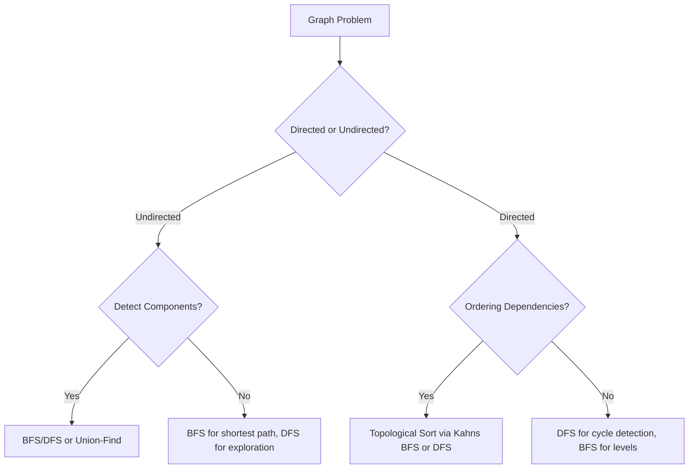

## Graphs: The Universal Data Structure

Graphs model relationships. Nodes represent entities, and edges represent connections between them. From social networks to road maps to dependency chains, graphs are everywhere in computer science. Mastering graph fundamentals is essential for tackling a huge family of algorithm problems.

### Representation

The two most common representations are:

- **Adjacency List**: Each node stores a list of its neighbors. Space-efficient for sparse graphs — O(V + E). This is the go-to for most interview problems.
- **Adjacency Matrix**: A 2D array where `matrix[i][j]` indicates an edge from i to j. Good for dense graphs or when you need O(1) edge lookup, but costs O(V^2) space.



### BFS — Breadth-First Search

BFS explores level by level using a queue. It finds the shortest path in unweighted graphs. Time: O(V + E). Use BFS when you need the minimum number of steps or when exploring layer by layer.

### DFS — Depth-First Search

DFS goes as deep as possible before backtracking, using a stack or recursion. It is the basis for cycle detection, topological sorting, and finding connected components. Time: O(V + E).

### Topological Sort

For directed acyclic graphs — DAGs — topological sort produces a linear ordering where every edge goes from earlier to later. Two approaches: Kahns algorithm uses BFS with in-degree tracking; the DFS approach uses post-order reversal. If a cycle exists, topological sort is impossible.

### Union-Find — Disjoint Set Union

Union-Find efficiently tracks which nodes belong to the same connected component. Two key optimizations make it nearly O(1) per operation:

- **Path Compression**: Flatten the tree during find operations.
- **Union by Rank**: Always attach the smaller tree under the root of the larger tree.

Union-Find excels at dynamic connectivity queries: "Are nodes A and B connected?" and "Connect nodes A and B."

### Connected Components

In an undirected graph, run BFS or DFS from each unvisited node to discover all connected components. Alternatively, use Union-Find to group nodes incrementally.

Graph problems are everywhere in interviews. Build your adjacency list, choose BFS or DFS based on the question, and always track visited nodes to avoid infinite loops.

## ELI5

Imagine a map of cities connected by roads. Each city is a **node**, and each road is an **edge**. A graph is just a fancy way of drawing this map in code.

```
Cities and roads:

   New York ─── Boston
      |              |
   Philadelphia ─── Providence
      |
   Washington DC

Adjacency list (how the code stores it):
  New York    → [Boston, Philadelphia]
  Boston      → [New York, Providence]
  Philadelphia → [New York, Providence, Washington DC]
  Providence  → [Boston, Philadelphia]
  Washington DC → [Philadelphia]
```

**BFS** (breadth-first) is like dropping a pebble in water and watching the ripples spread. You visit all cities 1 road away first, then 2 roads away, then 3...

**DFS** (depth-first) is like following one road all the way to its end, then backtracking and trying the next road.

**Topological sort** is for when things have to happen in order — like cooking steps. You can't bake the cake before mixing the batter. Topo sort figures out a valid order where every dependency comes first.

```
Recipe dependencies:

  buy eggs ──┐
  buy flour──┤─→ mix batter ──→ bake ──→ frost ──→ eat cake 🎂
  buy butter─┘                   ↑
  preheat oven ──────────────────┘

Topological order: buy ingredients → preheat → mix → bake → frost → eat
```

**Union-Find** is like sorting kids into teams. "Are you on the same team as her?" — check in one step, even after hundreds of team merges.

## Poem

Nodes and edges, a web of ties,
Adjacency lists where connection lies.
BFS spreads outward, level by level,
DFS dives deep like a daring daredevil.

Topological sort lines the DAG up straight,
Union-Find groups components — no debate.
From social graphs to maps on a screen,
Graphs are the mightiest structure you have seen.

## Template

```ts
// Build adjacency list from edge list
function buildGraph(n: number, edges: number[][]): Map<number, number[]> {
  const graph = new Map<number, number[]>();

  for (let i = 0; i < n; i++) graph.set(i, []);

  for (const [u, v] of edges) {
    graph.get(u)!.push(v);
    graph.get(v)!.push(u); // omit for directed graph
  }

  return graph;
}

// BFS traversal
function bfs(graph: Map<number, number[]>, start: number): number[] {
  const visited = new Set<number>([start]);
  const queue: number[] = [start];
  const order: number[] = [];

  while (queue.length > 0) {
    const node = queue.shift()!;
    order.push(node);

    for (const neighbor of graph.get(node) ?? []) {
      if (!visited.has(neighbor)) {
        visited.add(neighbor);
        queue.push(neighbor);
      }
    }
  }

  return order;
}

// DFS traversal
function dfsGraph(graph: Map<number, number[]>, start: number): number[] {
  const visited = new Set<number>();
  const order: number[] = [];

  function dfs(node: number): void {
    visited.add(node);
    order.push(node);

    for (const neighbor of graph.get(node) ?? []) {
      if (!visited.has(neighbor)) {
        dfs(neighbor);
      }
    }
  }

  dfs(start);
  return order;
}

// Topological sort (Kahn's algorithm — BFS-based)
function topologicalSort(n: number, edges: number[][]): number[] {
  const graph = new Map<number, number[]>();
  const inDegree = new Array(n).fill(0);

  for (let i = 0; i < n; i++) graph.set(i, []);

  for (const [u, v] of edges) {
    graph.get(u)!.push(v);
    inDegree[v]++;
  }

  const queue: number[] = [];
  for (let i = 0; i < n; i++) {
    if (inDegree[i] === 0) queue.push(i);
  }

  const order: number[] = [];

  while (queue.length > 0) {
    const node = queue.shift()!;
    order.push(node);

    for (const neighbor of graph.get(node) ?? []) {
      inDegree[neighbor]--;
      if (inDegree[neighbor] === 0) queue.push(neighbor);
    }
  }

  return order.length === n ? order : []; // empty if cycle exists
}
```
