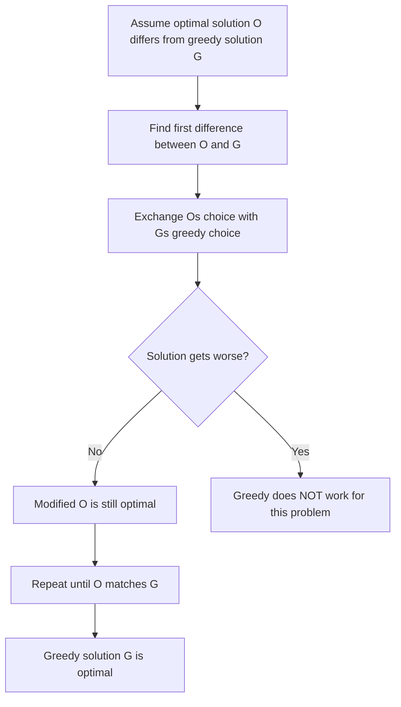

## Greedy Algorithms: Trust the Local Optimum

A greedy algorithm makes the locally optimal choice at each step, hoping that these local choices lead to a globally optimal solution. Unlike dynamic programming, greedy algorithms never reconsider past decisions. This makes them fast and elegant — when they work. The challenge is proving that greedy actually produces the correct answer.

### When Does Greedy Work?

Greedy works when the problem has two properties:

- **Greedy Choice Property**: A locally optimal choice can always be part of some globally optimal solution.
- **Optimal Substructure**: After making the greedy choice, the remaining problem is a smaller instance of the same type.

### The Exchange Argument Proof

The most common technique for proving a greedy algorithm correct is the **exchange argument**:

1. Assume an optimal solution O exists that differs from the greedy solution G.
2. Find the first point where they differ.
3. Show that you can "exchange" the choice in O with the greedy choice without making the solution worse.
4. Repeat until O matches G, proving G is also optimal.



### Classic Greedy Problems

**Interval Scheduling — Activity Selection**: Given intervals, select the maximum number of non-overlapping ones. Greedy strategy: always pick the interval that ends earliest. Sort by end time, greedily select, skip overlapping.

**Jump Game**: Can you reach the last index? Track the farthest reachable position. At each step, update the farthest reach. If you ever land on an index beyond the current farthest, the answer is no.

**Huffman Coding**: Build an optimal prefix-free code by repeatedly merging the two lowest-frequency nodes. Uses a min-heap internally.

**Fractional Knapsack**: Unlike 0/1 knapsack — which requires DP — the fractional version is greedy. Sort items by value-per-weight, take as much of the best item as you can.

**Task Scheduling with Deadlines**: Sort tasks by deadline and use a priority queue to decide which tasks to drop when conflicts arise.

### Greedy vs DP

If a problem has overlapping subproblems and you cannot prove the greedy choice property, you likely need DP. A good heuristic: if you find a counterexample where the greedy choice leads to a suboptimal result, switch to DP or backtracking.

### Tips for Interviews

- State your greedy strategy explicitly before coding.
- Briefly argue why it works — the interviewer wants to hear your reasoning.
- Sorting is almost always the first step in a greedy solution.
- When in doubt, try to construct a counterexample. If you cannot, greedy is likely correct.

## ELI5

Imagine you're collecting coins along a path, and you can only move forward. A **greedy** approach says: always grab the biggest coin you can see right now, without thinking about the future.

```
Path of coins:  [1¢, 5¢, 1¢, 25¢, 10¢, 1¢]

Greedy: just grab the biggest coin at each step.

Sometimes greedy works perfectly:
  Making change for 41¢ with [25¢, 10¢, 5¢, 1¢]:
  Take 25¢ → 16¢ remaining
  Take 10¢ → 6¢ remaining
  Take 5¢  → 1¢ remaining
  Take 1¢  → done! (4 coins — optimal!)

Sometimes greedy fails:
  Making change for 6¢ with [4¢, 3¢, 1¢]:
  Greedy: take 4¢ → 2¢ remaining → take 1¢, 1¢ = 3 coins
  Optimal: take 3¢, 3¢ = 2 coins  ← greedy missed this!
```

**Interval scheduling** is a classic greedy win. If you have overlapping meetings and want to attend as many as possible:

```
Meetings: [9-11am, 10-12pm, 11-1pm, 12-2pm]

Greedy strategy: always pick the meeting that ends EARLIEST.

Step 1: Pick [9-11am]  (ends at 11, earliest)
Step 2: [10-12pm] overlaps → skip
Step 3: Pick [11-1pm]  (ends at 1, next earliest non-overlapping)
Step 4: Pick [12-2pm]  (ends at 2, doesn't overlap with 11-1pm)

Result: 3 meetings — the maximum possible!
```

**The key question:** does making the best local choice now guarantee the best overall result? If yes, greedy works. If you can find a counterexample where being "locally greedy" leads to a globally worse outcome, you need DP instead.

## Poem

Take the best that's right in front of you,
Never look back — just push on through.
Sort the intervals, pick the soonest end,
A greedy choice is a coder's best friend.

But prove it works, or you'll pay the price —
Exchange the argument, check it twice.
When local optimums globally align,
Greedy algorithms run in record time.

## Template

```ts
// Greedy: Maximum Subarray (Kadane's Algorithm)
function maxSubArray(nums: number[]): number {
  let maxSum = nums[0];
  let currentSum = nums[0];

  for (let i = 1; i < nums.length; i++) {
    // Greedy choice: extend current subarray or start fresh
    currentSum = Math.max(nums[i], currentSum + nums[i]);
    maxSum = Math.max(maxSum, currentSum);
  }

  return maxSum;
}

// Greedy: Interval Scheduling (sort by end time)
function eraseOverlapIntervals(intervals: number[][]): number {
  intervals.sort((a, b) => a[1] - b[1]); // sort by end time
  let removed = 0;
  let prevEnd = -Infinity;

  for (const [start, end] of intervals) {
    if (start < prevEnd) {
      removed++; // overlap → remove (keep the one ending earlier)
    } else {
      prevEnd = end; // no overlap → keep this interval
    }
  }

  return removed;
}

// Greedy: Jump Game (track max reachable)
function canJump(nums: number[]): boolean {
  let maxReach = 0;

  for (let i = 0; i < nums.length; i++) {
    if (i > maxReach) return false; // stuck
    maxReach = Math.max(maxReach, i + nums[i]);
  }

  return true;
}

// Greedy: Partition Labels (last occurrence tracking)
function partitionLabels(s: string): number[] {
  const lastIdx: Record<string, number> = {};
  for (let i = 0; i < s.length; i++) lastIdx[s[i]] = i;

  const result: number[] = [];
  let start = 0, end = 0;

  for (let i = 0; i < s.length; i++) {
    end = Math.max(end, lastIdx[s[i]]);
    if (i === end) {
      result.push(end - start + 1);
      start = end + 1;
    }
  }

  return result;
}
```
