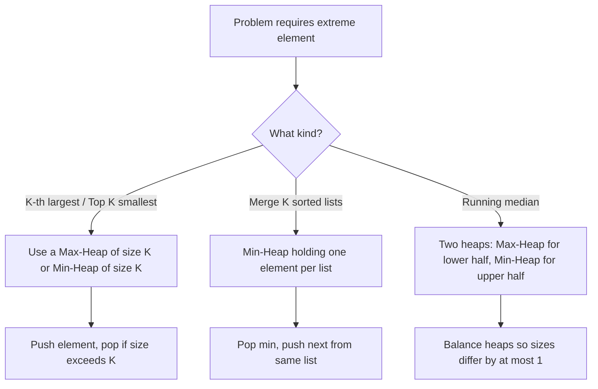

## Heap and Priority Queue: Always Know the Extreme

A heap is a specialized tree-based data structure that satisfies the heap property: in a min-heap, every parent is smaller than or equal to its children; in a max-heap, every parent is greater than or equal to its children. This gives you O(1) access to the minimum or maximum element and O(log n) insertion and extraction.

### Why Heaps Matter

Heaps power the **priority queue** abstract data type, which appears in a remarkable number of algorithm problems. Whenever a problem asks for the "K-th largest," "top K elements," "merge K sorted lists," or "running median," a heap is almost certainly the right tool.



### Core Operations

- **Insert**: Add element at the bottom, then "bubble up" to restore heap property — O(log n).
- **Extract min/max**: Remove the root, move the last element to root, then "sift down" — O(log n).
- **Peek**: Return the root — O(1).
- **Heapify**: Build a heap from an unsorted array in O(n) using bottom-up sift-down.

### Key Patterns

**Top K Elements**: Maintain a min-heap of size K. For each element, push it in. If the heap exceeds size K, pop the smallest. At the end, the heap contains the K largest elements. Time: O(n log K).

**Merge K Sorted Lists**: Push the first element of each list into a min-heap. Pop the smallest, then push the next element from that same list. Repeat until all lists are exhausted. Time: O(N log K) where N is total elements.

**Running Median**: Maintain two heaps — a max-heap for the lower half and a min-heap for the upper half. Balance them so their sizes differ by at most one. The median is always at the top of one or both heaps.

### Implementation Notes

In JavaScript and TypeScript, there is no built-in heap. You will need to implement one or use a library. The array-based representation is standard: for index i, the left child is at 2i+1, the right child at 2i+2, and the parent at floor of i-1 divided by 2.

Practice recognizing when a problem needs "repeated access to the current min or max" — that is your cue to reach for a heap.

## ELI5

Imagine a hospital emergency room. Patients arrive at different times, but you don't treat them in arrival order — you always treat the **sickest patient first**. That's a priority queue (heap).

```
Patients arrive: [mild cold, broken arm, heart attack, sprained ankle]

A regular queue (wrong for ER):
  Treat: mild cold → broken arm → heart attack → ...
  (heart attack patient waits too long!)

A priority queue (min-heap, lowest urgency score = most urgent):
  Add: mild cold (score 4)   → heap top: mild cold
  Add: broken arm (score 2)  → heap top: broken arm
  Add: heart attack (score 1)→ heap top: heart attack ← always pops first!
  Add: sprained ankle (score 3)

  Pop order: heart attack → broken arm → sprained ankle → mild cold ✓
```

**Finding the K-th largest** element: imagine you're a talent show judge keeping track of the top 3 contestants. You maintain a small pile of just 3 names. When a new contestant comes in:
- If they're better than the worst in your pile, kick the worst out and add the new one.
- Otherwise, ignore them.

```
Top 3 from: [3, 1, 5, 12, 2, 11]

Start with min-heap (keeps track of the minimum in your "top K" pile):

  Add 3  → heap: [3]
  Add 1  → heap: [1, 3]
  Add 5  → heap: [1, 3, 5]    ← full!
  Add 12 → 12 > heap min (1) → pop 1, push 12 → heap: [3, 5, 12]
  Add 2  → 2 < heap min (3)  → skip
  Add 11 → 11 > heap min (3) → pop 3, push 11 → heap: [5, 11, 12]

Top 3: [5, 11, 12]   Heap top (minimum of top 3) = 5 = 3rd largest ✓
```

**Two heaps for running median**: split the data into two halves — a max-heap for the lower half and a min-heap for the upper half. The median is always at the top of one or both heaps.

## Poem

At the top sits the king of the tree,
The smallest — or greatest — for all to see.
Push a new node, let it bubble on up,
Pop from the root, let it trickle and drop.

Need the top K? Keep a heap that's tight,
Running median? Two heaps make it right.
Merge K sorted streams with elegant ease —
The heap is your tool for problems like these.

## Template

```ts
class MinHeap {
  private heap: number[] = [];

  get size(): number {
    return this.heap.length;
  }

  peek(): number | undefined {
    return this.heap[0];
  }

  push(val: number): void {
    this.heap.push(val);
    this.bubbleUp(this.heap.length - 1);
  }

  pop(): number | undefined {
    if (this.heap.length === 0) return undefined;

    const min = this.heap[0];
    const last = this.heap.pop()!;

    if (this.heap.length > 0) {
      this.heap[0] = last;
      this.bubbleDown(0);
    }

    return min;
  }

  private bubbleUp(i: number): void {
    while (i > 0) {
      const parent = Math.floor((i - 1) / 2);
      if (this.heap[parent] <= this.heap[i]) break;
      [this.heap[parent], this.heap[i]] = [this.heap[i], this.heap[parent]];
      i = parent;
    }
  }

  private bubbleDown(i: number): void {
    const n = this.heap.length;

    while (true) {
      let smallest = i;
      const left = 2 * i + 1;
      const right = 2 * i + 2;

      if (left < n && this.heap[left] < this.heap[smallest]) smallest = left;
      if (right < n && this.heap[right] < this.heap[smallest]) smallest = right;

      if (smallest === i) break;

      [this.heap[smallest], this.heap[i]] = [this.heap[i], this.heap[smallest]];
      i = smallest;
    }
  }
}

// Usage: K-th largest element
function findKthLargest(nums: number[], k: number): number {
  const minHeap = new MinHeap();

  for (const num of nums) {
    minHeap.push(num);
    if (minHeap.size > k) {
      minHeap.pop(); // evict smallest, keeping K largest
    }
  }

  return minHeap.peek()!;
}
```
