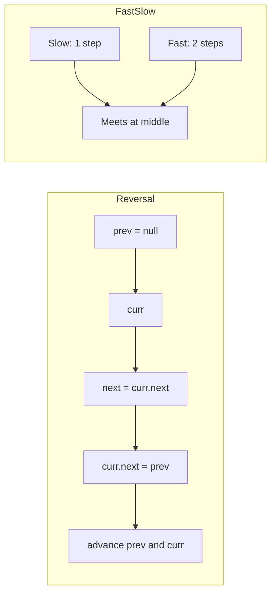

## Linked List

Linked list problems test your ability to manipulate pointers without losing references. The core challenge is rearranging node connections while keeping the list intact. Mastering a few key techniques covers the vast majority of problems.

### Dummy Node

Create a dummy node that points to the head. This eliminates edge cases where the head itself might change — for example, when removing the first node or merging two lists. At the end, return `dummy.next` as the new head.

#### Real World
> **[Memory allocators]** — Custom memory allocators (like those in game engines) maintain a free-list as a linked list with a dummy sentinel head, enabling O(1) allocation and deallocation by manipulating pointers directly without special-casing empty lists.

#### Practice
1. Given a linked list and a value k, remove all nodes with value k. Solve using a dummy head to handle the case where head itself needs removal.
2. Given a linked list, remove the n-th node from the end in one pass. Use a dummy head to simplify the edge case where n equals the list length.
3. Why does a dummy head eliminate the need to special-case an empty list or head deletion? Give a concrete example where the code without a dummy head requires an extra conditional.

### Fast and Slow Pointers

Move one pointer one step at a time and another two steps at a time. When the fast pointer reaches the end, the slow pointer is at the middle. This technique also detects cycles: if there is a cycle, the fast pointer will eventually meet the slow pointer. To find the cycle's start, reset one pointer to the head and move both one step at a time until they meet.

#### Real World
> **[Operating systems / garbage collection]** — Garbage collectors in languages like Java use Floyd's cycle detection (fast/slow pointer) to detect reference cycles in object graphs, identifying memory that can never be freed despite having non-zero reference counts.

#### Practice
1. Given the head of a linked list, determine if the list contains a cycle. If so, return the node where the cycle begins (Linked List Cycle II / LeetCode 142).
2. Given the head of a linked list, return the middle node. If there are two middle nodes, return the second (Middle of the Linked List / LeetCode 876).
3. After fast and slow pointers meet in a cycle, why does moving one pointer back to the head and advancing both one step at a time always find the cycle entry point? Sketch the mathematical proof.

### Reversal

To reverse a linked list, maintain three pointers: prev, current, and next. Save current's next, point current back to prev, then advance. This runs in O(n) time and O(1) space. Partial reversal — reversing between positions m and n — requires carefully connecting the reversed segment back to the surrounding nodes.

#### Real World
> **[LRU cache implementation]** — LRU caches (used in Redis, CPU caches, and browser history) use a doubly linked list for O(1) node removal and reordering. When a cache entry is accessed, its node is reversed-moved to the front — exactly the partial-reversal / pointer-rewiring pattern.

#### Practice
1. Reverse a singly linked list iteratively in O(n) time and O(1) space. Then reverse it recursively. Which approach risks stack overflow on long lists?
2. Given a linked list, reverse only the nodes between positions left and right (1-indexed), in-place (Reverse Linked List II / LeetCode 92).
3. Reversing a doubly linked list requires updating both `next` and `prev` pointers. What is the minimal set of pointer assignments needed per node, and what is the most common off-by-one mistake?



### Merge Technique

Merging two sorted lists uses a dummy node and a tail pointer. Compare the heads of both lists, append the smaller one to tail, and advance. This pattern also applies to flattening multi-level lists or interleaving nodes.

#### Real World
> **[Database query execution]** — Merge-sort joins in relational databases (like PostgreSQL's merge join) use this exact two-list merge technique on sorted table pages, enabling O(n + m) join time when both input relations are already sorted on the join key.

#### Practice
1. Merge two sorted linked lists into one sorted list and return the head (Merge Two Sorted Lists / LeetCode 21). Use a dummy head for clean pointer management.
2. Given k sorted linked lists, merge them all into one sorted list (Merge K Sorted Lists / LeetCode 23). Use a min-heap to pick the smallest current head.
3. The merge of two sorted lists runs in O(n + m). How does this compose into O(n log k) when merging k lists of roughly equal size n/k using a divide-and-conquer approach?

### Complexity

Most linked list operations are O(n) time and O(1) space. The main difficulty is not algorithmic but mechanical: track your pointers carefully, draw the state before and after each operation, and always check for null references.

#### Real World
> **[System design — messaging queues]** — Message queue implementations like those underpinning Kafka consumers use linked lists internally for O(1) enqueue and dequeue. The O(n) access time is never needed since consumers always process the front of the queue.

#### Practice
1. Given a linked list, determine if it is a palindrome (Palindrome Linked List / LeetCode 234). Solve in O(n) time and O(1) space using fast/slow pointers plus in-place reversal.
2. Given a linked list, reorder it such that the nodes are in the order: first, last, second, second-to-last, ... (Reorder List / LeetCode 143). What three sub-techniques does this problem require?
3. Linked list operations are O(n) for random access but O(1) for insertion/deletion at a known pointer. Compare this with array trade-offs and describe a system where the linked list characteristic is critical.

## ELI5

Imagine a treasure hunt where each clue is hidden in a box, and each box has a note saying **where the next box is**. You can only reach box 5 by starting at box 1 and following the trail.

```
Linked list: [A] → [B] → [C] → [D] → null

Box A says: "I hold 'A', next box is B"
Box B says: "I hold 'B', next box is C"
Box C says: "I hold 'C', next box is D"
Box D says: "I hold 'D', next box is nowhere (null)"

To get to D: you MUST start at A and follow the trail. You can't skip to D directly.
```

**Reversing a linked list** is like flipping the arrows so each clue points back to where you came from:

```
Before: A → B → C → D → null
After:  null ← A ← B ← C ← D

Process (three pointers: prev, curr, next):
  prev=null, curr=A
  Step 1: save next=B, point A→null, advance: prev=A, curr=B
  Step 2: save next=C, point B→A,    advance: prev=B, curr=C
  Step 3: save next=D, point C→B,    advance: prev=C, curr=D
  Step 4: save next=null, point D→C, advance: prev=D, curr=null
  Done! New head = D
```

**Fast and slow pointers** are like two runners on a circular track. If there's no loop, the fast runner finishes and leaves. If there IS a loop, the fast runner laps the slow runner and they meet.

```
Cycle detection:

  Slow: moves 1 step at a time  🐢
  Fast: moves 2 steps at a time 🐇

  No cycle:  fast reaches null → no cycle
  Has cycle: fast loops around and catches slow → they meet → cycle found!
```

**The dummy head** trick eliminates annoying edge cases. Put a fake node before the real head so you never have to special-case "what if I need to remove/insert at the very beginning?"

## Poem

Nodes in a chain, one points ahead,
A dummy node to guard the head.
Fast and slow, a racing pair,
One finds the middle, one checks what's there.

Reverse the arrows, flip the flow,
Prev, curr, next — a steady show.
Null at the end, null at the start,
Pointer problems are pointer art.

Draw it out, keep references tight,
Linked lists reward those who get it right.

## Template

```ts
interface ListNode {
  val: number;
  next: ListNode | null;
}

// Reverse a linked list iteratively
function reverseList(head: ListNode | null): ListNode | null {
  let prev: ListNode | null = null;
  let curr = head;

  while (curr !== null) {
    const next = curr.next; // save next
    curr.next = prev;       // reverse pointer
    prev = curr;            // advance prev
    curr = next;            // advance curr
  }

  return prev; // new head
}

// Fast/slow pointer — find the middle node
function findMiddle(head: ListNode | null): ListNode | null {
  let slow = head;
  let fast = head;

  while (fast !== null && fast.next !== null) {
    slow = slow!.next;
    fast = fast.next.next;
  }

  return slow; // middle node (second middle if even length)
}

// Detect cycle using Floyd's algorithm
function hasCycle(head: ListNode | null): boolean {
  let slow = head;
  let fast = head;

  while (fast !== null && fast.next !== null) {
    slow = slow!.next;
    fast = fast.next.next;

    if (slow === fast) return true;
  }

  return false;
}
```
