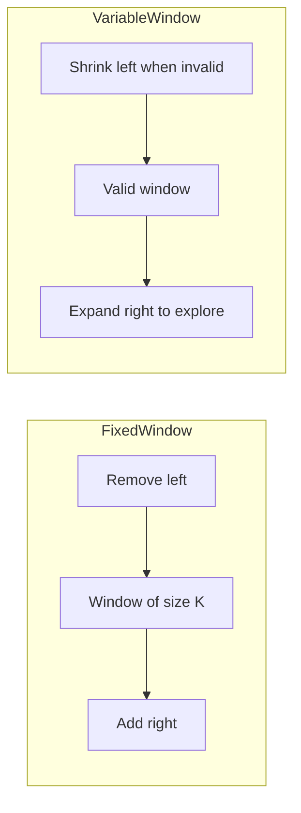

## Sliding Window

The sliding window technique maintains a contiguous subarray or substring and slides it across the input, updating the answer incrementally. Instead of recalculating from scratch for every possible window, you add the new element entering the window and remove the one leaving — reducing O(n*k) brute force to O(n).

### Fixed-Size Window

When the window size k is given, initialize the window with the first k elements, then slide by adding the next element and removing the leftmost. This solves problems like "maximum sum subarray of size k" or "moving averages."

### Variable-Size Window

When you need to find the longest or shortest subarray meeting a condition, use two pointers as window boundaries. Expand the right boundary to include more elements. When the window violates the constraint, shrink from the left until it is valid again.

The key invariant: the window always represents a candidate solution, and you track the best candidate seen so far.



### Common Applications

- Longest substring without repeating characters
- Minimum window substring containing all target characters
- Maximum sum subarray of size k
- Count of subarrays with at most K distinct elements

### Tracking Window State

Use a hash map or array to track frequencies inside the window. A "valid count" variable can track how many target characters are satisfied, avoiding a full map comparison on every step. This keeps the per-step work at O(1).

### Complexity

Both fixed and variable sliding windows run in O(n) time because each element enters and leaves the window at most once. Space is O(1) for numeric windows or O(k) when tracking character frequencies.

## ELI5

Imagine you're on a train looking out the window. Your window frame shows exactly 3 houses at a time. As the train moves, one house leaves your view on the left and a new one enters on the right.

```
Houses: [🏠 🏡 🏘 🏚 🏠 🏡]
Window size: 3

Position 1:  [🏠 🏡 🏘] 🏚 🏠 🏡    sum = 3
Position 2:   🏠 [🏡 🏘 🏚] 🏠 🏡   sum = 4  (remove 🏠, add 🏚)
Position 3:   🏠 🏡 [🏘 🏚 🏠] 🏡   sum = 3  (remove 🏡, add 🏠)
Position 4:   🏠 🏡 🏘 [🏚 🏠 🏡]   sum = 3  (remove 🏘, add 🏡)

Max sum window = 4 (position 2)
```

Without sliding window, you'd add up all 3 houses fresh each time. With sliding window, you just **add one house on the right and remove one on the left** — constant work per step.

**Variable-size windows** are like adjusting binoculars. Zoom in (shrink left) when you've seen too much, zoom out (expand right) to see more:

```
Find the longest substring with no repeated letters:
"abcba"

right=0: window=[a]         valid → length=1
right=1: window=[ab]        valid → length=2
right=2: window=[abc]       valid → length=3
right=3: window=[abcb]      INVALID! 'b' repeated
  → shrink left: remove 'a' → [bcb]  still invalid
  → shrink left: remove 'b' → [cb]   valid! length=2
right=4: window=[cba]       valid → length=3

Answer: 3 (either "abc" or "cba")
```

**The key insight:** each element enters the window once (from the right) and leaves once (from the left). So the total work is O(n) — the window never goes backwards.

## Poem

Slide a window, left to right,
Keep the frame exactly tight.
Add the new, remove the old,
Watch the answer now unfold.

Fixed in size or free to grow,
Shrink the left when limits blow.
Every element enters once,
Leaves just once — no second hunts.

Substrings, sums, or distinct count,
Sliding windows — paramount.

## Template

```ts
// Variable-size sliding window template
function slidingWindow(s: string): number {
  const freq = new Map<string, number>();
  let left = 0;
  let result = 0;

  for (let right = 0; right < s.length; right++) {
    // Expand: add s[right] to the window
    freq.set(s[right], (freq.get(s[right]) ?? 0) + 1);

    // Shrink: move left pointer until window is valid
    while (/* window is invalid */ false) {
      freq.set(s[left], freq.get(s[left])! - 1);
      if (freq.get(s[left]) === 0) freq.delete(s[left]);
      left++;
    }

    // Update result with the current valid window
    result = Math.max(result, right - left + 1);
  }

  return result;
}

// Fixed-size sliding window template
function fixedWindow(nums: number[], k: number): number {
  let windowSum = 0;
  let maxSum = -Infinity;

  for (let i = 0; i < nums.length; i++) {
    windowSum += nums[i];

    if (i >= k) {
      windowSum -= nums[i - k]; // remove element leaving the window
    }

    if (i >= k - 1) {
      maxSum = Math.max(maxSum, windowSum);
    }
  }

  return maxSum;
}
```
