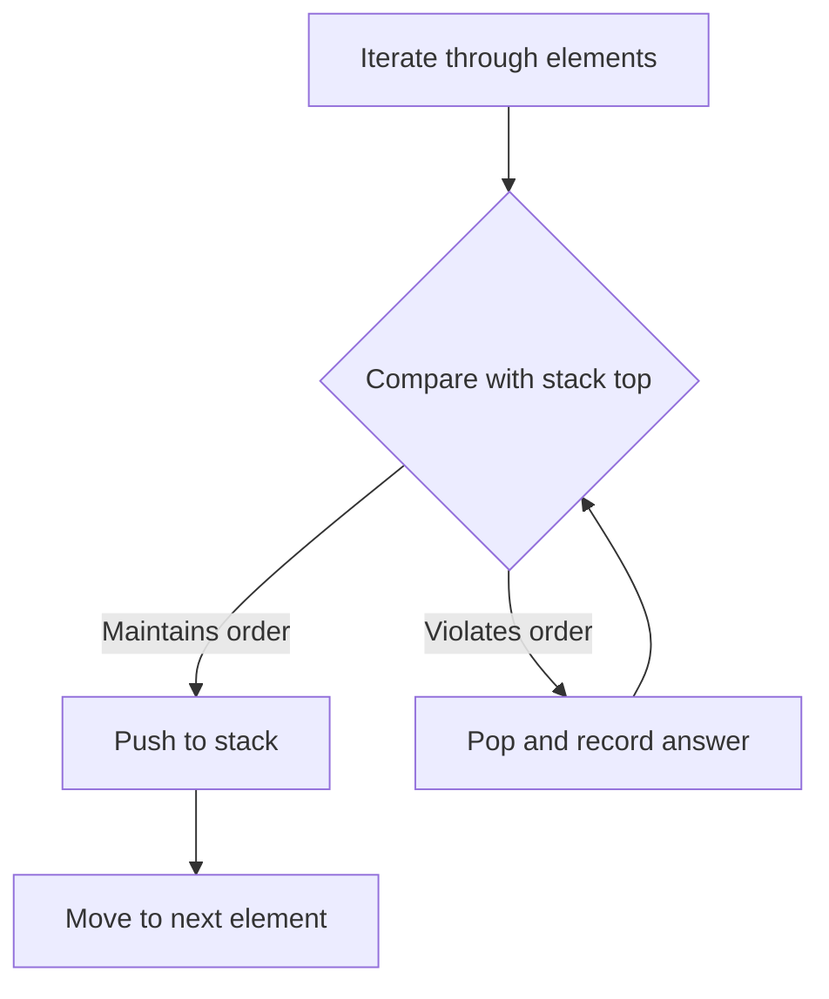

## Stack

A stack is a Last-In-First-Out structure that excels at problems involving matching, nesting, and tracking "the most recent unresolved item." Whenever you need to remember context and backtrack to it, a stack is your tool.

### Matching and Nesting

The classic application is validating balanced parentheses. Push opening brackets onto the stack; when you encounter a closing bracket, pop and verify it matches. If the stack is empty at the end, the input is valid. This extends to any nesting structure: HTML tags, nested function calls, or expression evaluation.

#### Real World
> **[Compilers / parsers]** — Every compiler and browser HTML parser uses a stack to validate and evaluate nested structures: XML/HTML tag matching, JSON brace pairing, and expression parsing all rely on the same push-on-open, pop-on-close stack pattern.

#### Practice
1. Given a string containing just '(', ')', '[', ']', '{', '}', determine if the input string is valid (Valid Parentheses / LeetCode 20). Solve using a stack.
2. Given an absolute Unix file path, simplify it (remove `.`, `..`, and extra `/`) by processing each component with a stack (Simplify Path / LeetCode 71).
3. In the valid parentheses problem, why is checking `stack.length === 0` at the end (in addition to the mismatch check inside the loop) necessary? What input would fail without that final check?

### Monotonic Stack

A monotonic stack maintains elements in sorted order — either strictly increasing or strictly decreasing. As you iterate through an array, you pop elements that violate the monotonic property, and each pop reveals a relationship like "next greater element" or "next smaller element."

This solves problems like daily temperatures, stock span, largest rectangle in histogram, and trapping rain water. The key insight: each element is pushed and popped at most once, so the total time is O(n).

#### Real World
> **[Financial analytics]** — Stock market dashboards compute the "stock span" (number of consecutive prior days the price was less than or equal to today's price) using a monotonic stack, enabling O(n) computation of spans across years of daily prices for visualization tools at Bloomberg and financial data providers.

#### Practice
1. Given an array of daily temperatures, find for each day the number of days until a warmer temperature (Daily Temperatures / LeetCode 739). Solve using a monotonic stack storing indices.
2. Given heights of bars in a histogram, find the largest rectangle that can be formed (Largest Rectangle in Histogram / LeetCode 84). Explain how the monotonic stack identifies the left and right boundaries.
3. Monotonic stacks store indices rather than values in most implementations. Why is storing indices more powerful than storing values, and give a problem where storing only the value would fail?



### Expression Evaluation

Stacks naturally handle expression parsing. Use one stack for operators and one for operands, or convert infix to postfix notation. The stack tracks pending operations, resolving them when a higher-priority operator or closing bracket appears.

#### Real World
> **[Spreadsheet engines / calculators]** — Google Sheets and Excel use the Shunting-Yard algorithm (operator + operand stacks) to evaluate formulas like `=SUM(A1*(B2+C3))`. The same two-stack approach powers calculators, expression evaluators in programming languages, and query plan generators in databases.

#### Practice
1. Evaluate a Reverse Polish Notation (postfix) expression — numbers and operators in an array. Use a single stack to evaluate in O(n) (Evaluate Reverse Polish Notation / LeetCode 150).
2. Implement a basic calculator that evaluates a string containing digits, `+`, `-`, and parentheses (Basic Calculator / LeetCode 224). How do parentheses interact with the operator stack?
3. Why is postfix (RPN) notation easier to evaluate with a stack than infix notation? What property of postfix eliminates the need to handle operator precedence during evaluation?

### Complexity

Stack-based solutions are typically O(n) time and O(n) space. Despite the nested-looking while loop inside the for loop, each element is pushed and popped at most once, giving amortized O(1) per operation.

#### Real World
> **[Interview preparation platforms]** — Understanding the amortized O(1) analysis of stacks is a commonly tested concept at Google, Meta, and Amazon interviews. Recognizing that O(n) total push/pop operations within an O(n) loop does not make the algorithm O(n²) is a key insight distinguishing strong candidates.

#### Practice
1. Given a circular array of temperatures, find the next warmer day for each position, wrapping around if needed (Next Greater Element II / LeetCode 503). How do you handle the circular structure with a stack?
2. Given an array of non-negative integers representing an elevation map, compute how much water it can trap after raining (Trapping Rain Water / LeetCode 42). Solve using a monotonic stack.
3. The monotonic stack processes each element at most twice (one push, one pop). Explain this amortized argument and why the outer `for` loop with an inner `while` loop is still O(n) overall.

### Recognition Pattern

If the problem involves nesting, matching pairs, "previous or next greater or smaller," or needs to track a history that unwinds in reverse order, think stack.

#### Real World
> **[Version control / undo history]** — Text editors and IDEs implement undo/redo with two stacks: operations are pushed onto the undo stack, and "undo" pops from it onto the redo stack. This LIFO structure perfectly models the "reverse the last action" behavior users expect.

#### Practice
1. Given a series of directory navigation commands (`cd dir`, `cd ..`, `cd /`), determine the minimum number of operations to return to the main folder (Crawler Log Folder / LeetCode 1598). What pattern does this map to?
2. Design a stack that supports `push`, `pop`, `top`, and `getMin` operations all in O(1) time (Min Stack / LeetCode 155). What auxiliary structure is needed?
3. Given the patterns you've seen (matching, monotonic, expression evaluation), describe a structured approach to recognizing which stack variant a new problem requires, before writing any code.

## ELI5

Imagine a stack of pancakes. You can only add to the top or take from the top. The pancake you put on last is the first one you eat. That's a stack — **Last In, First Out**.

```
Push pancakes:         Pop pancakes:
         🥞  ← add      🥞  ← remove first
       🥞               🥞
     🥞               🥞
   🥞               🥞

You always interact with the TOP of the stack.
```

**Matching parentheses** is exactly like tracking "open" and "close" events. Push when something opens, pop when something closes:

```
Check if "({[]})" is valid:

  See '(' → push → stack: [(]
  See '{' → push → stack: [(, {]
  See '[' → push → stack: [(, {, []
  See ']' → pop '[' → matches! → stack: [(, {]
  See '}' → pop '{' → matches! → stack: [(]
  See ')' → pop '(' → matches! → stack: []
  Stack empty at end → VALID ✓

Check "([)]":
  See '(' → push → stack: [(]
  See '[' → push → stack: [(, []
  See ')' → pop '[' → doesn't match ')' → INVALID ✗
```

**Monotonic stack** is like a bouncer at a club who only lets in people who are taller than the last person in line. When someone shorter arrives, all the taller people behind them get removed first:

```
Find next greater element for [2, 1, 4, 3]:

  i=0: push 2    → stack: [2]
  i=1: 1 < 2, just push → stack: [2, 1]
  i=2: 4 > 1, pop 1 → next greater of 1 is 4
       4 > 2, pop 2 → next greater of 2 is 4
       push 4    → stack: [4]
  i=3: 3 < 4, just push → stack: [4, 3]
  End: stack leftovers → next greater = -1

Result: [4, 4, -1, -1]
```

Each element is pushed and popped **at most once**, so the whole process is O(n) even though there's a loop inside a loop.

## Poem

Last in, first out — the stack's decree,
It tracks the context, history.
Push it on when something's new,
Pop it off when you're back through.

Monotonic, rising tall,
Pop the short ones — watch them fall.
Next greater element? Stack knows best,
Each one pushed and popped — then rest.

Nesting, matching, history's call,
The humble stack can solve them all.

## Template

```ts
// Monotonic stack: next greater element for each position
function nextGreaterElement(nums: number[]): number[] {
  const result = new Array(nums.length).fill(-1);
  const stack: number[] = []; // stores indices

  for (let i = 0; i < nums.length; i++) {
    // Pop elements smaller than current — current is their next greater
    while (stack.length > 0 && nums[stack[stack.length - 1]] < nums[i]) {
      const idx = stack.pop()!;
      result[idx] = nums[i];
    }
    stack.push(i);
  }

  return result;
}

// Valid parentheses matching
function isValid(s: string): boolean {
  const stack: string[] = [];
  const pairs: Record<string, string> = { ')': '(', ']': '[', '}': '{' };

  for (const ch of s) {
    if (ch === '(' || ch === '[' || ch === '{') {
      stack.push(ch);
    } else {
      if (stack.length === 0 || stack.pop() !== pairs[ch]) {
        return false;
      }
    }
  }

  return stack.length === 0;
}
```
