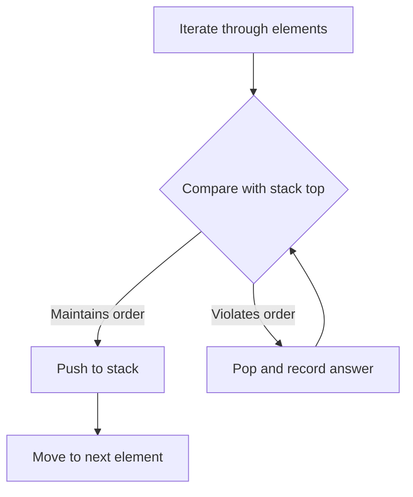

## Stack

A stack is a Last-In-First-Out structure that excels at problems involving matching, nesting, and tracking "the most recent unresolved item." Whenever you need to remember context and backtrack to it, a stack is your tool.

### Matching and Nesting

The classic application is validating balanced parentheses. Push opening brackets onto the stack; when you encounter a closing bracket, pop and verify it matches. If the stack is empty at the end, the input is valid. This extends to any nesting structure: HTML tags, nested function calls, or expression evaluation.

### Monotonic Stack

A monotonic stack maintains elements in sorted order — either strictly increasing or strictly decreasing. As you iterate through an array, you pop elements that violate the monotonic property, and each pop reveals a relationship like "next greater element" or "next smaller element."

This solves problems like daily temperatures, stock span, largest rectangle in histogram, and trapping rain water. The key insight: each element is pushed and popped at most once, so the total time is O(n).



### Expression Evaluation

Stacks naturally handle expression parsing. Use one stack for operators and one for operands, or convert infix to postfix notation. The stack tracks pending operations, resolving them when a higher-priority operator or closing bracket appears.

### Complexity

Stack-based solutions are typically O(n) time and O(n) space. Despite the nested-looking while loop inside the for loop, each element is pushed and popped at most once, giving amortized O(1) per operation.

### Recognition Pattern

If the problem involves nesting, matching pairs, "previous or next greater or smaller," or needs to track a history that unwinds in reverse order, think stack.

## ELI5

Imagine a stack of pancakes. You can only add to the top or take from the top. The pancake you put on last is the first one you eat. That's a stack — **Last In, First Out**.

```
Push pancakes:         Pop pancakes:
         🥞  ← add      🥞  ← remove first
       🥞               🥞
     🥞               🥞
   🥞               🥞

You always interact with the TOP of the stack.
```

**Matching parentheses** is exactly like tracking "open" and "close" events. Push when something opens, pop when something closes:

```
Check if "({[]})" is valid:

  See '(' → push → stack: [(]
  See '{' → push → stack: [(, {]
  See '[' → push → stack: [(, {, []
  See ']' → pop '[' → matches! → stack: [(, {]
  See '}' → pop '{' → matches! → stack: [(]
  See ')' → pop '(' → matches! → stack: []
  Stack empty at end → VALID ✓

Check "([)]":
  See '(' → push → stack: [(]
  See '[' → push → stack: [(, []
  See ')' → pop '[' → doesn't match ')' → INVALID ✗
```

**Monotonic stack** is like a bouncer at a club who only lets in people who are taller than the last person in line. When someone shorter arrives, all the taller people behind them get removed first:

```
Find next greater element for [2, 1, 4, 3]:

  i=0: push 2    → stack: [2]
  i=1: 1 < 2, just push → stack: [2, 1]
  i=2: 4 > 1, pop 1 → next greater of 1 is 4
       4 > 2, pop 2 → next greater of 2 is 4
       push 4    → stack: [4]
  i=3: 3 < 4, just push → stack: [4, 3]
  End: stack leftovers → next greater = -1

Result: [4, 4, -1, -1]
```

Each element is pushed and popped **at most once**, so the whole process is O(n) even though there's a loop inside a loop.

## Poem

Last in, first out — the stack's decree,
It tracks the context, history.
Push it on when something's new,
Pop it off when you're back through.

Monotonic, rising tall,
Pop the short ones — watch them fall.
Next greater element? Stack knows best,
Each one pushed and popped — then rest.

Nesting, matching, history's call,
The humble stack can solve them all.

## Template

```ts
// Monotonic stack: next greater element for each position
function nextGreaterElement(nums: number[]): number[] {
  const result = new Array(nums.length).fill(-1);
  const stack: number[] = []; // stores indices

  for (let i = 0; i < nums.length; i++) {
    // Pop elements smaller than current — current is their next greater
    while (stack.length > 0 && nums[stack[stack.length - 1]] < nums[i]) {
      const idx = stack.pop()!;
      result[idx] = nums[i];
    }
    stack.push(i);
  }

  return result;
}

// Valid parentheses matching
function isValid(s: string): boolean {
  const stack: string[] = [];
  const pairs: Record<string, string> = { ')': '(', ']': '[', '}': '{' };

  for (const ch of s) {
    if (ch === '(' || ch === '[' || ch === '{') {
      stack.push(ch);
    } else {
      if (stack.length === 0 || stack.pop() !== pairs[ch]) {
        return false;
      }
    }
  }

  return stack.length === 0;
}
```
