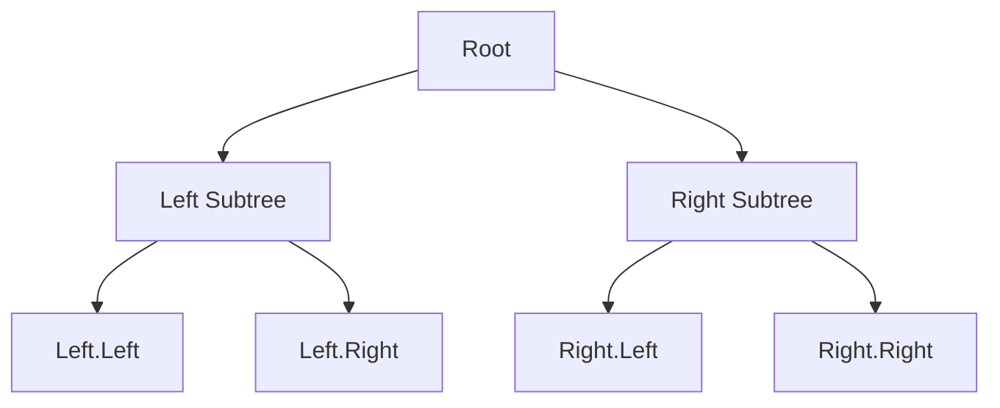

## Trees

Tree problems are fundamentally about recursion. Every subtree is itself a tree, so most solutions follow a pattern: solve for the current node using solutions from its children. Mastering DFS and BFS traversals covers the majority of tree interview questions.

### Depth-First Search - DFS

DFS explores as deep as possible before backtracking. The three orderings differ only in when you process the current node:

- **Preorder** — process node, then left, then right. Used for serialization and copying trees.
- **Inorder** — process left, then node, then right. On a BST, this yields sorted order.
- **Postorder** — process left, then right, then node. Used when you need children's results first, like calculating heights or checking balance.

The recursive template is elegant: base case returns when the node is null, recursive case combines results from left and right subtrees.

#### Real World
> **[File systems]** — File explorers like macOS Finder and Windows Explorer use DFS preorder to display directory trees: show the folder, then its contents recursively. Postorder is used when computing folder sizes — children must report their sizes before the parent can sum them.

#### Practice
1. Given the root of a binary tree, return the maximum depth (Maximum Depth of Binary Tree / LeetCode 104). Implement using both preorder DFS (top-down) and postorder DFS (bottom-up).
2. Given the root of a binary tree, return all root-to-leaf paths as strings (Binary Tree Paths / LeetCode 257). Use DFS with a running path string, backtracking at each leaf.
3. What is the difference between passing values down the tree (preorder style) and returning values up the tree (postorder style)? Give a problem that naturally fits each direction.

### Breadth-First Search - BFS

BFS uses a queue to process nodes level by level. Initialize the queue with the root, then repeatedly dequeue a node, process it, and enqueue its children. This is the natural choice for level-order traversal, finding minimum depth, or any problem that asks about "levels."

#### Real World
> **[Organizational tools]** — Project management software (like Jira's dependency tree view) uses BFS level-order traversal to render task hierarchies level by level, ensuring that all dependencies at depth k are shown before deeper subtasks — exactly the BFS ordering.

#### Practice
1. Given a binary tree, return its zigzag level-order traversal: first level left to right, second level right to left, alternating (Binary Tree Zigzag Level Order Traversal / LeetCode 103).
2. Given a binary tree, return the values of the nodes visible from the right side — the last node at each level (Binary Tree Right Side View / LeetCode 199).
3. BFS uses O(width) space while DFS uses O(height) space. For a balanced binary tree with n nodes, compare the worst-case space for each. For which tree shape is BFS space dramatically worse than DFS?



### BST Properties

A Binary Search Tree guarantees: left subtree values are less than the node, right subtree values are greater. This enables O(log n) search, insertion, and deletion on balanced trees. Validate a BST by passing min and max bounds down the recursion. Inorder traversal of a valid BST always produces a sorted sequence.

#### Real World
> **[Database indexes]** — Balanced BSTs (specifically AVL trees and red-black trees) are the foundation of in-memory indexes in databases like Redis sorted sets and Java's TreeMap. They guarantee O(log n) search, insert, and delete — critical for range queries like `WHERE price BETWEEN 10 AND 50`.

#### Practice
1. Given the root of a binary tree, determine if it is a valid BST (Validate Binary Search Tree / LeetCode 98). Use the min/max bounds approach, not a simple left-right comparison.
2. Given a BST, find the k-th smallest element (Kth Smallest Element in a BST / LeetCode 230). Use inorder traversal to exploit the sorted-order property.
3. Why does validating a BST require passing down min/max bounds rather than simply checking `node.left.val < node.val < node.right.val` at each node? Construct a tree that passes the naive check but is invalid.

### Common Patterns

Return values up the tree for height, diameter, or path sums. Pass values down the tree for constraints, running sums, or path tracking. Many problems combine both directions. When the problem says "path," clarify whether it means root-to-leaf or any-node-to-any-node — the approach differs significantly.

#### Real World
> **[Compilers / AST analysis]** — Abstract Syntax Trees (ASTs) in compilers are binary-ish trees where postorder traversal evaluates expressions bottom-up (children evaluated before parent), and preorder traversal is used for code generation passes that need context from parent nodes.

#### Practice
1. Given a binary tree, find the length of the longest path between any two nodes (Diameter of Binary Tree / LeetCode 543). The path does not need to pass through the root — how does this complicate the recursion?
2. Given a binary tree and a target sum, find all root-to-leaf paths where the path sum equals the target (Path Sum II / LeetCode 113). Use DFS with backtracking to collect paths.
3. The "diameter of binary tree" problem uses a nonlocal variable updated inside a postorder DFS. Why is postorder the correct order here, and why would preorder give a wrong answer?

### Complexity

DFS and BFS both visit every node once: O(n) time. DFS uses O(h) stack space where h is the height, while BFS uses O(w) queue space where w is the maximum width.

#### Real World
> **[Technical interviews at top companies]** — Tree problems account for roughly 20-25% of LeetCode medium/hard questions at FAANG-level interviews. The O(n) time, O(h) space analysis is the expected answer for any tree traversal complexity question.

#### Practice
1. Given a binary tree, serialize it to a string and deserialize the string back to the original tree (Serialize and Deserialize Binary Tree / LeetCode 297). Which traversal order makes reconstruction unambiguous?
2. Given two binary trees, determine if they are the same tree — same structure and same node values (Same Tree / LeetCode 100). Solve recursively with a clean base case analysis.
3. For a skewed binary tree (essentially a linked list), DFS uses O(n) stack space. In an interview, how would you rewrite a recursive DFS to be iterative to avoid this stack overflow risk?

## ELI5

Imagine a family tree. The grandparent is at the top, their children are one level below, and grandchildren are the level below that. Every person is connected to exactly one parent (except the grandparent at the top — that's the **root**).

```
Family tree:

              Grandma (root)
             /              \
         Mom               Uncle
        /    \                \
      You   Sister          Cousin

Rules:
  - Grandma has no parent (she's the root)
  - Everyone else has exactly one parent
  - You can trace any path from the root downward
```

**DFS (going deep first)** is like exploring a family album one branch at a time — you look at all of Mom's side before looking at Uncle's side.

**BFS (going level by level)** is like a birthday photo where you take one layer at a time: first grandma, then all her kids, then all grandchildren.

```
The same tree, two traversal orders:

DFS (preorder):  Grandma → Mom → You → Sister → Uncle → Cousin
  (visit me, then dive into left branch, then right branch)

BFS (level-order): Grandma → Mom → Uncle → You → Sister → Cousin
  (visit all of level 1, then level 2, then level 3)
```

**Postorder DFS** is the secret for "bottom-up" problems. You ask each child first, then decide at the parent. Like measuring everyone's height from the bottom up to find the tallest branch:

```
Height of a tree (postorder):

          1            ← height = 1 + max(2, 1) = 3
         / \
        2   1          ← heights: 2, 1
       / \
      1   1            ← heights: 1, 1

Process leaves first (height=1), then their parent (height=2), then root (height=3).
Children report their heights UP to their parent.
```

**BST (Binary Search Tree)** is like a sorted phone book built as a tree. Every name to the left is smaller, every name to the right is bigger — so you can find any name in O(log n) steps by going left or right at each node.

## Poem

Root to leaf, the tree descends,
Recursion splits, then merges, mends.
Preorder visits on the way down,
Inorder sorts without a frown.

Postorder waits till children speak,
BFS walks level, peek by peek.
Left is less and right is more,
That is what a BST is for.

Pass values down, return them high,
Trees teach recursion how to fly.

## Template

```ts
interface TreeNode {
  val: number;
  left: TreeNode | null;
  right: TreeNode | null;
}

// DFS — recursive template (preorder, inorder, postorder)
function dfs(node: TreeNode | null): void {
  if (node === null) return;

  // Preorder: process here (before children)
  dfs(node.left);
  // Inorder: process here (between children)
  dfs(node.right);
  // Postorder: process here (after children)
}

// DFS — example: max depth (postorder pattern)
function maxDepth(root: TreeNode | null): number {
  if (root === null) return 0;

  const leftDepth = maxDepth(root.left);
  const rightDepth = maxDepth(root.right);

  return 1 + Math.max(leftDepth, rightDepth);
}

// BFS — level-order traversal using a queue
function levelOrder(root: TreeNode | null): number[][] {
  if (root === null) return [];

  const result: number[][] = [];
  const queue: TreeNode[] = [root];

  while (queue.length > 0) {
    const levelSize = queue.length;
    const currentLevel: number[] = [];

    for (let i = 0; i < levelSize; i++) {
      const node = queue.shift()!;
      currentLevel.push(node.val);

      if (node.left) queue.push(node.left);
      if (node.right) queue.push(node.right);
    }

    result.push(currentLevel);
  }

  return result;
}
```
