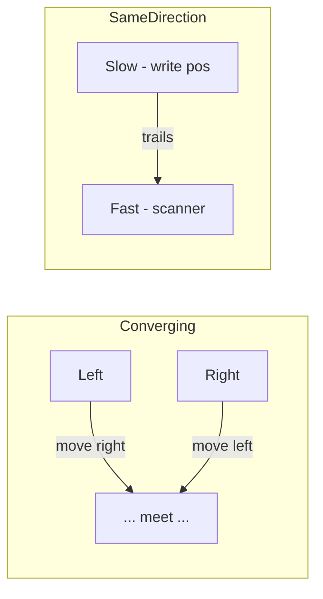

## Two Pointers

The two-pointer technique uses two indices that traverse a data structure — typically a sorted array — to solve problems in O(n) time without extra space. The pattern eliminates brute-force nested loops by intelligently narrowing the search space.

### Core Techniques

**Converging Pointers:** Place one pointer at the start and one at the end. Move them toward each other based on a condition. For "Two Sum on a sorted array," if the sum is too small, advance the left pointer; if too large, retreat the right pointer. Each step eliminates an entire row or column of possibilities.

**Same-Direction Pointers:** Both pointers move left to right, often at different speeds. This is ideal for in-place modifications: removing duplicates, partitioning arrays, or merging sorted arrays. One pointer tracks the "write" position while the other scans ahead.

**Three Pointers and Beyond:** Some problems like 3Sum fix one pointer and apply converging two-pointer on the remainder. Dutch National Flag uses three pointers to partition into three groups in a single pass.



### When to Use

Look for sorted arrays, problems asking for pairs or triplets with a target sum, palindrome checks, or in-place array modifications. The sorted property is crucial for converging pointers — it guarantees that moving a pointer changes the sum in a predictable direction.

### Complexity

Two pointers typically achieve O(n) time and O(1) space. For problems like 3Sum, fixing one pointer yields O(n²) total, which is optimal. The technique shines when you need to avoid hash map overhead or when the problem demands constant space.

## ELI5

Imagine you and a friend stand at opposite ends of a row of numbers. You walk toward each other. This is the **converging two-pointer** technique.

```
Sorted numbers: [1, 3, 5, 7, 9, 11]
Find two numbers that add to 12.

  Left=1, Right=11 → sum=12 → FOUND! ✓

What if sum was too small?
  Left=1, Right=9 → sum=10 (too small) → move Left forward
  Left=3, Right=9 → sum=12 → FOUND! ✓

What if sum was too big?
  Left=1, Right=11 → sum=12... → already found above

The sorted order guarantees:
  Moving left pointer RIGHT makes the sum BIGGER
  Moving right pointer LEFT makes the sum SMALLER
  → You always know which direction to go!
```

**Same-direction pointers** are like a slow writer and a fast reader going through a book. The fast one reads ahead and tells the slow one what to write down:

```
Remove duplicates from [1, 1, 2, 3, 3, 4] in-place:

Slow (write position): starts at index 0
Fast (scanner):        starts at index 1

  fast=1: nums[1]=1, same as slow → skip
  fast=2: nums[2]=2, DIFFERENT → slow++, write 2 → [1, 2, ...]
  fast=3: nums[3]=3, DIFFERENT → slow++, write 3 → [1, 2, 3, ...]
  fast=4: nums[4]=3, same as slow → skip
  fast=5: nums[5]=4, DIFFERENT → slow++, write 4 → [1, 2, 3, 4, ...]

Result: [1, 2, 3, 4] — duplicates removed in-place, O(1) extra space!
```

**Why it works:** on a sorted array, you always know which pointer to move. There's no need to try every pair (which would be O(n²)). By moving one pointer per step, you solve it in O(n).

## Poem

Two pointers start their race,
One from each end of the space.
If the sum is running low,
Move the left — let it grow.

If too high, pull right back in,
Shrink the gap until you win.
Same direction, side by side,
Slow writes while fast takes the ride.

Sorted arrays, no extra store,
Two pointers — who needs more?

## Template

```ts
// Converging two pointers (e.g., Two Sum II on sorted array)
function twoSumSorted(nums: number[], target: number): number[] {
  let left = 0;
  let right = nums.length - 1;

  while (left < right) {
    const sum = nums[left] + nums[right];

    if (sum === target) {
      return [left, right];
    } else if (sum < target) {
      left++;
    } else {
      right--;
    }
  }

  return [];
}

// Same-direction two pointers (e.g., remove duplicates in-place)
function removeDuplicates(nums: number[]): number {
  if (nums.length === 0) return 0;

  let slow = 0;

  for (let fast = 1; fast < nums.length; fast++) {
    if (nums[fast] !== nums[slow]) {
      slow++;
      nums[slow] = nums[fast];
    }
  }

  return slow + 1;
}
```
