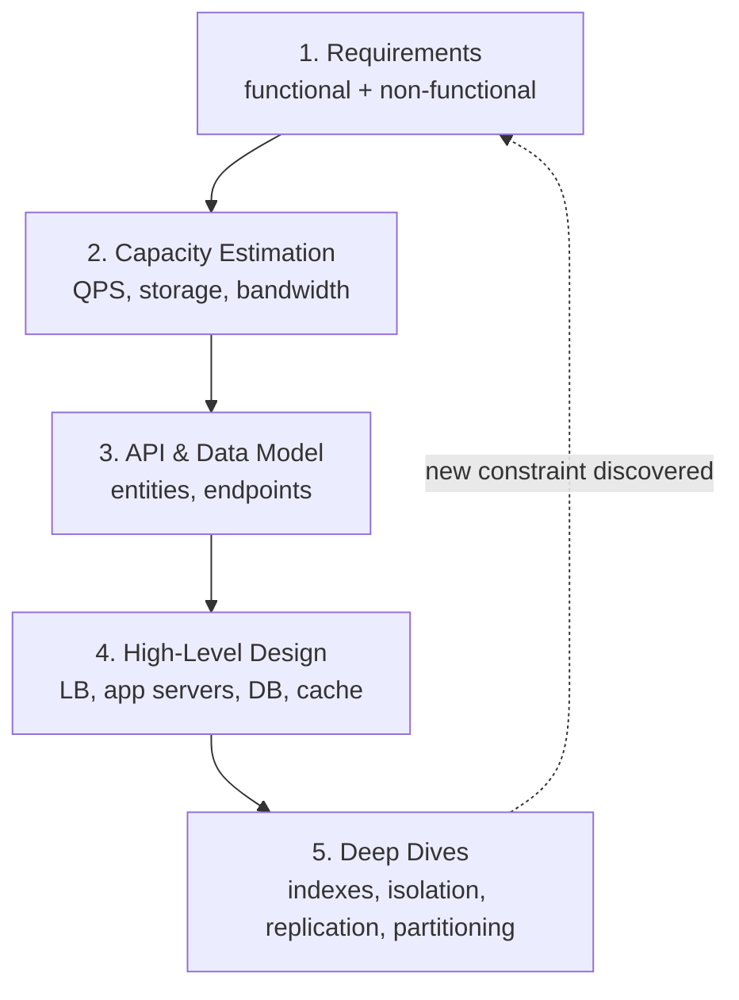

**Systems design** is the discipline of composing databases, caches, queues, and services into an architecture that meets a product's requirements at scale. The interview version tests something no coding round can: can you reason about **trade-offs** when there is no single correct answer?

An interviewer says "Design Twitter" and deliberately gives you almost nothing else. What they are evaluating:

1. **Requirements gathering** — Do you ask what features matter? Read-heavy or write-heavy? How many users?
2. **Capacity estimation** — Back-of-envelope math: QPS, storage, bandwidth. 100M DAU posting twice a day ≈ 2,300 writes/sec average, maybe 10x at peak.
3. **API & data model design** — What are the core entities and endpoints?
4. **High-level architecture** — Clients, load balancers, application servers, databases, caches.
5. **Deep dives** — This is where seniority shows: replication strategies, index choices, isolation levels, partitioning schemes.

**Why start with database internals?** Because nearly every interesting design decision — SQL vs NoSQL, which database for which workload, why writes are slow, why replicas disagree — traces back to how databases store and retrieve data. Understanding indexes, transactions, and storage engines gives you the *why* behind every architecture choice, instead of memorized buzzwords.

Explain what a systems design interview evaluates and outline a framework for approaching one.

## Solution

```js
// ════════════════════════════════════════════
// A reusable interview framework (30-45 min)
// ════════════════════════════════════════════

const framework = {
  // ── 1. Requirements (~5 min) ──────────────
  functional: [
    'Who are the users? What are the core features?',
    'What can we cut? (Design the MVP, mention extensions)',
  ],
  nonFunctional: [
    'Scale: DAU, QPS, read/write ratio',
    'Latency targets (p50 / p99)',
    'Consistency vs availability requirements',
    'Durability: can we ever lose data?',
  ],

  // ── 2. Capacity estimation (~5 min) ───────
  backOfEnvelope: () => {
    const DAU = 100_000_000;
    const writesPerUserPerDay = 2;
    const secondsPerDay = 86_400;

    const avgWriteQPS = (DAU * writesPerUserPerDay) / secondsPerDay; // ~2,300
    const peakWriteQPS = avgWriteQPS * 10;                           // ~23,000
    const readQPS = avgWriteQPS * 100; // read-heavy: 100:1 ratio

    const tweetSize = 300; // bytes, avg
    const storagePerYear =
      DAU * writesPerUserPerDay * 365 * tweetSize; // ~22 TB/year

    return { avgWriteQPS, peakWriteQPS, readQPS, storagePerYear };
  },

  // ── 3. API + data model (~5 min) ──────────
  api: [
    'POST /tweets            { text }        -> { tweetId }',
    'GET  /users/:id/feed    ?cursor=...     -> { tweets[] }',
  ],

  // ── 4. High-level design (~10 min) ────────
  components: [
    'Client -> CDN -> Load balancer -> App servers (stateless)',
    'Database (choice driven by access patterns!)',
    'Cache for hot reads, queue for async work',
  ],

  // ── 5. Deep dives (~15 min) ───────────────
  deepDives: [
    'Which index structure fits the write volume? (B-tree vs LSM)',
    'What isolation level do concurrent writes need?',
    'Replication: single-leader? How do we handle failover?',
    'Partitioning: by user id? By tweet id? Hot key problem?',
  ],
};

// ════════════════════════════════════════════
// Scaling vocabulary you must know cold
// ════════════════════════════════════════════
// Vertical scaling:   bigger machine. Simple, but has a ceiling
//                     and a single point of failure.
// Horizontal scaling: more machines. No ceiling, but now you
//                     need load balancing, replication,
//                     partitioning — i.e., all of systems design.
```

## Explanation

The single biggest mistake candidates make is **jumping straight to boxes and arrows**. Without requirements, you cannot justify any decision, and interviewers notice. The second biggest mistake is **memorizing architectures** ("Twitter uses fan-out-on-write") without understanding the underlying mechanics — one follow-up question ("why is that faster here?") exposes it.

The framework above front-loads the cheap, high-signal work: five minutes of requirements and estimation determines *everything* downstream. 23,000 peak writes/sec rules out a single Postgres box and makes an LSM-based store or partitioned setup worth discussing. A 100:1 read ratio says caching and read replicas will carry the day.

Deep dives are where this course pays off. "Use a database" is a junior answer; "use an LSM-based store because this workload is write-heavy and we can tolerate slightly slower point reads, with a bloom filter to protect the read path" is a senior one. The next 14 lessons build exactly that vocabulary: **indexes** (how reads get fast, what writes pay for it), **transactions and isolation** (what happens when operations race), and **storage formats** (row vs column, how data moves between services).

## Diagram



## ELI5

Imagine being asked to plan a birthday party, but all you're told is "make it fun."

A bad planner immediately starts buying balloons. A good planner asks questions first: How many kids are coming? (10 kids need a living room; 200 need a park.) Any allergies? What's the budget?

Systems design interviews work the same way. "Design Twitter" is "make it fun." The interviewer doesn't want balloons — they want to hear the questions, the head-math ("200 kids × 2 slices each = 40 pizzas"), and the plan that follows from the answers. And when they ask "why 40 pizzas?", you can show your work.

The rest of this course is about what's *inside* the boxes you draw — because anyone can draw a box labeled "database," but only someone who knows how databases actually work can defend it.
