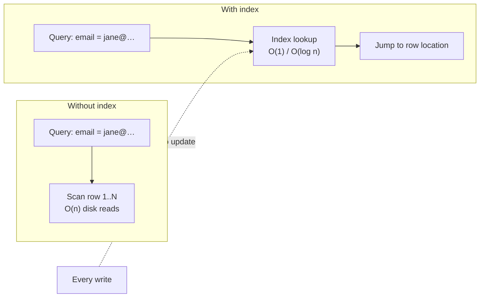

Your users table has 100 million rows and this query takes 30 seconds:

```sql
SELECT * FROM users WHERE email = 'jane@example.com';
```

Without help, the database must check **every single row** — a full table scan, O(n) disk reads. An **index** fixes this: it is an additional data structure, *derived* from the table, that lets the database jump (almost) straight to matching rows.

The mental model: a database at its simplest is an append-only file of records. Writing is blazingly fast — append to the end, done. But finding anything means scanning the whole file. An index is like the index at the back of a textbook: a separate, sorted structure that maps a **key** (email) to the **location** of the data (page/byte offset).

**The fundamental trade-off:**
- **Reads get fast**: O(n) scan → O(log n) or O(1) lookup.
- **Writes get slower**: every INSERT/UPDATE must now also update *every* index on the table.
- **Space grows**: each index is a full extra structure on disk.

This is why databases don't index everything automatically — *you* must choose indexes based on your query patterns.

Explain what an index is, how it changes read and write performance, and when you would (and wouldn't) add one.

## Solution

```js
// ════════════════════════════════════════════
// Life WITHOUT an index: the append-only log
// ════════════════════════════════════════════

const log = []; // our "table": an append-only array of records

function writeNoIndex(record) {
  log.push(record); // O(1) — writes are as fast as possible
}

function readNoIndex(email) {
  // O(n) — must scan every record. On disk, with 100M rows,
  // this is millions of disk reads. Unusable.
  for (let i = log.length - 1; i >= 0; i--) {
    if (log[i].email === email) return log[i];
  }
  return null;
}

// ════════════════════════════════════════════
// Life WITH an index
// ════════════════════════════════════════════

const emailIndex = new Map(); // key -> position in the log

function writeWithIndex(record) {
  log.push(record);                        // still append
  emailIndex.set(record.email, log.length - 1); // + index update
  // Every additional index = another update here.
  // 5 indexes on a table = 5 extra writes per INSERT.
}

function readWithIndex(email) {
  const offset = emailIndex.get(email);    // O(1) hop
  return offset !== undefined ? log[offset] : null;
}

// ════════════════════════════════════════════
// The trade-off, measured
// ════════════════════════════════════════════
// No index:  write = 1 op         read = O(n)  (30s on 100M rows)
// 1 index:   write = 2 ops        read = O(1)/O(log n)  (<1ms)
// 5 indexes: write = 6 ops        reads on 5 columns fast
//
// Rule of thumb: index the columns in your WHERE / JOIN /
// ORDER BY clauses. Don't index write-hot columns you never
// query, low-cardinality columns (e.g. `is_active`), or tiny
// tables where a scan is already cheap.
```

## Explanation

The reason this matters so much is **disk access**. Memory reads take ~100 nanoseconds; a disk seek takes ~10 milliseconds — 100,000x slower. A full table scan of a large table means touching every page of the table on disk. An index reduces that to a handful of page reads.

But the key interview insight is that **an index is not free — it shifts cost from reads to writes**. A write that used to be a pure append now becomes: append the record, then update index #1, index #2, ... each of which may itself require reading and rewriting disk pages. Heavily-indexed tables can see write throughput drop by multiples. This read/write tension is *the* recurring theme of storage engines, and the next three lessons are exactly about the different structures databases use to implement indexes, each with a different position on that trade-off:

- **Hash indexes** — O(1) point lookups, no range queries (next lesson)
- **B-trees** — O(log n) everything, great ranges, the relational default
- **LSM trees** — optimized for write-heavy workloads

When an interviewer asks "why is this query slow?" or "your writes are bottlenecked, what do you do?", indexes should be the first lever you reach for — adding one in the first case, and questioning whether you have too many in the second.

## Diagram



## ELI5

A library has a million books on shelves in the order they arrived. Finding "one specific book" means walking every aisle — that's a full table scan.

So the librarian keeps a card catalog: a small drawer of cards, sorted alphabetically, where each card says which shelf the book lives on. Now finding a book takes seconds — that's an index.

But here's the catch: every time a new book arrives, the librarian can't just drop it on a shelf anymore. They must *also* write a card and file it in the right drawer slot. Ten different catalogs (by title, by author, by year...) means ten cards to file per new book. Adding books gets slower so that finding books gets faster.

That's every index ever: **faster to find, slower to add, more drawers to maintain.**
