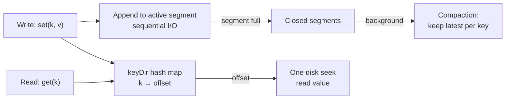

The simplest real index design, used by **Bitcask** (the storage engine behind Riak): keep the data in an **append-only log file** on disk, and keep an **in-memory hash map** from each key to the **byte offset** where its latest value lives.

- **Write**: append `key,value` to the log, update the hash map entry. Sequential disk write + O(1) map update — extremely fast.
- **Read**: look up the key in the map → get byte offset → one disk seek to read the value. O(1).
- **Update**: just append again. The map now points to the newer offset; the old entry becomes garbage.
- **Delete**: append a special **tombstone** record.

But two problems need solving:

1. **The log grows forever** (updates never overwrite). Solution: break the log into **segments**; periodically run **compaction** — throw away all but the latest value per key — and **merge** segments in the background.
2. **Crashes** lose the in-memory map. Solution: rebuild by scanning segments on startup, or persist periodic **snapshots** of the map.

And two limitations that can't be solved:

1. **All keys must fit in memory.** Billions of keys → the map itself doesn't fit in RAM.
2. **No efficient range queries.** Hashing scatters adjacent keys — `WHERE id BETWEEN 100 AND 200` means 101 separate lookups.

Explain how a hash index over an append-only log works, and why it's fast but limited.

## Solution

```js
// ════════════════════════════════════════════
// Bitcask-style hash index (simplified)
// ════════════════════════════════════════════

class HashIndexStore {
  constructor() {
    this.segments = [[]];       // list of append-only log segments
    this.keyDir = new Map();    // key -> { segmentId, offset }
    this.activeSegment = 0;
    this.SEGMENT_LIMIT = 1000;  // records per segment
  }

  set(key, value) {
    const segment = this.segments[this.activeSegment];
    segment.push({ key, value });                    // sequential append
    this.keyDir.set(key, {                           // O(1) map update
      segmentId: this.activeSegment,
      offset: segment.length - 1,
    });

    if (segment.length >= this.SEGMENT_LIMIT) {
      this.segments.push([]);                        // roll a new segment
      this.activeSegment++;
    }
  }

  get(key) {
    const loc = this.keyDir.get(key);                // O(1) lookup
    if (!loc) return null;
    const record = this.segments[loc.segmentId][loc.offset]; // 1 disk seek
    return record.value === TOMBSTONE ? null : record.value;
  }

  delete(key) {
    this.set(key, TOMBSTONE); // deletes are just appends too
  }

  // ── Background compaction ──────────────────
  // Old segments are immutable, so this runs without
  // blocking reads/writes, then swaps in atomically.
  compact() {
    const latest = new Map();
    for (const segment of this.segments.slice(0, -1)) {
      for (const { key, value } of segment) {
        latest.set(key, value);       // later entries win
      }
    }
    const compacted = [];
    for (const [key, value] of latest) {
      if (value !== TOMBSTONE) compacted.push({ key, value });
    }
    // swap: [compacted, activeSegment], rebuild keyDir offsets
  }
}

const TOMBSTONE = Symbol('tombstone');

// ════════════════════════════════════════════
// Why it's fast — and where it breaks
// ════════════════════════════════════════════
// FAST: writes are sequential appends (no random I/O),
//       reads are one hash lookup + one seek.
// BREAKS:
//   1. keyDir must hold EVERY key in RAM.
//   2. Range scan? hash(100)..hash(200) are scattered
//      randomly — must do 101 point lookups.
```

## Explanation

The design works because it plays to hardware strengths: **sequential writes** are the fastest thing a disk can do (no seeking), and the random-access cost is paid only once per read, guided by an in-memory pointer. Crash recovery is handled by the append-only property itself — nothing is ever overwritten, so the data files are always valid; only the in-memory map needs rebuilding (Bitcask persists "hint files" — snapshots of the map — to make restarts fast).

Compaction deserves attention in an interview: because segments are **immutable once closed**, compaction can run in a background thread over old segments while new writes land in the active segment. When done, the engine atomically switches reads over to the compacted segments and deletes the old files. Immutability → no locks on the hot path.

**When to name-drop a hash index:** workloads with a *bounded set of hot keys updated frequently* — view counters per video, session state per user, a cache. The value log can be huge (values live on disk), but the *key space* must fit in memory, and access must be point lookups. The moment your design needs `ORDER BY`, prefix search, or ranges ("messages between two timestamps"), hashing is disqualified — which is exactly the gap B-trees and LSM trees fill in the next lessons: both keep keys **sorted**.

## Diagram



## ELI5

Imagine a notebook where you only ever write on the next blank line — never erase, never squeeze things in. Writing is instant: flip to the end, jot it down.

To find things later, you keep a sticky-note board: "Alice's info → page 42, line 3." When Alice moves, you don't erase page 42 — you write her new address on page 97 and move her sticky note. Looking anyone up is instant: read the sticky, flip straight to the page.

Two chores and two dealbreakers. Chores: sometimes you copy only the *current* addresses into a fresh notebook and toss the old one (compaction), and if the board falls (crash), you rebuild the stickies by rereading notebooks. Dealbreakers: you need one sticky *per person* — a billion people won't fit on the board (keys must fit in RAM) — and the stickies are in random order, so "everyone whose name starts with A–C" means checking every sticky (no range queries).
